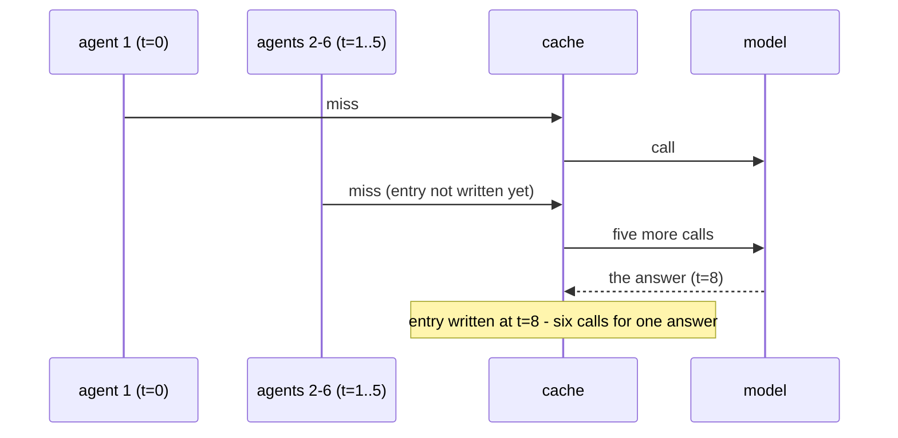

# 6.3 — 💥 The stampede on a cold key

## One-line answer

An entry is written when the answer comes back, not when the question is asked, so six agents asking
one new question inside that gap produce six model calls for one answer — 30% of the desk's daily free
tier spent on a single question, which one claim-the-key lock reduces to 5%.

## The story

The ration shop opens at ten. By quarter to, there are twenty people at the shutter.

They are not queuing. There is no queue, because a queue is a thing you form when there is somebody to
form it towards, and the shutter is down. There is a crowd, and the crowd is arranged by who arrived
and how firmly they are standing.

At ten the shutter goes up and everyone moves at once. The shopkeeper, who has done this for years,
does the only thing that works: he puts his hand up and says *"one at a time, and you — you were
first."*

That sentence is doing something precise. It is not about fairness and it is not about speed. He has
decided who is being served **so that the other nineteen can stop trying**. Until somebody is
designated, all twenty are simultaneously his problem.

## The idea in plain language

A cache entry has a lifetime and it starts later than people assume:

1. A request arrives. The cache is checked. **Miss.**
2. The model is called. This takes real time — seconds, for a support answer with retrieval in it.
3. The answer comes back.
4. **Now** the entry is written.

Between steps 1 and 4 the entry does not exist. Every request arriving in that window is also a miss,
also calls the model, and also — eventually — writes the same entry. The window is exactly as wide as
the model call is slow, which means **the slower your model, the worse this gets**, which is the
opposite of the intuition that slow models benefit most from caching.

The name for this is a **cache stampede**, or a thundering herd. It has three preconditions and needs
all three:

- a key that is **cold** — not in the cache, so no one is being served from it;
- **concurrent** arrivals on that same key;
- a **fill** that takes long enough for arrivals to overlap it.

Support desks meet all three constantly, and for a structural reason: agents ask about the same thing
at the same time because the same thing is happening to everybody. A shift change, an incident, a
product announcement — these produce a burst of one question, on a key that is by definition new.

The fix is called **single-flight**: the first miss claims the key, and subsequent misses on that key
wait for the claim holder rather than calling themselves. It is the shopkeeper's raised hand.

## Why Sutra needs it

Because Sutra's ration is twenty requests a day, and this failure spends them in one burst on one
question.

Everything else in this day trades hit rate against correctness in single-digit percentages. This one
takes 30% of the daily allowance in a few seconds, and it does it on the questions that matter most —
the new ones, arriving during an incident, when the desk is most needed.

It is also the failure that is *invisible in every measurement this day has built so far*. The hit
rate is unaffected — those six calls are six honest misses. `saved_calls` is correct. The four alarms
in [6.2](6.2-the-log-line-and-four-alarms.md) are all green. Six requests were spent to obtain one
answer, and nothing in the logging says so.

## The mechanism

`lab/stampede.py` runs one cold key through two arms with identical arrivals: the naive fill and
single-flight.

```bash
cd days/day-51-caching-the-quota-lifeline/lab
uv run python stampede.py
```

**Line by line:**

- `ARRIVALS = [0, 1, 1, 2, 3, 5, 9, 30]` is eight arrivals in seconds from the start of a shift. Seven
  land inside ten seconds and one arrives much later, which is what a shift change actually looks
  like.
- `FILL_SECONDS = 8` is how long the model takes to answer. It is the width of the window.
- `naive()` writes the entry at `arrival + fill`, and treats any arrival before the earliest write as
  a miss. That is what a plain "check, miss, call, store" implementation does.
- `single_flight()` adds one piece of state: `claimed_at`. A miss arriving while a claim is in flight
  waits instead of calling.
- Both arms are pure arithmetic over the arrival list. Nothing is threaded, nothing is timed, and the
  result is deterministic — which is the only way this is a test rather than a demonstration.

Measured on 2026-09-05:

```text
one cold key, 8 arrivals at t = [0, 1, 1, 2, 3, 5, 9, 30]
the model answers 8 seconds after it is asked

arm               model calls   waited   of the free tier
naive                       6        0               30%
single-flight               1        5                5%

One question, one answer, and the naive arm spent 6 of the day's 20 requests to get it.
Single-flight spent 1. Nothing about the cache changed.
```

**Six against one.** Six requests, one answer, and every one of the six is a correct, well-behaved,
honestly-logged cache miss.

Read the `of the free tier` column, because it is the one that ends the argument. Thirty per cent of
Sutra's entire daily allowance, gone, on one question, in the first nine seconds of a shift. Not on a
hard question or an expensive one — on a **new** one.

The `waited` column is the cost. Five requests waited instead of calling, which means five agents saw
a slower answer than they would have. That is the trade, and it is a good one at these numbers, and it
is a real cost that should be stated rather than glossed.

Now widen the window, which is what a slower model or a longer retrieval does:

```bash
uv run python stampede.py --fill 20
```

**Line by line:**

- Only `FILL_SECONDS` changes, from 8 to 20. Same arrivals, same key.
- A longer fill means more arrivals land inside the gap.

```text
arm               model calls   waited   of the free tier
naive                       7        0               35%
single-flight               1        5                5%
```

The naive arm gets **worse** — 7 calls instead of 6 — and single-flight does not move at all. That is
the shape to remember: **single-flight's cost is constant in the fill time and the naive cost grows
with it.** Anything that makes your model slower makes the unprotected version worse and the protected
version identical.



## When it breaks

It broke above; this section is the two ways the **fix** breaks, because single-flight is not free of
failure modes of its own and shipping it carelessly trades one incident for another.

**The claim that is never released.** If the model call raises — a 429, a timeout, a network drop —
and the claim is not cleared, every subsequent request on that key waits forever for a call that will
never return an answer. That turns a burst of extra spending into a permanent hang on one key, which
is strictly worse. The claim must be released in a `finally`, and the waiters must be told the fill
**failed** rather than left waiting for a result. This is Day 21's rule — errors surface, never get
swallowed — applied to a lock.

**The wait with no deadline.** A waiter that blocks indefinitely has moved the failure from the quota
budget into the latency budget. Day 44 part
[2.3](../../../day-44-client-hardening/parts/02-the-deadline/2.3-with-timeout.md) established that
every wait in Sutra has a deadline; a cache-fill wait is no exception, and its natural deadline is the
same one the underlying model call has. A waiter whose deadline expires should call the model itself,
accepting the duplicate, because a slow correct answer beats a hung one.

And the interaction with 429 handling is worth being explicit about, because it is the one place
single-flight has a genuinely delicate edge. If the single in-flight call comes back `429 RESOURCE_EXHAUSTED`,
five waiters are released at once. If each of them then retries immediately, the stampede is back and
it is now hitting an endpoint that has already refused. The correct behaviour is that the waiters
inherit the failure **and** its `retry-after`, backing off from the same schedule rather than
independently — Day 44 part
[3.3](../../../day-44-client-hardening/parts/03-backing-off/3.3-the-server-said-when.md), applied to a
group.

```python
async def fill_once(key: str) -> str:
    """One in-flight fill per key, with the failure shared rather than swallowed."""
    claim = _claims.get(key)
    if claim is not None:
        return await claim  # a waiter: inherits the answer, and the exception
    task = asyncio.get_running_loop().create_task(_call_model(key))
    _claims[key] = task
    try:
        return await task
    finally:
        _claims.pop(key, None)
```

**Line by line:**

- `_claims` maps a key to the in-flight task, not to a lock. Awaiting the task is what makes waiters
  receive the **same result** — and the same exception — rather than merely being unblocked.
- `return await claim` is the whole waiter path. A waiter that raises here raises the original error,
  including its `retry-after`, which is what makes group backoff possible.
- `create_task` before `_claims[key] = task`, both before any `await`, so no other coroutine can
  interleave between checking and claiming. That ordering is the correctness of the whole function.
- `finally: _claims.pop(key, None)` releases the claim whether the call succeeded or raised. Without
  the `finally` this function is the permanent-hang failure described above.
- `pop(key, None)` rather than `del`, because a cleanup elsewhere may have removed it already and a
  `KeyError` in a `finally` would mask the real exception.
- It returns the answer rather than writing the cache, so the caller decides what to store. A fill
  helper that also writes has two reasons to change.

This is a sketch of the mechanism, not the day's build brief — Sutra's desk is single-process for now,
and the `TODO(me)` in the hub asks you to decide whether it needs this yet and to write down what
would make it necessary.

## In production

**What a professional writes instead.** Single-flight per key, with a deadline, releasing on failure,
and sharing the failure with the waiters. Where the cache is shared across processes the claim has to
be shared too — a short-lived lock key in the same store, with an expiry safely longer than the fill
deadline, so a process that dies mid-fill does not hold the key forever. The expiry on that lock is
the one number in this design that has to be reasoned about rather than guessed.

**What degrades at scale.** Single-flight is per process unless you make it otherwise. Ten replicas
each doing perfect single-flight produce ten calls for one cold key, so the fix that removed a factor
of six locally leaves a factor of ten at the fleet level, and it looks solved on every individual
machine's metrics. The measurement that shows it is calls-per-distinct-key at the fleet level, which
nobody collects by default.

**The failure mode that only appears with real traffic.** Correlated cold keys. A deploy that changes
the prompt, a model switch, or a cache flush makes **every** key cold simultaneously, so the stampede
happens on all of them at once instead of on one. Single-flight helps per key and does nothing about
the aggregate, which is why the other half of the answer is warming — populating the head of the key
distribution before traffic arrives — and why cache flushes are done gradually rather than all at once.

**The review comment a senior engineer leaves:** *"There's no single-flight here. On a cold key every
concurrent request calls the model, and our whole daily quota is 20 requests. Add a per-key in-flight
map, share the exception with the waiters so a 429 doesn't turn into five independent retries, and put
a deadline on the wait. And release the claim in a `finally` — without it a failed fill hangs that key
permanently."*

**The interview question:** *"What happens to your cache when a popular new item appears?"* An honest
answer: *"Every concurrent request for it misses, because the entry isn't written until the answer
comes back, so they all call the backend for the same thing. I measured it on my own numbers: eight
agents arriving within nine seconds on one cold key, with an eight-second model call, produced six
calls for one answer — and my daily quota was twenty requests, so 30% of the day went on one question.
Single-flight took it to one call and five waiters. The subtlety is the failure path: the waiters have
to inherit the exception, not just get unblocked, or a 429 on the single call turns into five
independent retries and you've rebuilt the stampede against an endpoint that's already refusing. And
it's per process, so across a fleet you still get one call per replica."*

## Check yourself

```bash
cd days/day-51-caching-the-quota-lifeline/lab
uv run python stampede.py
uv run python stampede.py --fill 20
uv run python stampede.py --agents 12
```

Now find a combination of `--agents` and `--fill` at which the naive arm spends the desk's **entire**
daily quota of 20 requests on one question, and write it down beside your model's real answer latency
and your desk's real shift size.

**Out loud, without scrolling up:** state the three preconditions for a stampede, say why a slower
model makes it worse, and name the two ways the single-flight fix itself can fail.

**Next:** [7.1 — What must never enter a key](../07-in-production/7.1-what-must-never-enter-a-key.md).
