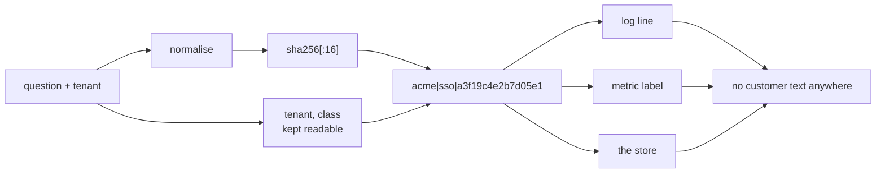

# 7.1 — What must never enter a key

## One-line answer

A cache key is written to logs, to metrics labels and to a shared store, so it is a **published**
string — customer text and credentials must be hashed out of it, the tenant must stay in it in
readable form, and the timing of a hit leaks whether a question has been asked before.

## The story

A bank passbook has the account number printed on every page. That is fine; an account number is
meant to be handed over.

Some people write their PIN inside the front cover. Not carelessly — deliberately, because they will
forget it, and the passbook lives in a locked steel cupboard at home.

The reasoning is sound right up to the moment the passbook leaves the cupboard, which it does every
time it is updated. It goes to the counter, it sits on a desk, it is handed back across a queue. The
owner is thinking about where it *lives*. The risk is decided by where it *travels*.

A cache key lives in a dictionary and travels into every log line, every metric label, every store
inspection and every debugging session for the lifetime of the system.

## The idea in plain language

A key is an identifier, and identifiers get written down. In an ordinary deployment, one cache key
ends up in at least four places nobody thought about when they wrote the f-string:

- the application log, on every hit and miss ([6.2](../06-proving-the-saving/6.2-the-log-line-and-four-alarms.md));
- a metrics label, if anyone ever breaks a hit rate down by key;
- the store itself — Redis, a table, a file name — where anybody with operational access can list them;
- a stack trace or a debugger session, where it appears in full.

So the question is not "is this key correct" but **"am I comfortable with this string being
published?"** And that reframing changes what belongs in it.

Three categories, and they behave differently:

| Category | Examples | What to do |
| --- | --- | --- |
| **Must be readable** | tenant slug, question class, model name, prompt version | keep in plain text — you need to scan and invalidate by these |
| **Must be present but not readable** | the question text itself, which may name a customer | hash it, and keep the plaintext only in the value |
| **Must never be present at all** | API keys, tokens, session cookies, anything from `.env` | not in the key, not in the value, not in the log |

The middle row is the one that needs a moment. Sutra's questions look harmless —
`"customer bounced back to the sign-in page during single sign-on"` — right up until an agent types
`"why did rakesh.sharma@example.com get logged out"`, which is a perfectly natural thing to type at a
support desk and which is now a customer's email address in a log line, in a metrics label, and in a
store that outlives the request.

The shape that solves it is to split the key into a readable prefix and a hashed body:

```
acme|sso|a3f19c4e2b7d05e1
^tenant  ^class  ^sha256 of the normalised question
```

You can still scan by tenant. You can still invalidate a whole class. And the question text is not
published anywhere.

## Why Sutra needs it

Principle 9 is that secrets never touch git, and Day 0 built the `.env` and `.gitignore` discipline
around it. This is the same principle pointed at a different exit: **a cache is a second place your
data goes**, and it was not in the threat model when the data boundary was drawn.

Day 40 built the tool filtering and the MCP security posture, and part
[6.4](../../../day-40-filtering-and-allowlists/parts/06-the-posture/6.4-what-you-write-down-before-you-connect.md)
established the habit of writing down what crosses a boundary before connecting anything. A response
cache crosses one, quietly, and it is easy to add without the posture document being updated — which
is exactly the shape of the failure that Day 69 will take up in full when it does PII and data
boundaries properly.

The narrow job today is to not build the problem: get the tenant into the key in readable form, get
the customer text out of it, and know that the timing channel exists.

## The mechanism

The key function from
[1.3](../01-two-caches-two-currencies/1.3-a-key-is-a-promise-about-sameness.md), rewritten for a world
where the key is published:

```python
import hashlib


def cache_key(question: str, tenant: str, question_class: str = "general") -> str:
    """The promise from 1.3, in a form that is safe to log.

    Readable prefix so entries can be scanned and invalidated by tenant and by
    class; hashed body so the agent's words - which may name a customer - are
    never written to a log, a metric label or the store's key space.
    """
    normalised = " ".join(question.lower().split()).rstrip("?!. ")
    digest = hashlib.sha256(normalised.encode("utf-8")).hexdigest()[:16]
    return f"{tenant}|{question_class}|{digest}"
```

**Line by line:**

- `question_class` defaults to `"general"` so the signature can be adopted without classifying
  anything yet, and the slot exists for the per-class TTLs that
  [5.5](../05-the-response-cache/5.5-a-ttl-is-a-bet.md) argued for.
- The normalisation happens **before** hashing, not after. Hashing first would make the key
  case-sensitive and whitespace-sensitive again, silently undoing
  [5.1](../05-the-response-cache/5.1-the-traffic-decides-the-hit-rate.md)'s five percentage points.
- `hashlib.sha256`, not `hash()`. Python's built-in `hash()` is randomised per process by default, so a
  key built from it changes on every restart and, in a shared store, differs between replicas. That is
  a cache that silently never hits in production and works perfectly on one developer's machine.
- `.hexdigest()[:16]` — sixteen hex characters, 64 bits. The same width ADK chose for its own
  fingerprint, for the same reasons: short enough to log on every line, wide enough that accidental
  collisions are not a practical concern.
- `f"{tenant}|{question_class}|{digest}"` keeps the two scannable fields in front. `KEYS acme|*` is a
  real operational need — after a tenant offboards, somebody has to delete their entries — and it is
  only possible if the tenant is not inside the hash.
- The docstring states what is readable and what is not, which is the sentence a reviewer checks.

Now the thing that is **not** fixed by hashing, and which is the reason this part is at `production`
level:

```text
agent types:  "why did the northwind account get suspended"
cache:        MISS  -> 4.2 s
agent types:  "why did the northwind account get suspended"
cache:        HIT   -> 0.01 s
```

A hit is four hundred times faster than a miss. That difference is observable by whoever made the
request, and it answers a question they were not authorised to ask: **has anybody asked this before?**

On a support desk shared between accounts, that is a real leak with a concrete shape. An agent can
discover that somebody has already asked about a particular customer, a particular incident, or a
particular unreleased feature name, purely from response time, without ever seeing an answer. Nothing
in the cache is misconfigured; the timing *is* the channel.

The defence is the tenant scope from
[5.2](../05-the-response-cache/5.2-scoping-the-key.md), and this is a second, independent argument for
it: with the tenant in the key, a probe can only ever learn about its own account's history, which is
information it already has. That is worth knowing because the two arguments cost the same 25
percentage points of hit rate and a reviewer only has to be convinced by one of them.



## When it breaks

The break is a key that reaches a log, and the log is doing exactly what it was built to do.

```python
logger.info("cache lookup", extra={"key": cache_key(question, tenant)})
```

**Line by line:**

- This is correct, ordinary, well-intentioned logging code, written in the Day 22 style.
- It logs the key because the key is what a reader needs in order to correlate a lookup with a store
  entry.
- With an unhashed key, it also logs whatever the agent typed.

With the raw f-string key from 1.3, the resulting line is:

```json
{"level": "info", "msg": "cache lookup", "key": "acme|why did rakesh.sharma@example.com get logged out"}
```

That line is now in the application log, in whatever log aggregator the log ships to, in that
aggregator's backups, and in any support ticket where someone pasted a log excerpt. Deleting it
requires knowing it is there.

There is no error, no alarm, and no test that fails. The only thing that catches it is somebody asking
what the key contains before the key is logged, which is why it belongs in a part rather than in a
checklist item.

And the second break, which is the one that wastes a week:

```python
digest = str(hash(normalised))  # not hashlib
```

**Line by line:**

- `hash()` is Python's built-in, and for `str` it is salted per process unless `PYTHONHASHSEED` is
  fixed.
- Every process restart produces different keys for the same question. Every replica produces
  different keys from every other replica.
- Nothing raises. The cache stores entries and never finds them.

The symptom is a hit rate near zero in production and a hit rate at the
[5.1](../05-the-response-cache/5.1-the-traffic-decides-the-hit-rate.md) ceiling in a single-process
test, and it will be blamed on the traffic, on the TTL and on the store before anybody suspects the
key.

## In production

**What a professional writes instead.** They treat the key as an output artefact and review it as one.
The rule that scales is: *the key is public, the value is private, and the value is encrypted at rest
if the question text is sensitive.* They also add the prompt or build version to the key — not for
privacy, but because a deploy changes what the answer would have been, which is
[5.5](../05-the-response-cache/5.5-a-ttl-is-a-bet.md)'s deployment-cadence argument arriving as a key
field.

**What degrades at scale.** Retention. A cache entry is not thought of as stored data, so it is
usually outside whatever data-retention policy the organisation has — no deletion schedule, no
subject-access handling, no export path. A cache holding customer questions with a long TTL across
many tenants is a data store that nobody has classified, and it is discovered during an audit rather
than during design. The mitigation is boring and effective: a documented maximum TTL, so that the
cache's retention is bounded by a number somebody chose.

**The failure mode that only appears with real traffic.** Metrics cardinality. Breaking a hit rate
down by key is irresistible during an incident, and with a per-question key that is one time series
per distinct question. On a real desk that is thousands, and it will either be silently dropped by the
metrics backend or produce a bill. The readable prefix is what makes this survivable: label by tenant
and class, never by the full key.

**The review comment a senior engineer leaves:** *"The cache key is the raw question and we log it on
every lookup. Support agents type customer names and email addresses into that box. Hash the question
part and keep the tenant and class readable so we can still scan and invalidate. And use `hashlib`,
not `hash()` — the built-in is per-process salted and the cache would never hit across replicas."*

**The interview question:** *"Any security considerations for a response cache?"* An honest answer:
*"Three, and the third one surprises people. First, the key gets published — it's in every log line,
every metric label and the store's own key space — so anything user-typed goes in as a hash, with only
the tenant and a class kept readable so you can still scan and invalidate. Second, the cache is a data
store nobody classified: it holds customer questions with a TTL, usually outside the retention policy,
and it turns up in an audit rather than a design review. Third is a timing channel — a hit is orders
of magnitude faster than a miss, so a caller can learn whether a question has been asked before
without ever seeing the answer. On a shared desk that leaks other accounts' activity, and the fix is
the same tenant scope you already needed for correctness, which is convenient because it means one
change buys both arguments."*

## Check yourself

```bash
python -c "print(hash('same string'))"
python -c "print(hash('same string'))"
```

Run those two commands and compare the outputs — that is the `hash()` trap, visible in two lines. Then
write down the three things in Sutra's current `.env` that must never appear in a cache key, and say
which log or metric would have carried them.

**Out loud, without scrolling up:** name the four places a cache key gets published, say which part of
the key must stay readable and why, and describe the timing channel in one sentence.

**Next:** [7.2 — 🅿️ Eviction, shared stores and semantic caching](7.2-eviction-shared-stores-and-semantic-caching.md).
