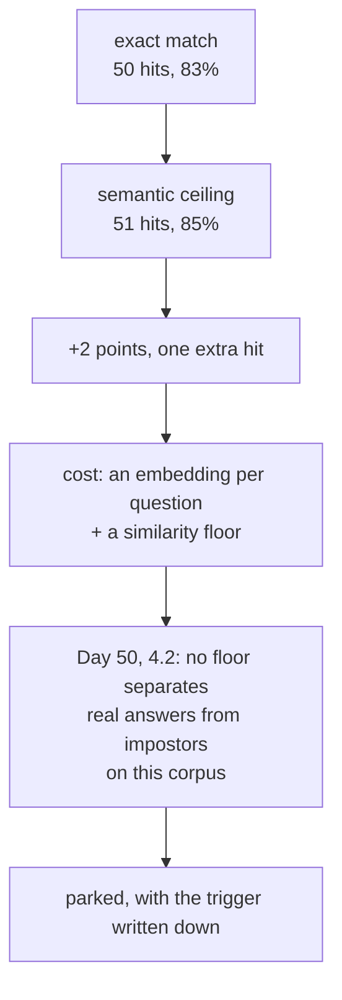

# 7.2 — 🅿️ Eviction, shared stores and semantic caching

## One-line answer

Three things a real deployment adds to today's cache — an eviction policy, a store shared across
processes, and similarity matching on the key — are deliberately **not built** here, and each has one
number that would tell you when to build it.

## The story

The municipal library has a reading room and, behind it, a stack room.

The reading room holds maybe two thousand books on open shelves. The stack room holds a hundred
thousand, and getting one takes a form, a wait, and somebody walking. The librarian decides what sits
in the reading room, and she decides it by watching: what gets asked for, what gets asked for twice,
what has not moved in a year.

Ask her whether the reading room should be bigger and she does not say yes. She says the shelves are
not the constraint — the constraint is that a bigger reading room is a longer walk to find anything,
and she already knows that four hundred of the two thousand account for most of what people take.

She is describing eviction, and she is describing it as a decision with a cost on both sides, which is
how it should be described and rarely is.

## The idea in plain language

Today's `ResponseCache` is a dictionary with a TTL. Three things are missing, and each is genuinely
worth understanding without being worth building yet.

**Eviction.** A dictionary grows forever. A real cache has a bounded size and a rule for what to throw
out when it is full — least recently used, least frequently used, a time-aware variant. Today's cache
never evicts because entries expire, and the desk's key space is small enough that the memory is
irrelevant.

**A shared store.** Today's cache lives inside one Python process. Two processes have two caches with
no knowledge of each other, so a hit rate measured on one is not the deployment's hit rate. A shared
store — Redis, Memcached, a database table — makes the cache a service, and turns every cache read
into a network call that can fail, time out and be slow.

**Semantic matching.** Today's key is exact after normalisation. `"sso redirect loop"` and
`"customer bounced back to the sign-in page during single sign-on"` are two entries with one answer, as
`_log.py`'s `answer_id` column says outright. A semantic cache embeds the question and matches by
similarity, which would merge them.

The reason all three are parked is the same, and it is worth stating once: **each of them is a
mechanism for raising the hit rate, and the hit rate is at its ceiling.**
[5.1](../05-the-response-cache/5.1-the-traffic-decides-the-hit-rate.md) measured 50 hits out of 60,
which is exactly 60 minus 10 distinct questions. There is nothing left for a bigger store, a shared
store or a cleverer match to find.

## Why Sutra needs it

Because the interview question is asked and because the trigger conditions matter more than the
mechanisms.

A parked topic in this curriculum means: you can explain it, you can say what it would buy, and you
have written down the number that would make you build it. Not building something is a decision, and
a decision without a trigger is a decision that gets revisited every time somebody new joins.

Day 70's Quota-Router and Day 84's observability work will both touch this cache. Both are better off
finding a documented "not yet, because X" than an undocumented absence.

## The mechanism

Here is each one with the number that flips it, and the evidence for that number from this day's own
runs.

### Eviction

Today: unbounded dict, entries removed by TTL only.

The curve from the paper demo is the whole argument:

```bash
cd days/day-51-caching-the-quota-lifeline/lab/papers/storage-hierarchies
uv run python stack.py
```

**Line by line:**

- `stack.py` computes the hit rate at every cache size from one pass over the reference stream, which
  is the paper's contribution and is taught in
  [`papers/01-storage-hierarchies.md`](../../papers/01-storage-hierarchies.md).
- The `cache size` column is exactly the question "how big should the store be", answered for every
  possible answer at once.

Measured on 2026-09-05:

```text
 cache size   hits  hit rate
          8     46      77%
          9     48      80%
         10     50      83%
         11     50      83%
         12     50      83%
```

Ten entries is the whole cache. Eleven and twelve are identical to ten, and so is ten thousand.

**The trigger:** build eviction when the distinct-key count over your TTL window exceeds what you are
willing to hold in memory. For the desk that number is ten, and a per-entry cost of even a kilobyte
puts the whole cache at ten kilobytes. Eviction is not a memory decision here; it is not a decision at
all.

### A shared store

Today: a dict per process.

**The trigger:** more than one process serving the desk. That is it — the moment there are two
replicas, the per-process hit rate is a lie and the fleet spends N times the misses.
[6.3](../06-proving-the-saving/6.3-the-stampede-on-a-cold-key.md) already showed the multiplier at the
fleet level: perfect single-flight in each of ten replicas is still ten calls for one cold key.

What it costs, and the reason it is not free: every lookup becomes a network call. That call can time
out, and Day 44 part
[2.3](../../../day-44-client-hardening/parts/02-the-deadline/2.3-with-timeout.md) established that
every wait in Sutra has a deadline. A cache lookup with no deadline can be slower than the model call
it was avoiding, which is the classic way a cache makes a system worse. The rule is that a cache read
gets a **short** deadline and a failure to read is treated as a miss, never as an error — the cache is
an optimisation, and an optimisation must never fail the request.

### Semantic matching

Today: exact match after normalisation.

The gap it would close is real and measurable in the desk's own log:

```bash
cd days/day-51-caching-the-quota-lifeline/lab
uv run python hitrate.py
```

**Line by line:**

- The `normalised question` row is the exact-match ceiling: 50 hits, 83%.
- `_log.py`'s `answer_id` column names the pair a semantic cache would merge:
  `"sso redirect loop"` and `"customer bounced back to the sign-in page during single sign-on"` both
  carry `sso-loop`.

Counting from the answer key: the log's **10** distinct questions carry **9** distinct `answer_id`
values, because exactly one pair is two wordings of one question. A perfect semantic cache would
therefore reach 51 hits out of 60 — **85%** — against exact matching's 50 and 83%.

**Two percentage points.** One extra hit in sixty. That is the entire prize, and it has to be weighed
against what a semantic cache costs, which is where Day 50 has already done the work for us.

A semantic cache is retrieval, and every failure mode Day 50 measured applies unchanged. It needs an
embedding of each question, so it needs a similarity floor — and
[Day 50, part 4.2](../../../day-50-chunking-and-top-k/parts/04-the-floor/4.2-there-is-no-floor-that-separates-them.md)
found that on Sutra's own corpus there is **no floor that separates real matches from impostors**: the
worst real answer scored 0.180 and the best nonsense scored 0.388. A semantic cache with a floor in
that range does not return a slightly worse document, as a retriever would. It returns **somebody
else's answer, as the answer**, which is [5.3](../05-the-response-cache/5.3-the-key-that-dropped-the-field.md)'s
collision failure with a similarity score attached to make it look considered.

**The trigger:** build a semantic cache when the gap between the exact-match ceiling and the
answer-key ceiling is large — and only with the two-condition rule from Day 50 part 4.2, never a bare
cosine floor. Two points is not large. Twenty would be.



## When it breaks

The break is building a semantic cache because the phrase sounds like an upgrade, and the failure it
produces is the worst one in this day, because it is a wrong answer that arrives with evidence.

Consider the two traps from `_log.py`, which are real desk questions:

```text
"what is the refund window"                    -> refund-window
"what is the refund window for annual plans"   -> refund-annual
```

Those two sentences share every word but two. Any embedding puts them very close together — far closer
than the 0.388 that Day 50 measured for a question about an **office printer** against an archive that
has never heard of printers. So a similarity floor loose enough to merge the two `sso` wordings, which
is the whole point of the exercise, is comfortably loose enough to merge these, which is a wrong
answer about money.

[5.3](../05-the-response-cache/5.3-the-key-that-dropped-the-field.md) already measured what that class
of merge does:

```text
key recipe                    hits  hit rate  wrong  wrong of hits
normalised question             50      83%      0             0%
first three words               52      87%      3             6%
```

Read those two rows again with this part's arithmetic in hand. `first three words` reached **52
hits** — *more* than the 51 a perfect semantic cache could reach — and three of them were wrong. A
crude lossy key overshot the honest ceiling and looked like the best result on the page.

That is the honest summary of semantic caching for this desk: **the prize is two points, a broken key
buys more than that and pays in wrong answers, and telling the two apart requires a floor that Day 50
could not find on this corpus.**

## In production

**What a professional writes instead.** They start exactly where today ends — an in-process dict with
a TTL — and they add each of the three when its trigger fires, in this order: shared store when there
are two processes, eviction when the key space stops fitting, semantic matching last or never. The
order is not arbitrary; it is increasing risk. A shared store can be wrong about *availability*.
Eviction can be wrong about *cost*. Semantic matching can be wrong about *the answer*.

**What degrades at scale.** All three get harder together, and they interact. A shared store plus
eviction means the eviction policy is now a distributed decision with its own consistency questions. A
shared store plus semantic matching means every lookup is an embedding call plus a vector search
before you have saved anything — a "cache" whose lookup is more expensive than some model calls.
Systems that added all three at once are the reason the phrase "we removed the cache and it got
faster" exists.

**The failure mode that only appears with real traffic.** A semantic cache's error rate is a function
of how *close together* your questions are, and support questions cluster tightly by construction —
they are all about one product, in one vocabulary, with error codes and plan names as the only
distinguishing tokens. That is the worst possible input distribution for similarity matching: high
average similarity, with the meaning carried by the few tokens that differ least in embedding space.
The domains where semantic caching works well are the ones where questions are far apart, which is
precisely where the repeat rate is low and a cache was not needed.

**The review comment a senior engineer leaves:** *"Before the semantic cache: what's the exact-match
ceiling and what's the answer-key ceiling? If the gap is four points I'd rather have four points of
certainty. And if we do build it, it needs Day 50's two-condition rule — a cosine floor on its own
doesn't separate our real matches from our impostors, we measured that."*

**The interview question:** *"Would you use a semantic cache?"* An honest answer: *"I measured the
prize before deciding. My exact-match key hit 83%, and by counting distinct answers rather than
distinct questions I found a perfect semantic cache would reach 85% — two points, one extra hit in
sixty, because only one pair in my traffic was genuinely two wordings of one question. Against that, a semantic cache
needs a similarity floor, and on the same corpus I'd already found there was no floor separating real
matches from nonsense: worst real match 0.18, best impostor 0.39. And my traffic has pairs like 'what
is the refund window' and 'what is the refund window for annual plans' that are near-identical in
embedding space with completely different answers. So the two points would have come with wrong
answers about refund policy, and I parked it with the trigger written down — I'd revisit if the gap
between the two ceilings got to twenty points."*

## Check yourself

```bash
cd days/day-51-caching-the-quota-lifeline/lab
uv run python hitrate.py
cd papers/storage-hierarchies && uv run python stack.py
```

Count the distinct `answer_id` values in `_log.py` and confirm the 85% figure yourself. Then write the
three trigger conditions as three sentences with numbers in them — those are the ADR the build brief
asks for.

**Out loud, without scrolling up:** name the three parked mechanisms, give the trigger for each, and
say why semantic caching is riskier for a support desk than for a general-knowledge assistant.

**Next:** the papers. Read [`papers/01-storage-hierarchies.md`](../../papers/01-storage-hierarchies.md)
now — the mechanism is built, so the proposal has something to land on.
