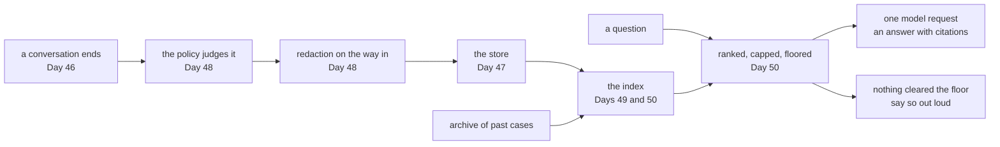

# 1.1 — The sentence the phase promised

## One-line answer

Phase 7 exists to make one sentence answerable — *"have we seen anything like this before?"* — and a
phase gate is the day you stop discussing whether the sentence is answerable and find out.

## The story

You go to the chemist with a prescription. The person behind the counter takes it, looks at you, and
asks: *"have you taken this one before?"*

It is a small question and it is doing a lot of work. If the answer is yes, they know you did not
react badly to it, because you are standing there. They know roughly what you will ask next. They
know whether to warn you about taking it with food, or whether you already know.

Now imagine the same counter, the same prescription, and nobody asks. You are handed the box. It is
the right box. Everything about the transaction is correct and the shop would pass any inspection of
its shelves, its labels and its till.

What you lost is not accuracy. It is the whole value of having been there before.

A support desk is that counter. The ticket that arrives this morning is nearly always a ticket
somebody has already answered. The difference between a desk that knows that and a desk that does
not is not measured in whether the answer is correct. It is measured in whether the answer arrives
at all, and how many people had to be interrupted to produce it.

## The idea in plain language

For the last six days this project has been building the machinery behind that question. Each day
built one piece and measured it on its own bench:

- **Day 46** drew the line between a **session** — one conversation, which ends — and a **memory** —
  something you deliberately carried out of a conversation so a different conversation can find it.
  It also established that nothing is ever carried out unless a line of your code carries it. See
  [Day 46, part 1.1](../../../day-46-sessions-vs-memory/parts/01-the-line/1.1-the-conversation-that-ends.md).
- **Day 47** made the conversation survive a restart by putting it in a file instead of in a
  dictionary that dies with the process.
- **Day 48** wrote the **retention policy** — the rules deciding what may be kept, for how long, and
  what must never be kept at all — as rows of data rather than as branches of code.
- **Day 49** built **retrieval**: turning every stored document into a list of numbers so that a
  question can be answered by *describing* what you want rather than by naming it.
- **Day 50** chose the numbers retrieval runs on — how big a stored piece is, how many pieces come
  back, and how weak a match has to be before the honest answer is *nothing*.
- **Day 51** priced **caching**, which is what keeps the whole thing inside a free tier.

Six benches. Six sets of measurements. And not one line anywhere that runs them in order.

That is what today is. A **phase gate** is a day whose only job is to put the pieces in a line, send
one real question through, and write down what actually came out — including the parts that came out
wrong.

Two words this day uses constantly, defined once:

- A **criterion** is one sentence that is either true of this repository or false of it, with a way
  to find out which. *"The desk answers from past cases"* is not a criterion. *"Asked a question
  whose answer lives only in a memo filed this week, the desk returns that memo above every archive
  row"* is.
- A **finding** is a criterion that came out false. A finding is not a failure of the gate. A finding
  is the gate working, and [1.2](1.2-a-gate-is-not-an-audit.md) is about why that distinction matters
  more than it sounds like it should.

## Why Sutra needs it

Tomorrow Phase 8 opens and the desk stops being a function. Day 53 introduces the graph Workflow
Runtime, and by Day 58 the triage flow is a graph with five stages — intake, classify, research,
draft, review — where **research is this phase**, wrapped in a node.

A node is a thing you retry, run beside other nodes, and resume after a crash. You cannot do any of
those to something you have not measured end to end, because you will not be able to tell a graph
bug from a retrieval bug that was there all along. Every hour spent debugging Day 58 with an
unmeasured Phase 7 underneath it is an hour spent guessing which half is lying.

That is the whole argument for spending a day on a gate: it is cheaper to find out now, on a flat
function, than on Day 58 inside a graph.

## The paper behind it

> **Generative Agents: Interactive Simulacra of Human Behavior**
> arXiv:2304.03442 · 2023 · <https://arxiv.org/abs/2304.03442>

It claimed that an agent's memory cannot be a single undifferentiated store scored by similarity
alone: what comes back has to be chosen on recency and importance as well, and the conclusions an
agent draws must be kept apart from the raw record of what happened.

Taught in full at
[Day 46 · papers/01-generative-agents.md](../../../day-46-sessions-vs-memory/papers/01-generative-agents.md).

## The mechanism

Here is the phase, in the order it runs, as one diagram. Every box is a day that has already been
written; every arrow is a wire this day is about to test.



And here is the same thing as a run. This is the day's headline command, and it is the only one in
the day that answers the phase's actual question:

```bash
cd days/day-52-memory-in-triage-flow/lab
uv run python endtoend.py
```

**Line by line:**

- `cd` into the lab first, because every script here imports its neighbours by plain module name —
  `_phase7`, `_archive` — and Python resolves those against the directory the script lives in.
- `endtoend.py` runs the whole chain in the diagram above: it files this week's five closed
  conversations through the policy, indexes the survivors alongside the fifty-seven-document
  archive, and sends three questions in the front door.
- The three questions are chosen to cover the three outcomes that exist. One is answered by a memo
  filed this week and by nothing else. One is answered by the archive alone. One has no answer
  anywhere, and the correct behaviour is to say so.

Measured on 2026-09-05:

```text
index rows            65
memos filed this week 4

Q  has anyone else been signed out of the dashboard on Chrome
   0.439  memo:7101:resolution:signed-out-of-the-dashboard#0
   0.345  ticket:4521#0
A  Blue Peak signed out of the dashboard every few minutes on Chrome. Cause was the SameSite and Se

Q  why would a browser throw away a cookie after a redirect
   0.233  kb:KB-104#0
A  KB-104 Unexpected sign-outs. A session cookie set without the SameSite and Secure attributes is

Q  the office printer jams on thick paper
   (nothing cleared the floor)
A  I searched the archive and found nothing close enough to be useful. Nobody has written this one

model requests        3
retrieval requests    0
```

Read the first question twice, because the whole phase is in it.

The desk was asked about people being signed out on Chrome. It returned two rows. The **top** row,
at `0.439`, is `memo:7101` — a memo written when the desk closed a case three days ago, which says
what the cause **was**: the `SameSite` and `Secure` cookie attributes, and the article that covers
it. The second row, at `0.345`, is `ticket:4521` — the original complaint from the archive, which
describes the symptom and stops there.

Now run the same three questions against the desk as it stood before any of this week's memos
existed:

```bash
uv run python endtoend.py --archive-only
```

**Line by line:**

- `--archive-only` skips the write path entirely and indexes the fifty-seven archive documents
  alone. Nothing else about the run changes: same questions, same chunk size, same cap, same floor.
- It is not a broken configuration. It is exactly what the desk was on Day 45, before Phase 7
  started, and it is what the desk silently becomes if the filing line is ever removed.

```text
index rows            61
memos filed this week 0

Q  has anyone else been signed out of the dashboard on Chrome
   0.415  ticket:4521#0
A  Ticket 4521. Keeps getting logged out. The customer is signed out of the dashboard every few min
```

Sixty-one rows instead of sixty-five. One row returned instead of two. And the answer is
`ticket:4521` — *"the customer is signed out of the dashboard every few minutes and lands back on
the sign-in page"*.

That is the complaint. The agent already has the complaint; it is sitting in front of them, which is
why they asked. What they wanted was the sentence naming `SameSite` and `Secure`, and it does not
exist in the archive-only index at all.

**Four rows are the difference between a desk that returns the problem and a desk that returns the
fix.** That sentence is what Phase 7 was for, and this run is the first time it has been true.

## When it breaks

The interesting break is not an error. It is the second question.

With memories, `kb:KB-104` scores `0.233`. Without them, the same question against the same article
scores `0.236`. Nothing about that article changed. Nothing about the question changed. The score
moved because four rows were added to the index, and the weight a word carries depends on how many
rows contain it — the arithmetic Day 49 built in
[part 1.4](../../../day-49-retrieval-and-embeddings/parts/01-text-as-numbers/1.4-the-word-that-tells-you-nothing.md).

Every filing changes every score.

That is not a bug and there is no fix, but it has a consequence you must hold on to for the rest of
this day: **a threshold tuned on one store is not valid on a bigger one.** The floor of `0.20` that
Day 50 chose was chosen against sixty-one rows. Today it faces sixty-five. In a year it will face
sixty-five thousand, and nothing in the code will announce that the number stopped being right.

The break you can reach on purpose is one line away. Ask for a chunk smaller than the overlap:

```text
Traceback (most recent call last):
  File "<string>", line 4, in <module>
  File ".../day-52-memory-in-triage-flow/lab/_index.py", line 112, in build_index
    rows = split_docs(docs, size, overlap)
           ^^^^^^^^^^^^^^^^^^^^^^^^^^^^^^^
  File ".../day-52-memory-in-triage-flow/lab/_index.py", line 81, in split_docs
    for n, piece in enumerate(chunk(text, size, overlap)):
                              ^^^^^^^^^^^^^^^^^^^^^^^^^^
  File ".../day-52-memory-in-triage-flow/lab/_index.py", line 59, in chunk
    raise ValueError(f"overlap {overlap} must be smaller than size {size}")
ValueError: overlap 60 must be smaller than size 40
```

The guard is why this stops rather than looping forever, and it is the shape of every configuration
bug in a pipeline this long: two constants, tuned by two people on two different days, that were
never checked against each other.

## In production

**What a professional writes instead.** They do not write a script called `endtoend.py`. They write
the same run as a scheduled job that executes against the real store every morning and posts its
output somewhere a human will see it without going to look. The reason is that this run's value is
entirely in the comparison — sixty-five rows today, sixty-five yesterday, forty-one on Tuesday
because someone changed a filter — and a comparison you have to remember to make is a comparison
nobody makes.

**What degrades at scale.** The two numbers in this run that look boring are the ones that move
first. `index rows` grows without bound, because nothing in Phase 7 deletes anything on a schedule;
Day 48's sweep exists but nothing calls it. And `model requests` grows exactly with traffic, because
retrieval is free and answering is not — which means the phase's cost curve is entirely determined
by how often people ask, and not at all by how much you remember.

**The failure mode that only appears with real traffic.** Memos are added by resolution, so the
store fills fastest with the cases that get resolved fastest. Those are the easy ones. Over a year,
the memory becomes an increasingly precise record of the questions the desk was already good at,
and the hard cases — long, messy, resolved by a conversation rather than by an article — are exactly
the ones that produce no clean memo and therefore never enter it. Your retrieval quality on the
questions you measure goes up while your coverage of the questions that hurt goes down.

**The review comment a senior engineer leaves:** *"This run proves the wiring on four memos and
fifty-seven documents that we wrote ourselves. Before I believe the top-row result, run it against
a month of real closed tickets and show me the same table. I expect the memo to stop being top row
somewhere around a thousand of them, and I would like to know where."*

**The interview question:** *"How do you know your retrieval-backed agent is actually using its
memory?"* An honest answer: *"I ran the same three questions twice against the same code, once with
the week's memos in the index and once without. The question about repeated sign-outs returned the
memo at 0.439 and the original complaint at 0.345 in the first run, and in the second run it
returned the complaint at 0.415 and nothing else. So the memory is not just present, it is winning —
and the answer changed from the symptom to the cause. I also noticed the control question's score
moved from 0.236 to 0.233 purely because four rows were added, which is how I know any similarity
floor I set is only valid at the store size I measured it on."*

## Check yourself

```bash
cd days/day-52-memory-in-triage-flow/lab
uv run python endtoend.py
uv run python endtoend.py --archive-only
```

Now write down, from the two runs, the exact score the memo won by on the first question. Then find
the one question whose score changed between the runs even though its answer did not, and say why.

**Out loud, without scrolling up:** state the sentence Phase 7 exists to answer, and say what the
desk returned for that question *before* this week's memos existed.

**Next:** [1.2 — A gate is not an audit](1.2-a-gate-is-not-an-audit.md).
