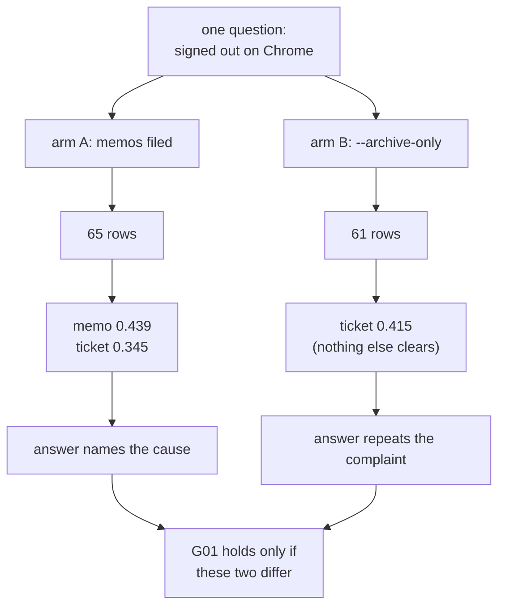

# 2.1 — G01: the question, answered end to end

## One-line answer

**G01:** asked a question whose answer exists only in a memo filed this week, the desk returns that
memo above every archive row — measured at `0.439` against `0.345`, where the same question without
the memo returns the original complaint and stops.

## The story

You go to a government office to get a document stamped. There are five windows.

Window one takes your form and checks it is the right form. Window two checks your identity. Window
three finds your file. Window four writes the decision. Window five stamps it and hands it back.

Every window is staffed. Every clerk is competent. Every one of them can tell you, accurately, what
their window does and show you that they do it correctly.

And you can still leave at the end of the afternoon without the stamped paper, because window three
found a file with your old address in it and window four wrote the decision from what window three
handed over. Nobody made a mistake at any window. The mistake is between windows, and there is no
window whose job it is to look at the whole corridor.

The only way to find out whether the corridor works is to walk it, with a real form, and see what
you are holding at the end.

## The idea in plain language

An **end-to-end criterion** is a criterion whose subject is the output of the whole system, not the
output of any part of it.

That sounds obvious and it is surprisingly rare, because every part of a system is easier to test
than the system. Testing `search()` needs an index and a query. Testing *the desk* needs a
conversation, a policy, a redaction pass, a store, an index, a query, a cap, a floor and a model.
The first test is quick to write and quick to run; the second is slow and awkward; so teams write
twenty of the first kind and none of the second, and then are surprised by a bug that lives in the
gaps.

G01 is deliberately the awkward kind. To make it checkable it needs three things:

1. **A question with a known answer.** Not "a realistic question" — a question where you wrote down
   in advance which row must come back. Day 50's
   [part 2.1](../../../day-50-chunking-and-top-k/parts/02-measuring-the-cut/2.1-the-answer-key-you-write-before-you-tune.md)
   called this the **gold set** and gave it three columns: the question, the document that answers
   it, and the words that *are* the answer.
2. **An answer that could only have come from the piece you are testing.** If the archive can also
   answer it, a passing run proves nothing about memory. So the question is chosen so that the
   archive holds the *symptom* and the memo holds the *cause*.
3. **A control run with that piece removed.** Without the control, "the memo came back" is a fact
   about one run. With it, "the memo came back and the answer changed from the complaint to the fix"
   is a fact about the difference the piece makes.

The third point is the one people leave out, and it is the whole of the criterion. A run without a
control tells you that code executed.

## Why Sutra needs it

Day 58 builds the triage graph and its **research** node is this exact call. When that node returns
the wrong row, there will be four candidate explanations: the graph passed the wrong question, the
node called the wrong function, the index was stale, or retrieval was always like this and nobody
checked.

Today's measurement removes the fourth explanation permanently, by writing down two numbers —
`0.439` and `0.345` — that anybody can reproduce on demand. That is worth an entire day, because
"retrieval was always like this" is the explanation that takes longest to rule out and it is the
one nobody can rule out retrospectively.

## The paper behind it

> **Retrieval-Augmented Generation for Knowledge-Intensive NLP Tasks**
> arXiv:2005.11401 · 2020 · <https://arxiv.org/abs/2005.11401>

It claimed that putting a retriever in front of a generator lets a model answer from documents
fetched at question time rather than only from what was frozen into its weights — which is exactly
the shape this run walks, and exactly why the answer changes when the retrieved rows change.

Taught in full at
[Day 49 · papers/02-retrieval-augmented-generation.md](../../../day-49-retrieval-and-embeddings/papers/02-retrieval-augmented-generation.md).

## The mechanism

The question is *"has anyone else been signed out of the dashboard on Chrome"*. Here is what exists
in the two stores that could answer it.

In the **archive** — the fifty-seven documents that were there before this week — there is
`ticket:4521`:

```text
Ticket 4521. Keeps getting logged out. The customer is signed out of the dashboard every few
minutes and lands back on the sign-in page. Started yesterday. Plan: Pro.
```

That is a complaint. It contains the words the question contains, so it will score well, and it
contains no cause and no fix.

In the **memory** — filed three days ago when case 7101 was resolved — there is
`memo:7101:resolution:signed-out-of-the-dashboard`:

```text
Blue Peak signed out of the dashboard every few minutes on Chrome. Cause was the SameSite and
Secure cookie attributes, see KB-104. Reported by [EMAIL].
```

Same symptom words, plus the cause, plus the article, plus a redaction marker where an address used
to be. That last detail is [3.3](../03-the-write-path/3.3-nothing-personal-reached-the-store.md)'s
subject and is not this part's business, except to notice that it is already there before anybody
searched.

Now run the criterion:

```bash
cd days/day-52-memory-in-triage-flow/lab
uv run python endtoend.py
```

**Line by line:**

- `endtoend.py` calls `build_desk()`, which runs the write path once — judge, redact, decide what
  survives — and returns the index that the read path searches. There is no separate "load" step,
  deliberately: the criterion is about the corridor, so the run walks the corridor.
- The three questions are hard-coded in the file rather than read from the gold set, because the
  gold set is tuned for *retrieval* and this criterion is about the *desk*. The two want different
  questions and pretending otherwise is how an end-to-end check quietly becomes a unit test.
- Nothing is printed about which store a row came from. It does not have to be: the `ref` says.
  `memo:` and `ticket:` are different prefixes, which is the whole reason
  [2.2](2.2-an-answer-that-names-its-source.md) works.

Measured on 2026-09-05, first question only:

```text
Q  has anyone else been signed out of the dashboard on Chrome
   0.439  memo:7101:resolution:signed-out-of-the-dashboard#0
   0.345  ticket:4521#0
A  Blue Peak signed out of the dashboard every few minutes on Chrome. Cause was the SameSite and Se
```

And the control, with the same code and the memos removed:

```bash
uv run python endtoend.py --archive-only
```

**Line by line:**

- `--archive-only` swaps `build_desk()` for `archive_only_index()`, which indexes `DOCS` and nothing
  else. Same chunk size, same overlap, same cap, same floor, same tokenizer, same scoring.
- It is a control and not a bug report. This is the desk as it existed at the end of Phase 6, and
  it is what the desk silently reverts to the day somebody removes the filing call.

```text
Q  has anyone else been signed out of the dashboard on Chrome
   0.415  ticket:4521#0
A  Ticket 4521. Keeps getting logged out. The customer is signed out of the dashboard every few min
```

Three things changed and all three matter.

**The top row changed.** `memo:7101` at `0.439` beat `ticket:4521` at `0.345` — a gap of `0.094`,
which is not close. The memo did not merely appear in the results; it won.

**The number of rows changed**, from two to one. In the control, only one row cleared both of Day
50's conditions. So the memo is not displacing an archive row — it is adding a result that did not
previously exist, and it is landing above the one that did.

**The answer changed from the symptom to the cause.** The control answers with the customer's own
complaint. The real run answers with the sentence naming `SameSite and Secure` and the article
`KB-104`. Those are two different pieces of paper to hand a support agent, and only one of them ends
the ticket.

Here is the criterion as a diagram, because what makes it a *gate* criterion rather than a unit test
is that both arms run the same code:



## When it breaks

The break that matters is the one where G01 passes and means nothing, and it has a specific cause:
**a question the archive can also answer.**

Try the criterion with the second question from the run instead — *"why would a browser throw away
a cookie after a redirect"*:

```text
with memories     0.233  kb:KB-104#0
archive only      0.236  kb:KB-104#0
```

The same row, from the same store, at almost the same score. If that question had been chosen as
G01's, the criterion would pass on a system where the memory was never wired in at all, because the
answer never depended on the memory. A criterion that passes when the feature is removed is not a
criterion; it is a sentence that happens to be true.

The second break is the scores moving for reasons that have nothing to do with the question.
`kb:KB-104` scored `0.236` in the control and `0.233` in the real run. Four rows entered the index
and every weight shifted, because a term's weight depends on how many rows contain it — Day 49's
[part 1.4](../../../day-49-retrieval-and-embeddings/parts/01-text-as-numbers/1.4-the-word-that-tells-you-nothing.md).
Write a criterion as *"KB-104 scores at least 0.235"* and it goes red the next time anybody files
anything, for no reason a reader will be able to work out.

The third break is an error, and you can reach it deliberately by asking for more rows than exist:

```text
Traceback (most recent call last):
  File "<string>", line 4, in <module>
  File ".../day-52-memory-in-triage-flow/lab/_index.py", line 112, in build_index
    rows = split_docs(docs, size, overlap)
           ^^^^^^^^^^^^^^^^^^^^^^^^^^^^^^^
  File ".../day-52-memory-in-triage-flow/lab/_index.py", line 81, in split_docs
    for n, piece in enumerate(chunk(text, size, overlap)):
                              ^^^^^^^^^^^^^^^^^^^^^^^^^^
  File ".../day-52-memory-in-triage-flow/lab/_index.py", line 59, in chunk
    raise ValueError(f"overlap {overlap} must be smaller than size {size}")
ValueError: overlap 1000 must be smaller than size 900
```

This is what happens when somebody raises `CHUNK_SIZE` in one place and not the other, and it is
the friendly version of the failure. The unfriendly version does not raise at all, and it is
[6.2](../06-failure-lab/6.2-the-memo-that-could-not-be-found.md).

## In production

**What a professional writes instead.** They keep the two arms and add a third: the same question
against yesterday's index. Two arms tell you the feature does something; three tell you whether it
is still doing it. The third arm is what turns G01 from a launch check into a regression check, and
the cost is keeping one dated copy of the index around.

**What degrades at scale.** The gap of `0.094` is a property of a sixty-five-row store with one
memo about this subject. File four hundred more sign-out memos and they compete with each other:
the top row becomes whichever of them happened to share the most words with the question, the gap
between first and second collapses towards zero, and the criterion starts passing or failing on
noise. The signal to watch is not the top score, it is the **gap between the first and second
result** — which Day 49's
[part 5.1](../../../day-49-retrieval-and-embeddings/parts/05-when-retrieval-lies/5.1-nearest-is-not-near.md)
already named as a thing the desk should emit.

**The failure mode that only appears with real traffic.** In this lab the question was typed by the
person who wrote the memo. In production the question is typed by a support agent under time
pressure, in their own words, and often typed *by the model* — Day 49's
[part 5.3](../../../day-49-retrieval-and-embeddings/parts/05-when-retrieval-lies/5.3-the-question-you-actually-asked.md)
measured five phrasings of one question producing five different results, three of them exactly
`0.000`. G01 as written measures the retrieval you tested. It does not measure the retrieval you
ship, and the difference between those two is the wording, which you do not control.

**The review comment a senior engineer leaves:** *"Good — you ran both arms. Now tell me what
happens when there are two memos about sign-outs instead of one, because that is next month. I want
the gap between rank one and rank two in the output, not just the top score, and I want the
criterion to be about the gap."*

**The interview question:** *"How do you prove a retrieval feature is actually contributing?"* An
honest answer: *"An ablation. Same code, same question, same everything, with the feature's data
removed. On my desk the question about repeated sign-outs returned the resolution memo at 0.439 and
the original complaint at 0.345; with the memos removed it returned the complaint at 0.415 and
nothing else. So the answer went from the symptom to the cause, and I can point at the two runs. The
mistake I avoided was picking a question the archive could also answer — I had one of those, and it
scored 0.236 with the feature and 0.233 without, which would have proved nothing."*

## Check yourself

```bash
cd days/day-52-memory-in-triage-flow/lab
uv run python endtoend.py
uv run python endtoend.py --archive-only
```

Now write G01 down as a sentence with the two numbers in it. Then find a question in
`_archive.py`'s `GOLD` list that would make a **bad** G01, and say in one line why.

**Out loud, without scrolling up:** explain why an end-to-end criterion needs a control run, and
what a criterion proves if it passes with the feature switched off.

**Next:** [2.2 — An answer that names its source](2.2-an-answer-that-names-its-source.md).
