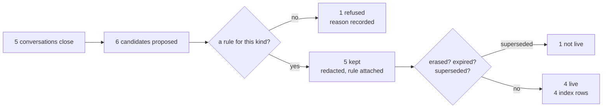

# 3.1 — G03: nothing is filed unless a line files it

## One-line answer

**G03:** memory fills only where a line of code fills it, and the counts must reconcile — six
candidates proposed, five kept, one refused, four live — because a store nobody writes to is
indistinguishable from a store that does not exist.

## The story

There is a suggestion box on the wall by the staff kitchen. It has been there for years. It has a
slot, a lock, a printed label, and a small stack of blank cards and a pen beside it.

People use it. Somebody wrote a note about the broken tap. Somebody wrote a longer one about the
rota. A new starter, told at induction that the company listens, put in a careful page about the
handover process.

Nobody has a key.

The box is not broken. It was installed correctly, it is in the right place, it is well signposted,
and it is doing precisely what a box does. What was never built is the other half — the person whose
job it is to open it on a Friday and do something with what is inside — and because a box that is
never opened looks exactly like a box that is emptied every week, nobody found out for years.

## The idea in plain language

Day 46's [part 1.3](../../../day-46-sessions-vs-memory/parts/01-the-line/1.3-nothing-is-filed-unless-you-file-it.md)
made the claim: sessions accumulate whether you want them to or not, and memory accumulates nothing
at all until your code calls `add_session_to_memory`.

Today turns that claim into a number, and the number is the point. "Memory is empty" is not a thing
you notice. There is no exception, no warning, no log line and no empty result — a search over an
empty memory returns whatever the archive has, confidently, which is
[6.1](../06-failure-lab/6.1-the-store-that-was-never-filled.md)'s whole subject.

So the criterion cannot be *"the store is filled"*. It has to be an arithmetic identity you can check
on every run:

> **proposed = kept + refused**, and **live ≤ kept**.

Four counts, and each one is a different question:

- **Proposed** — how many things the triage flow *offered* to memory. If this is zero, nothing
  upstream is calling the write path at all, and every other number below it is zero for a reason
  that has nothing to do with the policy.
- **Kept** — how many the retention policy admitted. Day 48 built this.
- **Refused** — how many it turned away, and why. Day 48's
  [part 2.2](../../../day-48-memory-design/parts/02-policy-as-data/2.2-every-verdict-names-its-row.md)
  insisted that the judging function **splits rather than filters**, returning both lists, precisely
  so this number exists.
- **Live** — how many survive erasure, expiry and supersession *today*. Lower than kept is normal:
  a memo can be admitted and immediately superseded by a later one about the same subject, which is
  what a correction does.

The identity is what makes the whole thing checkable. If proposed does not equal kept plus refused,
something is being dropped in silence, and silence is the failure mode this entire day exists to
catch.

One term, defined once: a **candidate** is a thing somebody wants to carry out of a conversation.
Not a memo — a memo is what a candidate becomes if the policy admits it. Keeping the two words apart
is what lets you count a refusal at all.

## Why Sutra needs it

Day 62 introduces human-in-the-loop patterns and Day 63 designs the approval gates: which actions
need a person's consent before they happen. A write into a memory that will be read back and shown
to customers for the next three years is a strong candidate for one of those gates.

You cannot put an approval gate in front of an act you cannot count. The four numbers below are what
a Day 63 design has to attach to: *this many were proposed, this many were admitted automatically,
this many need a human.* A write path that files things as a side effect of something else has no
place to hang that decision.

## The mechanism

The write path is one function call, and it returns two lists rather than one:

```python
def what_to_keep(candidates: list[Candidate], *, today: str) -> tuple[list[Memo], list[Refusal]]:
    """Judge every candidate, and split rather than filter (Day 48, part 2.2)."""
    del today  # no rule here depends on the date; expiry is `what_to_forget`'s job
    kept: list[Memo] = []
    refused: list[Refusal] = []
    for candidate in candidates:
        rule = RULES.get(candidate.kind)
        if rule is None:
            refused.append(Refusal(candidate, f"no retention rule for kind {candidate.kind!r}"))
            continue
        text, fired = redact(candidate.text) if rule.redact else (candidate.text, ())
        kept.append(
            Memo(
                kind=candidate.kind,
                holder=candidate.holder,
                subject=candidate.subject,
                text=text,
                said_on=candidate.said_on,
                source=candidate.source,
                rule=rule.kind,
                redactions=fired,
            )
        )
    return kept, refused
```

**Line by line:**

- The return type is a **tuple of two lists**, and that is the single most important line in the
  function. A function returning only survivors makes refusals unobservable, and an unobservable
  refusal rate is the signal you most want when the policy stops matching the traffic.
- `today` is accepted and immediately discarded with `del`. It is in the signature because every
  function in this policy takes `today` as a required keyword argument, so that section 3 can ask
  the policy what it thinks on four different dates. A module that reads the clock cannot be tested.
- `RULES.get(candidate.kind)` returns `None` for a kind nobody wrote a rule for, and the `None`
  branch **refuses**. Day 48's
  [part 2.3](../../../day-48-memory-design/parts/02-policy-as-data/2.3-the-kind-with-no-rule.md)
  argued that the most important row in a retention policy is the one that is not there; this is
  where that argument becomes an `if`.
- `redact(...)` runs **inside the construction of the memo**, not afterwards. A `Memo` cannot be
  built holding unredacted text, which is
  [3.3](3.3-nothing-personal-reached-the-store.md)'s subject and the reason it is impossible to
  forget.
- Nothing here is logged. The function returns everything it knows and the caller decides what to
  record — Day 48's rule, and the reason the same function is usable from a test, a gate and a
  scheduled job.

Now run the counts:

```bash
cd days/day-52-memory-in-triage-flow/lab
uv run python filed.py
```

**Line by line:**

- `filed.py` runs the five closed conversations in `_conversations.py` through `what_to_keep` and
  then `what_to_forget`, and prints all four counts plus the identity.
- It prints every verdict individually, with the reason attached, because a total that reconciles
  can still be reconciling for the wrong reason.

Measured on 2026-09-05:

```text
conversations closed  5
candidates proposed   6
candidates judged     6
  kept                5
  refused             1
memos live            4

reconciliation
  proposed            6
  kept + refused      6
  balances            True

  live        memo:7101:resolution:signed-out-of-the-dashboard admitted by rule 'resolution'
  live        memo:7104:resolution:csv-export-empty          admitted by rule 'resolution'
  superseded  memo:7108:account_fact:billing-account         replaced by correction of 2026-09-03
  live        memo:7108:correction:billing-account           admitted by rule 'correction'
  live        memo:7112:resolution:reset-link-already-used   admitted by rule 'resolution'
  refused     case:7115                                      no retention rule for kind 'hunch'
```

Read the two numbers that are not equal to each other.

**Six proposed, five kept.** The one refusal is `case:7115`, where the agent said *"I think this is
the same throttling problem as last time, but I have not confirmed it."* Somebody wanted to keep
that, and the policy has no row for a `hunch`, so it does not enter. That is not the policy being
strict; it is the policy being honest about its own coverage. An unconfirmed guess filed as a
resolution is a sentence that will come back in three months wearing the authority of the archive.

**Five kept, four live.** `memo:7108:account_fact:billing-account` says *"Bill Blue Peak on the
Northwind account"*. It was admitted — it is a perfectly legitimate account fact — and then
immediately superseded by the correction from the same conversation, where the customer said
*"actually, no"*. Both are in the store. Only one is live. Day 48's
[part 1.4](../../../day-48-memory-design/parts/01-what-a-conversation-leaves/1.4-a-correction-outranks-it.md)
is why, and the verdict line names it: `replaced by correction of 2026-09-03`.

Now remove the filing line:

```bash
uv run python filed.py --no-write
```

**Line by line:**

- `--no-write` skips the write path entirely. Nothing is judged, nothing is refused, nothing is
  stored. It is not a broken build; it is a desk whose `add_session_to_memory` call was never
  written, or was written and later removed in a refactor.

```text
conversations closed  5
candidates proposed   6
candidates judged     0   (the write path was never called)
memos live            0

index rows with memos 65
index rows without    61

A store with no filing line behaves exactly like a system with no memory at all.
```

Five conversations still closed. Six candidates still proposed. And the store is empty, because
proposing is not filing.

**Sixty-one rows against sixty-five.** That difference is the entire observable footprint of the
failure. No error, no warning, no log line — and if you did not have the two numbers side by side,
sixty-one rows would look like a perfectly healthy index, because it *is* one.



## When it breaks

The break is not an exception. It is a number that stops reconciling, and it happens the moment
somebody makes the judging function return one list.

Rewrite `what_to_keep` to `return kept` and every caller still works. The gate's arithmetic breaks
immediately — `proposed` is six, `kept` is five, `refused` is unknown, and there is no way to tell
a refusal from a crash. The refusal rate, which is the one signal that tells you the policy has
drifted away from the traffic, no longer exists as a quantity.

The second break is real and produces a real error. Ask for a verdict on a memo whose kind has no
rule, after the split has been bypassed:

```text
Traceback (most recent call last):
  File "<string>", line 6, in <module>
  File ".../days/day-52-memory-in-triage-flow/lab/_phase7.py", line 213, in what_to_forget
    rule = RULES[memo.rule]
           ~~~~~^^^^^^^^^^^
KeyError: 'hunch'
```

That is `what_to_forget` being handed a memo `what_to_keep` would never have produced. It is worth
reaching on purpose, because it demonstrates why the two functions are separate and why the first
one refuses rather than tolerating: `what_to_forget` is written on the assumption that every memo it
sees was admitted by a rule, and the `KeyError` is that assumption failing loudly rather than the
memo living forever under no policy at all.

The third break is the one from the story, and it produces nothing at all: the write path exists,
is correct, is tested, and is never called. The `--no-write` run above **is** that break. There is
no error text to quote, which is the reason G03 is an arithmetic criterion rather than an
assertion — you cannot catch an absence with a `try`.

## In production

**What a professional writes instead.** The four counts are emitted as metrics on every run, not
printed. `proposed`, `kept`, `refused`, `live`, and the derived `refused / proposed`. The alert is
not on any of the four; it is on the **ratio**, because the absolute numbers move with traffic and
the ratio does not. A refusal rate that jumps from two per cent to forty means somebody upstream
started proposing a new kind of thing, and you want to know that on the day it happens rather than
when a customer asks why the desk forgot something.

**What degrades at scale.** `live ≤ kept` gets further apart every month, because supersession and
expiry keep working while the store keeps growing. Eventually most of what is stored is not live,
and a store where eighty per cent of rows are superseded is paying for itself twice: once in
storage, and once in every index build that walks rows nobody may return. That is the trigger for
the sweep Day 48 designed and left as a `TODO(me)`, and the number that pulls the trigger is exactly
`live / kept`.

**The failure mode that only appears with real traffic.** In a lab, candidates are proposed by a
function you wrote. In production they are proposed by a model deciding what was worth keeping from
a conversation, and models are agreeable. Ask one to extract the durable facts from a chat and it
will find some, every time, including from a conversation that contained none. Proposed climbs
steadily, kept climbs with it, and the store fills with true-but-worthless statements — *"the
customer confirmed they had received the email"* — that are individually harmless and collectively
dilute every search. The counts look healthy the entire time.

**The review comment a senior engineer leaves:** *"You are counting what the policy did with what it
was given. Nothing counts what it was **not** given. If the extraction step silently returns an empty
list for a whole class of conversations, every number in this report is zero and every number is
also correct. Add a count of conversations closed with zero candidates and alert if it moves."*

**The interview question:** *"How would you know if your agent's memory had stopped being written
to?"* An honest answer: *"You cannot know from the read side, because an empty memory and a working
one both return results — the archive answers anyway, confidently. So I count on the write side and
check an identity: proposed equals kept plus refused. On my last run that was six equals five plus
one, with the one refusal being an unconfirmed guess that has no retention rule. If proposed ever
goes to zero, the pipeline upstream stopped calling me, and no read-side signal would have shown
that."*

## Check yourself

```bash
cd days/day-52-memory-in-triage-flow/lab
uv run python filed.py
uv run python filed.py --no-write
```

Find the one candidate that was refused and the one that was superseded, and say in a sentence why
each is a different kind of "not in the store".

**Out loud, without scrolling up:** state the arithmetic identity G03 checks, and explain why an
empty memory cannot be detected from the read side.

**Next:** [3.2 — Every memo names the rule that kept it](3.2-every-memo-names-the-rule-that-kept-it.md).
