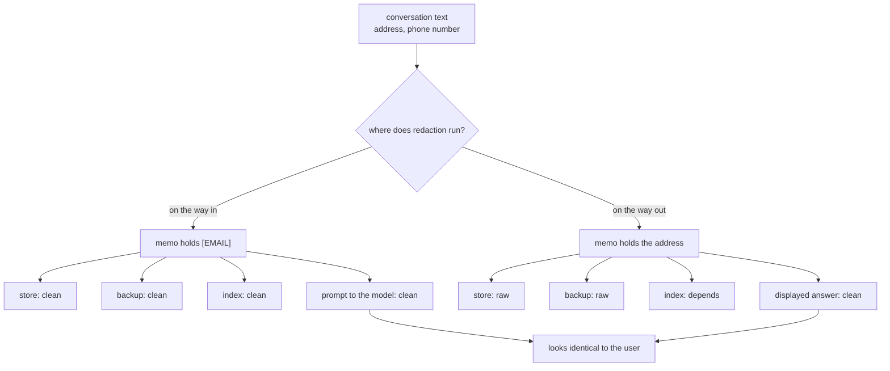

# 3.3 — G05: nothing personal reached the store

## One-line answer

**G05:** no personal detail is in the store, checked by running the patterns **against the stored
rows** rather than against the code that was supposed to strip them — and the same conversations
redacted on the way out instead leave two rows still matching.

## The story

You need to prove your address for a phone contract, so you take your ID card and a bank letter to
the copy shop on the corner.

The man behind the counter lifts the lid, puts your card face down on the glass, presses the green
button, hands you the copy, and takes your money. You leave.

The card is still on the glass.

The lid is down, so it looks exactly like a closed photocopier. The next customer lifts the lid to
copy their tax form, and there it is: your name, your number, your date of birth, sitting on the
glass of a machine in a shop on a street.

Nobody was careless with the copy. The copy was fine. What went wrong is that the original was left
in the machine, and the reason nobody noticed is that a machine with something on the glass and a
machine with nothing on the glass look the same from the outside.

## The idea in plain language

There are two places you can remove personal data from a system, and they are not equivalent.

**On the way in** — the text is cleaned *before* anything stores it. What lands in the store, the
backup, the export, the log and the index is already clean. The original exists only in the
conversation it came from, which has its own retention rule and its own deletion path.

**On the way out** — the text is stored as it arrived and cleaned when it is displayed. The
displayed answer looks identical. Everything behind it holds the original.

Everybody's first instinct is on the way out, because it is reversible and feels safer: if the
redaction is too aggressive you can loosen it and the data is still there. That is precisely the
problem. *The data is still there* — in the file, in last night's backup, in the search index, in
the analytics export somebody set up in March, and in the copy of production that was pulled onto a
laptop to debug something.

Day 48's [part 4.1](../../../day-48-memory-design/parts/04-privacy-and-erasure/4.1-redact-before-you-write.md)
stated the rule in one sentence: personal data that never reaches storage cannot leak, cannot be
backed up, cannot be exported and cannot be asked for.

G05 adds one thing to that rule, and it is the thing that makes it a gate criterion rather than a
design intention: **the check runs against the store.**

That distinction is the whole part. A check that reads the source and confirms `redact()` is called
is a check on the code. A check that reads every row in the store and runs the patterns over it is a
check on reality. The first one passes when redaction is called on the wrong field, when a code path
bypasses it, or when someone loads data in by a different route. The second one does not.

Two terms, defined once:

- **PII** — personally identifiable information: anything that identifies a person, on its own or
  combined with something else. An email address, a phone number, an account number, a home address.
  This lab's patterns cover two classes, and knowing which two is more important than the patterns.
- **Data minimisation** — holding the least data that still does the job. Redaction on the way in is
  data minimisation with an implementation.

## Why Sutra needs it

Day 69 is *PII and data boundaries — synthetic data only, free-tier training caveat*, and it carries
a fact this criterion is a rehearsal for: a free-tier model provider may use what you send it. Every
memo in this store is a candidate for a prompt, so every memo in this store is a candidate for
somebody else's training corpus.

There is no way to un-send that. It is not a risk you mitigate afterwards with a policy; it is a
property of what you put in the store, decided at the moment of writing, by this function. Day 69
will ask what the desk holds, and the honest answer has to already be *"nothing personal, and here
is the run that checks it"*.

## The mechanism

The patterns are data, and redaction happens inside the construction of the memo so there is no
window in which an unredacted `Memo` exists:

```python
PII_PATTERNS: dict[str, re.Pattern[str]] = {
    "EMAIL": re.compile(r"[A-Za-z0-9._%+-]+@[A-Za-z0-9.-]+\.[A-Za-z]{2,}"),
    "PHONE": re.compile(r"\+?\d[\d ()-]{7,}\d"),
}


def redact(text: str) -> tuple[str, tuple[str, ...]]:
    """Replace anything matching a PII pattern with its label, and say which patterns fired."""
    fired: list[str] = []
    for label, pattern in PII_PATTERNS.items():
        text, count = pattern.subn(f"[{label}]", text)
        if count:
            fired.append(label)
    return text, tuple(fired)
```

**Line by line:**

- `PII_PATTERNS` is a dictionary of **label to pattern**, not a list of patterns, because the label
  is what ends up in the text. `[EMAIL]` in a stored memo tells a later reader that something was
  removed and what kind of thing it was, which a blank space does not.
- `subn` rather than `sub`: it returns the replacement count as well as the text, which is how the
  function can report **what fired** rather than only what it produced. A redaction nobody can count
  is a redaction nobody can check, and `G05` counts.
- The loop reassigns `text` on every pass, so patterns compose: a sentence containing both an
  address and a number comes out with both replaced and both labels reported.
- The return type is a tuple of `(text, labels)`, which forces every caller to decide what to do
  with the labels. Returning the text alone would make it possible to redact and never record that
  you had.
- The `PHONE` pattern deliberately requires a digit at each end with at least eight characters
  between. It is crude. Which classes it does *not* cover is a `TODO(me)` in the hub, and Day 48's
  build brief already asks for the list, because an uncovered class is not a bug you find later — it
  is a claim you never made.

Now the criterion, run against the store:

```bash
cd days/day-52-memory-in-triage-flow/lab
uv run python redacted.py
```

**Line by line:**

- `redacted.py` first prints what the conversations *proposed*, so you can see the personal data
  entering the pipeline rather than take its presence on trust.
- It then runs the write path and applies `matches()` — the same patterns — to every row that
  actually ended up in the store, and separately to every row in the index.
- Checking the index as well as the store is not redundant. The index is a second copy of the text,
  built by different code, and it is the copy that gets pasted into a prompt.

Measured on 2026-09-05:

```text
what the conversations proposed
  case:7101  ['EMAIL']
      ure cookie attributes, see KB-104. Reported by dana.k@blue-peak.example.
  case:7112  ['PHONE']
      e customer's mail scanner opened them first. Contact on +44 7700 900312.

stored redacted, on the way in
  rows in the store     4
  rows still matching   0

  index rows matching   0

what redaction did, on one memo
  before  ure cookie attributes, see KB-104. Reported by dana.k@blue-peak.example.
  after    SameSite and Secure cookie attributes, see KB-104. Reported by [EMAIL].
  fired   ('EMAIL',)
```

Two of the six proposed candidates carried personal data. Zero rows in the store match. Zero rows in
the index match. G05 holds.

Now store the same conversations raw and redact on display instead:

```bash
uv run python redacted.py --after
```

**Line by line:**

- `--after` keeps the original text on the memo and applies redaction only where the text is shown.
  Nothing else changes: same policy, same rules, same candidates, same index build.
- This is not a strawman. It is the design most systems have, because it is the design you get by
  default when redaction is added after the store already exists.

```text
stored raw, redacted on read
  rows in the store     4
  rows still matching   2
      memo:7101:resolution:signed-out-of-the-dashboard  ['EMAIL']
      memo:7112:resolution:reset-link-already-used  ['PHONE']

  index rows matching   0
```

**Two rows in the store still contain an address and a phone number**, and the answer a support
agent sees is byte-for-byte the same in both runs. That is the photocopier: the copy is clean, and
the original is still on the glass.

Note the third line carefully — `index rows matching 0` — because it is the trap inside the trap. In
this arm the index was built from the redacted text while the store kept the raw text, so the search
index looks clean and the store is not. A check that only read the index would report this
configuration as passing. The criterion has to walk **every** copy of the text, and in a real system
there are more copies than you think.



## When it breaks

The most common break is a pattern that eats too much. Day 48's build brief already flags it: the
email pattern here ends with `[A-Za-z]{2,}`, which is greedy about the trailing part of the domain
and will happily swallow a full stop in some inputs, turning *"Reported by a@b.example. The
customer"* into *"Reported by [EMAIL] The customer"*. The sentence loses its full stop, the memo
reads slightly wrong, and nobody notices because nobody re-reads memos.

The second break is the one with no error text and the largest consequence: **a class you did not
write a pattern for.** This lab covers two. Real desk traffic contains account numbers, order
references, postcodes, national identifiers, card fragments, IP addresses and — most awkwardly —
names, which no regular expression will ever find. Every one of those flows through `redact()`
untouched, the function reports `fired=()`, and G05 passes.

That is not a bug in the check; it is the boundary of the check, and it must be written down rather
than discovered. A criterion that says *"no PII in the store"* is false. The criterion this gate can
honestly make is *"no instance of the two classes we cover is in the store"*, and the gap between
those two sentences belongs in the day's traps.

The third break does raise, and it is worth reaching once:

```text
Traceback (most recent call last):
  File "<string>", line 4, in <module>
  File ".../day-52-memory-in-triage-flow/lab/_phase7.py", line 151, in redact
    text, count = pattern.subn(f"[{label}]", text)
                  ^^^^^^^^^^^^
AttributeError: 'str' object has no attribute 'subn'
```

That is `PII_PATTERNS` holding a raw string instead of a compiled pattern — the edit somebody makes
when adding a class in a hurry. It fails loudly on the first memo, which is the correct outcome. The
version that fails quietly is a pattern that compiles and matches nothing, and there is no exception
for that at all: the only defence is a test with a positive case for every pattern in the dictionary.

## In production

**What a professional writes instead.** They redact in two places, not one, and they are honest that
the second is a backstop rather than a design. Redaction on the way in is the boundary; a check on
the way out is a tripwire that catches the row that got in by some other route — a migration, an
import, a backfill, a bug. What they do not do is rely on the second one, because a tripwire that
fires on live traffic has already failed at the thing that mattered.

**What degrades at scale.** Patterns are cheap per row and the store grows without bound, so
eventually the redaction pass is a meaningful share of the write cost — which is the moment somebody
proposes running it asynchronously, "just for the backlog". That proposal is the beginning of a
store with a mixed population, some rows redacted and some not, and no field saying which. If it has
to happen, the memo needs a `redacted_by_version` field from the start, so the unclean rows are
addressable.

**The failure mode that only appears with real traffic.** Customers put personal data in places
patterns do not look. A screenshot pasted into a ticket. A file name that is somebody's full name. A
sentence that identifies a person without containing anything a regex can match — *"the man who runs
the Camden branch"*. The store fills with material that is technically pattern-clean and genuinely
identifying, and no amount of tightening the regexes touches it. This is the argument for keeping
memos short and factual rather than storing conversation excerpts, which is the same argument Day
48's [part 1.3](../../../day-48-memory-design/parts/01-what-a-conversation-leaves/1.3-the-transcript-is-exhaust.md)
made for a different reason.

**The review comment a senior engineer leaves:** *"You check the store and the index. Name every
other place this text lands and check those too — the session database from Day 47, the structured
logs from Day 22, and anything the prompt is echoed into. A redaction that covers three of five
copies is a redaction that will be described in the incident report as having been in place."*

**The interview question:** *"Where do you strip personal data in a retrieval system, and how do you
know it worked?"* An honest answer: *"On the way in, before anything stores it, inside the
constructor so there is no window where an unredacted record exists. To know it worked I run the
patterns over the stored rows and the index rows, not over the code — on my last run that was zero
matches out of four rows, and when I switched to redact-on-read instead, two of the same four rows
still contained an address and a phone number while the displayed answer was identical. The limit I
would state up front is that I cover two classes, email and phone, so my claim is about those two
and not about PII in general."*

## Check yourself

```bash
cd days/day-52-memory-in-triage-flow/lab
uv run python redacted.py
uv run python redacted.py --after
```

Add a third pattern to `PII_PATTERNS` for something this lab does not cover, then re-run and see
whether anything fires. Whatever the answer, write down one class you are still not covering.

**Out loud, without scrolling up:** say why a check that reads the source code cannot satisfy G05,
and name three places the text lands besides the store.

**Next:** [4.1 — The ranked path is the one that ships](../04-the-read-path/4.1-the-ranked-path-is-the-one-that-ships.md).
