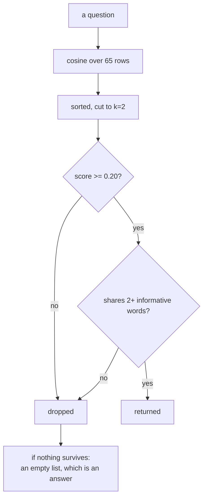

# 4.1 — G06: the ranked path is the one that ships

## One-line answer

**G06:** three read paths over the same index and the same answer key give 0/10, 10/10 and 9/10
answered — and only the third one, which loses a real answer, rejects all four questions the archive
cannot answer.

## The story

A shop needs a Saturday assistant and forty people apply. The applications land on the manager's
desk over three weeks, in whatever order the post arrived.

The manager has time to read two.

If the pile is in postal order, the two they read are the two that arrived first. Those two might be
excellent. They might be a retired accountant and someone who lives ninety minutes away. There is no
relationship at all between "arrived early" and "suitable", so reading two off the top is the same
as reading two at random — and reading forty is not on offer.

Now suppose somebody spends an afternoon putting the pile in order of how well each application
matches the advert. The manager still reads two. But now the two are the two best, and the number
two is a *budget* rather than a *risk*.

Sorting the pile did not change how many the manager can read. It changed what reading two is worth.

## The idea in plain language

Day 46 shipped a **cap**: return at most `TOP_K` memories, so that a search cannot paste the whole
store into a prompt. Its
[part 5.4](../../../day-46-sessions-vs-memory/parts/05-failure-lab/5.4-the-store-that-outgrew-its-value.md)
measured what happens without one — five hundred filed cases, one question matching all five
hundred, 48,175 characters injected.

The cap worked and it bought no correctness at all, because the underlying service returned matches
in no particular order. Day 46's own summary says it plainly: *you cannot take the top three of an
unranked list.*

Day 49 supplied the ranking, and Day 50 added two conditions on top of it. So there are three read
paths in this project's history, and they are all still runnable:

| Path | What it does | Built on |
| --- | --- | --- |
| **unranked cap** | everything that shares a word, in index order, cut to `k` | Day 46 |
| **ranked** | cosine similarity, sorted, cut to `k` | Day 49 |
| **ranked + floor** | the above, then drop anything below `SIM_FLOOR`, then require `MIN_SHARED_TERMS` informative words in common | Day 50 |

G06 is the criterion that says the third one is what ships, and that the choice was made from a
table rather than from a preference.

The table needs three columns, and the third is the one people leave out:

- **hit@k** — did the document that answers the question appear in the top `k` rows?
- **answered@k** — did the *text* of those rows actually contain the answer? Day 50's
  [part 1.3](../../../day-50-chunking-and-top-k/parts/01-the-unit-you-index/1.3-cut-too-small-to-mean-anything.md)
  is about the gap between these two.
- **impostors answered** — for questions the archive genuinely cannot answer, how many came back
  with rows anyway? This one has no upper bound that is good. Four out of four is a system that will
  answer anything.

One term, defined once: an **informative term** is a word rare enough in this archive to carry
meaning, measured by its inverse document frequency — the weighting Day 49's
[part 1.4](../../../day-49-retrieval-and-embeddings/parts/01-text-as-numbers/1.4-the-word-that-tells-you-nothing.md)
built. "The" and "on" are not informative. "Samesite" is. The second of Day 50's two conditions
requires that a returned row share at least two informative words with the question, and it exists
because cosine similarity alone will happily score a row highly on nothing but common words.

## Why Sutra needs it

Day 55 is *delegation and transfer; agent-as-tool*, and Day 57 builds the orchestrator with a
Writer↔Critic pair. Both of those hand work to a component and trust what comes back.

A component that answers everything cannot be delegated to. If the research step returns three
confident rows for a question about the office printer, the orchestrator has no signal that the
research failed — it will hand those rows to the writer, and the writer will write something. The
floor is what makes "I found nothing" a returnable value, and a returnable "nothing" is what makes
delegation safe.

## The paper behind it

> **A vector space model for automatic indexing**
> doi:10.1145/361219.361220 · 1975 · <https://doi.org/10.1145/361219.361220>

It claimed that representing documents and queries as vectors over the same set of terms turns
retrieval from a test of whether words match into a measurement of how far apart two things are —
which is precisely what makes ranking, partial matches and a cutoff possible at all.

Taught in full at
[Day 49 · papers/01-vector-space-model.md](../../../day-49-retrieval-and-embeddings/papers/01-vector-space-model.md).

## The mechanism

The three paths are three functions with the same signature, so the same scoring harness can run
all of them:

```python
def unranked(index, question: str, k: int) -> list[tuple[float, str]]:
    """Day 46's shape: everything sharing a word, in index order, then cut to k. No scoring."""
    words = set(tokenize(question))
    out = []
    for ref in index.refs:
        if words & set(tokenize(index.texts[ref])):
            out.append((0.0, ref))
        if len(out) == k:
            break
    return out


def ranked_no_floor(index, question: str, k: int) -> list[tuple[float, str]]:
    """Day 49's shape: cosine, sorted, cut to k. Nothing is ever rejected."""
    return search(index, question, k)


def shipped(index, question: str, k: int) -> list[tuple[float, str]]:
    """Day 50's shape: ranked, then the floor, then the shared-informative-terms condition."""
    return retrieve(index, question, k=k)
```

**Line by line:**

- All three return `(score, ref)` pairs even though `unranked` has no scores. It fills in `0.0`,
  which is honest: the path genuinely does not produce a score, and inventing one would hide the
  difference the criterion is about.
- `unranked` breaks out of the loop as soon as it has `k` rows. That is the whole failure in one
  statement — it stops looking the moment it has enough, so what it returns is a function of the
  order documents happen to sit in.
- `ranked_no_floor` is a straight call to Day 49's `search`, unmodified. The criterion compares
  paths, so each path has to be the real thing rather than a reimplementation of it.
- `shipped` calls `retrieve`, which wraps `search` and applies both conditions on top. Day 50's rule
  is that `retrieve` **wraps** rather than replaces, so the ranking and the conditions stay
  separable and either can be measured alone — which is exactly what this table does.

Run the criterion:

```bash
cd days/day-52-memory-in-triage-flow/lab
uv run python ranked.py
```

**Line by line:**

- `ranked.py` scores all three paths over the ten-question gold set from `_archive.py` and the four
  questions in `NOTHING` that the archive genuinely cannot answer.
- It runs against the **full** index — archive plus this week's memos — because the criterion is
  about the desk as shipped, not about the archive in isolation.

Measured on 2026-09-05:

```text
index rows            65   (archive plus 4 memos)
k                     2
floor                 0.2   min shared informative terms 2

read path                    hit@k   answered@k   impostors answered
unranked cap (Day 46)         0/10       0/10               4/4
ranked (Day 49)              10/10      10/10               4/4
ranked + floor (Day 50)       9/10       9/10               0/4

one impostor question: 'the office printer jams on thick paper'
  ranked (Day 49)      0.386 ticket:4610#0, 0.326 kb:KB-900#0
  shipped              (nothing)
  informative terms in the question: []
```

Three rows, and every one of them says something different.

**The unranked cap scores zero out of ten.** Not low — zero. It found the correct document for no
question at all. That is not because the cap is too tight; the cap is two, and the ranked path gets
ten out of ten with the same two. It is because taking the first two rows that share *any* word with
the question is taking two rows at random, and there are sixty-five of them.

That number is worth sitting with, because Day 46 shipped this path and it looked like it worked.
It looked like it worked because the desk always returned something plausible, and nobody had an
answer key.

**The ranked path scores ten out of ten on both columns, and four out of four on impostors.** It
finds everything it should find, and it also finds things for questions about office printers,
travel expenses, notice periods and meeting rooms. Look at what it returns for the printer: two
rows, the best at `0.386`, and the last line of the run explains why — `informative terms in the
question: []`. Not one word in *"the office printer jams on thick paper"* is rare enough in this
archive to mean anything, so the score of `0.386` was assembled entirely out of words like "on" and
"the". Day 50's
[part 4.1](../../../day-50-chunking-and-top-k/parts/04-the-floor/4.1-cosine-never-says-it-does-not-know.md)
measured this exactly: cosine similarity has no way to say *I don't know*.

**The shipped path scores nine out of ten and zero out of four.** It rejects every impostor, and it
costs one real answer to do it.

That trade is the criterion. It is not free, it was not free on Day 50 either, and the honest
statement of G06 is: *we chose to lose one gold answer in order to stop answering four questions we
have no business answering.* A gate that reported only `9/10` would be reporting a regression. A
gate that reported only `0/4` would be reporting a win. The row is both, and both numbers have to be
in the table or the choice cannot be reviewed.



Raising `k` does not change any of it:

```bash
uv run python ranked.py --k 3
```

**Line by line:**

- `--k 3` runs the identical table at three rows instead of two. Nothing else moves.
- It is worth running because the intuition that a bad result can be fixed by returning more rows is
  extremely strong and completely wrong here.

```text
read path                    hit@k   answered@k   impostors answered
unranked cap (Day 46)         0/10       0/10               4/4
ranked (Day 49)              10/10      10/10               4/4
ranked + floor (Day 50)       9/10       9/10               0/4
```

Identical. Day 50's
[part 3.2](../../../day-50-chunking-and-top-k/parts/03-the-k-is-a-budget/3.2-where-the-curve-goes-flat.md)
found the curve flat from `k = 2` on this archive, and it is still flat with four memos added. Every
row above two is cost with no answer attached.

## When it breaks

The break that matters is that **all three numbers are properties of this archive on this day**, and
nothing in the code says so.

`9/10` is nine specific questions out of a hand-written set of ten. Add an eleventh question and the
denominator changes. Add four hundred memos and the floor of `0.20` — chosen when the worst real
answer scored `0.180` and the best impostor scored `0.388` — faces a completely different
distribution, because every filing shifts every weight.

So a criterion written as *"answered@k is at least 9/10"* is a criterion that will go red on a day
nobody changed any code, and the person on call will have no idea why. Written as *"report
hit@k, answered@k and impostors answered for all three paths"*, it ages: the numbers move, the
comparison stays meaningful, and a human looks at the table.

The second break is the one that gets shipped, and it is subtle: **removing the floor because it
lost an answer.** Somebody notices `9/10` where Day 49 had `10/10`, treats it as a regression, and
deletes the two conditions. Every number in the middle row comes back, including `4/4` on impostors,
and the desk starts confidently answering questions about the office printer. There is no test that
fails. The only thing that would have caught it is the third column, which is why it is in the
table.

The third break raises, and you can reach it by asking for the floor to reject everything:

```text
Traceback (most recent call last):
  File "<string>", line 5, in <module>
IndexError: list index out of range
```

That is code doing `rows[0]` after `retrieve` returned an empty list. It is the single most common
bug introduced by adding a floor to an existing pipeline, because every caller written before the
floor existed assumed there was always at least one row. `_phase7.py`'s composer checks `if not
rows` **before** touching `rows[0]`, and [4.3](4.3-nothing-said-out-loud.md) is about what it says
instead.

## In production

**What a professional writes instead.** They keep all three paths in the codebase and run the table
in continuous integration on every change to retrieval, because the value of the comparison is that
it is a comparison. What they do not do is keep three paths *reachable at runtime* behind a
configuration flag — that is how a system ends up serving the unranked path in one region because
somebody set an environment variable in 2024.

**What degrades at scale.** The impostor column is measured against four hand-written questions. In
production the impostors are not questions about printers; they are questions about your own product
that the archive simply has not covered yet, and they score much higher than `0.386` because they
share real vocabulary. The floor that rejected four obvious impostors will not reject those, and the
`MIN_SHARED_TERMS` condition will not either, because the words *are* informative. This is the point
at which a reranker earns its place, and Day 50's
[part 6.2](../../../day-50-chunking-and-top-k/parts/06-in-production/6.2-rerankers-hybrid-search-and-a-vector-database.md)
names the trigger.

**The failure mode that only appears with real traffic.** The gold set is written by the person who
knows the answers. Real questions are shorter, contain product jargon, and are frequently written by
the model rather than by the agent — Day 49's
[part 5.3](../../../day-49-retrieval-and-embeddings/parts/05-when-retrieval-lies/5.3-the-question-you-actually-asked.md)
measured five phrasings of one question producing five different results, three of them exactly
zero. Every number in this table is an upper bound on what the desk does in the field.

**The review comment a senior engineer leaves:** *"The table is right and the thresholds in the
criterion are wrong. Do not assert 9/10. Assert that the shipped path rejects every question in the
impostor set and that its answered rate is not worse than the previous run's by more than one — then
store the previous run. As written, this goes red the first time somebody adds a gold question and
everyone learns to ignore it."*

**The interview question:** *"You added a similarity threshold and your recall went down. Why keep
it?"* An honest answer: *"Because recall was not the only column. On my archive the ranked path
scored ten out of ten answered and also answered four out of four questions the archive contains
nothing about — one of them about an office printer, at 0.386, assembled entirely from words like
'on' and 'the'. Adding a floor of 0.20 plus a requirement of two shared informative terms took
answered to nine out of ten and impostors to zero out of four. I lost one real answer and stopped
inventing four, and I can point at the run. What I would not do is assert the 9 as a threshold —
that number is a property of the archive on the day I measured it."*

## Check yourself

```bash
cd days/day-52-memory-in-triage-flow/lab
uv run python ranked.py
uv run python ranked.py --k 3
```

Find the one gold question the shipped path loses. Then decide, in one sentence you would defend in
a review, whether losing it is worth rejecting all four impostors.

**Out loud, without scrolling up:** explain why the unranked cap scored zero out of ten when the
ranked path scored ten out of ten with the same `k`, and say what the cap was actually buying on
Day 46.

**Next:** [4.2 — Every constant names its run](4.2-every-constant-names-its-run.md).
