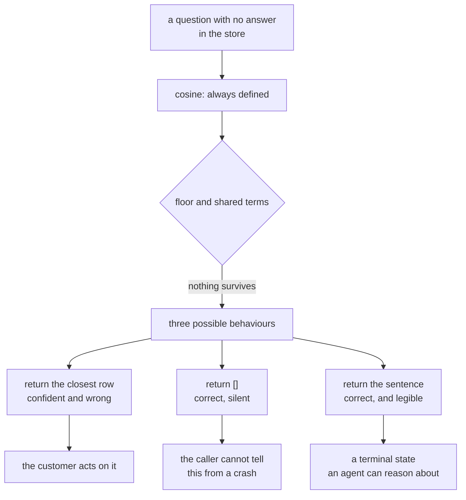

# 4.3 — G08: nothing, said out loud

## One-line answer

**G08:** all four questions the archive cannot answer come back with a sentence saying the search
found nothing — a sentence that makes a claim about the search and never about the world, because
those are different claims and only one of them is true.

## The story

You go into a hardware shop for a specific size of washer. The man behind the counter listens,
nods, walks to a drawer, comes back and puts something on the counter.

It is not the washer you asked for. It is close. It might work.

You ask whether he has the size you actually wanted, and he says *"that's what you want, that."*

You leave with the wrong washer, and you leave believing you have solved the problem, which is the
expensive part. If he had said *"we don't stock that size — try the place on the industrial estate"*
you would have lost two minutes and gained a plan. Instead you lose the afternoon, discover the
washer does not fit, and start again from the beginning with less time and less patience.

The shop that says *"we don't have it"* is more useful than the shop that always has something. Not
kinder — more useful. It is the only one of the two whose "yes" carries any information.

## The idea in plain language

There are three things a retrieval step can do when a question has no answer in the store, and they
are not variations of each other.

**Return something anyway.** This is the default, because similarity is always defined. Ask cosine
about the office printer and it will hand you the closest of sixty-five rows, at some score, with
complete confidence. Day 50's
[part 4.1](../../../day-50-chunking-and-top-k/parts/04-the-floor/4.1-cosine-never-says-it-does-not-know.md)
measured this: an impostor question scoring `0.388`, higher than the score of the row carrying the
correct answer for nine of the ten real questions.

**Return nothing.** An empty list. This is what the floor buys, and it is correct as far as it goes.
The problem is that an empty list is not a message. Downstream, `[]` from a search that found
nothing and `[]` from a search that never ran look identical, and so does `[]` from a search that
crashed and was caught by somebody's `except`.

**Say nothing was found.** A sentence. Not silence, not an empty container — a claim, in words, that
a caller and a human and a model can all read.

G08 requires the third, and it requires the sentence to be a particular kind of claim.

Look at the two candidate sentences carefully, because they differ by everything:

| Sentence | What it claims | Is it true? |
| --- | --- | --- |
| *"I searched the archive and found nothing close enough to be useful. Nobody has written this one up yet."* | a fact about **this search over this store** | yes |
| *"There is no past case like this."* | a fact about **the world** | unknowable |

The desk cannot know the second one. It searched one archive with one tokenizer at one chunk size
under one floor, and every one of those choices could be the reason nothing came back. Day 46's
[part 4.2](../../../day-46-sessions-vs-memory/parts/04-the-choice/4.2-sutras-memory-policy.md) wrote
this into Sutra's memory policy as rule four: *a miss is reported, not interpreted.*

That distinction is Principle 10 — fail honestly — applied to the one case where failing honestly
costs you nothing and lying costs you a customer.

One term, defined once: an **honest miss** is a returned result that says the search happened and
produced nothing. It is a *result*, not an error: it does not raise, it is not logged as a failure,
and it is a perfectly normal thing for a working system to produce many times a day.

## Why Sutra needs it

Day 59 is the Phase 8 failure lab — loops, runaway agents, containment. A runaway agent is very
often an agent that cannot recognise a dead end: it retrieves, gets something plausible, acts on it,
finds the action did not help, retrieves again with a slightly different query, gets something else
plausible, and goes round.

The floor plus this sentence is what breaks that loop. An agent that receives *"I searched and found
nothing"* has a terminal state to reason about. An agent that receives a row at `0.388` has a lead
to follow, and it will follow it, and there is always another row.

## The mechanism

The sentence is a module-level constant, not a string built where it is needed:

```python
NOTHING_FOUND = (
    "I searched the archive and found nothing close enough to be useful. "
    "Nobody has written this one up yet."
)
```

**Line by line:**

- It is a constant so that there is exactly one of it. A sentence assembled at three call sites is
  three sentences, and one of them will eventually say something the other two do not.
- *"I searched the archive"* names the action taken. The reader learns that a search happened,
  which is the fact that distinguishes this from silence.
- *"nothing close enough to be useful"* names the *reason* — a threshold was applied — rather than
  claiming absence. It is the floor, in English.
- *"Nobody has written this one up yet"* is about the archive's coverage, not about reality. It is
  the closest the sentence comes to a claim about the world, and it is still a claim about a
  document store.
- What it deliberately does not contain: any suggestion that the customer's problem is new,
  unusual, or already solved elsewhere.

And the branch that returns it comes **before** anything touches the rows:

```python
if not rows:
    return NOTHING_FOUND
best = texts[rows[0][1]].strip()
```

**Line by line:**

- The order is the whole point. `rows[0]` on an empty list raises `IndexError`, and every caller
  written before the floor existed assumed there was always at least one row.
- `return` rather than `raise`. An honest miss is a result, and turning it into an exception makes
  every caller wrap the search in a `try`, which is how it eventually gets swallowed.

Run the criterion:

```bash
cd days/day-52-memory-in-triage-flow/lab
uv run python saidnothing.py
```

**Line by line:**

- `saidnothing.py` asks the four questions in `_archive.py`'s `NOTHING` list — questions about travel
  expenses, an office printer, notice periods and meeting rooms, none of which the archive covers.
- It then asks one question the archive *can* answer, so that the contrast is in the same run rather
  than in the reader's memory.
- It finishes by checking the sentence itself: does it make a claim about the archive, and does it
  make a claim about the world.

Measured on 2026-09-05:

```text
questions the archive genuinely cannot answer
  how do I claim travel expenses for a client visit
      ->  I searched the archive and found nothing close enough to be useful. Nobody has written this one up yet.
  the office printer jams on thick paper
      ->  I searched the archive and found nothing close enough to be useful. Nobody has written this one up yet.
  what is the notice period for resigning
      ->  I searched the archive and found nothing close enough to be useful. Nobody has written this one up yet.
  which meeting room has the projector
      ->  I searched the archive and found nothing close enough to be useful. Nobody has written this one up yet.

a question it can answer, for contrast
  why would a browser throw away a cookie after a redirect
      ->  kb:KB-104#0  at 0.233

the sentence said on a miss: 'I searched the archive and found nothing close enough to be useful. Nobody has written this one up yet.'
  claims something about the archive:  True
  claims something about the world:    False
```

Four out of four say so. The fifth question returns a row. G08 holds.

The interesting number in that output is the contrast: `kb:KB-104#0` came back at **`0.233`**, which
is only just above the floor of `0.20`. And the impostor question about the printer scored `0.386`
under the ranked path in [4.1](4.1-the-ranked-path-is-the-one-that-ships.md) — **higher than the
real answer** — and was rejected only because it shares no informative words with the archive.

That is worth stating plainly: *the score alone would have kept the printer and dropped the cookie
article.* The floor is not what makes G08 work. The floor plus the second condition is, and
[4.1](4.1-the-ranked-path-is-the-one-that-ships.md) is where that was measured.

Now take the sentence away and return an empty result instead:

```bash
uv run python saidnothing.py --silent
```

**Line by line:**

- `--silent` prints `[]` for each unanswerable question instead of the sentence. Nothing else about
  the run changes: same floor, same conditions, same rejections.
- This is not a broken build. It is what a retrieval function does by default, and it is what every
  caller sees unless somebody writes the sentence.

```text
  how do I claim travel expenses for a client visit
      ->  []
  the office printer jams on thick paper
      ->  []
  what is the notice period for resigning
      ->  []
  which meeting room has the projector
      ->  []

An empty list means 'nothing scored'. It does not say so, and nobody downstream
can tell it apart from 'the search never ran'.
```

Four empty lists. Every one of them correct, and none of them a message.



## When it breaks

The break that gets shipped is the sentence being improved.

Somebody reads *"Nobody has written this one up yet"* and thinks it sounds tentative, and changes it
to *"There is no past case matching this issue."* It reads better. It is more confident. It is a
claim the desk has no way to support, and a support agent who reads it will stop looking — which is
exactly the outcome the honest version was written to avoid.

The second break is an empty list reaching code that was written before the floor existed:

```text
Traceback (most recent call last):
  File "<string>", line 5, in <module>
IndexError: list index out of range
```

That is `rows[0]` on a search that legitimately found nothing. It is the correct failure — loud, at
the exact line, with a name anybody can search — and it is far better than the alternative, which is
a caller that does `rows[:1]` and silently produces an answer with no source at all.

The third break has no error text and is the reason G08 is checked at all. Set `SIM_FLOOR = 0.0` and
re-run. Every one of the four impostor questions comes back with a row, the honest-miss sentence
becomes unreachable dead code, and nothing anywhere reports that a code path has stopped being
taken. A sentence that is never said is indistinguishable from a sentence that was deleted, and the
only way to notice is a criterion that asks *how many misses did we report today* — which in
production is a metric, not a test.

## In production

**What a professional writes instead.** The miss is a **structured result**, not a string: a small
object carrying `found=False`, the query as it was actually issued, the top score that failed to
clear the floor, and the floor it failed against. The sentence is then rendered from that object at
the edge. The reason is that the top score is the most useful number in the whole system — a miss at
`0.19` against a floor of `0.20` is a tuning problem, and a miss at `0.02` is a coverage problem,
and they need completely different responses from completely different people.

**What degrades at scale.** The miss rate is a leading indicator and nobody watches it. It goes up
for two opposite reasons — the archive stopped covering the traffic, or the floor is now too high
for a store whose weights have shifted — and the two are distinguishable only by the distribution of
top scores on misses. A desk that reports misses honestly and never aggregates them has the data and
none of the value.

**The failure mode that only appears with real traffic.** Under `load_memory`, the query is written
by the model, not by the agent — Day 46's
[part 3.3](../../../day-46-sessions-vs-memory/parts/03-three-wires/3.3-the-tool-the-model-may-call.md).
A model that receives *"I searched and found nothing"* will very often try again with a rephrased
query, and again, and again. Each attempt is a request. The honest miss, wired to a model with no
attempt limit, is a quota bill — which is exactly why Day 46's build brief asks for
`MAX_LOOKUPS_PER_INVOCATION`, and why the sentence needs to say *stop* as clearly as it says
*nothing*.

**The review comment a senior engineer leaves:** *"Return an object, not a string. I want the top
score on every miss, logged, because 'we found nothing' at 0.19 and 'we found nothing' at 0.02 are
different incidents and right now they produce identical output. Also put a counter on how often the
miss branch is taken — the day that drops to zero, somebody has lowered the floor and nobody will
have noticed."*

**The interview question:** *"What does your retrieval return when it finds nothing relevant?"* An
honest answer: *"A sentence, not an empty list — 'I searched the archive and found nothing close
enough to be useful.' The distinction I care about is that it is a claim about my search, not about
the world: the desk cannot know that no such case exists, only that this index at this floor
returned nothing. All four of my unanswerable test questions produce it. What I would add in
production is that the miss carries the top score that failed to clear the floor, because a near
miss and a total miss are different problems and the string version throws that away."*

## Check yourself

```bash
cd days/day-52-memory-in-triage-flow/lab
uv run python saidnothing.py
uv run python saidnothing.py --silent
```

Now write the sentence the desk must **never** say, and one line explaining what claim it makes that
the desk has no way to support.

**Out loud, without scrolling up:** give the three things a retrieval step can do when it finds
nothing, and say why the middle one is not good enough.

**Next:** [5.1 — Counted during the run, not after](../05-the-zero-claim/5.1-counted-during-the-run-not-after.md).
