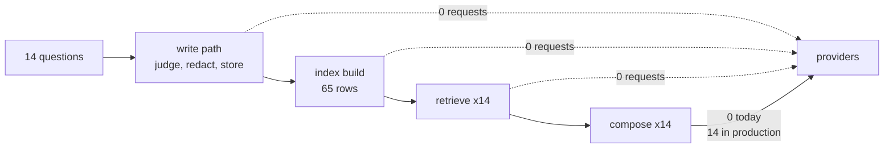

# 5.1 — G09: counted during the run, not after

## One-line answer

**G09:** the phase's request budget is a number a counter produced while the desk was running —
fourteen questions, fourteen model requests, zero requests to any provider — and not a number
somebody typed into a document afterwards.

## The story

The prepaid electricity meter lives in the cupboard by the front door. You top it up with a card
at the corner shop.

You have never looked at it. You top up when the display starts flashing, and you have an idea in
your head of what you use — *"about fifteen a week, maybe twenty in winter"* — which came from
roughly how often you find yourself at the shop.

Then one week you actually write down the reading on Monday morning and again on the following
Monday. It is not fifteen. It is not twenty either. And more usefully, the reading on Wednesday
morning is enormous compared to Tuesday, which you eventually trace to an immersion heater on a
timer that somebody set years ago and nobody has thought about since.

The number in your head was not a lie. It was an average of impressions, and averages of impressions
hide the one thing you needed to see: not *how much*, but *where*.

## The idea in plain language

There are two ways to state a request budget, and they look identical on the page.

**Asserted.** Somebody thinks about the system, works out how many calls it should make, and writes
it in the day's §6. It is usually right. It is right in the same way the electricity guess is right:
close enough that nothing contradicts it, and useless for finding the immersion heater.

**Counted.** Something in the code increments a number every time a request is made, and the budget
is what that number said after a real run.

The difference only appears when they disagree, and by then the asserted number has been in a
document for weeks. Principle 15 makes quota the currency of this project, and a currency you
estimate rather than count is a currency you will eventually be short of.

For this phase there is a second distinction, and it is the one that makes the `$0` claim
meaningful. Two different things get counted:

- **Provider requests** — calls that leave the process and consume somebody's rate limit. Gemini's
  free tier, Groq's, an OpenRouter `:free` model, a local Ollama server. These are what Addendum 02
  is about and what a quota is denominated in.
- **Model requests** — times the flow asked *something* to turn rows into a sentence. In this lab
  that something is `CountingModel`, twelve lines of string formatting that never opens a socket.

Those two numbers are equal in production and they are not equal here, and saying so is the
criterion. A gate day that quietly made fourteen real calls in order to prove it makes none would
be a joke; a gate day that pretended a stand-in was a model would be a lie. So the run counts both
and prints both.

One term, defined once: **RPM/RPD** — requests per minute and requests per day. Free tiers are
denominated in these rather than in money, which is why Principle 15 says *budgets are denominated
in RPM/RPD per provider, not dollars*. A number of requests can be compared against a published
limit. A cost in currency cannot, because there is no currency involved.

## Why Sutra needs it

Day 70 builds the Quota-Router: a plugin that tracks requests-remaining per provider per window and
routes work to whichever has headroom. It cannot exist without a counter, because "remaining" is
"limit minus used" and *used* is a count.

Today is where that counter is first justified. If the phase's budget were an assertion, Day 70
would have to start by building the measurement it needed and discovering that nothing in the
codebase had ever counted a request. Building the habit here, on a phase whose honest answer is
zero, costs nothing and means Day 70 starts from a number.

## The mechanism

The counter is an object the flow is handed, not a global:

```python
class CountingModel:
    """A stand-in for the model that counts requests instead of making them."""

    def __init__(self) -> None:
        self.requests = 0
        self.prompt_chars = 0

    def compose(self, question: str, rows: list[tuple[float, str]], texts: dict[str, str]) -> str:
        """One request: the question, the retrieved rows, and an answer with citations on it."""
        self.requests += 1
        block = "\n".join(f"[{ref}] {texts[ref]}" for _, ref in rows)
        self.prompt_chars += len(question) + len(block)
        ...
```

**Line by line:**

- It is a class with instance state, so a caller can create one per run and read it afterwards. A
  module-level counter would be shared by every test in the process and would make two runs
  indistinguishable — the same mistake Day 43's
  [part 1.1](../../../day-43-stateless-by-default/parts/01-accidental-state/1.1-the-dictionary-nobody-called-state.md)
  named as accidental state.
- `self.requests += 1` is the **first** statement in the method, before any early return. A counter
  incremented at the end of a function counts successes, and a budget that only counts successful
  requests is a budget that will be wrong on exactly the day a provider starts failing.
- `prompt_chars` is counted in the same place, because the two numbers are only comparable if they
  come from the same call. [5.3](5.3-what-a-cache-can-and-cannot-reach.md) is built on this one.
- `compose` takes `rows` and `texts` rather than a finished prompt string, so it can measure the
  question and the retrieved block separately. Handing it a pre-built string would make the split
  impossible to recover.

Run the criterion over the whole question set:

```bash
cd days/day-52-memory-in-triage-flow/lab
uv run python budget.py
```

**Line by line:**

- `budget.py` runs the ten gold questions plus the four unanswerable ones — fourteen in total —
  through the full desk, with one `CountingModel` shared across all of them so the totals accumulate.
- It calls `retrieve` separately as well as through `ask`, so that retrieval calls and model requests
  are counted as different quantities rather than inferred from each other.

Measured on 2026-09-05:

```text
counted over one full pass of the gate's question set
  questions asked       14
  index rows searched   65
  memos filed first     4

  retrieval calls       14
  network requests      0   (retrieval is arithmetic, not a call)
  model requests        14
  prompt characters     6617

per provider, over this run
  gemini free tier         0 requests
  groq free tier           0 requests
  openrouter :free         0 requests
  ollama local             0 requests

The model requests above are composition, counted by a stand-in that never leaves the
process. The memory half of the phase - filing, judging, redacting, indexing, ranking,
flooring - made no request of any provider at all.
```

Read the two columns that are not the same number.

**Fourteen retrieval calls and zero network requests.** Every retrieval in this phase is arithmetic
over numbers already in memory. There is no service to call, no rate limit to respect, no `429` to
handle and nothing to cache, because nothing left the process. That is the sentence Phase 7's gate
is actually about: *"Seen anything like this before?" answered at $0* is true because the answering
machinery is arithmetic, not because anything clever was done about cost.

**Fourteen model requests and zero provider requests.** The composition step ran fourteen times. In
production those fourteen are fourteen real calls against a free tier. Here they are fourteen calls
into a class in the same process, and the run says so in plain words rather than reporting `0` and
letting the reader assume the phase somehow answers questions without a model.

That distinction is the whole reason G09 exists as a criterion rather than as a line in a document.
An asserted budget would have said `0` — and it would have been simultaneously true about providers
and misleading about the flow.

Now look at what the asserted version would have given you:

```bash
uv run python budget.py --asserted
```

**Line by line:**

- `--asserted` prints the four provider counts from a dictionary in the file, without running the
  desk at all. It is a document, rendered.
- The numbers are the same numbers. That is the point: the asserted version is not wrong, it is
  unearned, and the two are indistinguishable until the day they are not.

```text
the budget as written down
  gemini free tier          0 requests
  groq free tier            0 requests
  openrouter :free          0 requests
  ollama local              0 requests

Nothing was run to produce these numbers.
```

Identical output, no run behind it. Put the two blocks side by side in a review and nobody can tell
which is which — which is exactly why the criterion is *"counted during a run"* rather than
*"reported as zero"*.



## When it breaks

The break with the largest consequence is a counter that misses a path.

`CountingModel.compose` is the only place a request is counted, and it is the only place a request
is made — today. The moment a retry is added, or a second model is used for a classification step,
or a tool call is introduced, there is a request the counter does not see. Nothing raises. The
budget simply becomes an undercount, and an undercount is worse than an assertion because it carries
the authority of a measurement.

The second break is the one that has already been prevented by one line above, and it is worth
reaching to see:

```text
Traceback (most recent call last):
  File "<string>", line 6, in <module>
IndexError: list index out of range
```

That is what `compose` does if the increment is moved below the `if not rows` early return and the
early return is then removed as "redundant". The counter and the failure path get tangled together,
and the general rule falls out of it: **count at the boundary, before any branch.** A counter inside
a conditional counts the condition, not the request.

The third break produces no error and is the reason Principle 15 says quota rather than money. Free
tiers are per-window: a limit of twenty requests a *day* is not a limit of twenty requests. Fourteen
requests in one run is comfortable; fourteen requests in each of four runs while debugging is
fifty-six, and the fifty-seventh returns:

```text
google.genai.errors.ClientError: 429 RESOURCE_EXHAUSTED. {'error': {'code': 429,
'message': 'You exceeded your current quota, please check your plan and billing
details.', 'status': 'RESOURCE_EXHAUSTED', 'details': [{'@type':
'type.googleapis.com/google.rpc.QuotaFailure', 'violations': [{'quotaMetric':
'generativelanguage.googleapis.com/generate_content_free_tier_requests',
'quotaId': 'GenerateRequestsPerMinutePerProjectPerModel-FreeTier',
'quotaValue': '5'}]}, {'@type': 'type.googleapis.com/google.rpc.RetryInfo',
'retryDelay': '47s'}]}}
```

That text is not from today's run — today's run makes no requests, so it cannot produce it. It is
the body Day 2 recorded when this project first exhausted a free tier, quoted from
[Day 2, part 1.3](../../../day-02-llm-mechanics/parts/01-first-contact/1.3-listed-is-not-callable.md).
Read the two fields that make it useful: `quotaValue: '5'` names the limit that was hit, and
`retryDelay: '47s'` is the wait the provider is telling you to take. Every model call path in this
project handles `429` by reading that delay, backing off and then escalating — never by inventing a
result.

## In production

**What a professional writes instead.** The counter is not an object the caller remembers to pass;
it is a plugin or a middleware on the runtime, so a code path *cannot* make a request without being
counted. ADK's plugin surface is where that lives in this project, and Day 70 builds it. The
difference between a counter you pass and a counter that wraps is the difference between a budget
that is right and a budget that is right for the paths somebody remembered.

**What degrades at scale.** A single total stops being useful almost immediately. What you need is
requests per provider per window, and the window is the hard part: providers reset on their own
clocks, sometimes on a rolling window rather than a calendar one, and a counter that resets at
midnight local time will be confidently wrong for a provider that resets on a rolling sixty seconds.
Day 70's router exists because "how many have I got left" is a genuinely harder question than "how
many have I made".

**The failure mode that only appears with real traffic.** Retries. A request that fails and is
retried three times is one logical request and four counted ones, and every free-tier limit counts
the four. A budget derived from the number of questions asked will be short by exactly the retry
rate, which is zero in testing and non-zero at exactly the moment quota matters. The counter has to
sit below the retry loop, not above it.

**The review comment a senior engineer leaves:** *"The count is on the model stand-in. When this
becomes a real client, the count needs to move with it or it stays at fourteen forever while the
real number climbs. Put it on the runtime, not on the model — and count attempts, not calls,
because the free tier counts attempts."*

**The interview question:** *"How do you know your agent stays inside a free tier?"* An honest
answer: *"I count requests during a run rather than reasoning about them afterwards. On my last full
pass — fourteen questions through the whole memory pipeline — the retrieval side made zero provider
requests, because it is arithmetic over a local index, and the composition step made fourteen, which
in production is fourteen real calls. I keep those as two separate numbers so nobody reads a zero
and thinks the system answers questions without a model. The part I would fix before scaling is that
the counter is on the model object, so a retry inside the client would not be counted — the free
tier counts attempts, so the counter has to sit under the retry loop."*

## Check yourself

```bash
cd days/day-52-memory-in-triage-flow/lab
uv run python budget.py
uv run python budget.py --asserted
```

Now find one code path in this lab that could make a request and would not be counted by
`CountingModel`, and write down where the counter would have to move to catch it.

**Out loud, without scrolling up:** explain the difference between a provider request and a model
request in this phase, and say why reporting only the first number would be misleading.

**Next:** [5.2 — The lane we did not buy](5.2-the-lane-we-did-not-buy.md).
