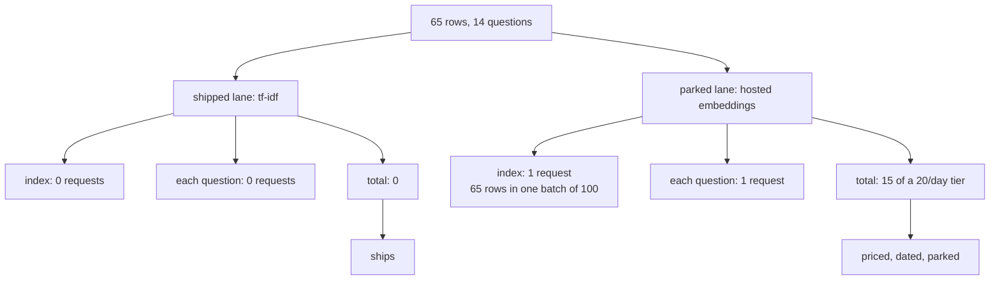

# 5.2 — G10: the lane we did not buy

## One-line answer

**G10:** building and searching this memory spent zero provider requests, and the hosted alternative
is priced from a measured tier rather than dismissed — fifteen requests against a free tier of about
twenty a day, for one run of fourteen questions.

## The story

You want to get fit, so you go and look at the gym on the high street.

You take the tour. You ask the price. You ask what happens if you cancel, what the peak hours are,
and whether the monthly figure includes the classes. You come away with numbers on a piece of paper:
thirty-two a month, twelve-month minimum, classes extra.

And then you buy a second-hand kettlebell and start doing the thing in the front room.

You have not "decided against the gym" in the vague way people decide against things. You know
exactly what it costs, exactly what it would give you that the front room does not, and exactly what
would have to change for it to be worth it — an injury, a plateau, moving somewhere with no floor
space. If any of those happen you will not have to start the research again, because you did it once
and wrote it down.

The difference between that and *"the gym is too expensive"* is that one of them is a decision and
the other one is a mood.

## The idea in plain language

Sutra's retrieval runs on **term counts and tf-idf**: an entirely local calculation over words,
built by hand in Day 49 and needing no model, no network and no key. Day 49's
[part 3.1](../../../day-49-retrieval-and-embeddings/parts/03-meaning-as-geometry/3.1-the-dish-you-know-by-taste.md)
was honest about what that costs — a term-count vector cannot tell that two sentences with no shared
words mean the same thing, which is exactly what an **embedding** can do.

An embedding is a list of numbers produced by a model that was trained to put texts used in similar
ways close together. It is better. Day 49's
[part 2.1](../../../day-49-retrieval-and-embeddings/parts/02-the-meaning-test/2.1-the-score-that-came-back-zero.md)
measured the gap concretely: two tickets describing the same fault scored exactly `0.000` against
each other under term counts.

So why is the shipped lane the worse one?

Because *better* is not the only axis, and the other axis is a published number of requests per day.
G10 is the criterion that says the trade was priced rather than asserted. Three things have to be
true:

1. The shipped lane's provider cost is **counted**, and it is zero.
2. The alternative's cost is **calculated** from a limit somebody actually looked up, with the date.
3. Zero requests were spent doing the calculating.

The third point is the one that makes this a discipline rather than a spreadsheet. It is genuinely
tempting to "just try it and see" — and trying it consumes the quota that the trying was supposed to
be reasoning about.

Two terms, defined once:

- **A batch** — a single request carrying many texts. Hosted embedding APIs take a list, so
  indexing sixty-five rows is not sixty-five requests; it is one, at a batch size of a hundred. The
  batch size is the single biggest lever on the arithmetic and it is the thing people forget.
- **A parked capability** — 🅿️ in this curriculum. Something you can describe, price and defend in
  an interview, and deliberately have not built. Day 49's
  [part 3.4](../../../day-49-retrieval-and-embeddings/parts/03-meaning-as-geometry/3.4-the-embedder-we-park.md)
  parked the hosted embedder. This part re-prices it against today's larger index.

## Why Sutra needs it

Day 70's Quota-Router routes work to whichever provider has headroom. Its entire premise is that
different pieces of work have different quota costs, and that those costs are known numbers rather
than impressions.

The arithmetic in this part is the shape of the input that router needs: *this operation costs this
many requests against this provider's window*. A project where nobody has ever written that sentence
down for a single operation cannot build a router; it can only build a thing that tries providers
until one of them works, which is a retry loop wearing a router's name.

## The mechanism

The shipped lane's cost is measured by running it and looking:

```bash
cd days/day-52-memory-in-triage-flow/lab
uv run python indexcost.py
```

**Line by line:**

- `indexcost.py` runs the whole write path and index build, times it, then runs all fourteen
  questions through `retrieve` and times that separately.
- It reports characters and tokens indexed as well as rows, because the hosted alternative is billed
  by request but *sized* by content, and the two lanes are only comparable once both are in the same
  units.

Measured on 2026-09-05:

```text
the lane Phase 7 ships: term counts and tf-idf
  memos filed           4
  index rows            65
  characters indexed    13268
  tokens indexed        2916
  provider requests     0
  build wall clock      2.7 ms
  14 searches            2.3 ms
```

Sixty-five rows built and fourteen questions answered, for no provider requests at all. That is the
`$0` in *"seen anything like this before?" answered at $0*, and it is not a clever optimisation — it
is a consequence of the lane being arithmetic.

Now price the lane that was not taken:

```bash
uv run python indexcost.py --embedded
```

**Line by line:**

- `--embedded` makes **no request**. It divides the row count by the batch size to get the number of
  requests indexing would take, and adds one request per question for embedding the query.
- `FREE_EMBEDDING_REQUESTS_PER_DAY` is quoted from Day 49's part 3.4 rather than re-derived, and the
  comment beside it says so. Re-deriving it would cost the quota this criterion exists to protect.

```text
the lane Phase 7 parked: a hosted embedding model
  rows to embed         65
  batch size            100
  requests to index     1
  free requests per day 20   (Day 49 part 3.4)
  days of quota         0.05
  requests per question 1   (the query must be embedded too)
  requests for 14 asks   14

  total to reproduce this run: 15 requests against a 20/day tier
  Zero were spent. The numbers above are arithmetic over a measured tier, which is the
  only honest way to price something you have decided not to buy.
```

Read the arithmetic rather than the conclusion.

**One request to index the whole archive.** Sixty-five rows fit in one batch of a hundred, so the
indexing side is almost free. That is the opposite of what people expect, and it is why the batch
size matters: at a batch size of ten it would be seven requests, and at a batch size of one it would
be sixty-five.

**Fourteen requests to ask fourteen questions.** This is the side nobody prices, and it is the side
that dominates. **Every question has to be embedded**, because a query and a row must live in the
same space — Day 49's
[part 1.3](../../../day-49-retrieval-and-embeddings/parts/01-text-as-numbers/1.3-direction-not-size.md)
is why. So the hosted lane's cost is not "the cost of building an index". It is *one request per
question, forever*, and it scales with traffic rather than with the archive.

**Fifteen against twenty a day.** One pass of this gate would consume three quarters of a day's free
embedding quota. Running the gate twice in an afternoon — which is what you do when you are
debugging it — exhausts it, and the second run fails partway through with rows embedded and rows
not, which is a worse state than not having started.

That is the whole argument, and note what it is *not*: it is not that embeddings are bad, or that
tf-idf is good enough. Day 49 measured tf-idf scoring `0.000` on a pair of tickets about the same
fault. The argument is that a lane costing one request per question cannot be the default lane of a
project whose budget is denominated in twenty requests a day, and that the honest way to say so is
with the two numbers side by side.



There is a third lane, and it is the one to un-park first: a local embedding model. Day 49's
[part 3.2](../../../day-49-retrieval-and-embeddings/parts/03-meaning-as-geometry/3.2-the-model-that-runs-in-your-own-shop.md)
built it — a `POST` to `http://localhost:11434/api/embed` against Ollama, twenty-eight lines of
standard-library Python, and **zero quota**, because the model is on your own machine. It gets you
the meaning that tf-idf cannot see, at the cost of a process you have to run. That is the trade the
kettlebell is: it is not the gym, and it is not nothing.

## When it breaks

The break is not in the arithmetic. It is in the number the arithmetic runs on.

`FREE_EMBEDDING_REQUESTS_PER_DAY = 20` was measured on this project's key, by Day 49, on a
particular date. Free rosters move: Addendum 02 exists because they moved once already, in December
2025, and the plan's Principle 7 says never to invent a version, a limit or a model name. So the
honest status of that `20` today is **amber, not green** — it is quoted with its source and its day,
and the freshness check in [7.1](../07-the-phase-boundary/7.1-the-freshness-recheck.md) is where it
gets re-read.

If it moved to five, the arithmetic above says the gate cannot run once. If it moved to a thousand,
the parked lane stops being parked. Neither of those is a code change; both are a number changing
somewhere else, and the only defence is that the number is written down with a date beside it rather
than absorbed into a conclusion.

The second break is real and produces a real error. The local lane fails like this when Ollama is
not running:

```text
Traceback (most recent call last):
  File "<string>", line 4, in <module>
  File "...\Python312\Lib\urllib\request.py", line 215, in urlopen
    return opener.open(url, data, timeout)
           ^^^^^^^^^^^^^^^^^^^^^^^^^^^^^^^
  File "...\Python312\Lib\urllib\request.py", line 515, in open
    response = self._open(req, data)
               ^^^^^^^^^^^^^^^^^^^^^
  File "...\Python312\Lib\urllib\request.py", line 532, in _open
    result = self._call_chain(self.handle_open, protocol, protocol +
             ^^^^^^^^^^^^^^^^^^^^^^^^^^^^^^^^^^^^^^^^^^^^^^^^^^^^^^^
  File "...\Python312\Lib\urllib\request.py", line 492, in _call_chain
    result = func(*args)
             ^^^^^^^^^^^
  File "...\Python312\Lib\urllib\request.py", line 1373, in http_open
    return self.do_open(http.client.HTTPConnection, req)
           ^^^^^^^^^^^^^^^^^^^^^^^^^^^^^^^^^^^^^^^^^^^^^^
  File "...\Python312\Lib\urllib\request.py", line 1347, in do_open
    raise URLError(err)
urllib.error.URLError: <urlopen error [WinError 10061] No connection could be made because the target machine actively refused it>
```

`WinError 10061` on `localhost:11434` means the port is closed — nothing is listening — which on
this machine means Ollama is not started. It is worth reaching once because it is the failure mode
of the free lane: not a quota error, not a key error, but a service that is simply not running, and
a message that says nothing about embeddings at all.

The third break is silent and expensive. Set the batch size to one — which is what happens when
somebody refactors a loop and the batching is lost — and indexing goes from one request to
sixty-five, against a tier of twenty. Nothing raises until request twenty-one, and by then a third
of the index is embedded and two thirds is not.

## In production

**What a professional writes instead.** The lane is a **configuration**, not a code path chosen at
import time, and the cost model lives beside it: requests per index build, requests per query, and
the provider window each is charged against. Day 49's
[part 3.3](../../../day-49-retrieval-and-embeddings/parts/03-meaning-as-geometry/3.3-the-scale-does-not-know-what-it-weighs.md)
already built the seam — one function that takes a list of texts and returns a list of vectors —
which is what makes swapping the lane a one-line change rather than a rewrite. What it does not
have yet is the cost model attached to the seam, so nothing can answer "what would switching cost"
without a person doing the arithmetic by hand.

**What degrades at scale.** The indexing side scales with the archive and the query side scales with
traffic, and they cross. At sixty-five rows, indexing is one request and a day's questions are
hundreds; the query side dominates completely. At a million rows the index build is ten thousand
requests and becomes a scheduled job with its own budget. The two halves stop being comparable and
have to be budgeted separately, which is the point at which "how much does retrieval cost" stops
having a single answer.

**The failure mode that only appears with real traffic.** A hosted embedding lane makes the query
path depend on a network call, and a network call fails. Under tf-idf a search cannot fail — it is
arithmetic, and the worst it does is return nothing. Under the hosted lane the desk has a new
failure mode where a question cannot be *asked*, and it needs a timeout, a retry ladder, a `429`
path and a decision about what to do when embedding is down: refuse, or fall back to tf-idf and
silently answer worse. That decision has to be made before it is needed, and nobody makes it.

**The review comment a senior engineer leaves:** *"The parked-lane arithmetic is per run. Give it to
me per day at expected traffic, because 15 requests for a 14-question gate is not the number that
matters — 400 support questions a day is 400 embedding requests a day, and that is the number that
decides this. Also write the batch size down as a constant with the tier beside it; right now it is
a hundred because somebody typed a hundred."*

**The interview question:** *"Why are you using tf-idf instead of embeddings?"* An honest answer:
*"Cost per question, not quality. Embeddings are better and I measured how much better — two tickets
about the same fault score exactly 0.000 under term counts. But the hosted lane costs one request
per query against a free tier of about twenty a day, so one pass of my own test suite is fifteen of
those twenty. Indexing is almost free because it batches; querying is not, and querying scales with
traffic. The move I would actually make is a local embedding model over HTTP on my own machine,
which gets me the meaning at zero quota and costs me a process to run. I have that priced and
parked, with the date I checked the tier."*

## Check yourself

```bash
cd days/day-52-memory-in-triage-flow/lab
uv run python indexcost.py
uv run python indexcost.py --embedded
```

Work out, on paper, what the parked lane costs per day if the desk answers four hundred questions.
Then say which of the two lanes that number rules out, and what would have to change to reverse it.

**Out loud, without scrolling up:** explain why the indexing cost of a hosted embedding lane is
almost irrelevant and the query cost is not.

**Next:** [5.3 — What a cache can and cannot reach](5.3-what-a-cache-can-and-cannot-reach.md).
