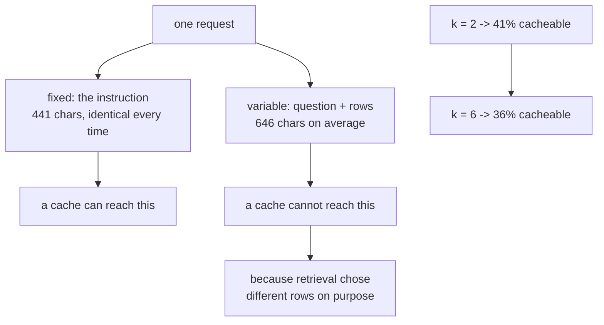

# 5.3 — G11: what a cache can and cannot reach

## One-line answer

**G11:** the desk's one request splits 41% fixed and 59% variable at the shipped `k`, and the
variable half is the retrieved rows — so retrieval, which is what made the desk useful, is also what
put most of the request permanently out of a cache's reach.

## The story

The shop upstairs has letterheads printed. Five hundred of them, in a box under the counter: the
name, the address, the registration number, the line about opening hours, all in the right place and
all identical.

When somebody needs a letter, they take a sheet out of the box and write on it. The printed part
took one trip to the printer, once, and every letter since has been free of it.

The written part is a different matter. Every letter says something different, because that is what
a letter is. You cannot pre-print *"Dear Mrs Okafor, regarding the delivery on the 14th"*, and
noticing that is not a failure of the printing idea — it is the boundary of it. The printer can
absorb everything that is the same on every letter and nothing that is not, and the whole skill is
knowing which half is which before you order five hundred of anything.

## The idea in plain language

A **cache** saves work by reusing something identical from last time. That word — identical — is the
whole of it. Two things that are nearly the same are, to a cache, two different things.

Day 51 priced two kinds of caching for this project. This part does not re-teach them; it measures
what either of them can reach *in the flow Phase 7 just built*, which is a different question and
one only this day can answer, because this day is the first time the flow exists.

Split one request into two halves:

- **The fixed half** — bytes that are identical on every request, in the same position, from the
  first token. In this desk that is the standing instruction: who the assistant is, that it must
  answer only from the cases it is given, that it must cite them, and what to say when there is
  nothing.
- **The variable half** — bytes that change from request to request. Here that is the question the
  agent typed and the rows retrieval chose for it.

A cache can only reach the fixed half, and it can only reach it if the fixed half comes **first**. A
prefix cache works on a prefix; move one variable byte to the front and everything after it is
uncacheable, which is why the instruction goes before the rows and not after them.

Now the uncomfortable part, and the reason this criterion belongs in the gate rather than in Day 51:

> **Retrieval exists to put different rows in front of the model for different questions. That is
> its entire purpose, and it is exactly the property that makes those rows uncacheable.**

Phase 7 did not merely fail to help the cache. It grew the half the cache cannot touch. A desk that
answered from its instruction alone would be almost entirely cacheable and almost entirely useless.

One term, defined once: **the cacheable share** — the fixed half as a fraction of the whole request.
It is the number that says how much of the request a cache could ever save, before anything about
hit rates or expiry enters the picture. It is an upper bound, and it is usually much lower than
people assume.

## Why Sutra needs it

Day 58 assembles the triage graph: intake, classify, research, draft, review. Five stages, and
several of them will make model requests carrying retrieved context.

If the cacheable share of one request is 41%, the cacheable share of a five-stage graph is *not*
41% — every stage has its own instruction, and every stage that retrieves has its own variable half.
Knowing the split for one request is the only way to reason about the graph before building it, and
Day 58 is a bad day to discover that adding a stage multiplied the uncacheable bytes.

## The mechanism

The measurement needs the two halves counted separately at the moment the request is composed, which
is why `CountingModel.compose` in
[5.1](5.1-counted-during-the-run-not-after.md) takes `rows` and `texts` rather than a finished
prompt string. Here is the instruction whose length is the fixed half:

```python
INSTRUCTION = (
    "You are a support desk assistant. You answer from past cases that are given to you and from "
    "nothing else. Every claim you make must name the case it came from. When the cases given to "
    "you do not contain the answer, say that you searched and found nothing close enough, and do "
    "not say that no such case exists. Do not guess a ticket number. Do not invent a resolution. "
    "Past cases follow, most similar first, each with the score it matched at."
)
```

**Line by line:**

- It is one string constant, so it is byte-identical on every request. An instruction assembled with
  an f-string containing today's date is a different string every day and cacheable for none of it.
- *"answer from past cases that are given to you and from nothing else"* is the grounding rule; it
  is here rather than in the code because the model is the thing that has to obey it.
- *"say that you searched and found nothing close enough, and do not say that no such case exists"*
  is [4.3](../04-the-read-path/4.3-nothing-said-out-loud.md)'s sentence, moved into the instruction
  where it belongs. The desk's Python returns `NOTHING_FOUND`; the *model* needs telling too,
  because on a partial match it is the model that decides how confident to sound.
- The last line — *"Past cases follow, most similar first, each with the score it matched at"* —
  is what makes the boundary explicit. Everything after this sentence is the variable half, and
  saying so in the prompt is what lets a reader and a cache agree on where the prefix ends.
- The final wording is a `TODO(me)` in the hub. What is fixed here is the **shape**: a constant, in
  front, ending with a sentence that hands over to the rows.

Now measure the split over the whole gold set:

```bash
cd days/day-52-memory-in-triage-flow/lab
uv run python cacheprefix.py
```

**Line by line:**

- `cacheprefix.py` retrieves for each of the ten gold questions, builds the row block exactly as
  `compose` would, and measures the question plus the block against the instruction.
- It reports the **mean** variable half and also the smallest and largest, because a mean on its own
  hides the case that matters.
- Tokens are derived at 4.55 characters per token, the figure Day 24 measured against a provider's
  own tokenizer. It is quoted rather than re-derived; counting tokens for real is a network call.

Measured on 2026-09-05:

```text
k                     2
questions measured    10

half of the request                  chars   tokens   share
fixed (the instruction)                441       97     41%
variable (question + retrieved rows)     646      142     59%
                                  -------------------------
one request                           1086      239    100%

smallest variable half  57 chars
largest variable half   1491 chars
identical across questions: False

The fixed half is cacheable because it is the same characters every time. The variable
half is not, because retrieval chose different rows for every question - which is the
whole point of retrieval. Raising k grows the half a cache cannot reach.
```

Three numbers in there are worth more than the headline.

**41% is the ceiling, not the saving.** That is the largest share of this request a cache could ever
remove, before any question of whether the cache hits, how long the entry lives, or whether the
provider's minimum cacheable size is met. Real savings are lower. A plan that assumes caching
halves the bill is already wrong at the arithmetic stage.

**The smallest variable half is 57 characters.** That is a question with no rows attached — the one
gold question the floor rejects, from
[4.1](../04-the-read-path/4.1-the-ranked-path-is-the-one-that-ships.md). For that question the
request is almost entirely instruction and the cacheable share is nearly 90%. **The desk is most
cacheable exactly when it is least useful**, which is a genuinely awkward fact and the reason a
cache hit rate is a terrible proxy for whether a system is working.

**The largest is 1,491 characters.** That is a question that pulled two long chunks. The variable
half is three and a half times the instruction, and the cacheable share for that request is under a
quarter.

Now raise the cap and watch the boundary move:

```bash
uv run python cacheprefix.py --k 6
```

**Line by line:**

- `--k 6` changes only the number of rows retrieval returns. The instruction, the questions, the
  index and the archive are untouched.
- Six is not a sensible `k` for this archive — Day 50's curve is flat from two — so this is a
  measurement of what a bad `k` costs a cache, not a proposal.

```text
half of the request                  chars   tokens   share
fixed (the instruction)                441       97     36%
variable (question + retrieved rows)     778      171     64%
                                  -------------------------
one request                           1219      268    100%

smallest variable half  57 chars
largest variable half   2077 chars
```

The cacheable share falls from **41% to 36%**, and the largest variable half grows from 1,491 to
2,077 characters. Nothing about the cache changed. `k` went up, and the cache's reach went down.

That is the finding, stated as a rule: **`k` is a cache decision as well as a token decision.** Day
50 chose `k = 2` off an answer-rate curve and priced it in tokens. It turns out the same choice also
sets the ceiling on what caching can ever do for this flow, and nobody would have found that without
running the two halves side by side.



## When it breaks

The break that costs real money is the fixed half stopping being fixed, by one character.

Put a date in the instruction — *"Today is 2026-09-05."* — and it is byte-identical for a day and
different tomorrow. Put the agent's name in it and it is different per agent. Put a version string
in it and it is different per deploy. Each of those is a reasonable thing to want in an instruction,
and each of them takes the cacheable share from 41% to zero for some population of requests, with no
error, no warning and no line anywhere reporting that the cache stopped hitting.

The second break is ordering. Move the retrieved rows in front of the instruction — which reads
perfectly naturally, *here is the context, now here are your rules* — and the prefix is variable from
the first byte. The instruction is still identical and it is now unreachable, because a prefix cache
matches from the start and stops at the first difference.

The third break has no error text and is the most common: measuring the wrong thing and being
pleased. A cache hit rate of 90% sounds excellent and is compatible with saving almost nothing, if
the hits are on a small fixed half. The number that matters is **cached characters as a share of
total characters sent**, and a system that reports hit rate alone can improve its headline metric
while its bill does not move.

There is also a real error you can reach, and it is worth reaching once, because it is what happens
when the composer is handed a ref that is not in the index — the same shape as
[2.2](../02-the-run/2.2-an-answer-that-names-its-source.md)'s citation failure:

```text
Traceback (most recent call last):
  File "<string>", line 5, in <module>
KeyError: 'memo:7101:resolution:signed-out-of-the-dashboard'
```

Note that this is the *parent* ref without its `#0` chunk suffix. The block that goes into the
prompt is built by looking every ref up in `index.texts`, so a caller that helpfully strips the
suffix before composing gets this rather than a shorter prompt.

## In production

**What a professional writes instead.** They make the prefix boundary explicit in the code, not
implicit in the order of string concatenation: a function that returns `(cacheable_prefix,
variable_suffix)` and a composer that joins them. That way a change which moves a byte across the
boundary is a change to a function signature rather than an invisible edit inside a template, and
somebody notices.

**What degrades at scale.** The variable half grows with the archive, because bigger chunks and more
of them is the direction every retrieval system drifts. The fixed half does not — instructions get
longer slowly and by deliberate edit. So the cacheable share falls over the life of a system,
monotonically, and the caching plan written at launch is optimistic by an amount nobody tracks. The
metric to keep is the share, not the saving.

**The failure mode that only appears with real traffic.** Caches have a minimum. Providers do not
cache a prefix below some token count, because the bookkeeping costs more than the saving. A 97-token
instruction is comfortably below the minimum on several providers, which means the honest cacheable
share for this desk today may be **zero** — not 41% — and the only way to find out is to read the
provider's current documentation rather than reason about it. That is a live-lookup row, and it is
amber until somebody opens the page. It belongs in
[7.1](../07-the-phase-boundary/7.1-the-freshness-recheck.md)'s list rather than in a claim here.

**The review comment a senior engineer leaves:** *"41% is the ceiling and you have written it as if
it were the saving. Add the provider's minimum cacheable prefix size to this table — if it is above
97 tokens our real share is zero and this whole line item is decoration. And put the instruction
behind a function that returns the prefix explicitly, before somebody interpolates a timestamp into
it."*

**The interview question:** *"You added retrieval and your caching stopped helping. Why?"* An honest
answer: *"Because a cache only reaches bytes that are identical every time, and retrieval exists to
put different bytes in front of the model for every question. I measured my own request: 441
characters of fixed instruction against 646 average of question plus retrieved rows, so 41% is the
absolute ceiling on what caching could remove, and raising k from two to six took it to 36%. The
thing that surprised me is that the desk is most cacheable on the questions where retrieval found
nothing — 57 characters of variable half — so a high cache hit rate is partly a measure of how often
we failed to retrieve anything."*

## Check yourself

```bash
cd days/day-52-memory-in-triage-flow/lab
uv run python cacheprefix.py
uv run python cacheprefix.py --k 6
```

Add one sentence to `INSTRUCTION` and re-run. Write down how the cacheable share moved, and then say
what would happen to the share if you instead added the same number of characters to each retrieved
chunk.

**Out loud, without scrolling up:** explain why the desk is most cacheable on the questions it
answers worst, and why a cache hit rate is a poor measure of whether caching is saving anything.

**Next:** [6.1 — The store that was never filled](../06-failure-lab/6.1-the-store-that-was-never-filled.md).
