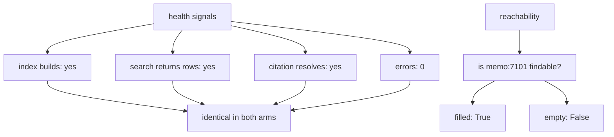

# 6.1 — 💥 The store that was never filled

## One-line answer

An empty memory produces a healthy-looking desk: rows returned, a score of `0.415`, a citation that
resolves, no errors and no warnings — and the only check that separates it from a working one is
naming a case in advance and asking whether it can be found.

## The story

The stock room behind the shop has never looked better.

The shelves are labelled by aisle and by product line. The step ladder is on its hook. The floor is
swept, the fire exit is clear, the temperature log by the door has been signed every morning this
month. If somebody came round with a clipboard they would find nothing to write down.

There is no stock.

Every single thing an inspection looks at is a property of the *room*, and the room is immaculate.
The one thing an inspection does not look at is whether the room contains the thing it exists to
contain, because that is not a property of the room — it is a question you have to arrive already
knowing the answer to. *Is the 40-watt bulb here?* You have to know that a 40-watt bulb is supposed
to be here before the empty space where it should be means anything at all.

## The idea in plain language

🎬 **The scene.** The desk has been running for a week. Support agents are asking it questions and
getting answers. Nobody has complained.

😬 **The naive fix.** Add health checks. Is the memory service constructed? Does the index build?
Does a search return rows? Does the answer carry a citation? Does the citation resolve? Are there
errors in the log? Every one of those is a sensible thing to check, and a team that checks all six
feels well covered.

💥 **Why it fails.** All six pass on an empty store. The archive answers anyway. Retrieval is
working perfectly — it is ranking sixty-one rows and returning the best one — and the fifty-seven
documents it is ranking are the ones that were there before Phase 7 started. The desk is not broken;
it has quietly reverted to Day 45, and every signal it emits is a signal about the machinery rather
than about the contents.

💡 **The insight.** A store's emptiness is not observable from the store's behaviour. It is only
observable against an **expectation**: something you wrote down, in advance, that ought to be in
there. The check is not *"is the store healthy"*. It is *"is `memo:7101` findable"*, and that
sentence cannot be written by a monitoring system. Somebody has to have decided what should be
there.

This is the same shape as Day 46's
[part 5.2](../../../day-46-sessions-vs-memory/parts/05-failure-lab/5.2-the-store-that-was-never-a-store.md),
where an in-process store lost everything at restart: *no error, no warning and no log line, because
nothing failed*. Today's version is worse in one respect. There, the store had been filled and lost
its contents. Here it was never filled, so there is not even a before-and-after to notice.

## Why Sutra needs it

Day 65 is Phase 9's gate: *kill it mid-run; it resumes; a human approved the write*. Resumption is
the act of rebuilding state from a store, and the entire test is whether what comes back is what
went in.

A project that cannot tell a full store from an empty one cannot test resumption at all, because
"it resumed and the answer was fine" is exactly what an empty store produces. The reachability check
built here is the primitive Day 65 needs: name a thing, then ask for it by name.

## The mechanism

Run the desk twice — once filled, once with nothing filed — and print every health signal a
reasonable team would monitor:

```bash
cd days/day-52-memory-in-triage-flow/lab
uv run python emptystore.py
```

**Line by line:**

- `emptystore.py` asks one question — *"has anyone else been signed out of the dashboard on
  Chrome"* — of two desks that differ only in whether this week's four memos were filed.
- It prints six signals per arm: row count, rows returned, top score, whether the citation resolves,
  model requests, errors and warnings. Those are the signals a real dashboard carries.
- It deliberately does **not** print the reachability check by default. The default run is what the
  team sees; the check is what they would have to have thought to add.

Measured on 2026-09-05:

```text
--- store filled (4 memos) ---
  index rows            65
  search returned       2 rows
  top score             0.439
  citation resolves     True
  model requests        1
  errors raised         0
  warnings logged       0
  answer: Blue Peak signed out of the dashboard every few minutes on Chrome. Cause was the SameSite and Se

--- store empty (nothing was filed) ---
  index rows            61
  search returned       1 rows
  top score             0.415
  citation resolves     True
  model requests        1
  errors raised         0
  warnings logged       0
  answer: Ticket 4521. Keeps getting logged out. The customer is signed out of the dashboard every few min
```

Put the two blocks side by side and ask which one is broken.

`citation resolves` is `True` in both. `errors raised` is `0` in both. `warnings logged` is `0` in
both. `model requests` is `1` in both. Every signal that a monitoring system can produce *without
knowing anything about your domain* is identical.

Two signals differ, and neither of them is actionable on its own. `index rows` is 61 instead of 65 —
but 61 is a perfectly plausible number for a healthy index, and nobody knows what it should be
without looking it up. `top score` is `0.415` instead of `0.439` — but `0.415` is a *good* score,
comfortably above the floor, and if anything it looks slightly more confident to a person reading a
dashboard.

The answers are where the damage is, and the damage is not visible in the shape of the answer. The
filled desk says the cause was `SameSite and Secure`, see `KB-104`. The empty desk repeats the
customer's own complaint back at the agent: *"Keeps getting logged out... lands back on the sign-in
page."* Both are true sentences. Both cite a real row. One of them ends the ticket.

Now add the check that separates them:

```bash
uv run python emptystore.py --reachability
```

**Line by line:**

- `--reachability` names one memo in advance — `memo:7101:resolution:signed-out-of-the-dashboard` —
  and asks each index whether any row belongs to it.
- The ref is a **constant in the script**, written by a person who knew what this week's filing was
  supposed to produce. That is the part no tool can generate.

```text
--- the reachability check ---
  filled   memo:7101:resolution:signed-out-of-the-dashboard reachable: True
  empty    memo:7101:resolution:signed-out-of-the-dashboard reachable: False

The difference between the two runs is invisible to every health signal above and
obvious to one question: is the thing we filed findable? Name a case, ask for it.
```

`True` and `False`. One line, unambiguous, and it required somebody to write down a ref.



## When it breaks

The reachability check has one failure mode of its own, and it is worth knowing because it is how
this kind of check dies: **the canary goes stale.**

`memo:7101:resolution:signed-out-of-the-dashboard` is a real ref today. In a real store, that memo
will eventually be superseded by a better write-up of the same subject, or erased because Blue Peak
asked, or expired. On that day the check goes red, nothing is wrong, and somebody spends an hour
before concluding the canary needs updating. Do that twice and the check gets deleted.

The production answer is that the canary must be **synthetic and permanent**: a memo written by the
system itself, under a holder that is not a customer, with a retention rule that never expires it
and a subject nothing else will ever supersede. It costs one row and it removes the entire failure
mode.

The second break is trying to replace the canary with a threshold. *"Alert if the store has fewer
than fifty memos"* looks like the same idea and is not. It goes red on the day you launch and every
day until you reach fifty; it goes green forever once you pass fifty, including on the day filing
stops, because the fifty from before are still there. A count tells you about accumulation. A named
ref tells you about *reachability*, and reachability is the property that broke.

The third break is real and produces an error, and it is what happens when the canary is checked
with the wrong kind of lookup:

```text
Traceback (most recent call last):
  File "<string>", line 5, in <module>
KeyError: 'memo:7101:resolution:signed-out-of-the-dashboard'
```

That is `index.texts[ref]` on a parent ref in a chunked index — the same `KeyError` as
[2.2](../02-the-run/2.2-an-answer-that-names-its-source.md)'s citation failure. The check in
`emptystore.py` avoids it by comparing `ref.split("#", 1)[0]` across every key, which is a little
more work and does not raise on a store where the memo is legitimately absent. A canary check that
raises instead of returning `False` is a canary check that will be wrapped in a `try` within a
month.

## In production

**What a professional writes instead.** Two signals rather than one. The canary answers *"can I
still find a thing I know is there"*; a **write-side heartbeat** answers *"when did anything last
enter the store"*. The second is a timestamp, it is cheap, and it catches the failure earlier: the
canary stays reachable for as long as the canary exists, so it will not notice that filing stopped
this morning. Together they cover both directions. Separately, each has a blind spot the other
covers.

**What degrades at scale.** A single canary in a store of a million rows tells you almost nothing.
Filing can fail for one tenant, one region, one kind of memo or one code path while the canary sits
happily in another. At that size the check becomes a sampled one: pick a memo filed in the last hour,
per tenant, and ask for it. That is a real job with real cost, and the trigger for building it is
the day the store stops being small enough for one canary to represent.

**The failure mode that only appears with real traffic.** The empty-store failure almost never
arrives as an empty store. It arrives as a *partially* empty one: the extraction step starts
returning nothing for one class of conversation, filing continues normally for everything else, and
every aggregate number keeps climbing. The canary is green, the heartbeat is green, the row count is
up and to the right, and the desk has quietly stopped remembering anything about billing questions.
Catching that needs the counts from
[3.1](../03-the-write-path/3.1-nothing-is-filed-unless-a-line-files-it.md) broken down by kind, and
an alert on a *ratio* rather than a total.

**The review comment a senior engineer leaves:** *"Everything on this dashboard is a property of the
machinery. Not one panel would change if the store were empty — I know, because you ran it. Add a
canary with a synthetic holder that nothing can supersede, and add last-write-time. And take the row
count off the dashboard or put an expected range beside it; a bare 61 is a number nobody can act
on."*

**The interview question:** *"How would you detect that your agent's memory silently stopped
working?"* An honest answer: *"You cannot detect it from the read side, and I ran it to be sure —
with the store empty, my desk still returned a row, at 0.415, with a citation that resolved, no
errors and no warnings, and the only visible difference was the row count going from 65 to 61 and a
top score that actually looked healthier. What separates the two is naming something in advance: a
synthetic canary memo the system files itself, checked for reachability, plus a last-write
timestamp. The canary catches 'the store lost things' and the timestamp catches 'nothing new is
arriving', and neither one catches the other."*

## Check yourself

```bash
cd days/day-52-memory-in-triage-flow/lab
uv run python emptystore.py
uv run python emptystore.py --reachability
```

Now write down the two fields a synthetic canary memo would need so that it can never expire and
nothing can ever supersede it. Check them against the `Rule` fields in
[3.2](../03-the-write-path/3.2-every-memo-names-the-rule-that-kept-it.md).

**Out loud, without scrolling up:** explain why a health check cannot detect an empty store, and
what a check needs that a health check does not have.

**Next:** [6.2 — The memo that could not be found](6.2-the-memo-that-could-not-be-found.md).
