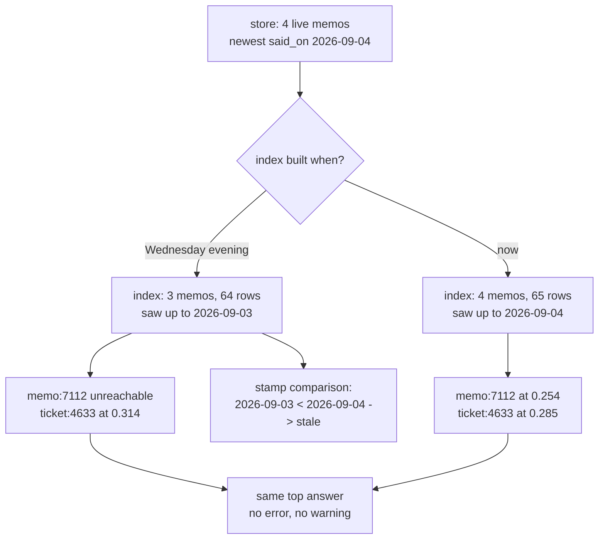

# 6.2 — 💥 The memo that could not be found

## One-line answer

A memo filed, judged, admitted and live in the store was unreachable because the index was built one
memo earlier — and the desk returned the same top answer either way, so the only observable
difference was a score moving from `0.314` to `0.285`.

## The story

The timetable at the bus stop is printed on a board behind glass, bolted to the pole.

You have used it for two years. The 47 leaves at eleven minutes past the hour and you leave the
house at six past, and this has worked so reliably that you no longer read the board — you glance at
it, the way you glance at a clock you already know the time from.

Last month the route changed. The 47 now runs from the other side of the road, at nineteen minutes
past, and the board behind the glass still says eleven.

Nothing about the board looks wrong. It is not faded, not vandalised, not missing. It is a clean,
correct, professionally printed timetable for a service that no longer exists, and the only way to
find out is to compare it against something else — the app, the sign on the other pole, or a bus
that does not come.

## The idea in plain language

🎬 **The scene.** A memo was filed on Wednesday. On Thursday a support agent asks the question that
memo answers, and the desk answers from a ticket instead.

😬 **The naive fix.** Check the store. The memo is there. Check the policy: it is `live`, admitted
by the `resolution` rule, not expired, not superseded, not erased. Check retrieval: it works — other
questions return other memos correctly. Check the answer: it is a real ticket, correctly cited,
above the floor. Nothing is wrong anywhere.

💥 **Why it fails.** The **index** was built before the memo was filed. The store and the index are
two different things, and only one of them is searched. The memo is in the store, has always been in
the store, and has never been in the index — so as far as every question is concerned it does not
exist. There is no error because nothing failed: the index built correctly, from the data it was
given, at the time it was given it.

💡 **The insight.** An index is a **snapshot** with no timestamp on it. It cannot tell you what it
does not contain, because a thing it does not contain leaves no space where it would have been.
Staleness is not a property you can observe by looking at the index; it is a property of the
*relationship* between the index and the store, and observing a relationship needs two readings.

Day 49's
[part 5.2](../../../day-49-retrieval-and-embeddings/parts/05-when-retrieval-lies/5.2-the-index-nobody-rebuilt.md)
found this on the archive side and named the second consequence: adding one row also moves the
weight of every word, so a stale index is not merely missing a row — it is scoring everything else
slightly wrong as well.

## Why Sutra needs it

Day 60 is *durable execution — resume, replay, idempotency*, and Day 61 is *pause/resume and
checkpoints*. Both are about reconstructing a system's state from something written down earlier,
and both live or die on knowing whether what you read back is current.

The two fields this part ends with — *the newest thing this snapshot saw* and *how many rows it
wrote* — are the smallest possible version of a checkpoint header. Learning to write them on an
index is learning to write them on a checkpoint, and Day 60 will not have to introduce the idea from
scratch.

## The paper behind it

> **Time, clocks, and the ordering of events in a distributed system**
> doi:10.1145/359545.359563 · 1978 · <https://doi.org/10.1145/359545.359563>

It claimed that without a shared clock you can still order events by what each part of a system has
*seen* — which is exactly the reading this failure needs, because the question is not what time it
is but whether the index has seen everything the store has.

Taught in full at
[Day 22 · papers/01-time-clocks-ordering.md](../../../day-22-structured-logging/papers/01-time-clocks-ordering.md).

## The mechanism

Build the index from three of the four live memos — the state it would be in if it were built the
evening before the fourth was filed — and ask the question the missing memo answers:

```bash
cd days/day-52-memory-in-triage-flow/lab
uv run python staleindex.py
```

**Line by line:**

- `staleindex.py` runs the real write path, then deliberately drops the newest memo before building
  a second index. Everything else — the archive, the policy, the chunk size, the floor — is shared.
- The question is *"customer says the password reset link was already used when they clicked it"*,
  which the memo from case 7112 answers directly.
- It prints, for each index, whether the memo is reachable at all, followed by the rows the desk
  actually returned. Reachability and results are separate lines because they are separate facts.

Measured on 2026-09-05:

```text
memos live in the store      4
memos present in the index   3
stale index rows             64
fresh index rows             65

--- stale index ---
  memo:7112:resolution:reset-link-already-used reachable: False
  0.314  ticket:4633#0
  0.236  kb:KB-311#0
  answer: Ticket 4633. Password reset link says expired. The customer requests a reset, opens the

--- fresh index ---
  memo:7112:resolution:reset-link-already-used reachable: True
  0.285  ticket:4633#0
  0.254  memo:7112:resolution:reset-link-already-used#0
  answer: Ticket 4633. Password reset link says expired. The customer requests a reset, opens the
```

This is a worse failure than [6.1](6.1-the-store-that-was-never-filled.md)'s, and the reason is in
the last line of each block.

**The answer is identical.** Both desks return `ticket:4633` as the top row, so both compose the
same first sentence. A team comparing the two outputs — which is what you do when a support agent
says *"it gave me the wrong thing"* — would see no difference at all in the thing the agent was
shown first.

**The memo is not missing from the results. It is missing from the universe.** `reachable: False`
is not a ranking outcome; the row is not in the index, so it was never scored, never compared, never
rejected. There is no floor to lower and no `k` to raise that will bring it back.

**And the scores moved.** `ticket:4633` scores `0.314` in the stale index and `0.285` in the fresh
one. Adding one row changed the weight of the words the question uses, so the *same document* scores
differently against the *same question* depending on what else is in the index. Any threshold tuned
against one of these is not valid against the other, which is the arithmetic Day 49's
[part 1.4](../../../day-49-retrieval-and-embeddings/parts/01-text-as-numbers/1.4-the-word-that-tells-you-nothing.md)
built and the reason this failure quietly poisons tuning as well as recall.

**Sixty-four rows against sixty-five.** That is the whole footprint. One row.

Now add the two fields that make it visible:

```bash
uv run python staleindex.py --stamped
```

**Line by line:**

- `--stamped` computes what an index file *would* say if it recorded the newest memo it saw and how
  many rows it wrote, and compares that against what the store holds now.
- Neither field is expensive. Both are known at build time and thrown away.

```text
--- what a stamp would have said ---
  index built over memos up to  2026-09-03
  newest live memo said on      2026-09-04
  index rows at build time      64
  rows the store would give now 65
  stale                         True
```

Two readings, one comparison, one boolean. `2026-09-03` against `2026-09-04`, `64` against `65`, and
the invisible failure becomes a line anybody can run.

Note that the check needs **both** fields, not either. The dates alone miss the case where a memo is
*erased* rather than added — the newest date does not move and the row count falls. The counts alone
miss the case where one memo is superseded by another on the same day — the count is unchanged and
the contents are not. Two cheap fields cover both; one covers half.



## When it breaks

The break inside the break is that a stamp can lie.

If the index writes `built_at` from the clock rather than from the data — *"this index was built at
14:32"* — then an index rebuilt from a stale copy of the store gets a fresh timestamp and a stale
body. The stamp says current and the contents are not, and now there is a check that actively
reassures you. That is why the field above is `index built over memos up to`, taken from the
**maximum `said_on` of the rows it actually indexed**, and not from `datetime.now()`. A stamp must
describe the data, not the run.

The second break is real, produces an error, and is what happens when the store and the index
disagree in the *other* direction — the index holds a ref the store no longer does:

```text
Traceback (most recent call last):
  File "<string>", line 5, in <module>
KeyError: 'memo:7108:account_fact:billing-account'
```

That is a lookup for a memo that was superseded and removed from the store while the index still
carried its row. The desk retrieves it, tries to fetch its current text to compose with, and fails
loudly. Loud is the right outcome here — the alternative is answering a customer from a fact they
explicitly corrected, which is the failure Day 48's
[part 3.2](../../../day-48-memory-design/parts/03-expiry-and-supersession/3.2-the-newer-fact-wins.md)
is about.

The third break has no error and is the one that ships: **the index is rebuilt on deploy.** It works
perfectly, everybody is happy, and the staleness window is silently equal to the time between
deploys. On a team that ships twice a day that is invisible. On a team that ships once a month, the
desk has a month of amnesia, and the first person to notice will be a customer.

## In production

**What a professional writes instead.** The index carries a header: the newest source timestamp it
saw, the row count, the chunk size, the overlap, and the name and version of the vectoriser that
built it. Day 49's build brief already asks for `built_at` and a source row count; this failure is
the argument for them, and Day 49's
[part 3.3](../../../day-49-retrieval-and-embeddings/parts/03-meaning-as-geometry/3.3-the-scale-does-not-know-what-it-weighs.md)
adds the lane fields — because an index built by one vectoriser and searched by another produces
scores that are not merely stale but meaningless.

**What degrades at scale.** Rebuilding the whole index stops being possible. At sixty-five rows it
is 2.7 milliseconds; at ten million it is a job with a budget, and the answer becomes incremental
indexing — which trades one failure for a harder one, because now the index has a *partial* view and
"is it stale" becomes "which parts of it are stale". The stamp grows into a watermark per shard, and
this is the point at which a real vector store earns its keep, since that bookkeeping is exactly
what they are for.

**The failure mode that only appears with real traffic.** Staleness is not uniform in its
consequences. The rows most likely to be missing are the newest ones, and the questions most likely
to need the newest rows are the ones about the incident that started this morning. So the index is
freshest exactly where nobody is looking and stalest exactly where everybody is, and the aggregate
answer rate barely moves while the desk is useless on the only thing anyone is asking about.

**The review comment a senior engineer leaves:** *"There is no way to ask this index how old it is.
Put the newest source timestamp and the row count in the file, and have the search refuse — loudly —
if the store's newest row is newer than the index's watermark by more than the rebuild interval.
Refuse, not warn: a warning in a log is a warning nobody reads, and answering from a stale index is
how we tell a customer something we corrected last week."*

**The interview question:** *"How do you know your search index reflects your data?"* An honest
answer: *"You cannot know by looking at the index, so I put two fields in it: the newest source
timestamp it saw and how many rows it wrote, both taken from the data rather than from the clock.
Comparing those against the store is one line. I ran the failure to see what it looks like without
them — a memo that was filed, live and correct was simply unreachable, the desk returned the same
top answer as the healthy run, and the only visible difference was a score moving from 0.314 to
0.285 because adding one row changes every term weight. No error, no warning, and identical output
to the user."*

## Check yourself

```bash
cd days/day-52-memory-in-triage-flow/lab
uv run python staleindex.py
uv run python staleindex.py --stamped
```

Now describe the case that the row count catches and the timestamp does not, and the case the
timestamp catches and the row count does not. If you can only think of one, re-read the paragraph
after the `--stamped` output.

**Out loud, without scrolling up:** explain why a stale index cannot be detected by examining the
index, and why the stamp must come from the data rather than from `datetime.now()`.

**Next:** [6.3 — Green because nothing existed](6.3-green-because-nothing-existed.md).
