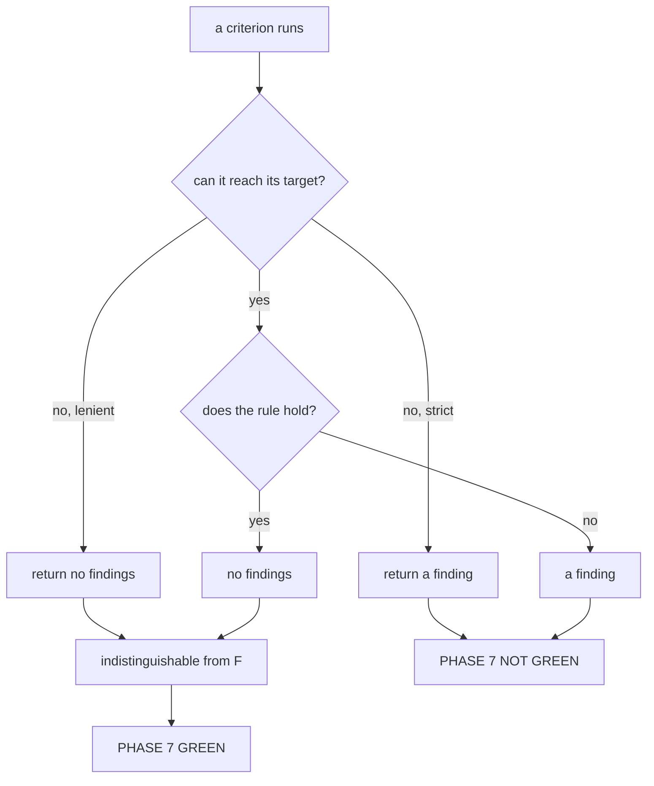

# 6.3 — 💥 Green because nothing existed

## One-line answer

Two implementations of the same five checks over the same repository print `PHASE 7 GREEN` and
`PHASE 7 NOT GREEN` — and the one that says green is the one that treats a module it cannot import
as nothing to check rather than as the finding it is.

## The story

The smoke alarm in the hallway has a green light and a test button.

Nobody has pressed the test button. There has been no smoke, so there has been no beep, and the
absence of beeping over three years has become, without anyone deciding it, the evidence that the
alarm works.

The battery came out in 2023 to power a television remote, on the understanding that it would be
put back at the weekend.

The alarm is silent. It was silent last year and it will be silent next year, and it will be silent
in exactly the way it is silent now on the night it matters. Silence was never evidence. It looked
like evidence because the alarm's only other output is noise, and the absence of the bad output got
read as the presence of the good one.

## The idea in plain language

🎬 **The scene.** The gate runs in continuous integration and it is green. It has been green for
weeks. Nobody has looked at the output because there has been nothing to look at.

😬 **The naive fix.** Write the checks defensively. A check that crashes is worse than useless — it
turns a build red for a reason nobody can act on — so wrap the import in a `try`, and if the module
is not there, return no findings and move on. It is a reasonable instinct and it is the standard way
to make a fragile check robust.

💥 **Why it fails.** *Not there* and *there and correct* both produce an empty findings list. The
check has two possible outputs and three possible situations, so two situations share an output, and
the two that share it are the two you most need to tell apart.

💡 **The insight.** **A missing target is a finding.** Not an error, not a skip — a finding, of the
same kind and the same weight as a rule that failed. Day 45's
[part 6.1](../../../day-45-the-mcp-audit/parts/06-failure-lab/6.1-green-because-the-path-did-not-exist.md)
called this the most load-bearing decision in an audit module, and it is worth stating again here
because a phase gate makes the consequence larger: an audit that skips reports on a component, and a
gate that skips declares a phase finished.

The general form is worth naming, because it is not really about imports. Any check that answers
*"did I find a problem?"* rather than *"did I look?"* has this bug. A grep that finds no matches, a
directory walk over a directory that does not exist, a query returning no rows from a table that was
renamed — all of them come back clean, and clean is the answer they give when they have been unable
to do their job.

## Why Sutra needs it

Every gate from here to Day 96 is written against a codebase that does not exist yet at the moment
the gate is written. Phase 8's gate is written before the graph is built; Phase 9's before
durability exists; Phase 12's evalsets before the agents they judge are finished.

That ordering is deliberate — the list is written before you look — and it means **every one of them
will be pointed at missing modules on the day it is first run.** If the house style is "skip what is
absent", every gate in this curriculum is green on the day it is written and stays green until
somebody notices, which is the opposite of what a gate is for.

## The mechanism

Two functions, the same five criteria, the same repository. The only difference is the `except`
branch:

```python
def lenient() -> list[str]:
    """A check that returns no findings when it cannot reach what it is checking."""
    findings: list[str] = []
    for module_name, symbol, _ in EXPECTED:
        try:
            module = importlib.import_module(module_name)
        except Exception:  # noqa: BLE001 - the whole point is that this is swallowed
            continue
        if not hasattr(module, symbol):
            findings.append(f"{module_name}.{symbol} is missing")
    return findings


def strict() -> list[str]:
    """The same check, with a missing target treated as the finding it is."""
    findings: list[str] = []
    for module_name, symbol, day in EXPECTED:
        try:
            module = importlib.import_module(module_name)
        except Exception as error:  # noqa: BLE001 - the message is the finding
            findings.append(f"{module_name} ({day}) is not importable: {error}")
            continue
        if not hasattr(module, symbol):
            findings.append(f"{module_name}.{symbol} ({day}) is missing")
    return findings
```

**Line by line:**

- The two functions differ by **three lines**: `except Exception:` versus `except Exception as
  error:`, and a `findings.append` before the `continue`. That is the entire distance between a gate
  and a decoration.
- `except Exception` rather than `except ImportError` in both, deliberately. A module that exists but
  raises at import time — a missing environment variable, a syntax error, a circular import — is
  just as unreachable as one that does not exist, and a narrow `except` would let that case crash
  the gate instead of reporting it.
- The `noqa` comments say **why** the broad catch is there, which is the house rule from `CLAUDE.md`:
  no `# noqa` without a comment. In `lenient` the comment is an admission; in `strict` it is a
  justification.
- `strict` puts the day in the message. A finding that says *"`sutra.retrieval` (Days 49 and 50) is
  not importable"* tells the reader where to go; one that says *"import failed"* costs them a search
  through the plan.
- Neither function raises. Both return lists. A gate that throws on its first problem reports one
  finding when there are six, and Principle 10 wants the errors surfaced, not the first error
  surfaced.

Run both:

```bash
cd days/day-52-memory-in-triage-flow/lab
uv run python greenonnothing.py; echo "exit: $?"
```

**Line by line:**

- The default run uses `lenient`. It is the version somebody writes on a Friday when the gate has
  been failing for a reason they cannot fix.
- `echo "exit: $?"` prints the exit code, because on a gate the exit code *is* the result and the
  text is commentary.

Measured on 2026-09-05:

```text
criteria checked      5
implementation        lenient
findings              0

PHASE 7 GREEN

Nothing under sutra/ that Phase 7 asked for exists. Every rule was skipped, every
skip was silent, and the verdict above is what the run printed.
```

**`PHASE 7 GREEN`, exit `0`, on a repository where not one line of Phase 7's project code has been
written.** Five criteria checked, five criteria skipped, zero findings, and a green verdict.

That output is not a strawman written to make a point. It is the honest result of running a
reasonable-looking check against this repository today, and it is what a continuous integration
badge would show.

Now the three-line difference:

```bash
uv run python greenonnothing.py --strict; echo "exit: $?"
```

**Line by line:**

- `--strict` swaps in the other function. Same criteria, same repository, same run.

```text
criteria checked      5
implementation        strict
findings              5
  - sutra.memory.service (Day 46) is not importable: No module named 'sutra.memory'
  - sutra.memory.persistence (Day 47) is not importable: No module named 'sutra.memory'
  - sutra.memory.policy (Day 48) is not importable: No module named 'sutra.memory'
  - sutra.retrieval (Day 49) is not importable: No module named 'sutra.retrieval'
  - sutra.retrieval (Day 50) is not importable: No module named 'sutra.retrieval'

PHASE 7 NOT GREEN
exit: 1
```

Five findings, exit `1`, and every line names the day whose work is missing.

This is the correct state of this repository, and it is also the day's build brief written out by a
program: the five things that have to exist before Phase 7 can be called finished.



## When it breaks

The lenient version is not the only way to reach a false green, and the others are harder to see.

**Checking the reference instead of the product.** `gate.py` imports `sutra`; the parts import
`_phase7`. Change one import line in the gate and every criterion passes today, because the lab's
reference implementation is complete. There is no `try`, no swallow, nothing that looks like a
mistake — just a module name that is one word different from the right one.

**A criterion with no negative case.** *"`retrieve` returns a list"* passes on `[]`, on the right
rows, and on the wrong rows. It looks like a check and it is a type assertion. The test for whether
a criterion is real is whether you can describe the state in which it fails; if you cannot, it does
not have one.

**An empty inventory.** Day 45's
[part 6.2](../../../day-45-the-mcp-audit/parts/06-failure-lab/6.2-the-registry-that-was-empty.md)
found this shape: every rule was correct about the one server in the registry, and no rule asked
whether the registry was the whole truth. Here the same bug would be `EXPECTED = []` — five criteria
become zero criteria, the loop body never runs, and the gate reports green with total accuracy about
nothing at all.

There is also a real error worth reaching, because it is what the narrow `except` would have let
through. Point the checker at a module that exists and raises on import:

```text
Traceback (most recent call last):
  File "<string>", line 2, in <module>
  File "...\Python312\Lib\importlib\__init__.py", line 90, in import_module
    return _bootstrap._gcd_import(name[level:], package, level)
           ^^^^^^^^^^^^^^^^^^^^^^^^^^^^^^^^^^^^^^^^^^^^^^^^^^^
  File "<frozen importlib._bootstrap>", line 1387, in _gcd_import
  File "<frozen importlib._bootstrap>", line 1360, in _find_and_load
  File "<frozen importlib._bootstrap>", line 1310, in _find_and_load_unlocked
  File "<frozen importlib._bootstrap>", line 488, in _call_with_frames_removed
  File "<frozen importlib._bootstrap>", line 1387, in _gcd_import
  File "<frozen importlib._bootstrap>", line 1360, in _find_and_load
  File "<frozen importlib._bootstrap>", line 1324, in _find_and_load_unlocked
ModuleNotFoundError: No module named 'sutra.memory'
```

That is `importlib.import_module("sutra.memory.service")` with nothing catching it. On a gate this
is better than a false green and worse than a finding: the run stops at the first problem, the other
four are never checked, and the person reading continuous integration sees a crashed job rather than
a list of five things to do.

## In production

**What a professional writes instead.** Every check returns three states, not two: `pass`, `fail`,
and `not_checked` with a reason. The gate's summary then reports all three, and the release rule is
that `not_checked` blocks a boundary just as `fail` does — you may ship with known problems, but not
with unknown ones. That is the machine-readable version of the amber row from
[1.2](../01-the-promise/1.2-a-gate-is-not-an-audit.md), and it removes the entire class of failure
this part is about, because there is no longer an output that both situations can share.

**What degrades at scale.** Skipped checks accumulate invisibly. A suite of two hundred criteria
where eleven silently skip looks identical to one where all two hundred run, and the eleven will be
the ones covering the component that was renamed last quarter — that is, the newest and least
understood code. Reporting **coverage** — how many criteria actually executed — alongside the pass
rate is the only thing that catches it, and almost nobody does it.

**The failure mode that only appears with real traffic.** In continuous integration the gate runs in
a container where a dependency, a credential or a mount may be missing. A check that swallows
unreachable targets will pass in that container and fail on a developer's machine, which is exactly
backwards, and the conclusion the team draws is that the gate is flaky. Flaky gates are switched
off, and they are switched off by people who believe they are removing noise.

**The review comment a senior engineer leaves:** *"Line 41 is a bare `continue` on an import failure.
That is the difference between a gate and a green badge, and I would rather have no gate than one
that cannot fail. Return `not_checked` with the exception message, count it in the summary, and make
`not_checked` block the boundary."*

**The interview question:** *"How do you know your checks are actually running?"* An honest answer:
*"Because a check that cannot reach its target reports a finding rather than skipping. I ran both
versions over the same repository — the lenient one printed `PHASE 7 GREEN` with exit zero on a
codebase where not one of the five modules exists, and the strict one printed five findings and exit
one. They differ by three lines. What I would add in a real system is a third state: `not_checked`
with a reason, counted in the summary, and blocking a release the same way a failure does. Two
states are not enough, because 'clean' and 'could not look' end up sharing one."*

## Check yourself

```bash
cd days/day-52-memory-in-triage-flow/lab
uv run python greenonnothing.py; echo "exit: $?"
uv run python greenonnothing.py --strict; echo "exit: $?"
```

Now open `gate.py` and find the line that decides whether it checks the project or the lab's
reference. Change it to the wrong one in your head and say what the findings count becomes.

**Out loud, without scrolling up:** state the rule in one sentence, and give the second way to reach
a false green that has nothing to do with exception handling.

**Next:** [7.1 — The freshness re-check](../07-the-phase-boundary/7.1-the-freshness-recheck.md).
