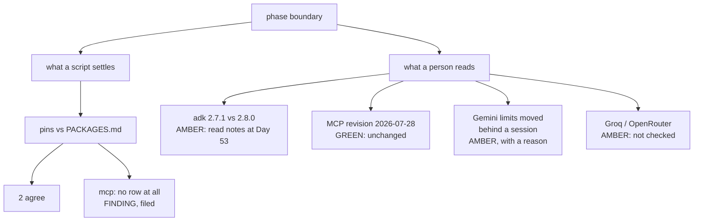

# 7.1 — The freshness re-check

## One-line answer

Four things outside this repository get re-read at every phase boundary; on 2026-09-05 two came back
green, one came back amber because the numbers moved behind a login, and the offline half found a
real Principle 7 violation — `mcp==1.29.1` is pinned in `pyproject.toml` with no row in
`docs/PACKAGES.md`.

## The story

There is a small sticker in the top corner of the windscreen. Somebody at a garage wrote two
things on it in biro: a date, and a mileage.

That is all it says. It does not say the oil is clean. It does not say the belt is sound. It says
*this is where the car was the last time a person looked at it*, and everything you might want to
know follows from comparing that with where the car is now.

The engine, meanwhile, sounds fine. It started this morning and it started yesterday, and it will
go on sounding fine for a long time whether the oil was changed or not.

The sticker is not a description of the car. It is a description of **when somebody last checked**,
and those are different facts. A car that has been serviced and one that has not are identical from
the driver's seat right up to the point where they are not, which is exactly why the note in the
windscreen records the looking rather than the engine.

## The idea in plain language

Everything a repository controls is in the repository. Its versions are pinned, its code is
committed, its tests run on demand, and if any of it changes, git says so.

Everything a repository *depends on* is not. Four categories, from the plan's section 15 rule 5:

| What moves | Why it matters here |
| --- | --- |
| The framework's releases | A breaking change means the plan is amended before any code changes (Principle 14) |
| The MCP specification revision | A new revision means Addendum 01 Part 2 is re-read, as a standing rule |
| The providers' free-tier rosters | A model that lost its free tier turns a working project into a billed one (Addendum 02) |
| The skills and registry ecosystem | Provenance rows can stop being valid without anything local changing |

Not one of those produces a commit in this repository when it happens. There is no notification, no
failing test, no red build. The world moves and the repository stays exactly as correct-looking as
it was the day before.

That is what the **freshness check** is: a ritual, at a boundary, of going and looking. It is the
sticker in the windscreen, not the engine.

The work splits in two, and keeping the halves apart is what makes the result honest:

- **What a script can settle.** Pins against the ledger. No network, milliseconds, no judgement.
- **What a person has to go and read.** Release notes, a specification page, a provider's limits.
  Judgement is required — *is this change breaking?* — so a script can carry the question and the
  command, and not the answer.

One term, defined once: a **pin** is an exact version in `pyproject.toml`, written with `==`. It is
the repository's claim about what it depends on. Principle 7 says every pin gets a dated row in
`docs/PACKAGES.md`, and the row is the *evidence* for the claim — when it was looked up, on what
day, and why the package is there at all.

## Why Sutra needs it

Day 53 opens Phase 8 on the ADK's graph Workflow Runtime, and plan section 5.1 lists four traps
where 1.x habits break under 2.x. The whole of Phase 8 is written against one framework version.

If `google-adk` released something breaking between the day this phase started and the day the next
one begins, the correct sequence is: **amend the plan, then write code** — never silently adapt
(Principle 14). The freshness check is the moment that question gets asked, and asking it the day
before Phase 8 starts is much cheaper than discovering it on Day 58 with a graph half-built.

## The mechanism

### The half a script settles

```bash
cd days/day-52-memory-in-triage-flow/lab
uv run python freshness.py
```

**Line by line:**

- `freshness.py` parses the exact pins out of `pyproject.toml` with `tomllib` — standard library, no
  dependency — and the dated rows out of `docs/PACKAGES.md`, keeping the most recent row per package.
- It compares them in both directions: does the ledger agree with the pin, and is there a pin with no
  ledger row at all.
- It makes **no network request**. A gate day that quietly ran four calls to prove it makes none
  would have failed its own criterion in
  [5.1](../05-the-zero-claim/5.1-counted-during-the-run-not-after.md), so the four external rows are
  printed as unticked boxes carrying the exact command that answers them.

Measured on 2026-09-05:

```text
what the repository pins, and when the ledger last saw it
  package                       pinned      ledger       checked   agrees
  google-adk                     2.7.1       2.7.1    2026-08-26   True
  google-genai                  2.19.0      2.19.0    2026-08-24   True
  mcp                           1.29.1           -             -   False

  pins with no dated ledger row: ['mcp']

what only the network can answer, and the command that answers it
  [ ] google-adk release notes since the last gate
        curl -s https://pypi.org/pypi/google-adk/json | python -c "import json,sys;d=json.load(sys.stdin);print(d['info']['version'])"
  [ ] MCP specification revision
        curl -s https://modelcontextprotocol.io/specification/ | grep -o '20[0-9][0-9]-[0-9][0-9]-[0-9][0-9]'
  [ ] Gemini free-tier limits
        open https://ai.google.dev/gemini-api/docs/rate-limits
  [ ] Groq and OpenRouter free rosters
        open https://console.groq.com/settings/limits and https://openrouter.ai/models?q=:free

  rows a script settled today:   3
  rows still amber:              4
```

The third row of the first table is a finding.

**`mcp` is pinned at `1.29.1` and has no row in `docs/PACKAGES.md` at all.** Not a stale row — no
row. The package was added during Phase 5, used across seven days of MCP work, and the dated row
Principle 7 requires was never written.

Nothing broke and nothing was going to. `uv sync` installs it, the tests pass, `./m check` is happy,
and the repository is one package short of being able to say *when we looked this up, and why*. Day
45's audit — an audit of MCP, no less — did not catch it, because it audited MCP behaviour and this
is ledger discipline. It was found by a rule written this morning, before anybody looked at the file,
which is the whole case for writing rules before looking.

By [1.2](../01-the-promise/1.2-a-gate-is-not-an-audit.md)'s rule it gets one of two endings, and here
it is **filed**: the row is in this day's hub for the learner to paste, because a generated day does
not edit the project's append-only ledgers.

### The half a person goes and reads

The four boxes above are unticked because the script did not tick them. Here is what happened when
they were actually run, on **2026-09-05**.

**Row 1 — the framework.**

```bash
curl -s https://pypi.org/pypi/google-adk/json \
  | python -c "import json,sys;print(json.load(sys.stdin)['info']['version'])"
```

**Line by line:**

- Reads the version out of PyPI's JSON rather than scraping a page, because a JSON field is a stable
  answer and a page layout is not.
- `-s` silences the progress meter, which would otherwise be interleaved with the body.

```text
2.8.0
```

Pinned at `2.7.1`, latest is `2.8.0`. **Amber, and deliberately so.** This is not a bump to make at a
gate: Principle 14 says a release is read for breaking changes and the plan is amended *first*, and
Phase 8 is about to be written against whatever version it names. The status is *known, one minor
behind, decision deferred to Day 53 with the release notes read* — which is a sentence, not a tick.

**Row 2 — the specification.**

```bash
curl -s -L https://modelcontextprotocol.io/specification/ | grep -oE '20[0-9]{2}-[0-9]{2}-[0-9]{2}' | sort -u
curl -s -L -o /dev/null -w "%{http_code}\n" https://modelcontextprotocol.io/specification/2026-07-28
```

**Line by line:**

- The first command greps date-shaped strings off the specification index. The revision *is* a date,
  so the shape is the answer.
- The second asks whether the revision this project is written against still resolves. A revision
  that has been withdrawn returns `404`, and that is a very different situation from one that has
  been superseded.

```text
2024-11-05
2025-03-26
2025-06-18
2025-11-25
2026-07-28
2026-08-30
200
```

Six dates, and the newest **revision link** on the page is `2026-07-28` — the one this project is
written against, and it returns `200`. The `2026-08-30` that also appears is not a revision:
`https://modelcontextprotocol.io/specification/2026-08-30` returns `404`. **Green.** The revision has
not moved, so Addendum 01 Part 2's standing rule does not fire.

That distinction is the reason the second command exists. A grep for date-shaped strings finds every
date on a page, including a changelog entry, and reading the highest one as "the revision" would have
produced a false alarm and an afternoon of re-reading an addendum for nothing.

**Row 3 — the free tier.**

```bash
curl -s -L https://ai.google.dev/gemini-api/docs/rate-limits
```

**Line by line:**

- The page loads without a session, so it can be fetched. What it *contains* is the finding.

The page returns `200` and says it was last updated `2026-09-02`. It documents how limits work —
RPM, TPM and RPD, evaluated per project rather than per key, with RPD resetting at midnight Pacific —
and it states the tier structure. What it no longer carries is the per-model number this project's
budgets are denominated in. In the page's own words:

```text
Each model variation has an associated rate limit (requests per minute, RPM). For details
on those rate limits, see the AI Studio Rate Limit page.
```

**Amber, with a reason.** The AI Studio page needs a signed-in session, so the free-tier embedding
figure Day 49's
[part 3.4](../../../day-49-retrieval-and-embeddings/parts/03-meaning-as-geometry/3.4-the-embedder-we-park.md)
recorded — about twenty requests a day — **cannot be re-confirmed from a public page**. It remains a
measurement taken on this project's own key, and [5.2](../05-the-zero-claim/5.2-the-lane-we-did-not-buy.md)'s
arithmetic rests on it.

That is worth stating plainly rather than glossing: a number this project reasons about has moved
behind a login since it was recorded. The honest status is *not re-verified, source now requires a
session*, and the re-verification is a `TODO(me)` in the hub with the exact page named.

The same page also settles a fact quoted in
[5.1](../05-the-zero-claim/5.1-counted-during-the-run-not-after.md): exceeding any dimension returns
`429 RESOURCE_EXHAUSTED`, and RPD resets at midnight Pacific — so a quota exhausted at 22:00 local
time in Europe is back well before the next morning, and a budget that assumes a rolling
twenty-four-hour window is wrong in the safe direction.

**Row 4 — the other rosters.** `console.groq.com/settings/limits` and `openrouter.ai` both render
their limits behind a session. **Amber, not checked.** No command in this document will settle them,
which is why the script prints `open <url>` rather than a `curl` that would appear to work and would
not.

### One more thing the run turned up

```bash
curl -s https://pypi.org/pypi/mcp/json \
  | python -c "import json,sys;print(json.load(sys.stdin)['info']['version'])"
curl -s https://pypi.org/pypi/google-adk/json | python -c "
import json,sys
for r in json.load(sys.stdin)['info']['requires_dist'] or []:
    if r.lower().startswith('mcp'):
        print(r)
"
```

**Line by line:**

- The first prints the newest `mcp` on PyPI.
- The second reads `google-adk`'s own declared dependency range for `mcp`, which is the constraint
  that decides whether an upgrade is even permitted.

```text
2.1.1
mcp<2,>=1.24; extra == "all"
mcp<2,>=1.24; extra == "mcp"
mcp<2,>=1.24; extra == "test"
```

`mcp` has gone to **2.1.1**, and `google-adk` declares `mcp<2`. So the `1.29.1` pin is not merely
behind — **the framework forbids the upgrade.** Day 45's
[part 7.3](../../../day-45-the-mcp-audit/parts/07-the-phase-gate/7.3-the-pin-and-the-amendment.md)
recorded the same shape at the Phase 6 boundary when `mcp` was still on 1.x; the major version has
since landed, and the constraint has not moved.

That turns the finding from *"we are behind"* into *"we are blocked upstream"*, which is a sentence
an amendment can be written around and a very different thing to put in front of a reviewer.



## When it breaks

The failure mode of a freshness check is that it becomes a formality, and the mechanism is specific:
**the boxes get ticked from memory.**

Somebody remembers looking at the rate-limit page a fortnight ago. It had not changed. Ticking the
box costs nothing and feels accurate — and the tick is now indistinguishable from one that followed
an actual visit. That is why every row above carries a **date and a result** rather than a mark:
*"2026-09-05, latest is 2.8.0, deferred to Day 53"* is a claim somebody can contradict, and ✅ is not.

The second failure is reading the wrong thing off the right page. The specification grep returns six
dates and only one of them is the current revision; taking the largest would have reported a revision
change that did not happen, sent somebody to re-read an addendum, and — worse — taught the team that
this check cries wolf. A live check needs to assert what it found, not just that it found something.

The third failure is real and it is what the first command does when the network is not there:

```text
curl: (6) Could not resolve host: pypi.example.invalid
```

Loud, immediate and unambiguous. The dangerous version is the same failure with `-s` in front of it,
which prints nothing at all and pipes an empty body into the parser, so the next stage reports an
error about JSON rather than about the network — or, if the parser is forgiving, reports nothing and
is read as "no change".

## In production

**What a professional writes instead.** The pin-versus-ledger half is not a boundary ritual at all;
it is a linter that runs on every commit, because it needs no network and takes milliseconds. The
`mcp` finding would have been caught the day the package was added rather than seven days later. What
stays at the boundary is the genuinely external half, because deciding whether a release is breaking
is judgement and judgement does not belong in a pre-commit hook.

**What degrades at scale.** Three pins is readable; forty is not, and the check silently becomes a
list nobody reads while staying perfectly green. At that size the useful output is the **diff** —
which rows changed since the last boundary — not the table. A freshness report that prints everything
is a freshness report that gets skimmed.

**The failure mode that only appears with real traffic.** Documentation moves. Day 46's hub cites
`https://adk.dev/docs/sessions/memory/`; on 2026-09-05 that URL returns `404` and the live page is
`https://adk.dev/sessions/memory/`, which still documents `BaseMemoryService`,
`add_session_to_memory` and `add_events_to_memory`. Nothing in this repository broke and a reader
following a link from a written day landed on a missing page. Principle 8 asks you to name the page
you checked; it is also worth checking that the pages you named last month still resolve.

**The review comment a senior engineer leaves:** *"Move the pin-versus-ledger check into `./m check`.
No network, milliseconds, and it just found a package that has been unrecorded for seven days — that
is a commit-time problem, not a boundary one. Leave the four external rows here, and put a date and a
result on each rather than a tick. Also: `mcp<2` upstream is the headline of this whole report, not a
footnote."*

**The interview question:** *"How do you keep a project's dependencies honest over months?"* An
honest answer: *"Two halves, kept apart. The half inside the repository — pins against a dated
ledger — is mechanical and belongs in continuous integration; at my last phase boundary it found a
package pinned for seven days with no ledger row, which no test would ever have caught. The half
outside — framework releases, spec revisions, free-tier rosters — needs somebody to go and look, and
I record a date and a result rather than a tick. That run also turned up the useful one: the newest
`mcp` is 2.1.1 and the framework declares `mcp<2`, so we are not behind, we are blocked upstream —
and those two get completely different responses."*

## Check yourself

```bash
cd days/day-52-memory-in-triage-flow/lab
uv run python freshness.py
curl -s https://pypi.org/pypi/google-adk/json | python -c "import json,sys;print(json.load(sys.stdin)['info']['version'])"
```

Write down what the second command returns today and the date. Then say, in order, the three things
Principle 14 requires you to do before that version could be adopted.

**Out loud, without scrolling up:** name the four external things a phase boundary re-reads, and say
why *"behind by one minor"* and *"blocked upstream"* are different findings.

**Next:** [7.2 — Six conditions, and the one that is amber](7.2-six-conditions-and-the-one-that-is-amber.md).
