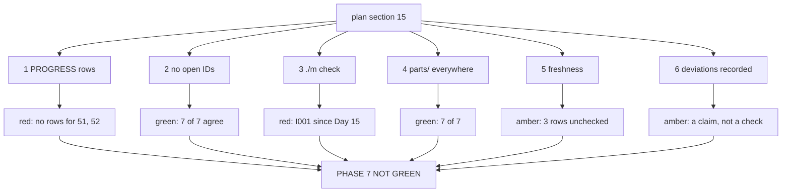

# 7.2 — Six conditions, and the one that is amber

## One-line answer

Plan section 15 lists six conditions for a green phase; on 2026-09-05 two hold, three do not, one is
in progress, and the honest verdict for Phase 7 is **not green** — which is a result, not a failure.

## The story

The school report comes home at the end of term. Eight subjects, eight boxes, eight grades.

Seven of them have a grade. The eighth has a line of small print: *"insufficient assessment — pupil
absent for the practical."*

There is a strong pull to read that as a formality and move on to the seven. The seven are good. The
eighth is not a bad grade, after all; it is not a grade at all, and a missing grade feels much less
like news than a poor one.

But the practical is the half of that subject where you find out whether somebody can actually do the
thing. Seven grades and a blank is not seven eighths of a report — it is a report with a hole in
exactly the place a report is for, and the only reason it does not feel that way is that a blank box
is quieter than a bad mark.

## The idea in plain language

Plan section 15 does not say "a phase is green when it feels finished". It says a phase is green when
**six specific things** are true, and it lists them:

| | The condition | Who can answer it |
| --- | --- | --- |
| 1 | Every day in the phase has its row in `docs/PROGRESS.md`, with gates green | a script |
| 2 | `scripts/trace.py` shows no open IDs from this or any earlier phase | a script |
| 3 | `./m check` passes on the whole repository | a script |
| 4 | Every day in the phase has a `parts/` directory | a script |
| 5 | The freshness check passes | a person, mostly |
| 6 | Any deviation is recorded — an ADR, or `docs/CHANGELOG_PLAN.md` | a person |

Four of the six are mechanical. That is a good ratio and it is not the whole story, because the two
that are not mechanical are the two that carry judgement, and judgement is what gets skipped when a
boundary is crossed at the end of a long week.

The word that makes this part work is **verdict**. A verdict is not a mood and it is not a summary.
It is one of three states per condition — green, red, or amber — with the evidence beside it, and a
single overall answer that follows from them by a rule stated in advance:

> **A phase is green when every condition is green. Anything else is not green.**

That rule is deliberately unforgiving, and the reason is that the alternative — "green with a couple
of caveats" — is the thing that has no definition. Two teams will read it two ways, and the phase
after it will be built on whichever reading was more convenient at the time.

One term, defined once: an **open ID** is a concept the plan's day map assigns to a day, that no
written day declares in its hub frontmatter. It is not a bug in the plan and it is not a bug in the
code; it is a statement that a piece of the curriculum has been promised and not yet delivered, and
condition 2 exists so that promise cannot quietly lapse.

## Why Sutra needs it

Phase 8's gate is *"triage graph v1 end-to-end"*. It will be checked by this same six-row list, with
the same rule, on Day 59.

If Phase 7 is declared green today on a mixture of measurements and hopes, then Phase 8's condition 2
— *no open IDs from this **or any earlier** phase* — inherits the hope. The list is cumulative by
design: a lapse here is a lapse that Day 59 has to either find or repeat, and by Day 65 nobody will
remember which phase it came from.

## The mechanism

Conditions 1 and 4 are two questions about the same seven day folders, and condition 2 is a
comparison between the plan's day map and what each hub declares. The script reads all three
directly:

```python
def hub_ids(day: int) -> tuple[str, list[str]] | None:
    """(folder name, ids) from the day's hub frontmatter, or None when the day is not written."""
    folders = sorted(DAYS.glob(f"day-{day:02d}-*"))
    if not folders:
        return None
    hub = folders[0] / "LESSON.md"
    if not hub.is_file():
        return folders[0].name, []
    head = hub.read_text(encoding="utf-8").split("\n---", 2)[0]
    line = re.search(r"^ids:\s*(.+)$", head, re.M)
    return folders[0].name, re.findall(r"[A-Z]{2,3}-\d+", line.group(1) if line else "")
```

**Line by line:**

- `DAYS.glob(f"day-{day:02d}-*")` resolves a day **by number**, accepting whatever slug follows. That
  is the plan's section 17.2 rule — the number is the identity and the slug is a label — and it is
  why a folder can be renamed to a better slug without breaking this check.
- It returns `None` for a day with no folder and `(name, [])` for a folder with no hub. Those are
  genuinely different situations: nobody has started, versus somebody has started and the hub is not
  written. Collapsing them into one would be
  [6.3](../06-failure-lab/6.3-green-because-nothing-existed.md)'s bug.
- `split("\n---", 2)[0]` takes only the frontmatter, so an `ids:` that appears in the body cannot be
  picked up by accident.
- `re.findall(r"[A-Z]{2,3}-\d+", ...)` reads identifiers out of whatever list syntax the frontmatter
  uses. The frontmatter is YAML-ish and parsed with a regular expression rather than a YAML library,
  which is how every tool in this repository reads it — no dependency, and the shape is fixed.

Run it:

```bash
cd days/day-52-memory-in-triage-flow/lab
uv run python ids.py
```

**Line by line:**

- `ids.py` parses Phase 7's rows out of the plan's day map — the authoritative list — and compares
  each against the corresponding hub.
- It prints one row per day of the phase whether it agrees or not, because a table of only the
  failures hides how much was checked.

Measured on 2026-09-05:

```text
 day  plan says                   hub declares                agrees
  46  ADK-27, ADK-28              ADK-27, ADK-28              True
  47  ADK-29                      ADK-29                      True
  48  AG-12, AG-13                AG-12, AG-13                True
  49  AG-33, ADK-30               AG-33, ADK-30               True
  50  AG-14                       AG-14                       True
  51  ADK-31, OPS-10              ADK-31, OPS-10              True
  52  AG-15                       AG-15                       True

days with no hub yet   none
open IDs               none

Every ID the plan assigns to this phase is declared by a written day.
```

Condition 2 is green, and the interesting part is that it was **red an hour earlier**. When this
script was first run, Day 51 had a `parts/` directory and no `LESSON.md` — a day in flight, where
the folder exists, the sections exist, and the hub that declares the IDs has not been written yet.
Its row read `-` under *hub declares*, `agrees` was `False`, and the open list was
`['ADK-31', 'OPS-10']`. Then Day 51's hub landed and the same command, unchanged, printed the block
above.

Nobody fixed anything. The repository moved, and the audit moved with it.

That is the whole argument for writing this criterion as *"run `ids.py` and read it"* rather than
*"open IDs must be zero"*. **A snapshot of a moving repository is what an ID audit is.** Written as
an assertion, it goes red on a Tuesday for a reason that has nothing to do with anybody's code —
someone is halfway through the next day — and a check that cries wolf on ordinary progress is a
check people learn to ignore. Written as *run it and read it*, the same output is information: it
tells you exactly which day is unfinished, which is a fact worth having rather than an alarm.

Now the six conditions, each with what was actually run:

| | Condition | Verdict on 2026-09-05 | Evidence |
| --- | --- | --- | --- |
| 1 | Rows in `PROGRESS.md`, gates green | 🔴 red | `grep -cE '^\| 5[12] ' docs/PROGRESS.md` returns `0`. Neither Day 51 nor Day 52 has a row; today's is in this day's §11 waiting to be pasted with its hash |
| 2 | No open IDs | 🟢 green | `ids.py`, above: seven of seven days agree with the plan, open list empty. It was red while Day 51's hub was unwritten |
| 3 | `./m check` passes | 🔴 red | `ruff check tests/` reports `I001 Import block is un-sorted or un-formatted` at `tests/test_persona.py:7`. Predates this day; the file last changed on Day 15 |
| 4 | Every day has `parts/` | 🟢 green | All seven of days 46–52 have one |
| 5 | The freshness check | 🟡 amber | [7.1](7.1-the-freshness-recheck.md): two rows green, three amber, one finding (`mcp` pinned with no ledger row) |
| 6 | Deviations recorded | 🟡 amber | No ADR or `CHANGELOG_PLAN.md` entry is required by anything in this phase, and none was written. That is a claim, not a check |

**Two green, two red, two amber. Phase 7 is not green**, and the sentence to write in the ledger is
that one rather than a summary of how much of it works.

Look at condition 3 for a moment, because it is the most instructive red on the list:

```text
I001 [*] Import block is un-sorted or un-formatted
  --> tests\test_persona.py:7:1
   |
 5 |   # Marked "live" so `pytest -m "not live"` (the default gate) skips it: it spends
 6 |   # quota, and a suite that silently makes network calls is a suite people stop running.
 7 | / import asyncio
 8 | |
 9 | | import pytest
10 | | import re
11 | | from sutra.desk.run_once import ask_with
12 | | from sutra.desk.agent import root_agent, INSTRUCTION
   | |____________________________________________________^
help: Organize imports
```

`import re` on line 10, in the middle of the third-party block, where it belongs in the standard
library block above. It has nothing whatever to do with memory, retrieval or Phase 7. It has been
red since Day 15, through Phase 6's gate and every day since, and `docs/PROGRESS.md` already carries
a note admitting that the ✅ marks written on days 16 to 22 were optimistic because of it.

That is worth sitting with. **A phase gate is cumulative**, so a lint failure in one file makes every
subsequent phase not-green until somebody runs one command. The command is
`uv run ruff check --fix tests/test_persona.py`, it takes a second, and the reason it has survived
five phases is that nobody's day was *about* it — which is precisely the class of thing a gate exists
to force into view.

It is not fixed here. `tests/` is the learner's own code and a generated day may not edit it, so this
day names it, puts it in the traps, and leaves the command.



## When it breaks

The way this list breaks is that **amber gets promoted to green by proximity**.

Look at the table again. One condition is green. If the four reds are worked through — the rows get
pasted, Day 51 lands, the lint is fixed — the table reads *five green, two amber*, and at that point
the pull to call it green is enormous. Five out of six! And the two ambers are "just" a couple of
provider pages nobody could open and a claim about ADRs that is almost certainly true.

The rule stated in advance is the only defence, and it has to be stated *in advance* because at that
moment it will feel pedantic. **Anything that is not green is not green.**

The second break is condition 6, which is the one with no mechanism at all. *"Any deviation is
recorded"* is checked by asking whether anybody remembers deviating. There is no script that can
find an ADR that was never written, because an unwritten ADR leaves nothing behind — which is
[6.3](../06-failure-lab/6.3-green-because-nothing-existed.md)'s shape wearing different clothes:
*did not deviate* and *deviated and did not record it* produce identical evidence.

The honest handling is what the table does: mark it amber, say *this is a claim rather than a check*,
and name who is making the claim. It never becomes green by being true; it becomes green by somebody
saying so, and the record should show that.

The third break produces a real error, and it is what happens when a day folder is renamed to a
better slug and something reads the slug instead of the number:

```text
Traceback (most recent call last):
  File "<string>", line 4, in <module>
FileNotFoundError: [Errno 2] No such file or directory: 'days/day-52-memory-in-the-triage-flow/LESSON.md'
```

One extra word — `in-the-triage-flow` against `in-triage-flow` — and a hard-coded path breaks. Every
tool in this repository resolves a day by **number** and accepts any slug, which is why `ids.py`
globs `day-{day:02d}-*` rather than joining a name. The plan's section 17.2 makes that a rule
precisely so a folder can be given a better name without a search-and-replace across five scripts.

## In production

**What a professional writes instead.** The six conditions are a single command with a table and an
exit code, run at the boundary and archived — not six commands somebody remembers to run in order.
The archive is the part people leave out and it is the part that pays: the value of a boundary report
is almost entirely in comparing it with the last one, and *"condition 3 has been red at every gate
since Phase 3"* is a much more actionable sentence than *"condition 3 is red"*.

**What degrades at scale.** Cumulative conditions get slower and more diluted. Condition 2 checks
every ID from every earlier phase, which is fine at fifty-two days and is a large table at
ninety-six. The report has to switch from listing everything to listing the **delta** — what changed
since the last boundary — or it becomes a wall nobody reads, and a wall nobody reads is functionally
identical to a check nobody runs.

**The failure mode that only appears with real traffic.** A boundary is crossed under pressure. Phase
8 starts because Phase 8's work is ready, not because Phase 7's report came back clean, and the
report arrives as an obstacle rather than as information. The only thing that survives that pressure
is a rule agreed before anyone was under it, plus the discipline of writing *not green* in a ledger
that a stranger will read six months later. Nobody has ever regretted the ledger entry that said what
was actually true.

**The review comment a senior engineer leaves:** *"Condition 3 has been red since Day 15 and every
gate since has either not noticed or noticed and moved on. That is not a lint problem, it is a
process problem — the gate found it and nothing forced it. Make the fix a blocking item on this
boundary rather than a trap note, and add the date the condition first went red to the report so the
next reviewer can see how long we have been carrying it."*

**The interview question:** *"What does 'the phase is done' mean on your project, concretely?"* An
honest answer: *"Six named conditions, checked one at a time, with a rule agreed in advance that
anything not green is not green. On my last boundary that gave me one green, three red and two amber,
so the phase was not green and the ledger says so. The most useful of the reds was a lint failure in
one test file that had been there for five phases and had nothing to do with the work — every gate
before had either missed it or quietly stepped over it. And I keep two of the six as amber rather
than green because they are claims rather than checks; a condition that can only be answered by
somebody remembering is a condition I want marked as such."*

## Check yourself

```bash
cd days/day-52-memory-in-triage-flow/lab
uv run python ids.py
grep -cE '^\| 5[12] ' ../../../docs/PROGRESS.md
```

Now go through the six conditions and write your own verdict for each, with the command you ran
beside it. Then apply the rule and write the one-word answer.

**Out loud, without scrolling up:** state the rule that turns six verdicts into one, and name the two
conditions that no script can answer.

**Next:** [7.3 — What Phase 8 inherits](7.3-what-phase-eight-inherits.md).
