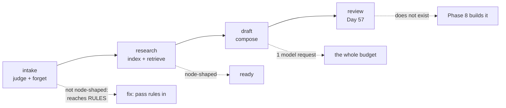

# 7.3 — What Phase 8 inherits

## One-line answer

Four of the six steps behind one answer already exist and none of them calls a model — but only two
of the four are shaped like a node, because the other two reach for a module-level dictionary
instead of taking it as an argument.

## The story

The shop shuts at six and you hand the keys to whoever opens tomorrow.

You do not hand over just the keys. You say the till float is short by four pounds and there is a
note about it in the book. You say the delivery is coming before ten and the driver needs somebody
who can sign. You say the freezer at the back is making a noise and you have not called anyone yet.

None of that is on any form. All of it is what makes the next shift possible, and the difference
between a handover and a key exchange is that a handover includes the things that are **not
finished**.

The temptation at the end of a shift is to hand over only what went well, because the rest feels
like admitting something. The freezer does not stop making the noise because nobody mentioned it.

## The idea in plain language

Tomorrow the desk stops being a function and becomes a **graph**.

Day 53 introduces the ADK's graph Workflow Runtime, which is the 2.x composition model: work is
nodes joined by edges, and an agent is one kind of node rather than the only thing there is. Plan
section 5.1 calls this trap number one — the 1.x habit of composing everything through `sub_agents`
trees, ported unchanged onto a runtime that no longer works that way. By Day 58 the triage flow is
five stages: intake, classify, research, draft, review.

**Research is this phase, wrapped in a node.**

So the question this part answers is not *"is Phase 7 finished?"* — [7.2](7.2-six-conditions-and-the-one-that-is-amber.md)
answered that. It is *"is Phase 7 in a shape the next phase can pick up?"*, and that has a concrete
technical meaning rather than a vague one.

A step can become a node when three things are true:

1. **Every value it needs arrives as a parameter.** Not read from a module, not from an environment
   variable, not from a global that something else set up first.
2. **Everything it produces is returned.** Not written into a shared structure the next step happens
   to read.
3. **Running it twice with the same input gives the same output.** No hidden accumulation between
   calls.

Those three together are what make a node **retryable**, **runnable beside another node**, and
**resumable after a crash** — which are, in order, Day 54's subject, Day 54's other subject, and the
whole of Phase 9.

A step that fails them is not broken. It works perfectly as part of a function. It simply cannot be
lifted out and dropped into a runtime that may call it twice, in parallel, in a different process,
after a restart.

One term, defined once: a **pure step**, in this narrow sense, is one whose inputs all arrive as
arguments. Reading a module-level *constant* is fine — a constant is configuration, and Day 50's
tuned numbers are exactly that. Reading or writing a module-level *mutable* is not, because the
value depends on what ran before, and a node has no way to know what ran before.

## Why Sutra needs it

Day 60 is durable execution: resume, replay, idempotency. Day 61 is checkpoints. Both mean stopping
a graph in the middle and starting it again from something written down.

A node that reaches for module state cannot be resumed, because the state it reached for is in a
process that no longer exists. Finding that out on Day 60, with a graph already built on top of it,
is an expensive way to learn something a fifteen-line check finds today.

## The mechanism

The check reads each step's source and asks what it reaches for:

```python
MUTABLE_GLOBALS = {"RULES"}


def node_shaped(function) -> tuple[bool, str]:
    """Whether a function's inputs all arrive as arguments, and what it reaches for if not."""
    source = inspect.getsource(function)
    reached = sorted(
        name for name in MUTABLE_GLOBALS if f"{name}[" in source or f"{name}." in source
    )
    if reached:
        return False, f"reaches module-level {', '.join(reached)}"
    return True, "every input arrives as an argument"
```

**Line by line:**

- `MUTABLE_GLOBALS` is an explicit list, not everything the module defines. `CHUNK_SIZE` and
  `SIM_FLOOR` are module-level too and they are *constants*, which a node may read freely; the
  distinction is mutability, and no tool can infer it, so a person writes it down.
- The test is textual — `RULES[` or `RULES.` in the source — which is crude and honest about being
  crude. A proper version walks the abstract syntax tree, and would be the right thing in `./m
  check`. For a boundary report, a check that can be read in six lines and is obviously conservative
  is more useful than one nobody audits.
- It returns `(bool, reason)` rather than a bare boolean, so the report says *what* was reached
  rather than only that something was. A finding that costs the reader a search is half a finding.

Run it:

```bash
cd days/day-52-memory-in-triage-flow/lab
uv run python handover.py
```

**Line by line:**

- `handover.py` names the four steps behind one answer, in the order they run, and pairs each with
  the Day 58 stage that will wrap it.
- It then runs one real question end to end and prints the numbers Phase 8 will have to carry across
  a node boundary.

Measured on 2026-09-05:

```text
step        phase 8 node  node-shaped  why
judge       intake        False        reaches module-level RULES
forget      intake        False        reaches module-level RULES
index       research      True         every input arrives as an argument
retrieve    research      True         every input arrives as an argument

one answer, in numbers Phase 8 will have to carry
  memos live            4
  index rows            65
  rows retrieved        2
  model requests        1
  citations             memo:7101:resolution:signed-out-of-the-dashboard#0, ticket:4521#0
```

**Two of four.** The read path is node-shaped and the write path is not.

That split is not an accident and it is worth understanding rather than fixing reflexively.
`desk_index` and `retrieve` take everything they need — rows, a question, a `k` — and return a value.
They could be called from another process tomorrow with no setup at all.

`what_to_keep` and `what_to_forget` both do `RULES[memo.rule]`, reaching into a module-level
dictionary. Today that dictionary is built once from `RETENTION` and never changed, so in practice
the functions are pure. But *in practice* is doing a lot of work in that sentence, and
[3.2](../03-the-write-path/3.2-every-memo-names-the-rule-that-kept-it.md)'s `--unruled` run is the
proof: it adds a `hunch` row to `RULES` at runtime and the policy's behaviour changes without a
single argument changing. A function whose result can be altered by something else mutating a module
is not a function you can safely retry.

The fix is one parameter — `what_to_keep(candidates, *, today, rules=RULES)` — and it is deliberately
**not** applied here. It belongs to whoever writes `sutra/memory/policy.py`, and it is in the hub's
build brief as a `TODO(me)`. A gate reports; it does not quietly repair the thing it is reporting on,
because a repaired finding is a finding nobody learns from.

Now the graph itself:

```bash
uv run python handover.py --trace
```

**Line by line:**

- `--trace` prints the same answer as a sequence of stages with their inputs and outputs, in Day 58's
  vocabulary rather than in this lab's.

```text
the same answer as a graph
  intake    conversations       -> candidates
  intake    candidates          -> memos + refusals
  research  memos + archive     -> index
  research  index + question    -> scored rows
  draft     scored rows         -> an answer with citations   <- the one model request
  review                        -> nothing yet: Phase 8 builds it

Four of the six exist today and none of them calls a model. The fifth is the request
this phase spent its whole budget on. The sixth is why Phase 8 is a phase.
```

Read the last two lines of the graph.

**`draft` is the only stage that costs anything.** Every arrow above it is arithmetic. That is the
budget shape Phase 8 inherits, and it is why [5.3](../05-the-zero-claim/5.3-what-a-cache-can-and-cannot-reach.md)'s
cacheability arithmetic matters more than it looks: the desk's entire provider cost is concentrated
in one node, and everything Phase 7 did was to make the *input* to that node better.

**`review` does not exist.** There is nothing today that reads a draft and says whether it is
supported by the rows it cites. [2.2](../02-the-run/2.2-an-answer-that-names-its-source.md) built the
citation — the address a reviewer would follow — and stopped there, deliberately, because checking
that a claim matches its source needs a second agent. That is Day 57's Writer↔Critic pair, and the
citation is the interface it attaches to.



## When it breaks

The break this check is written to prevent arrives on Day 60, and it looks like a bug in the graph
runtime.

A node is retried after a failure. It runs a second time, in the same process, and produces a
different answer — because between the two runs something mutated the module-level dictionary it
reads. The person debugging it will look at the runtime, at the retry policy, and at the node's
inputs, all of which are identical, and will conclude the framework is doing something strange.

The version with an error is easier and you can reach it now:

```text
Traceback (most recent call last):
  File "<string>", line 6, in <module>
  File ".../day-52-memory-in-triage-flow/lab/_phase7.py", line 213, in what_to_forget
    rule = RULES[memo.rule]
           ~~~~~^^^^^^^^^^^
KeyError: 'hunch'
```

That is the write path handed a memo whose rule is not in `RULES`. In one process it cannot happen,
because the only thing producing memos is `what_to_keep`, which refuses unknown kinds. Across a node
boundary it can: a memo serialised by one version of the policy, resumed by another, in a process
whose `RULES` was built from a different `RETENTION`. The `KeyError` is the good outcome. The bad one
is a rule that exists in both versions with different values, which raises nothing.

The second break has no error at all and is the reason the third condition — same input, same
output — is in the list. Nothing in this phase accumulates between calls today. The moment somebody
adds a cache to the index build, or a counter, or memoises `retrieve`, the second call differs from
the first and a retried node silently stops being a retry.

## In production

**What a professional writes instead.** The check is not a script in a lab; it is a lint rule in
`./m check`, written against the abstract syntax tree rather than against the source text, and it
runs on every commit. The reason is that node-shapedness is not a property you establish once at a
boundary — it is a property that decays with every convenience somebody adds, and the convenience
always looks harmless at the moment it is added.

**What degrades at scale.** The numbers this handover carries — four memos, sixty-five rows, two rows
retrieved, one model request — all cross a node boundary in Phase 8, which means they have to be
**serialised**. An index of sixty-five rows is a small object; an index of a million is not, and it
cannot be passed between nodes as a value at all. At that point the research node stops taking an
index and starts taking a *handle* to one, which is exactly the pattern Day 36 established for MCP
long jobs: state travels in the payload as an explicit handle rather than as the thing itself.

**The failure mode that only appears with real traffic.** Parallel nodes share what they reach for.
Two research nodes running side by side on one process share `RULES`, share any module-level cache,
and share the index object. Today that is safe because nothing writes to any of them. It is safe by
accident rather than by design, and the first person to add a write will not know that the safety
was accidental, because nothing in the code says so.

**The review comment a senior engineer leaves:** *"Two of your four steps read a module-level dict.
Pass it in — one keyword argument with a default, no call sites change — before Day 58 wraps them in
nodes. And write down that the index is passed by value today, because that assumption dies at the
first real corpus and I would rather it died in a design note than in a serialisation error."*

**The interview question:** *"You are moving a working pipeline into a workflow engine. What do you
check first?"* An honest answer: *"Whether each step's inputs all arrive as arguments, because that is
what decides whether the engine can retry it, parallelise it or resume it. I ran that check on my own
pipeline and two of four steps failed — both policy functions reach a module-level rules dictionary,
so in a single process they behave like pure functions and across a node boundary they do not. The
fix is one keyword argument. The thing I would flag beyond that is that my index is passed between
steps as a value, which is fine at sixty-five rows and is not fine at a million; that becomes a
handle."*

## Check yourself

```bash
cd days/day-52-memory-in-triage-flow/lab
uv run python handover.py
uv run python handover.py --trace
```

Now write the one-line signature change that would make `what_to_keep` node-shaped, and say what has
to be true of the default value for no call site to need editing.

**Out loud, without scrolling up:** give the three conditions a step must meet to become a node, and
say which one this phase's write path fails and why it does not matter yet.

**Papers.** This day teaches no paper of its own. The four it leans on were each taught earlier and
are worth re-reading now that the whole phase runs end to end:
[Generative Agents](../../../day-46-sessions-vs-memory/papers/01-generative-agents.md) (Day 46),
[Principles of transaction-oriented database recovery](../../../day-47-persistent-sessions/papers/01-transaction-oriented-recovery.md)
(Day 47),
[A vector space model for automatic indexing](../../../day-49-retrieval-and-embeddings/papers/01-vector-space-model.md)
and
[Retrieval-Augmented Generation for Knowledge-Intensive NLP Tasks](../../../day-49-retrieval-and-embeddings/papers/02-retrieval-augmented-generation.md)
(Day 49).

**Next:** Day 53 — the graph Workflow Runtime, where the four steps above become nodes.
