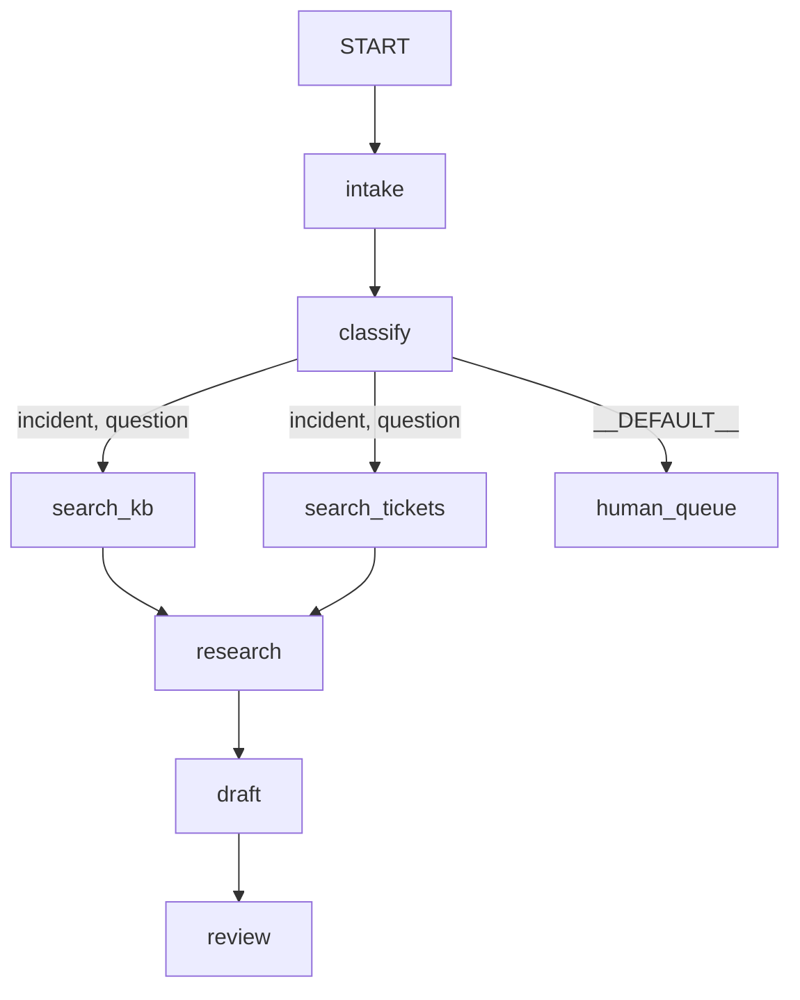

# Day 53 — The graph Workflow Runtime: nodes, edges, and the 2.x composition model

> **Yesterday (Day 52):** the Phase 7 gate. Memory was wired into the triage flow and the desk could
> finally answer *"have we seen anything like this before?"* at $0 — retrieval, chunking, top-k and
> caching all working behind one call.
> **Today:** Phase 8 opens, and the subject is how the pieces are *assembled*. A node is one step. An
> edge is what happens next. Together they are the composition layer that replaced the agent tree —
> **trap #1** — and by the end of the day a nine-node triage graph runs three different tickets down
> three different paths for **zero model calls**.
> **Tomorrow (Day 54):** sequential, parallel and loop patterns — which, because today establishes
> that a chain is sugar over edges, are three shapes of one thing rather than three APIs.

---

## §1 Where we are

Phase 7 gave the desk a memory. It can retrieve, it can rank, it can decide when not to bother. What it
still does not have is a *process* — a way of saying that a ticket is read, then classified, then
researched, then drafted, then reviewed, and that some tickets skip most of that and go to a person.

Think about how any office you have walked into actually handles a form. There are desks, and each desk
does one thing, and at the bottom of the paper somebody writes where it goes next. Nobody at any desk
knows the whole process. The form knows, because the route is written on it.

That is the shape of what you build today, and it is a genuine change from where ADK started. In 1.x
you composed agents by putting them *inside* other agents — a tree, where every agent has one parent
and the composition lives in the nesting. In 2.x the composition is a **list of edges**, separate from
the nodes, and the difference is not stylistic. A tree cannot express two branches arriving at the same
desk; try to put one agent under two parents and the framework says so in as many words:

> *Agent `classify` already has a parent agent, current parent: `incident_flow`, trying to add:
> `billing_flow`*

A graph can. And because the wiring is a list rather than a nesting, it is **data** — so the framework
can check it before anything runs, and so can you:



That picture was not drawn. It was printed by `shape.py`, which reads the graph object — so it cannot
be out of date, which is more than can be said for most diagrams in most documents.

The day ends where every honest day ends: with the failure. Two one-line mistakes produce a graph that
validates, runs, exits 0 and does **half the work** — two events where there should be five, with no
exception anywhere. Exit code zero means nothing raised. It does not mean the work was done.

## §2 The map

Six sections. Section 1 is **what a node is** — ADK-32, and the surprise is how little it means.
Section 2 is **what an edge is** — ADK-33, including the routing that makes branches possible.
Section 3 is **what the framework checks for you**, and precisely what it cannot. Section 4 is
**ADK-34, the composition model itself**, and the trap #1 material: why a graph and not a tree, and how
to read the 1.x snippets you will keep finding. Section 5 **assembles the triage skeleton and then
breaks it**. Section 6 is the production face: exceptions, and reviewability.

### Section 1 — the node (ADK-32)

*A node is one step of work with a name. That is all it is, and that is the point.*

| # | Part | What it answers | Level |
| --- | --- | --- | --- |
| 1.1 | [A node is a unit of work, not a unit of intelligence](parts/01-the-node/1.1-a-node-is-a-unit-of-work.md) | What is a node, and why is a two-line function one? | foundation |
| 1.2 | [The four things that can be a node](parts/01-the-node/1.2-the-four-things-that-can-be-a-node.md) | Function, agent, join, whole workflow — all `BaseNode` | foundation |
| 1.3 | [What arrives at a node](parts/01-the-node/1.3-what-arrives-at-a-node.md) | `node_input` from the edge, `ctx.state` from the session | working |
| 1.4 | [What leaves a node](parts/01-the-node/1.4-what-leaves-a-node.md) | `output` travels, `message` is shown, `route` steers | working |
| 1.5 | [Say it as you go, never collect and return](parts/01-the-node/1.5-say-it-as-you-go.md) | Trap #3, measured: 0.41s to first event against 1.24s | working |

### Section 2 — the edge (ADK-33)

*An edge is a written-down promise about what happens next. Because it is written down, it is data.*

| # | Part | What it answers | Level |
| --- | --- | --- | --- |
| 2.1 | [An edge is what happens next](parts/02-the-edge/2.1-an-edge-is-what-happens-next.md) | Why the wiring lives outside the nodes | foundation |
| 2.2 | [The chain that is a list of edges](parts/02-the-edge/2.2-the-chain-that-is-a-list-of-edges.md) | The tuple is sugar — proved by comparing both graphs | working |
| 2.3 | [A label, not an address](parts/02-the-edge/2.3-a-label-not-an-address.md) | Routes, `DEFAULT_ROUTE`, and the branch that ends silently | working |
| 2.4 | [Two shops at once, and the wait at the door](parts/02-the-edge/2.4-two-shops-at-once.md) | Fan-out and `JoinNode`: 0.45s against 0.84s | working |
| 2.5 | [On the edge or in the register](parts/02-the-edge/2.5-on-the-edge-or-in-the-register.md) | When to use `node_input` and when to use state | working |

### Section 3 — the graph is checked

*Nine checks run when you construct the workflow. Knowing what they cover is as useful as knowing what
they catch.*

| # | Part | What it answers | Level |
| --- | --- | --- | --- |
| 3.1 | [Tested before the mains go on](parts/03-the-graph-is-checked/3.1-tested-before-the-mains-go-on.md) | Six validation errors, verbatim, before anything runs | working |
| 3.2 | [Both waiting for the other to leave](parts/03-the-graph-is-checked/3.2-both-waiting-for-the-other-to-leave.md) | Why every cycle needs a routed edge | working |
| 3.3 | [The switch that turns nothing on](parts/03-the-graph-is-checked/3.3-the-switch-that-turns-nothing-on.md) | Half-wired is caught; not wired at all is invisible | working |

### Section 4 — the composition model (ADK-34, trap #1)

*The day's centre. Why the graph replaced the tree, how to port 1.x material, and what you get once the
flow is data.*

| # | Part | What it answers | Level |
| --- | --- | --- | --- |
| 4.1 | [One secretary, or one register](parts/04-composition/4.1-one-secretary-or-one-register.md) | One parent in a tree; many edges in a graph — measured | working |
| 4.2 | [The textbook with the wrong edition](parts/04-composition/4.2-the-textbook-with-the-wrong-edition.md) | Reading a 1.x snippet and writing the graph it becomes | production |
| 4.3 | [The bus pass with a date on it](parts/04-composition/4.3-the-bus-pass-with-a-date-on-it.md) | The three deprecated workflow agents, and why you may never see the warning | production |
| 4.4 | [The floor plan by the lift](parts/04-composition/4.4-the-floor-plan-by-the-lift.md) | The graph is data: count it, diagram it, assert on it | production |

### Section 5 — the first real graph

*Everything assembled, then deliberately broken.*

| # | Part | What it answers | Level |
| --- | --- | --- | --- |
| 5.1 | [Five desks, one form](parts/05-the-first-graph/5.1-five-desks-one-form.md) | Nine nodes, three tickets, three paths, zero model calls | working |
| 5.2 | [The cycle that finished early](parts/05-the-first-graph/5.2-the-cycle-that-finished-early.md) | **The failure lab**: two events instead of five, exit 0 | production |

### Section 6 — in production

| # | Part | What it answers | Level |
| --- | --- | --- | --- |
| 6.1 | [The whistle that was taken off](parts/06-in-production/6.1-the-whistle-that-was-taken-off.md) | Trap #4: raise, retry, timeout — and what swallowing costs | production |
| 6.2 | [The labelled fuse box](parts/06-in-production/6.2-the-labelled-fuse-box.md) | Reviewing a graph from four numbers | production |

### Papers — read after the parts

*Principle 4 at the scale of a day: build the mechanism by hand, then read the proposal.*

| # | Paper | Why it is here |
| --- | --- | --- |
| 01 | [Dryad — the job is a graph, and the graph is the program](papers/01-dryad.md) | `doi:10.1145/1272998.1273005` — where "the job is a DAG of sequential vertices" comes from, and which half of it the field dropped |

## §3 Setup — run this

```bash
mkdir -p days/day-53-graph-workflow-runtime/lab/papers/dryad
cd days/day-53-graph-workflow-runtime/lab
touch _run.py unit.py kinds.py arrives.py leaves.py stream.py edges.py routes.py \
      fanout.py carry.py validate.py cycle.py orphan.py legacy.py hidden.py \
      _deprecated_caller.py tree.py triage.py shape.py halfway.py boom.py gate.py
touch papers/dryad/dag.py papers/dryad/job.py
```

**No package is added today.** `google-adk==2.7.1` is already pinned from Day 5 and re-verified on Day
9; `docs/PACKAGES.md` has its dated row and gains no new one. Confirm the version you are actually
running before you start:

```bash
uv run python -c "import google.adk; print(google.adk.__version__)"
uv run python -c "from google.adk.workflow import Workflow, node, Edge, START, JoinNode, DEFAULT_ROUTE; print('ok')"
```

Both were run on 2026-09-05 and printed `2.7.1` and `ok`.

`git diff pyproject.toml uv.lock` must be empty today and stay empty.

## §4 Build brief

Create `sutra/graph.py`. It is the first file in Sutra's own package that composes rather than
computes, and Days 54 through 70 all edit it.

```python
# sutra/graph.py
"""The triage graph. Nodes come from elsewhere; this file is wiring and nothing else."""

ANSWERABLE = ...  # TODO(me): the labels that get researched. A StrEnum, not string literals.


def build_triage_graph() -> Workflow:
    """Return the triage graph. A function, not a module-level graph - see part 3.1."""
    # TODO(me): intake -> classify, then routed edges to both searches, then the join,
    #           then draft -> review. Plus a DEFAULT_ROUTE to a human queue.
    ...


def graph_report(flow: Workflow) -> dict[str, int | list[str]]:
    """The four review numbers from part 6.2, as data a test can assert on."""
    # TODO(me): nodes, edges, routed edges, DEFAULT_ROUTE count, terminal node names.
    ...
```

**What each piece is for:**

- `build_triage_graph()` is a function so a validation error surfaces at the call site rather than as
  an import error (part 3.1). Every test builds a fresh graph.
- `ANSWERABLE` as a `StrEnum` means the classifier and the edge list cannot disagree about spelling —
  the failure measured in part 5.2.
- `graph_report` exists so the shape can be asserted on rather than admired (part 6.2).
- The nodes themselves are **not** in this file. Where they live is your call; keeping wiring separate
  from node bodies is what stays readable at thirty nodes.

Then `tests/test_graph.py`, with at least: the graph builds; the five stages are present; there is a
`DEFAULT_ROUTE`; an incident reaches `review`; and one test you break on purpose and watch go red.

## §5 The eval that must be able to fail

```bash
uv run python days/day-53-graph-workflow-runtime/lab/gate.py; echo "exit: $?"
```

Run it **now, before writing anything.** Measured on 2026-09-05:

```text
  FAIL  sutra.graph imports                  ModuleNotFoundError: No module named 'sutra.graph'
  FAIL  build_triage_graph exists            ModuleNotFoundError: No module named 'sutra.graph'
  FAIL  five stages are nodes                ModuleNotFoundError: No module named 'sutra.graph'
  FAIL  a DEFAULT_ROUTE catches the rest     ModuleNotFoundError: No module named 'sutra.graph'
  FAIL  no node is unreachable               ModuleNotFoundError: No module named 'sutra.graph'

  0/5 checks pass
exit: 1
```

Five checks, five failures, exit 1. Each one is a sentence from a part, checked rather than believed:
the stages are nodes (1.1), the default route exists (2.3), and nothing is unreachable (3.3). The day
is done when this exits 0 — and it goes red again the moment somebody adds a node without wiring it.

## §6 Request budget

| Provider | Requests today |
| --- | --- |
| Gemini (`GOOGLE_API_KEY`) | **0** |
| Groq | **0** |
| OpenRouter | **0** |
| Ollama | **0** |

Zero, deliberately, and it is not a limitation of the exercise. Every node today is a plain Python
function, because the graph runtime is a **scheduler** and a scheduler can be watched without paying
for a single token. Two agents are constructed in `kinds.py` and `legacy.py` to show that an `LlmAgent`
is a `BaseNode` and that the old classes warn — construction sends nothing.

Day 58 puts models in `classify` and `draft`, and the arithmetic then becomes two requests per ticket
against a free-tier per-minute quota. The reason to notice today is part 1.1's: seven of the nine nodes
never need a model, and that is a design decision made now.

## §7 Traps

1. **Trap #1 — the node model** (plan §5.1). The graph is the composition layer; an agent is one node
   type. The half-port — wrapping a `SequentialAgent` in a `Workflow` — runs and is still a tree
   (4.2).
2. **Trap #3 — yield, don't append.** A node that buffers events emits nothing until it is finished and
   corrupts the ordering of a trace (1.5).
3. **Trap #4 — don't swallow exceptions.** A node that catches and returns a string has *succeeded*, so
   it is never retried, its trace span is green, and the string is fed into the next node's prompt
   (6.1).
4. **A parameter not called `node_input` is looked up in state, not on the edge.** The error says
   *"not found in state"*, which is the clue (1.1, 1.3).
5. **An edge is identified by its endpoints, not its route.** Two routes to one node is a duplicate
   edge; use `route=["a", "b"]` on a single `Edge` (2.2).
6. **A route that matches no edge ends the branch.** No exception, exit 0, one log warning (2.3, 5.2).
7. **A `JoinNode` waits for every predecessor.** Reach it down a route that triggers only one and
   nothing after it runs — and there is not even a warning (2.4, 5.2).
8. **An ordinary node with two incoming edges runs twice**, once per trigger. Two drafts, one customer
   (2.4).
9. **A node that returns `None` emits no event at all** and does not stop the run (1.4).
10. **A node may emit exactly one `output`.** A second raises `ValueError: Output already set` (1.5).
11. **`DeprecationWarning` is hidden by default** outside `__main__`, and reported once per location.
    "We saw no warnings" usually means nobody configured warnings (4.3).

## §8 Verify before you code

Fetched on **2026-09-05**, and every API claim in this day is checked against them plus the installed
`google-adk==2.7.1`:

- <https://adk.dev/graphs/> — graph-based workflows: `Workflow`, edges as tuples, nodes
- <https://adk.dev/graphs/routes/> — conditional routing, `Event(route=...)`, `DEFAULT_ROUTE`
- <https://adk.dev/graphs/data-handling/> — `node_input`, `output`, `message`, `ctx.state`, schemas
- <https://adk.dev/2.0/> — the 1.x → 2.0 migration: "from a hierarchical agent executor to a
  graph-based execution engine"; `SequentialAgent`/`ParallelAgent`/`LoopAgent` deprecation; the new
  `node_info` and `output` event fields
- `https://api.crossref.org/works/10.1145/1272998.1273005` — the Dryad record, for the title copied
  into `docs/PAPERS.md`

Note one disagreement worth recording rather than hiding: the plan's §5 baseline says `google-adk`
**2.6.3**, and the repo pins **2.7.1** (Day 5's `PACKAGES.md` row). Every symbol this day uses was
verified against the installed 2.7.1. No amendment is needed — a patch ahead of the baseline is what
Principle 7 expects — but the day states the version it actually checked.

## §9 Say it in an interview

*"ADK 2.0 moved composition from agent trees to a graph. In 1.x you nested agents in `sub_agents`, so
every agent had exactly one parent — put the same agent object under two parents and it raises
`already has a parent agent`, which means two branches cannot converge on one step and you end up with
two copies that drift apart. In 2.x the composition is a list of edges: a node is reached by however
many edges point at it, so a merge is just two edges into one object, and sequence, fan-out and loop
stopped being three special agent classes and became three shapes of edges. The practical payoff is
that the flow is data — the framework validates reachability, duplicate edges and unroutable cycles
before anything runs, and I generate the architecture diagram straight from `graph.edges` so it cannot
go stale.*

*What I would warn someone about is what validation does not cover. My graph built cleanly and did half
the work: the classifier emitted `INCIDENT` and the edge said `incident`, so the branch ended after one
node — exit code zero, one line in the log. The nastier one is a join node, because it waits for all
its predecessors, so a conditional route that triggers only one of them means the join never fires and
everything downstream is silently skipped, with no warning at all. Two events where there should have
been five. So I assert that a run reached a terminal node rather than trusting the exit code, and every
routing node gets a default edge to a human queue with a counter on it."*

## §10 Done when

See [`CHECKLIST.md`](CHECKLIST.md). The day is done when every box is ticked, `gate.py` exits 0, and
`./m depth 53` is green — not when you have read to the bottom of this page.

## §11 Ledger & commit

`docs/PROGRESS.md` — append:

```text
| 53 | 2026-09-05 | ADK-32, ADK-33, ADK-34 | 21 (+1 paper) | <hash> | ⚠️ |
```

`docs/PACKAGES.md` — **no new row.** `google-adk==2.7.1` was pinned on Day 5 and is unchanged; the
version was re-verified today with `uv run python -c "import google.adk; print(google.adk.__version__)"`.

`docs/PAPERS.md` — appended:

```text
| Dryad: distributed data-parallel programs from sequential building blocks | doi:10.1145/1272998.1273005 | 2007 | 2026-09-05 | 53 | `days/day-53-graph-workflow-runtime/papers/01-dryad.md` |
```

`docs/SKILL_PROVENANCE.md` — no row. No third-party skill was used today.

Commit:

```text
day 53: the graph Workflow Runtime - nodes, edges, the 2.x composition model - closes ADK-32, ADK-33, ADK-34
```
