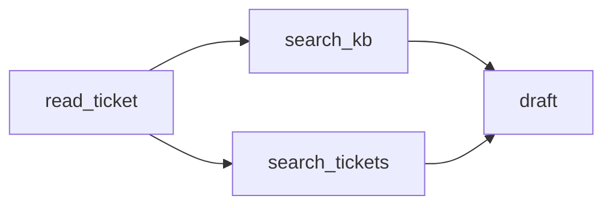

# Dryad — the job is a graph, and the graph is the program

**Dryad: distributed data-parallel programs from sequential building blocks** ·
`doi:10.1145/1272998.1273005` · 2007 · ACM SIGOPS Operating Systems Review 41(3), pages 59–72 ·
<https://doi.org/10.1145/1272998.1273005>

Verified against the Crossref record on 2026-09-05
(`curl -s https://api.crossref.org/works/10.1145/1272998.1273005`), which gives the title as *Dryad*
with the subtitle *distributed data-parallel programs from sequential building blocks*.

## One-line answer

It argued that a distributed job should be written as a **directed acyclic graph whose vertices are
ordinary sequential programs and whose edges are channels**, so that the programmer never writes
concurrency code and the *graph* — a first-class object the program builds — is what expresses
dependency and parallelism.

## The story

Somebody has a large amount of data and a machine that cannot hold it.

They know exactly what they want to do with it. It is not a hard calculation: read each record, keep
the ones that match, count them by category, sort the counts. On one machine, with a small enough file,
it is an afternoon and forty lines.

On fifty machines it becomes a different kind of problem, and none of the new difficulty is about the
calculation. Which machine has which piece. What happens when one of them is slow. What happens when
one of them dies halfway — do you start again, or can you redo just that piece? How does the counting
machine know that all the filtering machines have finished, and not merely that the ones it has heard
from have finished?

So the forty lines become two thousand, and roughly thirty of those are the original calculation. The
rest is coordination, and every person doing this writes it again, and every one of them writes it
slightly wrong in a way that appears only under load.

That was the state of things this document was written into: the useful part of the program was a
rounding error in the program.

## The idea in plain language

The proposal has two halves and the second is the one that matters here.

**First half: write the job as a graph.** A **vertex** is an ordinary program — sequential,
single-threaded, no coordination code in it at all. An **edge** is a **channel**: the output of one
vertex becomes the input of another. The whole job is a **directed acyclic graph** of these — directed
because data flows one way, acyclic because there are no loops.

**Second half: the graph is an object the program builds.** This is the part that separates the paper
from "draw a diagram of your pipeline". The job graph is constructed **programmatically**, at run time,
by a program that can compute how many vertices to make and how to connect them. The graph is data
before it is a computation.

The consequences the paper draws out:

- **Concurrency is a property of the shape, not of the code.** Two vertices with no path between them
  can run at the same time. Nobody wrote a thread. The scheduler reads the graph and knows.
- **The scheduler can be clever because the graph is explicit.** It knows what depends on what, so it
  can place a vertex near its data, re-run a failed vertex without re-running the job, and start a
  duplicate of a straggler.
- **The programmer's code stays sequential and therefore stays testable.** A vertex is a function you
  can call.

Two terms defined, since both are used loosely elsewhere:

- **Directed acyclic graph (DAG)**: a set of nodes and one-way connections with no way to return to
  where you started. "Acyclic" is what makes "run each vertex once, after its inputs" a well-defined
  instruction.
- **Data-parallel**: the same operation applied to many pieces of data at once. It is the kind of
  parallelism a graph expresses naturally, because "the same vertex, many times, on different shards"
  is just many vertices.

## Why Sutra needs it

Read [4.1](../parts/04-composition/4.1-one-secretary-or-one-register.md) and this paper's abstract
together and the resemblance is not subtle. ADK 2.x's Workflow Runtime is a graph of nodes and edges
in which nodes are ordinary functions and agents, edges carry outputs to inputs, the framework
schedules a node when its inputs are ready, and the graph is a **first-class object** you can read,
count and diagram ([4.4](../parts/04-composition/4.4-the-floor-plan-by-the-lift.md)).

The specific inheritance is the one this day exists to teach. Trap #1 is a move from *composition by
nesting* to *composition by graph*, and the argument for it is nineteen years older than ADK: a graph
can express a merge and a tree cannot, and when the graph is an object, tools can read it.

Knowing the lineage is also what stops you over-reading the resemblance —
*When it breaks* below is where the two part company.

## The mechanism

The paper's method, at the level the rest of this day is written at.

**A job is a graph the program constructs.** Not a configuration file and not the order of statements.
The program computes the graph — for a hundred input files it makes a hundred vertices — and hands it
to the runtime.

**A vertex is a sequential program.** It reads from its input channels, writes to its output channels,
and contains no coordination. This is the constraint that buys everything else: because a vertex cannot
coordinate, the runtime is free to run it whenever, wherever, and more than once.

**An edge is a channel.** In Dryad a channel could be a temporary file, a pipe or a network connection,
and — importantly — that choice is the *runtime's*, not the programmer's. The program says "these are
connected"; the system decides how.

**The runtime schedules from the graph.** A vertex becomes runnable when its inputs exist. Independent
vertices therefore run concurrently with nobody having asked for it.

**Failure is a re-run of one vertex.** Because a vertex is deterministic and its inputs are recorded on
channels, a failed vertex can simply be run again. That is the property that makes a large job
survivable, and it is the same reasoning Day 60 will apply to resuming an agent run.

The scheduling rule in one line, which is the whole method:



`search_kb` and `search_tickets` both depend on `read_ticket` and not on each other, so they run
together. `draft` depends on both, so it waits. Nobody wrote that; it is read off the picture.

## The paper in one demo

The claim to demonstrate is exactly one thing: **scheduling from the graph produces concurrency that
nobody wrote, and the vertices stay sequential.**

So the demo is a DAG scheduler and a job. Two files, no framework, no ADK — the paper predates all of
it, and including ADK here would prove that ADK works rather than that this idea does.

```text
days/day-53-graph-workflow-runtime/lab/papers/dryad/
├── dag.py    # the scheduler - the paper's contribution
└── job.py    # four vertices and four edges, and the command
```

`dag.py`:

```python
"""The paper's contribution, and nothing else: run a DAG of sequential vertices."""

from __future__ import annotations

import asyncio
from collections.abc import Awaitable, Callable

Vertex = Callable[..., Awaitable[object]]


async def run_dag(
    vertices: dict[str, Vertex],
    edges: dict[str, list[str]],
    *,
    concurrent: bool = True,
) -> dict[str, object]:
    """Run every vertex once, each after its predecessors. Returns name -> output."""
    pending: dict[str, asyncio.Task] = {}

    async def result_of(name: str) -> object:
        if name not in pending:
            pending[name] = asyncio.create_task(execute(name))
        return await pending[name]

    async def execute(name: str) -> object:
        parents = edges.get(name, [])
        if concurrent:
            # THE PAPER: independent predecessors are awaited together, so they overlap.
            inputs = await asyncio.gather(*(result_of(p) for p in parents))
        else:
            # THE ABLATION: identical results, strictly one at a time.
            inputs = [await result_of(p) for p in parents]
        return await vertices[name](*inputs)

    if concurrent:
        outputs = await asyncio.gather(*(result_of(name) for name in vertices))
    else:
        outputs = [await result_of(name) for name in vertices]
    return dict(zip(vertices, outputs))
```

**Line by line:**

- `vertices: dict[str, Vertex]` and `edges: dict[str, list[str]]` — the graph as data, which is the
  paper's second half. `edges[name]` lists the vertices `name` depends on.
- `pending: dict[str, asyncio.Task]` memoises by name, so a vertex with two dependants runs **once**.
  Without this, a diamond-shaped graph would run its top vertex twice — the same guarantee a
  `JoinNode` gives in [2.4](../parts/02-the-edge/2.4-two-shops-at-once.md).
- `asyncio.create_task(...)` starts the vertex immediately rather than when it is awaited. This is the
  line that makes overlap possible at all.
- `await asyncio.gather(*(result_of(p) for p in parents))` — **the paper**. Every predecessor is
  started before any is waited on, so independent ones overlap.
- `inputs = [await result_of(p) for p in parents]` — **the ablation**. Each predecessor is fully
  awaited before the next is asked for. Identical results; no overlap.
- The same fork appears at the top level, because otherwise the outer `gather` would start every vertex
  and the ablation would ablate nothing. That was a real bug in the first version of this file: the two
  modes printed the same time.
- `await vertices[name](*inputs)` — the vertex is called with its predecessors' outputs as positional
  arguments. It has no idea it is in a graph.

`job.py`:

```python
"""One job for the scheduler in dag.py. Four vertices, four edges, one command."""

from __future__ import annotations

import asyncio
import sys
import time

from dag import run_dag

WORK = 0.5


async def read_ticket() -> str:
    await asyncio.sleep(WORK)
    return "sso redirect loop"


async def search_kb(ticket: str) -> str:
    await asyncio.sleep(WORK)
    return f"KB-104 for {ticket!r}"


async def search_tickets(ticket: str) -> str:
    await asyncio.sleep(WORK)
    return f"ticket:4610 for {ticket!r}"


async def draft(kb: str, past: str) -> str:
    await asyncio.sleep(WORK)
    return f"draft citing [{kb}] and [{past}]"


VERTICES = {
    "read_ticket": read_ticket,
    "search_kb": search_kb,
    "search_tickets": search_tickets,
    "draft": draft,
}

EDGES = {
    "search_kb": ["read_ticket"],
    "search_tickets": ["read_ticket"],
    "draft": ["search_kb", "search_tickets"],
}


async def main() -> None:
    concurrent = "--sequential" not in sys.argv
    start = time.monotonic()
    outputs = await run_dag(VERTICES, EDGES, concurrent=concurrent)
    elapsed = time.monotonic() - start
    mode = "DAG scheduling (the paper)" if concurrent else "ablation: one at a time"
    print(f"mode      : {mode}")
    print(f"result    : {outputs['draft']}")
    print(f"vertices  : {len(VERTICES)} at {WORK}s of work each")
    print(f"wall clock: {elapsed:.2f}s")
```

**Line by line:**

- Each vertex is `async def` with an `await asyncio.sleep(WORK)` standing in for real work, and each is
  an ordinary function of its arguments. **None of them mentions the graph, the scheduler, or each
  other.** That is the paper's first half, made checkable.
- `search_kb` and `search_tickets` both take one argument and both list `read_ticket` as their only
  predecessor, so they are independent of each other.
- `draft(kb, past)` takes two, matching its two predecessors in `EDGES["draft"]` order.
- `WORK = 0.5` with four vertices makes the arithmetic exact: strictly serial is 4 × 0.5 = 2.0s; the
  longest path is `read_ticket → search_kb → draft`, which is 3 × 0.5 = 1.5s.
- `"--sequential" not in sys.argv` is the ablation switch — the only difference between the two runs.

Run it:

```bash
cd days/day-53-graph-workflow-runtime/lab/papers/dryad
uv run python job.py
uv run python job.py --sequential
```

**Line by line:**

- `cd` into the demo directory, because `job.py` imports `dag.py` from beside it. The demo has no
  dependency on the rest of the day's lab and can be copied out whole.
- The first command is the paper; the second is the ablation. Nothing else differs between them — same
  vertices, same edges, same machine, back to back.

Measured on 2026-09-05:

```text
mode      : DAG scheduling (the paper)
result    : draft citing [KB-104 for 'sso redirect loop'] and [ticket:4610 for 'sso redirect loop']
vertices  : 4 at 0.5s of work each
wall clock: 1.53s
```

```text
mode      : ablation: one at a time
result    : draft citing [KB-104 for 'sso redirect loop'] and [ticket:4610 for 'sso redirect loop']
vertices  : 4 at 0.5s of work each
wall clock: 2.03s
```

**1.53s against 2.03s**, and the two `result` lines are character-for-character identical.

Both numbers are the predicted ones: 2.03s is the four vertices end to end, and 1.53s is the longest
path through the graph. The half-second that disappeared is `search_tickets`, which happened *during*
`search_kb` because nothing connects them — and neither function was changed, and no thread, lock or
queue appears anywhere in either file.

That is the claim, switched off and on.

## When it breaks

Four places the claim does not hold, and the first two are why the resemblance to ADK is a resemblance
and not an identity.

**The graph is acyclic, and agent work is not.** Dryad's scheduling rule — run a vertex when its inputs
exist — is only well-defined without cycles. But *"draft, review, and go back if it is not good
enough"* is a cycle, and it is the shape of most useful agent work. ADK's Workflow Runtime therefore
permits cycles and pays for it with a rule Dryad never needed: every cycle must contain a routed edge
([3.2](../parts/03-the-graph-is-checked/3.2-both-waiting-for-the-other-to-leave.md)). The moment you
allow a cycle you lose the guarantee that the job terminates, and you replace it with a check that it
*can* terminate.

**The graph is static, and a plan is not.** In Dryad the graph is built before the job runs and does
not change while it runs. An agent that decides what to do next based on what it just found needs the
opposite, which is Day 56's planning-and-replanning and ADK's dynamic nodes. The static graph is what
makes Dryad's scheduling analysable; giving it up is a real loss, taken deliberately.

**Vertices are assumed deterministic and re-runnable.** That is what makes "just run the failed one
again" correct. A vertex that calls a language model is not deterministic, and a vertex that sends an
email must not be re-run at all. The re-execution story that falls out for free in Dryad becomes Day
60's idempotency problem and Day 63's approval gate.

**The benchmarks are batch data processing.** SQL-like queries over large datasets on a cluster, where
the work per vertex is large and the coordination overhead is negligible by comparison. A graph whose
vertices are 40ms function calls is a different regime, and the paper's performance claims say nothing
about it. What transfers is the *programming model*; the measurements do not.

## In production

**What survived.** The programming model, more or less completely. Expressing a job as a DAG of
sequential steps, scheduled from the dependency graph, is now the default way to build a data pipeline
or a workflow of any kind — and the reasons given are the paper's reasons: the steps stay simple and
testable, the parallelism comes from the shape, and a failure re-runs one step. The specific idea that
**the graph is a first-class object the program constructs**, rather than an implicit consequence of
the code's order, is the part with the longest reach; it is why
[4.4](../parts/04-composition/4.4-the-floor-plan-by-the-lift.md) can generate a diagram at all.

**What did not.** Dryad itself. The system was retired, and the language layer built on top of it went
with it. Two of its specific choices lost:

- **The requirement that the graph be acyclic and static.** Later systems added loops, conditional
  branches and graphs that change while running, because real work needs them. ADK 2.x's routed-edge
  rule is a direct descendant of having to give this up carefully.
- **The idea that the DAG is a thing users write.** Almost nobody constructs a graph by hand today; they
  write something higher level and a graph is produced. The graph became a compilation target rather
  than a user interface — which is worth holding onto, because in ADK it is *back* to being something
  you write by hand, and that is a deliberate step down the abstraction ladder rather than the state of
  the art.

**What replaced the dropped half.** For data processing, engines that take a declarative program and
build the graph themselves. For workflows and agents, the current generation — ADK's Workflow Runtime
among them — keeps the hand-built graph but relaxes the acyclic rule, which is exactly the trade this
day's cycle check makes visible.

## Check yourself

```bash
cd days/day-53-graph-workflow-runtime/lab/papers/dryad
uv run python job.py
uv run python job.py --sequential
```

Now add a fifth vertex `review` that depends only on `draft`, and predict both wall-clock times before
you run it. Then add a sixth that depends on nothing and predict again.

**Out loud:** *what did this paper actually claim, and what do we do differently now?* The claim was
that a job should be a DAG of sequential vertices with the graph as a first-class object, so that
concurrency comes from the shape rather than from the code. What we do differently is allow cycles and
graphs that change while running — because an agent that revises its own draft is a loop, and Dryad's
scheduling rule has no answer for one.

**Next:** back to [the hub](../LESSON.md), and its §11 ledger.
