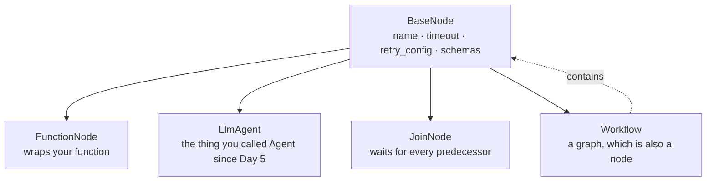

# 1.2 — The four things that can be a node

## One-line answer

A function, an agent, a tool and an entire workflow are all nodes — `isinstance(x, BaseNode)` is
`True` for every one of them — and that single fact is the whole 2.x composition model, because it
means an agent is *one kind of node* rather than the thing everything else has to hang off.

## The story

There is a wedding in the family and somebody has to cook.

For sixty people, an aunt cooks. She has done it before, she knows what everyone eats, and she works
out of the same kitchen the family has always used. For two hundred, a cook is hired: he comes with
two helpers, he brings his own vessels, and he cooks in the yard. For six hundred, a catering van
arrives at six in the morning, and inside the van is a whole small kitchen with its own people and its
own arrangements that nobody outside the van understands or needs to.

Three completely different things. An aunt, a hired cook, a company.

And on the invitation card, in the running order that gets pinned up in the hall, there is one line for
all three of them: **12:30 — lunch served.**

Whoever wrote that running order did not care which of the three it was. They cared that at 12:30 food
appears, and that it appears after the ceremony and before the photographs. The running order works
precisely because it refuses to know what is behind the line.

## The idea in plain language

ADK 2.x has one base class, `BaseNode`, and everything you can put in a graph is one.

That includes some things you would expect and one you would not:

| What you write | What the graph sees | Why you would use it |
| --- | --- | --- |
| a plain Python function | `FunctionNode` | cleaning, checking, arithmetic — free and deterministic |
| an `Agent` (an `LlmAgent`) | `LlmAgent` — already a node | the step that needs judgement |
| a `JoinNode` | `JoinNode` | wait for several branches and collect them ([2.4](../02-the-edge/2.4-two-shops-at-once.md)) |
| a whole `Workflow` | `Workflow` — already a node | a sub-process you want to name, reuse or test alone |

The fourth row is the surprising one and it is worth saying slowly. **A `Workflow` is itself a
`BaseNode`.** A graph can therefore contain a graph, the way a running order can contain "12:30 —
lunch served" without knowing that lunch is itself a twenty-step operation. Nothing special was added
to make this work; it falls out of `Workflow` inheriting from `BaseNode` like everything else.

Two terms defined, since both arrive here for the first time in a graph context:

- **`BaseNode`** is the base class every node inherits from. It carries the fields the runtime needs to
  schedule something: `name`, `timeout`, `retry_config`, `input_schema`, `output_schema`. When this
  day says "a node", it means an instance of a `BaseNode` subclass.
- **`LlmAgent`** is the class you have been calling `Agent` since
  [Day 5](../../../day-05-first-adk-agent/parts/02-the-agent-object/2.1-an-agent-is-a-configuration.md).
  `Agent` is an alias for it. It has always been able to run on its own; in 2.x it can *also* sit in a
  graph, because it is a `BaseNode`.

This is where the day's first collision with old tutorials happens, so let it be explicit. **Trap #1
(plan §5.1)** is the habit of composing only with `sub_agents` trees and treating workflow behaviour
as special agent *classes*. The table above is what replaces it: composition is the graph, and the
agent is one row in the table rather than the root of everything. A reader coming from 1.x material
will keep looking for "the agent that contains the others". There isn't one.

## Why Sutra needs it

Day 55 makes an agent available to another agent as a tool, and Day 58 wires classify and draft — both
agents — into the same graph as intake and review, which are functions. Neither day works if agents and
functions live in different worlds and need adapters between them.

More immediately: the argument in [1.1](1.1-a-node-is-a-unit-of-work.md) that most of Sutra's nodes
should be free functions is only *actionable* if a function and an agent are interchangeable in an edge
list. This part is the proof that they are.

## The mechanism

Build one of each and ask the same question of all four.

```python
"""1.2 - the four things that can be a node, and what each one becomes."""

from google.adk import Agent, Event, Workflow
from google.adk.workflow import BaseNode, JoinNode, node


def plain_function(node_input: str) -> Event:
    """An ordinary function. Not a node yet - nothing has wrapped it."""
    return Event(output=node_input)


wrapped_function = node(plain_function, name="from_function")

wrapped_agent = node(
    Agent(name="from_agent", model="gemini-2.5-flash", instruction="Classify the ticket."),
    name="from_agent",
)

wrapped_join = JoinNode(name="from_join")

inner = Workflow(name="from_workflow", edges=[("START", wrapped_function)])

CANDIDATES = [
    ("a plain function", wrapped_function),
    ("an LlmAgent", wrapped_agent),
    ("a JoinNode", wrapped_join),
    ("a whole Workflow", inner),
]
```

**Line by line:**

- `node(plain_function, name="from_function")` — the decorator used as a plain function. This is the
  form to reach for when the function is defined elsewhere, or when one function should become two
  differently-named nodes.
- `Agent(name=..., model="gemini-2.5-flash", instruction=...)` — the model string is pinned
  explicitly, which is **ADK-73** from Addendum 01: the default model is a preview and every agent
  names its own. `gemini-2.5-flash` is a free-tier model reached through `GOOGLE_API_KEY` with
  `GOOGLE_GENAI_USE_VERTEXAI=FALSE` (Addendum 02). Constructing an `Agent` sends nothing, so this
  script costs zero requests; a part that actually calls it must handle HTTP 429 with `retry-after`
  and backoff, which is Day 72's subject and is already in `sutra/config.py` from Day 9.
- `node(Agent(...), name="from_agent")` — wrapping an agent is allowed and returns the agent itself
  with the overrides applied. It is not converted into something else, which is the point.
- `JoinNode(name="from_join")` — constructed directly. It has no function to wrap; its behaviour is
  built in.
- `inner = Workflow(...)` — a complete two-node graph, made so it can be asked the same question as
  the other three.
- `BaseNode` is imported only to ask `isinstance`. Verified against `https://adk.dev/graphs/` on
  2026-09-05 and against the installed package with
  `python -c "from google.adk.workflow import BaseNode; print(BaseNode)"` on `google-adk==2.7.1`.

```bash
cd days/day-53-graph-workflow-runtime/lab
uv run python kinds.py
```

**Line by line:**

- `kinds.py` prints, for each candidate, what class it ended up as and whether the graph would accept
  it. The last line asks the same of the undecorated function, as a control.

Measured on 2026-09-05:

```text
what you wrote        what it became            is a BaseNode?
  a plain function    FunctionNode              True
  an LlmAgent         LlmAgent                  True
  a JoinNode          JoinNode                  True
  a whole Workflow    Workflow                  True

  the bare function is a BaseNode? False
```

Read the second column before the third. The function was **converted** into a `FunctionNode`. The
agent was **not** converted into anything — it went in an `LlmAgent` and came out an `LlmAgent`. So
did the `Workflow`. There is no wrapper class for agents-in-graphs, because none is needed: they
already satisfy the interface.

The last line is the control that makes the rest mean something. A bare Python function is *not* a
`BaseNode`. It becomes one when the decorator wraps it, or when the graph wraps it for you on the way
in. So the third column is not "everything is `True`, this test proves nothing" — it is four different
routes arriving at the same interface.



The dotted line is the one to notice. `Workflow` is both a kind of node and a container of nodes, and
that is what lets a graph nest without a second mechanism.

## When it breaks

The break here is a real limitation and not a mistake, and the framework states it in the deprecation
message you will meet in [4.3](../04-composition/4.3-the-bus-pass-with-a-date-on-it.md):

```text
SequentialAgent is deprecated in favor of Workflow and will be removed in a future version.
Workflow cannot yet be used as an LlmAgent sub-agent.
```

The second sentence is the limitation. Nesting runs one way today: **a workflow can contain an agent,
but an agent cannot have a workflow as a sub-agent.** So you cannot take an `LlmAgent`, give it
`sub_agents=[some_workflow]`, and expect the agent to hand control to the graph. If you need an agent
to invoke a graph, the graph goes above the agent and the agent is a node inside it — which is the
right shape anyway, and is what Day 58 builds.

There is a second break, and it fires when you build a graph out of chat-mode agents:

```text
The agent 'draft' has been added to the workflow with mode='chat' following node 'classify'. This is
not supported because chat-mode agents rely on conversational history (session events) and cannot
consume direct node inputs from preceding nodes. Please change the agent's mode to 'single_turn'
```

A chat-mode agent expects to read the conversation. A node in the middle of a graph is handed one
value on an edge. Those are different contracts, and the graph refuses to pretend otherwise rather
than silently feeding the agent something it will misread. The fix is in the message.

## In production

**What a professional writes instead.** They keep the sub-graphs small and named after the thing they
do, not after where they sit — `research_workflow`, not `stage_two` — because a `Workflow` used as a
node shows up in traces and dashboards by its name, and `stage_two` tells an on-call engineer at 2am
nothing at all. They also resist nesting more than one level deep in the first version; a graph of
graphs of graphs is exactly as hard to reason about as the agent trees this model replaced.

**What degrades at scale.** The cost profile of a graph is dominated by which rows of that table you
picked. A graph of ten `FunctionNode`s runs in milliseconds and costs nothing. Replace three of them
with `LlmAgent`s and you have three requests per run, three chances at a 429, three places latency can
spike, and a run whose wall-clock time is now set by the slowest provider response rather than by your
code. The interface being uniform is a convenience for the author and an illusion for the operator:
they are not interchangeable in cost, only in wiring.

**The failure that only appears with real traffic.** A sub-`Workflow` used as a node inherits the
parent's session and state. Two sub-workflows that both write a state key called `result` will
silently overwrite each other, and it will only show up when both branches actually run — which, on a
graph with conditional routes, may be one ticket in a hundred. Namespace state keys per sub-workflow
from the start.

**The review comment a senior engineer leaves:** *"You have wrapped `classify_agent` in a
`FunctionNode` that calls it and returns the text. Delete the wrapper — `LlmAgent` is already a
`BaseNode`, so put the agent in the edge list directly. The wrapper is also swallowing the agent's
intermediate events, which means none of its tool calls will appear in the trace."*

**The interview question:** *"In ADK 2.x, what can be a node in a workflow graph?"* A strong answer:
*"Anything that is a `BaseNode` — a function, an agent, a join, or another workflow. The one that
matters is the last: a `Workflow` is itself a node, so graphs nest without any extra machinery. And
the one people get wrong is the agent: it isn't wrapped into a node type, it already is one. That's
the actual content of the 1.x-to-2.x composition change — the agent stopped being the thing everything
hangs off and became one row in the table."*

## Check yourself

```bash
cd days/day-53-graph-workflow-runtime/lab
uv run python kinds.py
```

Now add a fifth candidate: put `inner` — the `Workflow` — inside another `Workflow` as a node, and
check that the outer graph accepts it.

**Out loud, without scrolling up:** which of the four kinds gets *converted* into something else, and
which three go in and come out as themselves?

**Next:** [1.3 — What arrives at a node](1.3-what-arrives-at-a-node.md).
