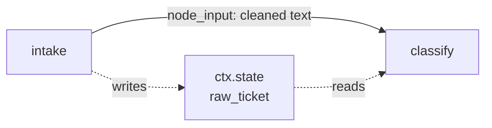

# 1.3 — What arrives at a node

## One-line answer

Exactly two things reach a node: `node_input`, which is whatever the previous node put in its
`output`, and `ctx.state`, which is the session's shared notebook — and the difference between them is
that `node_input` is handed over and `state` is looked up.

## The story

The courier is at the gate with a parcel.

He has one thing in his hands, and it is for you: your name on it, your flat number, and inside it
whatever it is you ordered. He does not know what is in it. He does not know who you are. He knows
that this object goes to that flat, because that is what is written on the object.

At the gate there is also a register. It has been there for years. It has your flat number, your phone
number, the name of the person who is allowed to sign for things when you are out, and a note from
February saying the bell is broken and to knock. The courier did not bring the register. He looks
things up in it.

Two completely different ways of knowing something. One arrived with the parcel. The other was already
there and had to be consulted.

When the bell does not work, the register is what saves the delivery. And when the register is wrong —
when the note about the bell was never updated after it was fixed — every courier for a year knocks
instead of ringing, and nobody can work out why.

## The idea in plain language

A node can get its information from two places, and choosing between them is a design decision you
will make dozens of times.

**`node_input`** is what the previous node handed over. It arrives as an argument. It exists because an
edge ran. If two nodes are not connected, one cannot see the other's `node_input`, and that is a
feature: it is what makes a node testable on its own.

**`ctx.state`** is a dictionary that lives on the **session**, not on the node. A session is the
container for one conversation or one run, and you met it on
[Day 6](../../../day-06-instructions-and-personas/parts/01-writing-the-handbook/1.1-handbook-not-a-wish.md)
as the thing that holds the transcript, and again on
[Day 47](../../../day-47-persistent-sessions/parts/01-what-restart-costs/1.1-the-book-under-the-shutter.md)
as the thing that survives a restart. Anything a node writes into `ctx.state` can be read by any later
node, whether or not there is an edge between them.

`ctx` itself is the **context** object: the node's handle on the run it is part of. Ask for it by
adding a parameter annotated `ctx: Context` and the runtime fills it in.

There is one rule about parameter names that catches everybody, and it was already the failure in
[1.1](1.1-a-node-is-a-unit-of-work.md):

- a parameter called **`node_input`** is filled from the edge;
- a parameter called **`ctx`** is filled with the context;
- **every other parameter** is looked up by name in `ctx.state`.

That last line is not a footnote. It means `def classify(ticket: str)` is not a typo for `node_input` —
it is a *request for a state key called `ticket`*, and if there isn't one the node fails at run time
with a message that says exactly that. Verified against `https://adk.dev/graphs/data-handling/` on
2026-09-05.

State also has **prefixes** that control how long a value lives, which matter from Day 60 onwards:
`app:` is shared by every user, `user:` follows one user across sessions, `temp:` is discarded when the
run ends, and a bare key lasts for the session.

## Why Sutra needs it

The triage graph has a shape that forces this choice. `intake` knows the customer id. `draft`, four
nodes later, needs it. In between are two search nodes that have no business knowing who the customer
is — they search an archive, and a search node that takes a customer id is a search node you cannot
reuse or cache.

If the only channel were the edge, the customer id would have to be threaded through both search nodes
as cargo, and their signatures would grow a parameter they never read. State is what stops that
happening, and [2.5](../02-the-edge/2.5-on-the-edge-or-in-the-register.md) turns the choice into a
rule you can apply without thinking.

## The mechanism

Two nodes. The first writes to both channels; the second prints what it can see.

```python
"""1.3 - what arrives at a node: node_input from the edge, ctx.state from the session."""

from google.adk import Event, Workflow
from google.adk.agents.context import Context
from google.adk.workflow import node

from _run import run, show


@node
def intake(node_input: str, ctx: Context) -> Event:
    """Writes the raw text to state, passes a cleaned copy along the edge."""
    ctx.state["raw_ticket"] = node_input
    return Event(output=" ".join(node_input.split()).lower())


@node
def classify(node_input: str, ctx: Context) -> Event:
    """Reads both: what the edge handed it, and what an earlier node left in state."""
    print(f"    node_input  = {node_input!r}")
    print(f"    state       = {ctx.state.to_dict()!r}")
    return Event(output="incident" if "down" in node_input else "question")


flow = Workflow(name="arrives", edges=[("START", intake, classify)])
```

**Line by line:**

- `from google.adk.agents.context import Context` — the annotation the runtime matches on. It is the
  annotation that matters, not the parameter name, but the convention is to call it `ctx`.
- `def intake(node_input: str, ctx: Context)` — asking for both. The order does not matter; they are
  bound by name and annotation, not by position.
- `ctx.state["raw_ticket"] = node_input` — a plain dictionary assignment. The runtime turns it into a
  state delta on the event, so the write is recorded in the session rather than living in memory. That
  is why it survives to Day 60's replay.
- `Event(output=...)` sends the *cleaned* text down the edge while state keeps the *raw* text. Doing
  both deliberately is the point of the example: the two channels are carrying different things.
- `ctx.state.to_dict()` — `State` is not a `dict`, so `dict(ctx.state)` raises `KeyError: 0`. Use
  `.to_dict()` to see all of it, or `.get(key)` for one value.
- `edges=[("START", intake, classify)]` — a three-element chain, which is two edges.
  [2.2](../02-the-edge/2.2-the-chain-that-is-a-list-of-edges.md) unpacks that.

```bash
cd days/day-53-graph-workflow-runtime/lab
uv run python arrives.py
```

**Line by line:**

- `arrives.py` prints from inside `classify`, before the event stream is shown, so you see the node's
  own view first and the runtime's view second.

Measured on 2026-09-05:

```text
what classify sees:
    node_input  = 'checkout is down'
    state       = {'raw_ticket': '  Checkout   is   DOWN  '}
  intake           'checkout is down'
  classify         'incident'
  2 events
```

The two values are different, and that difference is the whole lesson. `node_input` is `'checkout is
down'` — cleaned, because that is what `intake` chose to send. `state['raw_ticket']` is
`'  Checkout   is   DOWN  '` — untouched, with its original spacing and capitals, because that is what
`intake` chose to keep.

Neither is more correct. A node that wants to show the customer their own words needs the raw version;
a node that wants to match on keywords needs the cleaned one. What matters is that the graph let you
have both without forcing the cleaned copy to carry the raw one as baggage.



Solid line: the edge, which is a handover. Dotted lines: state, which is a lookup. The dotted path
does not need the solid one to exist.

## When it breaks

The common break is the one from [1.1](1.1-a-node-is-a-unit-of-work.md), and this part explains why
the message is worded the way it is:

```text
ValueError: Missing value for parameter "ticket" of function "typo". It was not found in state and
has no default value.
```

The parameter was not called `node_input`, so the runtime did the only other thing it knows how to do:
looked for a state key called `ticket`. There wasn't one. The message says *"not found in state"* and
not *"not found on the edge"*, and that wording is the clue to what actually happened.

The second break is quieter and more expensive. Reading state that an earlier node wrote **on a branch
that did not run**:

```text
    state       = {}
```

No error. `ctx.state.get("customer_id")` returns `None`, `draft` writes "Dear None", and the reply
goes out. State has no dependency information — it does not know that `customer_id` was supposed to be
set by a node on the other branch of a conditional route. This is the exact shape of the failure that
[5.2](../05-the-first-graph/5.2-the-cycle-that-finished-early.md) measures, and the defence is to use
`ctx.state[key]` rather than `.get(key)` when a value is genuinely required, so a missing one raises
instead of becoming `None`.

## In production

**What a professional writes instead.** They declare a `state_schema` on the workflow — a Pydantic
model naming every state key and its type — so that a typo in a key name fails when the graph is
built rather than when the ticket arrives. The check is real and it is strict; a `FunctionNode`
parameter that is not a declared field raises `StateSchemaError` at construction. That turns the
whole class of "quietly `None`" bugs above into a build error.

**What degrades at scale.** State is written into the session, and the session is persisted from
[Day 47](../../../day-47-persistent-sessions/parts/01-what-restart-costs/1.1-the-book-under-the-shutter.md)
onward. Every key you set is a write, and every key you never delete is carried for the life of the
session. A node that stashes the full text of every retrieved document in state turns a 2 KB session
into a 400 KB session, and the cost lands on whatever loads it — which under concurrency is every
node, on every run.

**The failure that only appears with real traffic.** Two nodes running in parallel that both write the
same state key. Locally they run in a predictable order and one always wins; in production the order
depends on which network call returns first, and the value becomes a coin flip. If two branches must
each record something, they write to two different keys and a later node combines them.

**The review comment a senior engineer leaves:** *"`search_kb` takes `customer_id` and never uses it —
it is being threaded through so `draft` can have it four nodes later. Put it in state at `intake` and
take it off the edge. Right now nobody can reuse `search_kb` without inventing a customer id."*

**The interview question:** *"How does data move between steps in your workflow?"* An answer with a
real distinction in it: *"Two channels. The edge hands the previous node's output to the next one as
`node_input`, and the session state is a shared dictionary any node can read. I put things on the edge
when the next node genuinely consumes them, and in state when a later node needs them but the nodes in
between do not. The trap is that state has no dependency tracking — if the node that was supposed to
set a key never ran, you get `None` and a reply that says 'Dear None'. So required keys get read with
`ctx.state[key]`, not `.get`, and the important ones get a `state_schema`."*

## Check yourself

```bash
cd days/day-53-graph-workflow-runtime/lab
uv run python arrives.py
```

Now rename `classify`'s first parameter from `node_input` to `ticket` and run it again. Read the error
and say which of the two channels it went looking in.

**Out loud, without scrolling up:** give one thing that belongs on the edge and one that belongs in
state, and say what test you applied.

**Next:** [1.4 — What leaves a node](1.4-what-leaves-a-node.md).
