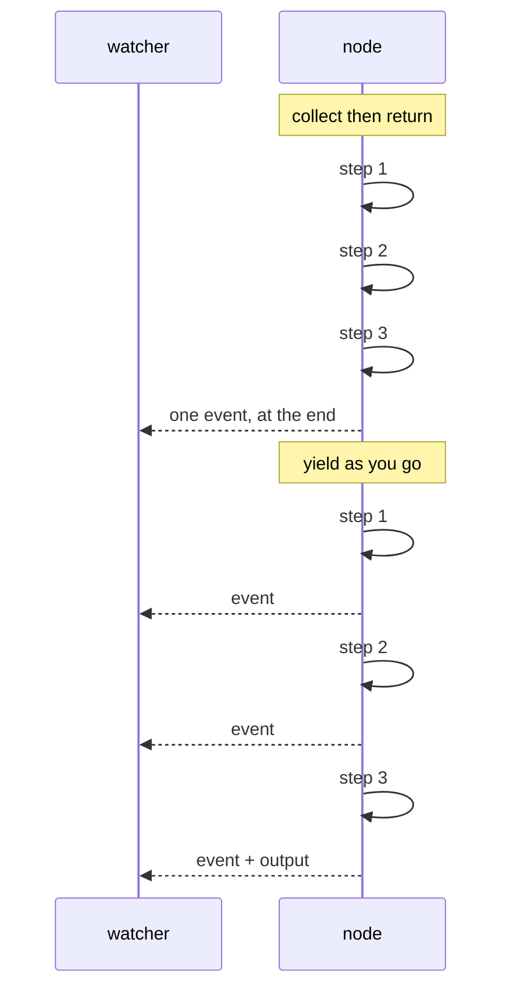

# 1.5 — Say it as you go, never collect and return

## One-line answer

A node that `yield`s emits each event the moment it happens, and a node that builds a list and returns
it emits nothing until it is completely finished — measured here as a first sign of life at **0.41s
against 1.24s** for identical work, which is why **trap #3** says yield, don't append.

## The story

You order food on a Friday night and the app shows you a little row of ticks.

*Order placed.* Then, a few minutes later, *restaurant is preparing your food.* Then *rider assigned*,
and a name, and then a small map with a scooter on it that is genuinely moving. None of this makes the
food arrive sooner. The rider is not faster because you can see him.

But you do not phone anyone. You do not open the app twelve times. You go and set the table, because
you know roughly where things are.

Now think of the last time you ordered from a place that had none of that. You pay, the screen says
*thank you*, and then there is nothing at all for fifty minutes. Same food, same rider, same kitchen.
Halfway through you start wondering whether the order went through, and there is no way to find out
except to wait for a doorbell that may never ring.

The information did not change the outcome. It changed everything about waiting for it.

## The idea in plain language

A node can produce events in two shapes.

**Return** gives one event, at the end. The runtime cannot know anything until your function is done,
because your function has not given it anything.

**Yield** makes the node a **generator** — a function that hands values back one at a time and carries
on from where it left off. The runtime receives each event the instant it is yielded and passes it
straight to whoever is watching.

This is **trap #3 from plan §5.1**, and it is worth stating in the exact 1.x form because that is what
you will find in tutorials:

> **Trap #3 — yield, don't append.** In 1.x, custom agents commonly collected events into a list and
> returned the list. In 2.x, custom agents and nodes **yield** events as they happen. Appending and
> returning breaks streaming and ordering guarantees.

"Breaks streaming" is the visible half: nobody sees anything until the end. "Breaks ordering" is the
subtle half, and it matters more in a graph than it did in a tree: the runtime interleaves events from
nodes running in parallel by *arrival*. A node that hoards its events and dumps them at the end
inserts a block of events at a timestamp that has nothing to do with when they happened, so a trace
reading top-to-bottom tells you a story that did not occur.

The rule in practice: **if a node does more than one thing, yield after each one.**

## Why Sutra needs it

Day 58's research stage searches an archive and drafts a reply. When a support agent is watching a
ticket being handled, the difference between a node that says *searching the archive* and then
*drafting a reply* and a node that says nothing for the whole run is the difference between a tool
someone trusts and one they abandon.

There is a harder reason too. Day 60 resumes an interrupted run by replaying the events that were
already recorded. A node that has not yielded anything yet has left nothing to replay, so the further
you push your events towards the end of a node, the more work is lost when a run is interrupted. On
Day 65 you will kill a run mid-flight on purpose and find out exactly how much you kept.

## The mechanism

The same three steps, the same sleep in each, written both ways.

```python
"""1.5 - trap #3: yield events as they happen; never collect them and return a list."""

import time

from google.adk import Event, Workflow
from google.adk.workflow import node

from _run import stream

STEPS = ["reading the ticket", "searching the archive", "drafting the reply"]
PAUSE = 0.4


@node
def collect_then_return(node_input: str) -> Event:
    """The 1.x habit. Every step finishes before the caller learns that any step started."""
    seen = []
    for step in STEPS:
        time.sleep(PAUSE)
        seen.append(step)
    return Event(output=" | ".join(seen))


@node
def yield_as_you_go(node_input: str):
    """The 2.x shape. The caller gets each step the moment it happens."""
    for step in STEPS:
        time.sleep(PAUSE)
        yield Event(message=step)
    yield Event(output=" | ".join(STEPS))
```

**Line by line:**

- `time.sleep(PAUSE)` stands in for the real work — a search, a model call, a database read. It is
  deliberately the *same* in both versions, so the only difference measured is when events come out.
- `collect_then_return` appends to `seen` and returns once. There is exactly one `return`, so there
  can be exactly one event, and it cannot exist before the loop ends.
- `yield_as_you_go` has **no return type annotation**. The framework detects a generator and iterates
  it either way, so this is a readability choice rather than a requirement: annotating a generator
  `-> Event` describes what it yields, not what it returns, and misleads the next reader.
- `yield Event(message=step)` — progress goes in `message`, not `output`, because progress is for the
  human ([1.4](1.4-what-leaves-a-node.md)). Three `message` events and one `output` event means the
  next node still receives exactly one value.
- The final `yield Event(output=...)` is the real result, and there is exactly one of them because a
  node is allowed exactly one. A second `output` raises `ValueError: Output already set` — see *When
  it breaks*.
- `from _run import stream` rather than `run`: `run` collects every event into a list before returning
  it, which would hide the very thing being measured. `stream` calls back the instant each event
  arrives.

```bash
cd days/day-53-graph-workflow-runtime/lab
uv run python stream.py
```

**Line by line:**

- `stream.py` prints the elapsed time at each event's arrival, using `time.monotonic()` from just
  before the run starts. The number to watch is the **first** line of each block.

Measured on 2026-09-05:

```text
collect then return:
  +1.24s  output  'reading the ticket | searching the archive | drafting the reply'

yield as you go:
  +0.41s  message 'reading the ticket'
  +0.80s  message 'searching the archive'
  +1.20s  message 'drafting the reply'
  +1.20s  output  'reading the ticket | searching the archive | drafting the reply'
```

Both finish at about the same moment — 1.24s and 1.20s. The work was identical and yielding did not
make it faster, exactly as the food app does not make the rider faster.

The number that changed is the first one. **0.41s against 1.24s** to the first sign of life: three
times sooner, and it would be thirty times sooner if the node did thirty steps. And the three
intermediate lines are not noise. They are a record of which step was in progress at each moment,
which is the thing you want at 2am when a run hangs and you need to know *where*.



## When it breaks

The break that catches people converting a node to a generator is mixing `yield` and `return`:

```python
@node
def mixed(node_input: str):
    yield Event(message="searching")
    return Event(output="THE RESULT")  # dropped - this is a generator
```

**Line by line:**

- The moment a function contains `yield`, Python makes it a generator, and `return` in a generator does
  not hand a value to the caller — it stops iteration. The `Event` is constructed and discarded.
- The failure is silent, which is what makes it worth a paragraph. Nothing raises.

```text
return inside a generator:
  mixed            None
  nxt              'nxt got None'
  2 events
```

`nxt got None`. The result was computed, wrapped in an `Event`, and thrown away, and the next node was
handed nothing. The fix is one word: `yield Event(output="THE RESULT")`.

The second break is a hard limit worth knowing before you meet it. Yield two `output` events and the
run stops:

```text
ValueError: Output already set. A node can produce at most one output.
```

**One output per node**, enforced. You may yield as many `message` events as you like, and exactly one
`output`. That constraint is what makes an edge meaningful: if a node could hand over three different
values, "what does the next node receive" would have no answer.

## In production

**What a professional writes instead.** They yield a `message` event at every step that could take
longer than a person is willing to sit still for, and nothing at the steps that cannot. Every yield is
an event, every event is persisted, and a node that yields on every loop iteration over a thousand
rows has written a thousand events into the session. The rule is: yield per *stage*, not per *item*.

**What degrades at scale.** Event volume, directly. Streaming is close to free for the producer and is
not free for the session store, the trace backend or anything that reads the run later. When Day 84
puts tracing across the whole app, the cost of a chatty node becomes visible as span count.

**The failure that only appears with real traffic.** A generator node that raises halfway through has
already emitted some of its events. Those events are real, they are recorded, and a downstream reader
that assumed "events exist, therefore the node succeeded" will treat a half-finished node as a
finished one. Partial output is the price of streaming. The defence is that a node's **`output`** event
is the one that means "done" — progress `message` events explicitly do not.

**The review comment a senior engineer leaves:** *"This node takes about a minute and emits one event.
Yield a message per stage. Right now the only way to know whether it is stuck on the search or the
draft is to attach a debugger to production."*

**The interview question:** *"Why does the framework want you to yield events instead of returning a
list of them?"* An answer that has been in the weeds: *"Two reasons, and the second is the one people
miss. The obvious one is streaming — the caller sees progress instead of waiting. The one that bit me
is ordering: the runtime interleaves events from parallel nodes by arrival, so a node that buffers and
dumps at the end produces a trace where its steps appear to have happened at a moment they did not.
The trace looks fine and it is lying. Also, anything not yielded yet is not recorded, so an
interrupted run loses more work the later you emit."*

## Check yourself

```bash
cd days/day-53-graph-workflow-runtime/lab
uv run python stream.py
```

Now raise `PAUSE` to `1.0` and run it again. Write down both first-event times and the gap between
them.

**Out loud, without scrolling up:** name the two things trap #3 says appending breaks, and say which
one you would only notice while reading a trace.

**Next:** [2.1 — An edge is what happens next](../02-the-edge/2.1-an-edge-is-what-happens-next.md).
