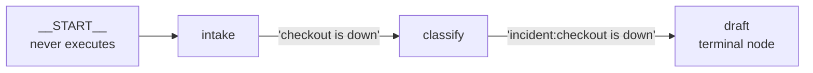

# 2.1 — An edge is what happens next

## One-line answer

An edge is a written-down promise that when one node finishes, another one starts and receives its
output — and because it is written down in one list rather than scattered through the nodes, you can
read the whole process without reading any of the code that does the work.

## The story

At the hospital out-patient department they give you a slip.

It is small, and half of it is already filled in. Your name, a number, and — this is the part that
matters — a line at the bottom that says **next: counter 7**.

You do not know why counter 7. You do not know what counter 7 does. You have never met the person at
counter 7 and you would not recognise them. You walk to counter 7, hand over the slip, and they take
it, do their part, and write a new line at the bottom: *next: room 12*.

Nobody in this building has explained the process to you and you are moving through it correctly.

Now imagine the same hospital without slips. Each person, having finished with you, tells you where to
go — from memory, in their own words, while looking at the next patient. It would mostly work. And on
the day the pharmacy moves to the second floor, there would be no list of people to tell, because the
route was never written down anywhere; it was living in eleven separate heads.

## The idea in plain language

An **edge** is a connection from one node to another: *when this one finishes, run that one, and give
it the output.*

The important word is *written down*. In ADK 2.x the edges are a list you pass to the `Workflow`
constructor, in one place, separate from the nodes. That separation is doing real work:

- **The process is readable.** You can look at the edge list and know the flow without opening a single
  node.
- **A node does not know what comes after it.** `classify` names no successor. That is what makes it
  reusable — [4.1](../04-composition/4.1-one-secretary-or-one-register.md) reuses one node from two
  branches, which would be impossible if the node hard-coded its own successor.
- **The wiring can be checked.** Because the whole shape is available before anything runs, the
  framework can reject a graph with an unreachable node or a cycle nobody can leave. That is section
  3's subject, and it is only possible because the edges are data.

An edge carries exactly two things: **where to** and, optionally, **which label it answers to**. The
label is `route`, and it is [2.3](2.3-a-label-not-an-address.md)'s subject. An edge with no route runs
whenever its source node finishes.

One term for later: a node with **no outgoing edges** is a **terminal node**. Its output becomes the
workflow's own output, which is how a graph used as a node ([1.2](../01-the-node/1.2-the-four-things-that-can-be-a-node.md))
produces a value for the graph above it.

## Why Sutra needs it

The triage flow is going to change. Day 57 puts a critic between draft and review. Day 63 puts an
approval gate before anything is sent. Day 70 routes the model call to whichever provider has quota.
Every one of those is an edit to the wiring, and none of them should require editing the nodes.

If `draft` had a line in it that said *"then call review"*, then adding a critic means editing
`draft`, and `draft` is a node with a prompt in it that someone tuned carefully. Keeping the wiring
out of the nodes is what makes the next five days additive rather than invasive.

## The mechanism

Three nodes and the two edges between them, with the edge list printed out from the built graph.

```python
"""2.1 / 2.2 - the chain tuple is sugar; the graph underneath is a list of Edge objects."""

from google.adk import Event, Workflow
from google.adk.workflow import Edge, START, node

from _run import run, show


@node
def intake(node_input: str) -> Event:
    return Event(output=" ".join(node_input.split()).lower())


@node
def classify(node_input: str) -> Event:
    return Event(output=f"incident:{node_input}")


@node
def draft(node_input: str) -> Event:
    return Event(output=f"draft for {node_input}")


spelled_out = Workflow(
    name="spelled_out",
    edges=[
        Edge(from_node=START, to_node=intake),
        Edge(from_node=intake, to_node=classify),
        Edge(from_node=classify, to_node=draft),
    ],
)
```

**Line by line:**

- `from google.adk.workflow import Edge, START, node` — `Edge` is the explicit form and `START` is the
  sentinel node every graph begins from. Verified against `https://adk.dev/graphs/` on 2026-09-05 and
  against the installed package with
  `python -c "from google.adk.workflow import Edge, START; print(START.name)"` on `google-adk==2.7.1`,
  which prints `__START__`.
- `Edge(from_node=..., to_node=...)` — both are keyword-only and both take **node objects**, not names.
  Passing the object is what lets the framework check the wiring: a name could be a typo for a node
  that does not exist, an object cannot.
- No `route=` on any of these three, so all three edges fire unconditionally when their source
  finishes. That is the default and it is the right default: most edges in most graphs are "and then".
- Notice what is *not* in the three node bodies: no mention of each other. `intake` does not know
  `classify` exists.

```bash
cd days/day-53-graph-workflow-runtime/lab
uv run python edges.py
```

**Line by line:**

- `edges.py` prints the graph's own edge list — `flow.graph.edges`, populated by the framework when the
  workflow was constructed — and then runs the flow, so the wiring and the behaviour are on screen
  together.

Measured on 2026-09-05:

```text
spelled_out:
    __START__ -> intake (route=None)
    intake -> classify (route=None)
    classify -> draft (route=None)

the chain runs:
  intake           'checkout is down'
  classify         'incident:checkout is down'
  draft            'draft for incident:checkout is down'
  3 events
```

The top block is the process, in three lines, readable by someone who has never seen the code. The
bottom block is that process happening. They are the same shape, which is the whole promise: the list
of edges is not documentation *about* the flow, it **is** the flow.

Follow one value through. `intake` output `'checkout is down'`; `classify` received it, prefixed it,
and output `'incident:checkout is down'`; `draft` received *that*. Each node's output became the next
node's `node_input`, because that is what an edge does.



## When it breaks

Point an edge at a node that nothing reaches and the graph refuses to be built:

```text
Graph validation failed. The following nodes are unreachable from START: ['draft', 'review']
```

The check runs at construction, so this is a startup error and not a 3am one. Section 3 is about the
family of these checks; the point here is that they exist *because* the edges are a list the framework
can examine.

The break that is not caught is more interesting, and it is the one to carry forward: **an edge that is
never followed is not an error.** A routed edge whose label is never emitted simply does not fire,
the branch ends, and the run finishes successfully having done less than you thought. Nothing is
malformed, so nothing is rejected. That is
[5.2](../05-the-first-graph/5.2-the-cycle-that-finished-early.md), and it is the reason this day has a
failure lab at all.

## In production

**What a professional writes instead.** They keep the edge list in one function, `build_triage_graph()`,
and never build a graph inline at module scope. The reasons are practical: a test needs to build a
fresh graph per case, a feature flag may need to add an edge, and a module-level graph is constructed
at import time, which means a graph validation error becomes an import error in something entirely
unrelated.

**What degrades at scale.** Edge count, and specifically the number of *routed* edges, is the honest
measure of how hard a graph is to reason about. Twenty unconditional edges in a line is a long
process; six routed edges out of one node is a decision tree with sixty-four paths through it, and
nobody tests sixty-four paths. When a graph starts growing conditional edges, that is the signal to
extract a sub-workflow ([1.2](../01-the-node/1.2-the-four-things-that-can-be-a-node.md)) rather than
add a seventh.

**The failure that only appears with real traffic.** An edge added for a rare case and never exercised.
It passes validation, it is in the diagram, and the first time a ticket takes it is in production —
where the node at the far end has drifted and now expects a different shape. Every edge deserves at
least one test that traverses it, and the count of edges is exactly the count of paths you owe tests
for.

**The review comment a senior engineer leaves:** *"This graph is built at import time in
`sutra/graph.py`. Wrap it in a function. Right now a bad edge takes down anything that imports the
module, including the CLI that was only trying to print `--version`."*

**The interview question:** *"Why does a graph runtime keep the edges separate from the steps?"* An
answer with consequences in it: *"So the process is data. Because it is a list rather than jumps
scattered through the code, the framework can validate reachability and cycles before anything runs, I
can render the flow as a diagram straight from the object, and a node has no idea what follows it —
which is what makes the same node reusable from two branches. In an agent tree that is not possible,
because the parent-child link is the composition."*

## Check yourself

```bash
cd days/day-53-graph-workflow-runtime/lab
uv run python edges.py
```

Now delete the middle `Edge(from_node=intake, to_node=classify)` line and run it again. Read what the
graph says about `classify` and `draft`.

**Out loud, without scrolling up:** what does a node know about the node that runs after it?

**Next:** [2.2 — The chain that is a list of edges](2.2-the-chain-that-is-a-list-of-edges.md).
