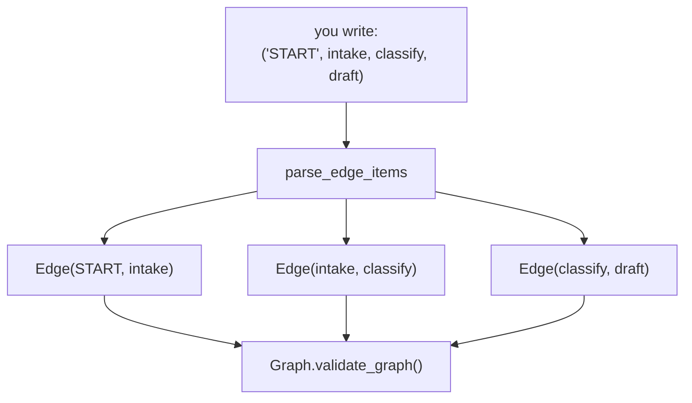

# 2.2 — The chain that is a list of edges

## One-line answer

`("START", intake, classify, draft)` is not a special "sequence" feature — it expands into exactly the
three `Edge` objects you would have written by hand, which the lab proves by comparing the two graphs
and getting `same edges? True`.

## The story

You buy a train ticket for a journey with two changes.

What you are handed is one ticket. It has your name on it, the station you start from, the station you
end at, and in small print down the middle the three legs with their times. One piece of paper for the
whole journey.

But at the first change, a man in a uniform looks at it and only cares about one line: are you allowed
on *this* train, from *this* station, to *this* one. He is not checking your journey. He is checking a
leg. The ticket is a convenience for you and a stack of three separate permissions for the railway,
and both things are true at once.

This matters on the day something goes wrong. When the second train is cancelled, nobody says "your
ticket is void". They say "leg two is void", and they re-book that leg, because underneath the single
piece of paper the journey was always three separate agreements.

## The idea in plain language

The `edges` list accepts two kinds of item, and one of them is shorthand for the other.

**A chain tuple** is a tuple of nodes: `(a, b, c)` means *a then b then c*. It expands to `a → b` and
`b → c`. A tuple of four nodes gives three edges, and so on. You may write as many chain tuples as you
like in the same list.

**An `Edge` object** is one edge, written out: `Edge(from_node=a, to_node=b, route=...)`.

The chain is not a different mechanism. There is no "sequential workflow" object hiding behind it.
`Graph.from_edge_items` walks the list and turns every tuple into `Edge` objects before anything else
happens, so by the time the graph exists, only edges remain. Verified against `https://adk.dev/graphs/`
on 2026-09-05 and by comparing the two graphs in the lab below.

Knowing this saves you from a real mistake. Because chains are *just edges*, you can mix them freely:
some of your wiring as chains for the long straight bits, some as explicit `Edge` objects for the
parts that need a route list. [5.1](../05-the-first-graph/5.1-five-desks-one-form.md) does exactly
that, because there is one thing the chain sugar cannot express and an `Edge` can.

**`START`.** Every graph must contain it, no edge may point *at* it, and edges leaving it may not
carry a route. It never executes — the runtime seeds the nodes after it directly. It exists so that
"where does work begin" is answered by an edge like every other question about the flow, rather than
by a special field on the workflow.

The bare string `"START"` in an edge list is resolved to that sentinel, which is why every example so
far has begun `("START", ...)`.

## Why Sutra needs it

Day 54 is sequential, parallel and loop patterns. If a chain were a special "sequential" construct,
then those three patterns would be three constructs, and mixing them would need rules about how they
nest — which is exactly the 1.x world plan §5.1 calls trap #1.

Because a chain is sugar over edges, the three patterns are three *shapes of the same thing*, and Day
54's job becomes recognising shapes rather than learning APIs. This part is what makes that possible,
and it is worth ten minutes now to avoid a whole day of confusion tomorrow.

## The mechanism

Build the same three-node flow twice — once as a chain, once as three `Edge` objects — and compare
what the framework actually produced.

```python
sugar = Workflow(name="sugar", edges=[("START", intake, classify, draft)])

spelled_out = Workflow(
    name="spelled_out",
    edges=[
        Edge(from_node=START, to_node=intake),
        Edge(from_node=intake, to_node=classify),
        Edge(from_node=classify, to_node=draft),
    ],
)


def describe(flow: Workflow) -> list[str]:
    return [f"{e.from_node.name} -> {e.to_node.name} (route={e.route!r})" for e in flow.graph.edges]
```

**Line by line:**

- `edges=[("START", intake, classify, draft)]` — **one** item in the list, a tuple of four elements,
  which becomes three edges. The count is worth saying out loud: a chain of *n* nodes is *n − 1* edges.
- The `spelled_out` version writes those three out. `START` here is the imported object rather than the
  string; both forms resolve to the same sentinel.
- `describe` reads `flow.graph.edges` — the framework's own list, after expansion. It is not
  re-deriving anything; it is reporting what the graph holds.
- Comparing the two `describe` results is the actual test. If the chain were a distinct construct, the
  two lists would differ.

```bash
cd days/day-53-graph-workflow-runtime/lab
uv run python edges.py
```

**Line by line:**

- `edges.py` prints both descriptions and then the equality check, so the claim is visible rather than
  asserted.

Measured on 2026-09-05:

```text
sugar:
    __START__ -> intake (route=None)
    intake -> classify (route=None)
    classify -> draft (route=None)
spelled_out:
    __START__ -> intake (route=None)
    intake -> classify (route=None)
    classify -> draft (route=None)

  same edges? True
```

`same edges? True`. One `Workflow` was given a tuple and the other was given three `Edge` objects, and
what came out the other side is indistinguishable — same sources, same destinations, same `route=None`
on all three.

Note also that `__START__` appears as a real source in both. It is a node in the graph, it has an
outgoing edge, and it simply never runs.



## When it breaks

The limit of the sugar is the one that will actually cost you an evening, and it looks like this. You
want two routes to lead to the same node:

```python
(classify, {"incident": search_kb, "question": search_kb})
```

**Line by line:**

- Two keys, two routes, one destination. It reads as "either label sends work to `search_kb`", which is
  a completely reasonable thing to want.
- Each dictionary key becomes its own edge, so this is two edges from `classify` to `search_kb`.

```text
Graph validation failed. Duplicate edge found: from=classify, to=search_kb
```

**An edge is identified by its two endpoints, not by its route.** There can only be one edge between a
given pair of nodes, so a node that should be reached by two different labels needs *one* edge
carrying *both* labels — and the routing-map sugar has no way to say that, because its keys are single
labels. The explicit form does:

```python
Edge(from_node=classify, to_node=search_kb, route=["incident", "question"])
```

**Line by line:**

- `route=` takes a list as well as a single value. The edge is followed when the emitted label matches
  **any** value in the list.
- This is one edge, so the duplicate check is satisfied, and both labels reach the node.

This is not an obscure corner. It is the exact shape the triage graph needs, and
[5.1](../05-the-first-graph/5.1-five-desks-one-form.md) is built on it.

The other break is `START` being treated as an ordinary node:

```text
Graph validation failed. Edges from START must not have routes (edge to intake has route urgent).
```

`START` does not run, so it cannot emit a label, so an edge leaving it can never match one. Rather
than let you build a graph whose first edge can never fire, the framework refuses it.

## In production

**What a professional writes instead.** They use chains for the straight runs and explicit `Edge`
objects at every branch, and they do not mix the two styles within a single decision. A file where
half the routing is dictionaries and half is `Edge` objects is a file where the next person misses a
branch when they read it. Pick per section of the graph, not per line.

**What degrades at scale.** Nothing about the expansion — it happens once, at construction. What
degrades is human: a chain of fourteen nodes fits on one line and reads as one thing, and it is
fourteen places a ticket can be sitting when someone asks "where is it stuck?" Long chains hide their
own length. Break them at meaningful boundaries and give the pieces names.

**The failure that only appears with real traffic.** A route added as a third dictionary key months
later, pointing at a node that already has an edge from that source, and the graph now fails to build.
On a service that constructs its graph at startup, that is a deploy that will not come up, and the
error mentions "duplicate edge" rather than "the route you just added". Recognising this message on
sight is worth the paragraph it took to explain.

**The review comment a senior engineer leaves:** *"You have written the same three edges as a chain in
one place and as `Edge` objects in another, for the same sub-flow. Pick one. And the duplicate-edge
error you worked around by renaming the node — undo that, and use `route=[...]` on a single edge
instead. You now have two nodes doing the same job and only one of them has the retry config."*

**The interview question:** *"How do you express a sequence of steps in a graph runtime?"* The answer
that shows you looked underneath: *"As a chain tuple, which is sugar — it expands into ordinary edges
before the graph is built, and you can prove it by comparing the resulting edge lists. That matters
because it means sequence, fan-out and loop are not three different constructs, they are three shapes
of edges. The one thing the sugar cannot do is give a single edge two route labels, and you need that
whenever two branches converge on the same node, because an edge is identified by its endpoints and a
second one between the same pair is rejected."*

## Check yourself

```bash
cd days/day-53-graph-workflow-runtime/lab
uv run python edges.py
```

Now change the `sugar` chain to `("START", intake, classify, draft, classify)` and read the error. Say
which rule it broke before you look it up.

**Out loud, without scrolling up:** how many edges does a chain of five nodes produce, and what is the
one thing a chain cannot express that an `Edge` can?

**Next:** [2.3 — A label, not an address](2.3-a-label-not-an-address.md).
