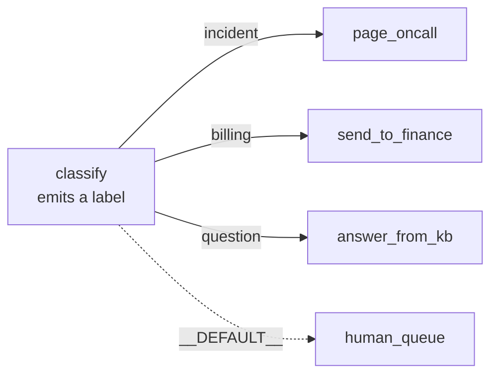

# 2.3 — A label, not an address

## One-line answer

A node emits a **label** — `route="incident"` — and the graph, not the node, decides which edge that
label opens; the node never names its successor, which is what lets you rewire the whole flow without
touching the classifier.

## The story

At the bank, the woman who takes your form does not send you anywhere. She stamps it.

The stamp is a word. **NRI**, or **SENIOR**, or nothing at all. She reads your form, decides which word
applies, presses the stamp on the top right corner, and hands it back. Then she looks past you at the
next person.

You are standing there holding a stamped form with no idea where to go, and you look up, and there is a
board. *NRI — counter 4. Senior citizens — counter 9. All other services — counter 2.*

The woman with the stamp has never read that board. She could not tell you what counter 4 does. Last
year NRI was counter 6, and when it moved, somebody printed a new board and nothing else in the branch
changed — she stamps the same word she has always stamped.

That is the arrangement: she knows *what kind of thing you are*, and the board knows *where that kind
of thing goes*, and neither of them knows the other's job.

## The idea in plain language

A routed edge has a **route** — a label. A node steers by emitting `Event(route=<label>)`. When it
finishes, the graph compares the emitted label against the routes on the edges leaving that node, and
follows the ones that match.

Three consequences, and each one is the reason for a later day:

1. **The node does not know the destination.** `classify` emits `"incident"`. It has no reference to
   `page_oncall`. Put a triage queue in between tomorrow and `classify` is untouched.
2. **Several edges can share a label.** The label opens *every* edge tagged with it, so one label can
   fan out to several nodes ([2.4](2.4-two-shops-at-once.md)).
3. **A label that matches nothing opens nothing.** The branch ends. There is no error. This is the
   day's central hazard and it gets its own measurement in
   [5.2](../05-the-first-graph/5.2-the-cycle-that-finished-early.md).

The rules the graph applies, in order, verified against `https://adk.dev/graphs/routes/` on 2026-09-05
and against `google-adk==2.7.1`:

| The edge | When it fires |
| --- | --- |
| `route=None` (an ordinary edge) | always, whatever label was emitted |
| `route="incident"` | when the emitted label is exactly `"incident"` |
| `route=["incident", "question"]` | when the emitted label is either of them |
| `route=DEFAULT_ROUTE` | only when **no** specific route on that node matched |

`DEFAULT_ROUTE` is a constant — its value is the string `"__DEFAULT__"` — and it is the "all other
services, counter 2" line on the board. A node may have at most one default edge, and the framework
enforces that. Without one, an unmatched label means the branch stops.

Note the first row carefully: an edge with **no** route fires *regardless* of what was emitted. Mixing
unrouted and routed edges out of the same node is legal and means "always do this, and additionally
one of those".

## Why Sutra needs it

Day 58's classify node decides what kind of ticket has arrived. Day 63 inserts an approval gate that
some categories must pass through and others must not. Day 70 sends the model call to whichever
provider has quota left.

Those are three different days rewiring the same decision. They are all edits to an edge list, and none
of them touches the node that makes the decision — provided the node emits a label rather than
choosing a destination. If `classify` contained `if incident: return page_oncall(...)`, every one of
those three days would be a change to the classifier, and the classifier is the node with a prompt in
it that somebody tuned.

## The mechanism

One classifier, four labels, four destinations, and a switch for whether a default edge exists.

```python
@node
def classify(node_input: str) -> Event:
    """Emits a label. It does not know which node the label leads to, and must not."""
    text = node_input.lower()
    if "down" in text:
        return Event(output=node_input, route="incident")
    if "invoice" in text or "billing" in text:
        return Event(output=node_input, route="billing")
    if "password" in text or "how do i" in text:
        return Event(output=node_input, route="question")
    return Event(output=node_input, route="unrecognised")


ROUTED = {"incident": page_oncall, "billing": send_to_finance, "question": answer_from_kb}


def build(with_default: bool) -> Workflow:
    edges = [("START", classify), (classify, dict(ROUTED))]
    if with_default:
        edges.append((classify, {DEFAULT_ROUTE: human_queue}))
    return Workflow(name="routed" if with_default else "unrouted", edges=edges)
```

**Line by line:**

- `route="incident"` and friends are plain strings chosen by you. They are not looked up anywhere; the
  only requirement is that an edge somewhere uses the same string.
- `Event(output=node_input, route=...)` sets both. The output still travels down whichever edge opens —
  routing decides *where*, not *what*.
- The fourth branch emits `"unrecognised"`, which is deliberately a label **no edge in `ROUTED`
  carries**. That is the experiment.
- `ROUTED` is a plain dict, so the graph's routing map is ordinary data you can build, log or test.
  `dict(ROUTED)` copies it because the framework consumes the mapping when it parses edges.
- `(classify, {DEFAULT_ROUTE: human_queue})` is a **second** edge item out of `classify`, added
  separately. It could not be a fourth key in `ROUTED` — well, it could, but keeping it separate makes
  the "and everything else" case visible when reading the list.

```bash
cd days/day-53-graph-workflow-runtime/lab
uv run python routes.py
uv run python routes.py --default
```

**Line by line:**

- The first run has no default edge; the second adds one. Everything else is identical, including the
  classifier.
- Four tickets go through each time, and the fourth is written to hit the `unrecognised` branch.

Measured on 2026-09-05, without a default edge:

```text
DEFAULT_ROUTE == '__DEFAULT__', default edge present: False

'Checkout is DOWN for everyone'
  classify         'Checkout is DOWN for everyone'
  page_oncall      'paged the on-call engineer'
  2 events

'How do I reset my password?'
  classify         'How do I reset my password?'
  answer_from_kb   'answered from the knowledge base'
  2 events

"Please send last month's invoice"
  classify         "Please send last month's invoice"
  send_to_finance  'forwarded to finance'
  2 events

'the coffee machine on floor 2 is sad'
  classify         'the coffee machine on floor 2 is sad'
  1 events
```

Three tickets got two events. The fourth got **one**, and the second line is simply absent. No error,
no warning in the output above, exit code 0. That ticket entered the system and stopped, and the only
sign is a number.

The run does print a warning to the log, and it is worth reading because it is the only thing standing
between you and silence:

```text
Node 'classify' has conditional/DEFAULT edges but none were matched by the emitted route(s):
unrecognised. The branch will end.
```

Now with the default edge, same classifier, same four tickets:

```text
'the coffee machine on floor 2 is sad'
  classify         'the coffee machine on floor 2 is sad'
  human_queue      'left in the human queue for a person to read'
  2 events
```

Two events. The unrecognised ticket reached a human instead of evaporating. **One edge was added and
no node changed.**



## When it breaks

The break is the case difference, and it is worth showing on its own because it is one character:

```text
Node 'classify_shouting' has conditional/DEFAULT edges but none were matched by the emitted route(s):
INCIDENT. The branch will end.
typo:
  classify_shouting 'Checkout is DOWN'
  1 events
```

The node emitted `"INCIDENT"`. The edge says `"incident"`. Route matching is **exact string
comparison**, so those are different labels, and the branch ended. The process ran, reported success,
and did nothing.

Two defences, and you want both:

- **Never write the label twice.** Put the labels in one place — an enum, or module constants — and
  have both the node and the edge list refer to it. A typo then becomes an `AttributeError` at import
  instead of a silent branch.
- **Always have a `DEFAULT_ROUTE` edge** on any node that routes. It converts "vanished" into "went to
  the fallback", which is a thing you can see, count and alert on.

The second break is trying to have two defaults:

```text
Graph validation failed. Multiple DEFAULT_ROUTE edges found from node classify to draft and review
```

"Otherwise" cannot mean two different things, and this one *is* caught at construction, because it is
malformed rather than merely unlucky.

## In production

**What a professional writes instead.** Labels come from a `StrEnum`, never from string literals at
both ends. Every routing node has a default edge, and the default node increments a counter rather
than only writing a log line — because "how many tickets fell through today" is a question someone
will ask, and grepping logs is not an answer. The default node is also the best possible source of
training data for improving the classifier: it is a queue of exactly the inputs your rules did not
understand.

**What degrades at scale.** Labels multiply. A classifier that emitted three labels last quarter emits
nine now, three of which reach the same node and two of which nothing consumes. Nothing fails. The
graph slowly acquires dead routes and unreachable intentions. A periodic check that every emitted label
has an edge — comparing the enum against `flow.graph.edges` — is ten lines and catches this class
outright.

**The failure that only appears with real traffic.** A label emitted by a *model* rather than by an
`if`. Day 58's classifier is an agent, and an agent asked to reply with `incident` will one day reply
with `Incident.` or `"incident"` or `incident (outage)`. Every one of those is an unmatched route and a
vanished ticket. The rule that follows: **normalise a model's label before you route on it** — strip,
lower-case, and validate against the known set — and route the failures to the default.

**The review comment a senior engineer leaves:** *"There is no `DEFAULT_ROUTE` edge on `classify`, and
the classifier is an LLM. The first time it answers 'Incident' with a capital I, that ticket is gone —
no error, no queue, no record beyond a log line nobody is watching. Add the default edge and a
counter."*

**The interview question:** *"How does a conditional branch work in your workflow engine, and what
happens if no branch matches?"* An answer that shows the scar: *"The node emits a label and the graph
matches it against the routes on its outgoing edges — the node never names its successor, which is why
I can rewire the flow without touching the classifier. If nothing matches, the branch just ends. No
exception, exit code zero, and one warning in the log. So every routing node in anything I ship has a
`DEFAULT_ROUTE` edge to a human queue with a counter on it, and the labels come from an enum so the
node and the edge can't disagree about spelling."*

## Check yourself

```bash
cd days/day-53-graph-workflow-runtime/lab
uv run python routes.py
uv run python routes.py --default
```

Now change one label in `ROUTED` to a different spelling — `"Incident"` — and run it again without
`--default`. Count the events for the first ticket.

**Out loud, without scrolling up:** what does a node know about where its work goes next, and what
happens when its label matches no edge?

**Next:** [2.4 — Two shops at once](2.4-two-shops-at-once.md).
