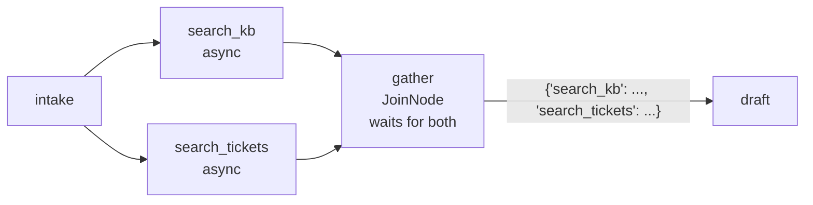

# 2.4 — Two shops at once, and the wait at the door

## One-line answer

A tuple destination fans work out to several nodes that then run at the same time — measured here as
**0.45s against 0.84s** for two searches — and a `JoinNode` is what waits for all of them and hands
the next node a dictionary keyed by which branch produced what.

## The story

Two things are needed before lunch: vegetables, and a gas cylinder booking.

If you go yourself, you go to the market, come home, then go to the gas agency, and come home again.
Two errands, one after the other, and the whole morning gone.

So instead you send your son to the market and your daughter to the gas agency, at the same time. You
stay at the door.

Both errands now take as long as the *slower* one, not both added together. But there is a new rule
that did not exist before, and it is the whole point: **you cannot start cooking until both of them
are back.** Not one. Both. If your daughter is stuck in a queue, the vegetables sitting on the counter
do not help, and starting without her means cooking a meal you cannot finish.

And there is a way to get this badly wrong. If you only sent one child but you are standing at the
door waiting for two, you will wait at that door all afternoon.

## The idea in plain language

**Fan-out** is one node leading to several. You write the destination as a **tuple**:

```python
(intake, (search_kb, search_tickets))
```

**Line by line:**

- The outer tuple is a chain of two elements, so it makes edges from `intake` to whatever comes next.
- The **inner** tuple is the fan-out: two destinations rather than one, so this single item becomes two
  edges, `intake → search_kb` and `intake → search_tickets`.
- Nothing here says "run these in parallel". It says they both follow `intake`, and the concurrency is
  a consequence of neither depending on the other.

Both destinations receive the same `node_input` — the source node's output — and both start
immediately. They run concurrently, which for I/O-bound nodes means the total time is the slowest one
rather than the sum.

**Fan-in** is several nodes leading to one, and this is where a `JoinNode` comes in. A `JoinNode`
is a node type built into the framework whose only job is to **wait for every predecessor** and hand
on what they all produced. Its output is a dictionary: `{"search_kb": ..., "search_tickets": ...}`,
keyed by node name.

Two words, defined properly, because people use them loosely:

- **Concurrent** means several things are in progress at once. It does not require several CPUs; a node
  waiting on a network response is not using the CPU, so another node can run meanwhile. That is what
  `async` gives you.
- **`_requires_all_predecessors`** is the property that makes a `JoinNode` different from an ordinary
  node. An ordinary node with two incoming edges runs **twice** — once per incoming trigger. A
  `JoinNode` runs **once**, after all of them.

The concurrency is real but it has a condition, and this is the part that surprises people: it comes
from `async` nodes. A node written with `def` and a blocking `time.sleep` occupies the loop, and two
of them will not overlap. Write the ones that wait on the network as `async def`, and they will.

**The hazard** — the one the story ends on — is a join that never fires because one of its
predecessors never ran. The `JoinNode` is still waiting, the run finishes anyway, and everything after
the join silently does not happen. That is measured in
[5.2](../05-the-first-graph/5.2-the-cycle-that-finished-early.md).

## Why Sutra needs it

Day 49 built retrieval over the ticket archive and Day 48 designed what to remember. The triage graph
searches *both* — the knowledge base and past tickets — and there is no reason for one to wait for the
other. Fan-out is the difference between a support agent waiting for two searches and waiting for one.

The join then matters for a reason that is about correctness rather than speed. Day 50 measured that
the reply is only as good as the sources it cites, and Day 58's `review` node refuses a draft with
fewer than two sources. That check is only meaningful if `draft` is guaranteed to have seen **both**
searches, which is exactly the guarantee a `JoinNode` provides and an ordinary node does not.

## The mechanism

```python
@node
def intake(node_input: str) -> Event:
    return Event(output=node_input)


@node
async def search_kb(node_input: str) -> Event:
    await asyncio.sleep(DELAY)
    return Event(output=f"3 articles for {node_input!r}")


@node
async def search_tickets(node_input: str) -> Event:
    await asyncio.sleep(DELAY)
    return Event(output=f"2 past tickets for {node_input!r}")


gather = JoinNode(name="gather")


@node
def draft(node_input: dict) -> Event:
    return Event(output=f"draft citing {len(node_input)} sources: {sorted(node_input)}")


parallel = Workflow(
    name="parallel",
    edges=[
        ("START", intake, (search_kb, search_tickets)),
        (search_kb, gather),
        (search_tickets, gather),
        (gather, draft),
    ],
)
```

**Line by line:**

- `async def search_kb` with `await asyncio.sleep(DELAY)` — `async` is what makes the overlap possible.
  With `def` and `time.sleep`, the two searches take 0.84s together instead of 0.45s; that is not a
  guess, it is what the first version of this lab measured before the nodes were made async.
- `("START", intake, (search_kb, search_tickets))` — a chain whose **last element is a tuple**. The
  chain gives `START → intake`, and then the tuple gives `intake → search_kb` *and*
  `intake → search_tickets`. Two edges from one element.
- `gather = JoinNode(name="gather")` — constructed directly, with no function. Its behaviour is
  built in: wait for every predecessor, output a dictionary.
- `(search_kb, gather)` and `(search_tickets, gather)` — the two incoming edges. These are what
  "every predecessor" means: the join waits for exactly the nodes with an edge into it.
- `def draft(node_input: dict)` — annotated `dict`, because that is what a join produces. The keys are
  the predecessor node names.

```bash
cd days/day-53-graph-workflow-runtime/lab
uv run python fanout.py
uv run python fanout.py --serial
```

**Line by line:**

- The default run is the fan-out above. `--serial` builds the same searches as a plain chain —
  `("START", intake, search_kb, search_tickets)` — with no fan-out and no join.
- Both print wall-clock time around the whole run, with `DELAY = 0.4` in each search.

Measured on 2026-09-05:

```text
parallel:
  intake           'sso redirect loop'
  search_kb        "3 articles for 'sso redirect loop'"
  search_tickets   "2 past tickets for 'sso redirect loop'"
  gather           {'search_kb': "3 articles for 'sso redirect loop'", 'search_tickets': "2 past tickets for 'sso redirect loop'"}
  draft            "draft citing 2 sources: ['search_kb', 'search_tickets']"
  5 events
  wall clock: 0.45s for two 0.4s searches
```

**0.45s for two 0.4s searches.** They overlapped. And look at the `gather` event: a dictionary with
both results, keyed by which node produced each one. `draft` did not have to know how many searches
there were or in what order they finished.

Now the same work in a straight line:

```text
serial:
  intake           'sso redirect loop'
  search_kb        "3 articles for 'sso redirect loop'"
  search_tickets   '2 past tickets for "3 articles for \'sso redirect loop\'"'
  3 events
  wall clock: 0.84s for two 0.4s searches
```

0.84s — almost exactly double. But look harder at the second line, because there is a worse problem
than the time. `search_tickets` searched for `'3 articles for ...'` — **the output of `search_kb`**.
Chaining them did not just serialise the work; it fed one search the other's results, because that is
what an edge does. The serial version is not a slower correct answer. It is a wrong answer.



## When it breaks

The dangerous failure is the door you are waiting at for a child you never sent. Wire the join so that
one route triggers only *one* of its predecessors:

```text
starved:
  classify_quiet   'Checkout is DOWN'
  search_tickets   'ticket:4610'
  2 events
  exit code will be 0 either way
```

Two events. The join never fired, `draft` never ran, and the run finished successfully. Both searches
are reachable — from *some* route — so the graph is perfectly valid and nothing is rejected. It is
just that on this path only one predecessor was triggered, and a `JoinNode` waits for all of them.

The fixed version, with one edge to each search carrying **both** route labels:

```text
fed:
  classify_quiet   'Checkout is DOWN'
  search_kb        'KB-104'
  search_tickets   'ticket:4610'
  gather           {'search_kb': 'KB-104', 'search_tickets': 'ticket:4610'}
  draft            "draft citing ['search_kb', 'search_tickets']"
  5 events
```

Five events instead of two. The difference between these two graphs is `route=["incident", "question"]`
on two edges, which is the explicit-`Edge` form from
[2.2](2.2-the-chain-that-is-a-list-of-edges.md) — the routing-map sugar cannot express it.

The rule to carry away: **every predecessor of a join must be triggered on every route that can reach
the join.** If a branch can reach a join without triggering all its inputs, that branch dies there.

The second break is using an ordinary node where you meant a join. An ordinary node with two incoming
edges does not wait — it runs **once per incoming trigger**:

```text
ordinary node with two incoming edges:
  intake           'x'
  a                'A'
  b                'B'
  draft            "draft from 'A'"
  draft            "draft from 'B'"
  5 events
```

`draft` appears twice, once with each branch's output, and neither run ever saw the other branch. On
the desk that is two replies sent to one customer. There is no error and no warning; there are simply
two answers where you expected one, and the only visible symptom is a node name appearing twice in a
list nobody reads.

## In production

**What a professional writes instead.** They use a join wherever two branches converge, even when
today only one branch can be active, because "only one can be active" is a property of the current
routing and routing changes. They also keep fan-out width small and known: a tuple of three is a
design, a tuple built from a list of unknown length is a load test you did not schedule.

**What degrades at scale.** Fan-out multiplies concurrent work, and when the fanned-out nodes are model
calls, it multiplies requests per second at your provider. Two parallel Gemini calls on a free tier is
two requests against the same per-minute quota arriving in the same instant — the shape most likely to
produce a 429. `max_concurrency` on the `Workflow` caps graph-scheduled parallelism and is the knob to
reach for; Day 70's quota router is the real answer.

**The failure that only appears with real traffic.** One branch of a fan-out is fast and one is slow,
and the join means every request pays the slow one. Locally both are 40ms. In production the archive
search hits a cold index once in fifty and takes four seconds, and now one request in fifty takes four
seconds *even though the other branch finished instantly*. A join converts a tail latency problem in
one branch into a tail latency problem for the whole graph — which is the argument of
[the tail at scale](../../../day-44-client-hardening/papers/01-the-tail-at-scale.md), met on Day 44 and
now visible in your own graph. Timeouts on the branches, not only on the whole run.

**The review comment a senior engineer leaves:** *"`draft` has two incoming edges and is not a join, so
it runs twice and we send two replies. It has not happened yet because `search_tickets` is behind a
route that is almost never taken. Put a `JoinNode` in front of it."*

**The interview question:** *"How do you run two steps in parallel and then combine them?"* An answer
with the trap in it: *"Fan out with a tuple destination and fan in with a join node — the join waits
for every predecessor and gives the next node a dict keyed by branch. Two things bite. The nodes have
to be `async` or they will not actually overlap, which you only discover by timing it. And a join
waits for **all** its predecessors, so if a conditional route reaches the join while triggering only
one of them, the join never fires and everything downstream is silently skipped — exit code zero,
half the work done."*

## Check yourself

```bash
cd days/day-53-graph-workflow-runtime/lab
uv run python fanout.py
uv run python fanout.py --serial
```

Now change `search_kb` from `async def` to `def` and its `await asyncio.sleep` to `time.sleep`, and
re-run the parallel version. Write down the new wall-clock time.

**Out loud, without scrolling up:** what does a `JoinNode` wait for, and what happens to everything
after it if one of those never arrives?

**Next:** [2.5 — On the edge or in the register](2.5-on-the-edge-or-in-the-register.md).
