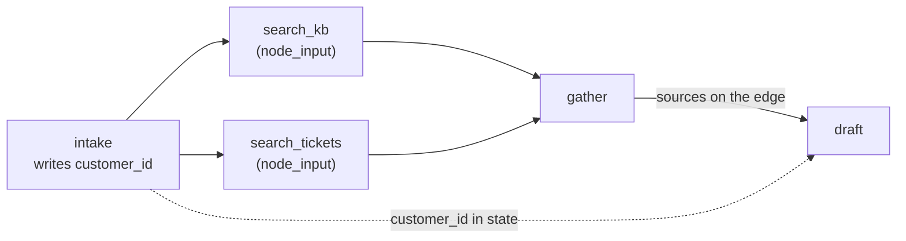

# 2.5 — On the edge or in the register

## One-line answer

Put a value on the edge when the very next node consumes it, and in `ctx.state` when a later node needs
it but the nodes in between do not — because anything you put on the edge becomes a parameter every
node along the way has to carry and none of them can be reused without.

## The story

The school trip needs two pieces of paper, and they travel completely differently.

The **permission slip** goes with the child. It is signed at home, it goes into the bag, it is handed
to the teacher at the bus. It is about this child and this trip, and once the trip is over it is
finished. Every child carries their own, and if a child does not have one, that child does not get on
the bus — the slip and the child travel together and the absence is immediately obvious.

The **emergency contact number** does not travel at all. It has been in the school register since
admission. The teacher does not ask twenty-eight children to bring it. If something happens on the
trip, she phones the school office and the office reads it out.

Nobody decided this by policy. It settled itself. A thing that is about *this trip* travels with the
trip. A thing that is about *the child, always* lives in the register and is looked up when needed.

And you can see what happens when it goes the other way. Ask every child to bring the emergency number
on a slip and three of them will forget, two will bring last year's, and the teacher now has
twenty-eight pieces of paper to keep track of instead of one phone call.

## The idea in plain language

[1.3](../01-the-node/1.3-what-arrives-at-a-node.md) established that a node can read from two places.
This part is the rule for choosing.

**On the edge** (`Event(output=...)` → the next node's `node_input`):

- the next node genuinely consumes it;
- it is about *this step of this run*;
- the value is small.

**In state** (`ctx.state[key]`):

- a node further along needs it and the nodes in between do not;
- it is about the run as a whole — the customer, the ticket id, the classification;
- several branches need to see it.

The test that settles almost every case: **would the node in the middle have to grow a parameter it
never reads?** If yes, the value belongs in state.

There is a real cost to getting it wrong in the "edge" direction, and it is not aesthetic. A node whose
signature contains a value it does not use:

- cannot be tested without inventing that value;
- cannot be reused in another graph that has no such value;
- cannot be cached on its real inputs, because its signature lies about what they are;
- makes every future reader wonder what it does with it.

And there is a real cost in the "state" direction too, which
[3.3](../03-the-graph-is-checked/3.3-the-switch-that-turns-nothing-on.md) and
[5.2](../05-the-first-graph/5.2-the-cycle-that-finished-early.md) both circle: **state has no
dependency information.** An edge is checked — the graph knows `draft` runs after `research`. Nothing
checks that the node which was supposed to set `customer_id` ever ran. Put something in state and you
have taken it out of the part of the system that can be validated.

So the rule is not "state is nicer". It is: use the edge when you can, because it is checked, and use
state when the edge would force an unrelated node to carry cargo.

## Why Sutra needs it

The triage graph has exactly the shape that forces the choice. `intake` learns the customer id. `draft`
needs it, four nodes later, to address the reply. Between them are two search nodes whose entire job is
*"given this text, find similar things"*.

Thread the customer id along the edge and `search_kb` grows a parameter it never reads, which means the
retrieval work from Day 49 — which is generic, cacheable and tested on its own — becomes a function
that needs a customer to run. That is a real loss for no gain.

## The mechanism

The full fan-out from [2.4](2.4-two-shops-at-once.md), with the customer id going the other way.

```python
@node
def intake(node_input: str, ctx: Context) -> Event:
    """The customer id is needed by the last node, but not by the two in between."""
    ctx.state["customer_id"] = "cust-4610"
    return Event(output=node_input)


@node
async def search_kb(node_input: str) -> Event:
    return Event(output="KB-104")


@node
async def search_tickets(node_input: str) -> Event:
    return Event(output="ticket:4610")


gather = JoinNode(name="gather")


@node
def draft(node_input: dict, ctx: Context) -> Event:
    """Reads sources off the edge and the customer id out of state."""
    return Event(
        output={
            "from_edge": sorted(node_input.values()),
            "from_state": ctx.state.get("customer_id"),
        }
    )
```

**Line by line:**

- `ctx.state["customer_id"] = "cust-4610"` in `intake` — written once, at the top of the run, by the
  node that learns it.
- `async def search_kb(node_input: str)` — **one parameter.** No `ctx`, no customer, nothing about who
  is asking. This signature is the entire argument of the part: it says exactly what the node needs and
  nothing else, so it can be tested with a string and reused anywhere.
- `def draft(node_input: dict, ctx: Context)` — asks for both channels, because it genuinely needs
  both: the sources came down the edge, the customer came from the register.
- `ctx.state.get("customer_id")` — `.get` is used here to *show* the value. In real code a required key
  should be `ctx.state["customer_id"]`, so a missing one raises instead of writing "Dear None"
  ([1.3](../01-the-node/1.3-what-arrives-at-a-node.md)).
- `sorted(node_input.values())` — the join's dictionary, values only, sorted so the output is stable
  between runs. Stability matters more than it sounds: an output that reorders itself makes every
  test flaky and every diff noisy.

```bash
cd days/day-53-graph-workflow-runtime/lab
uv run python carry.py
```

**Line by line:**

- `carry.py` prints only the final node's output, split by where each half came from, so the two
  channels are visible side by side.

Measured on 2026-09-05:

```text
  what draft assembled:
    from_edge    ['KB-104', 'ticket:4610']
    from_state   'cust-4610'

  search_kb never mentioned the customer id, and never had to.
```

Both halves arrived. The sources came along the edge through the join; the customer id came out of
state, having skipped two nodes entirely.

The last line is the deliverable. `search_kb`'s signature is `(node_input: str)`. It can be called with
a string in a unit test, reused in Day 58's graph and in whatever Day 79's eval harness wants, and
cached on its input — none of which is true of a function that also takes a customer id it ignores.



The dotted line crosses over the two search nodes without touching them. That is the picture of the
rule.

## When it breaks

The break is silent and it is the same one every time: a state key that was never written, because the
node that writes it is on a branch that did not run.

```text
    state       = {}
```

`ctx.state.get("customer_id")` returns `None`, and `draft` writes *"Dear None"* into a reply that goes
to a customer. Nothing raised. Nothing was logged.

This happens because — to say it once more, since it is the price of using state at all — **the graph
validates edges and does not validate state.** It knows `draft` runs after `gather`. It has no idea
that `draft` reads a key that only `intake` writes, and no way to notice when `intake` was skipped.

Three defences, in increasing order of strength:

1. **`ctx.state[key]`, not `.get(key)`**, for anything required. A `KeyError` naming the missing key is
   an infinitely better outcome than "Dear None".
2. **A `state_schema` on the workflow** — a Pydantic model listing the keys and their types. A
   `FunctionNode` parameter that is not a declared field then raises `StateSchemaError` **when the
   graph is built**, so a typo cannot reach production.
3. **Write it as early as possible**, ideally in the node right after `START`, which every route
   passes through. A key written before the first branch cannot be missing on any branch.

## In production

**What a professional writes instead.** A `state_schema`, always, on any graph with more than a couple
of state keys — it is the only thing that turns state from an untyped shared dictionary into something
the framework can check. They also namespace: `triage.customer_id` rather than `customer_id`, so a
sub-workflow added later cannot collide with a key it has never heard of.

**What degrades at scale.** State is persisted with the session
([Day 47](../../../day-47-persistent-sessions/parts/01-what-restart-costs/1.1-the-book-under-the-shutter.md)),
so every key is a write and every key you never remove is carried forever. Putting the *text* of
retrieved documents in state rather than their ids is the classic version: the session grows by
kilobytes per run and every load pays for it. Ids in state, text on the edge, text discarded when the
node that needs it has finished.

**The failure that only appears with real traffic.** Two nodes in a fan-out writing the same state key.
Locally one always finishes first and the result looks deterministic; in production it depends on which
network call returns first, and the value is a coin flip that nobody can reproduce. Parallel branches
write to *different* keys, and a node after the join combines them.

**The review comment a senior engineer leaves:** *"`search_kb(node_input, customer_id)` — it does not
use `customer_id`. It is being threaded through so `draft` can have it. Put it in state at `intake`
and take it off the signature, and then delete the four test fixtures that only exist to supply a
customer id to a search function."*

**The interview question:** *"You have a value the first step knows and the last step needs. How do you
get it there?"* The answer that shows the trade-off: *"Session state, not the edge — otherwise every
node in between grows a parameter it never reads, and those nodes stop being reusable or testable on
their own. The cost is that state is not checked: the graph validates edges, so it knows the order of
nodes, but nothing tells it that a key was supposed to be written by a node on a branch that did not
run. So I read required keys with `state[key]` rather than `.get`, declare a `state_schema` so typos
fail at build time, and write the value in the first node after START so no branch can skip it."*

## Check yourself

```bash
cd days/day-53-graph-workflow-runtime/lab
uv run python carry.py
```

Now delete the `ctx.state["customer_id"] = ...` line from `intake` and run it again. Then change
`draft` to use `ctx.state["customer_id"]` instead of `.get(...)` and run it a third time. Compare the
two failures.

**Out loud, without scrolling up:** state the one-sentence test for whether a value goes on the edge
or in state, and name the thing you give up by using state.

**Next:** [3.1 — Tested before the mains go on](../03-the-graph-is-checked/3.1-tested-before-the-mains-go-on.md).
