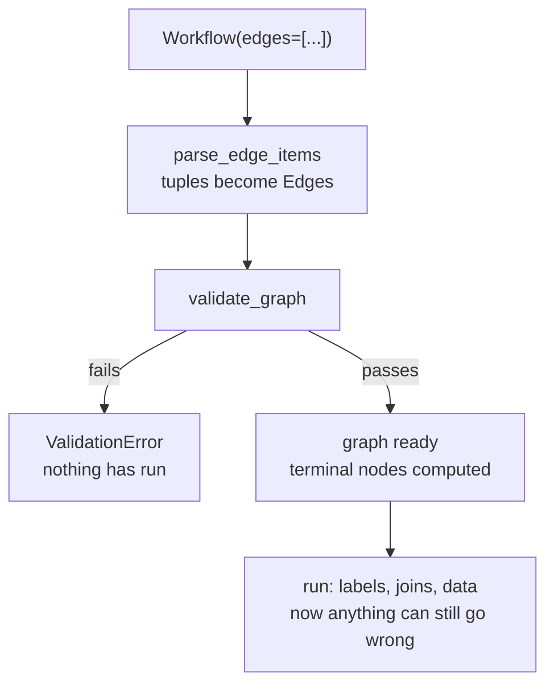

# 3.1 — Tested before the mains go on

## One-line answer

The graph is validated when you construct the `Workflow`, not when you run it — six different mistakes
are rejected before a single node executes, and every one of them would otherwise have been a
production incident rather than a startup error.

## The story

The electrician finishes the new points in the back room and does not switch on the mains.

He gets out a small device, touches it to each point in turn, and watches a light. Live, neutral,
earth. He does the loop with the main switch still down, because the question he is answering is not
*"does the fan work"* — it is *"is any of this wired in a way that would be dangerous the moment it
had power"*.

Two of the points are fine. On the third the light comes up wrong, and he takes the plate off and finds
that the earth was never connected — the wire is there, stripped, tucked behind, and not in the
terminal. It would have worked. The fan would have spun. It would have worked for four years and then
one wet morning it would not have.

He fixes it, tests again, and only then puts the mains up.

The whole value of what he did is that the fault was found while nothing had power. Once the mains are
up, the same fault is not a light on a meter. It is a person.

## The idea in plain language

When you call `Workflow(name=..., edges=[...])`, the framework does not merely store your edges. It
**builds the graph and checks it**, and if the check fails, the constructor raises. Nothing runs.

There are two very different classes of mistake, and this is the line between them:

- **Structural mistakes** are visible in the shape of the graph alone: a missing `START`, a node
  nothing reaches, two edges between the same pair, a cycle nobody can leave. These are caught here.
- **Behavioural mistakes** need a run and some data: a label spelled `INCIDENT` instead of `incident`,
  a join with a starved predecessor. These cannot be caught by looking at the shape, because the shape
  is legal. Section 5 is where you meet them.

Knowing which is which is the practical takeaway. If the graph *builds*, you know your wiring is
well-formed. You know nothing at all about whether it is right.

Six checks run, in this order (verified against `google-adk==2.7.1` by triggering each one, and named
in the framework's own validation module):

| Check | The mistake |
| --- | --- |
| duplicate node names | two different node objects sharing a name |
| `START` present | no entry point |
| `START` edges unrouted | an edge from `START` that can never match |
| connectivity | a node unreachable from `START`, or an edge pointing *at* `START` |
| duplicate edges | two edges between the same pair |
| `DEFAULT_ROUTE` sanity | two "otherwise" edges from one node |
| unconditional cycles | a loop with no routed edge, which could never end |
| schema compatibility | `output_schema` of one node not matching the next node's `input_schema` |
| chat-agent wiring | a `mode="chat"` agent given a non-`START` predecessor |

That is more than six; the point is that the list is long and it costs you nothing.

**Where the error surfaces** is worth one line, because it confuses people the first time. `Workflow` is
a Pydantic model, so a `ValueError` raised during validation comes back wrapped as a
`pydantic_core.ValidationError`. The sentence you care about is the one after `Value error,`.

## Why Sutra needs it

Day 58 builds a nine-node graph, and Days 57, 60, 62, 63 and 70 each add to it. Every one of those
edits is a chance to point an edge at the wrong node or leave one dangling.

The alternative to build-time validation is not "no validation" — it is validation by production
traffic, one path at a time, over weeks, with the paths nobody exercises silently broken. Sutra's
`./m check` gate builds the graph, which means these checks run in CI for free, which means a
mis-wired graph never reaches a commit.

## The mechanism

Six deliberately broken graphs, each constructed inside a `try`, so all six messages appear together.

```python
BAD_GRAPHS = {
    "no START": [(intake, classify)],
    "unreachable node": [("START", intake), (draft, review)],
    "duplicate edge": [("START", intake, classify), (intake, classify)],
    "route on a START edge": [("START", {"urgent": intake})],
    "unconditional cycle": [("START", intake, classify), (classify, intake)],
    "two DEFAULT_ROUTEs": [
        ("START", classify),
        (classify, {DEFAULT_ROUTE: draft}),
        (classify, {DEFAULT_ROUTE: review}),
    ],
}


def first_value_error(exc: Exception) -> str:
    """Pydantic wraps our ValueError; the sentence we care about is the one after 'Value error, '."""
    for line in str(exc).splitlines():
        if "Value error, " in line:
            return line.split("Value error, ", 1)[1].split(" [type=")[0].strip()
    return str(exc).splitlines()[0]
```

**Line by line:**

- Each value is an `edges` list and nothing more. No nodes were changed between cases; only the wiring
  differs, which is the point — every one of these is a wiring mistake.
- `"no START"` omits the entry point entirely. `"unreachable node"` wires `draft → review` with nothing
  leading to `draft`.
- `"duplicate edge"` writes `intake → classify` twice: once inside the chain, once on its own. This is
  the mistake from [2.2](../02-the-edge/2.2-the-chain-that-is-a-list-of-edges.md), and it is easy to
  make when adding a route to a pair that already has an edge.
- `first_value_error` digs the real sentence out of the Pydantic wrapper. It is a helper for *reading*
  the error, not for handling it — never catch these in real code; a graph that does not validate must
  not start.

```bash
cd days/day-53-graph-workflow-runtime/lab
uv run python validate.py
```

**Line by line:**

- `validate.py` constructs each broken graph in turn and prints the extracted sentence. Six
  constructions, zero runs, no model calls.

Measured on 2026-09-05:

```text
  no START
      Graph validation failed. START node (name: '__START__') not found in graph nodes.
  unreachable node
      Graph validation failed. The following nodes are unreachable from START: ['draft', 'review']
  duplicate edge
      Graph validation failed. Duplicate edge found: from=intake, to=classify
  route on a START edge
      Graph validation failed. Edges from START must not have routes (edge to intake has route urgent).
  unconditional cycle
      Graph validation failed. Unconditional cycle detected: intake -> classify -> intake. Cycles must include at least one conditional (routed) edge to avoid infinite loops.
  two DEFAULT_ROUTEs
      Graph validation failed. Multiple DEFAULT_ROUTE edges found from node classify to draft and review
```

Read them as a set. Every message **names the specific nodes involved** — `['draft', 'review']`,
`from=intake, to=classify`, `intake -> classify -> intake`. That is unusual and worth appreciating: a
validation error that says "the graph is invalid" costs you an hour, and one that prints the offending
cycle costs you a minute.

Note what none of these needed: an input, a session, a model, or a run. Six classes of bug found for
the price of constructing an object.



## When it breaks

The interesting failure of this section is not a validation error. It is the thing validation **does
not** catch, and reading the six messages above can leave you with more confidence than you have
earned.

Here is a graph that passes every one of those checks:

```text
typo:
  classify_shouting 'Checkout is DOWN'
  1 events
```

`START` is present. Every node is reachable. No duplicate edges, no cycle, one default route or none.
The graph is *structurally perfect* and it does nothing, because the node emits `"INCIDENT"` and the
edge says `"incident"` ([2.3](../02-the-edge/2.3-a-label-not-an-address.md)).

There is a second one, and it is worse because the graph looks even more correct:

```text
starved:
  classify_quiet   'Checkout is DOWN'
  search_tickets   'ticket:4610'
  2 events
```

Every node reachable, every edge unique, no cycles — and a `JoinNode` waiting for a predecessor this
route never triggered. Everything after the join is skipped.

**Validation checks the shape, not the behaviour.** The shape can only be wrong in a fixed number of
ways, and the framework knows all of them. The behaviour can be wrong in as many ways as your data has
shapes, and that is what evals are for. Both failures above are measured in
[5.2](../05-the-first-graph/5.2-the-cycle-that-finished-early.md).

## In production

**What a professional writes instead.** They construct the graph in a test — one test, three lines,
`build_triage_graph()` and no assertions — so that every one of these checks runs in CI on every
commit. It is the cheapest test in the suite and it catches an entire category. They also never
construct the graph at import time, so a validation failure is a clear error from the thing that asked
for a graph rather than an import error somewhere unrelated.

**What degrades at scale.** Validation is O(nodes + edges) with a depth-first search for cycles, so it
is irrelevant for any graph a human wrote. What degrades is trust: a team that has seen these errors
only as "the graph is broken again" starts wrapping construction in a `try/except` to get the service
up, and then a genuinely mis-wired graph runs in production with half its branches dead. If a graph
does not validate, the service must not start.

**The failure that only appears with real traffic.** Not this. That is the point of the section, and
it is the honest limit of it: these checks buy you a guarantee about the shape and none whatsoever
about the outcome. A team that reads a green build as "the workflow is correct" has misunderstood what
was checked.

**The review comment a senior engineer leaves:** *"There is a `try/except ValidationError` around
`build_triage_graph()` that logs a warning and returns `None`. Delete it. A graph that does not
validate is a bug we want loudly at deploy, and right now it becomes an `AttributeError` on
`None.graph` three files away at the first request."*

**The interview question:** *"What does your workflow engine check before it runs anything?"* An
answer that also states the limit: *"The shape — a `START` node exists and nothing points at it, every
node is reachable, no duplicate edges, at most one default route per node, and no cycle without a
routed edge to leave by. It raises at construction, so it lands at deploy rather than at 3am, and the
messages name the offending nodes. What it deliberately cannot check is behaviour: a route label
misspelled in the node, or a join whose predecessor was never triggered, produce a structurally
perfect graph that quietly does half the work. Shape is validated; correctness is what the evals are
for."*

## Check yourself

```bash
cd days/day-53-graph-workflow-runtime/lab
uv run python validate.py
```

Now add a seventh entry to `BAD_GRAPHS` that points an edge **at** `START` — `(intake, "START")` — and
read the message you get.

**Out loud, without scrolling up:** name two mistakes that are caught when the graph is built and two
that can only be caught by running it.

**Next:** [3.2 — Both waiting for the other to leave](3.2-both-waiting-for-the-other-to-leave.md).
