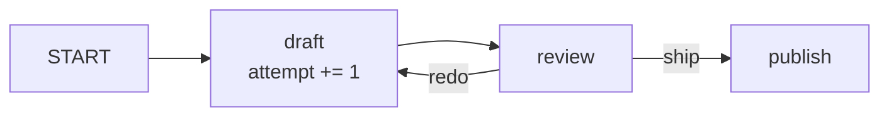

# 3.2 — Both waiting for the other to leave

## One-line answer

A cycle in the graph is allowed only if at least one edge in it carries a route, because a loop made
entirely of unconditional edges has no way to stop — and the framework refuses to build one, naming
the exact cycle it found.

## The story

Two friends have agreed to meet at the cinema and neither of them has left the house.

He is waiting because she said she would message when she starts. She is waiting because he said he
would message when he starts. Both are ready, both are near the door, and both are entirely reasonable
people following a rule that made sense when they agreed it.

The film starts at seven. At seven fifteen one of them phones, and the whole thing dissolves in ten
seconds and a bit of laughing, because a phone call is an escape hatch that the original arrangement
did not have.

That is the only difference between an arrangement that works and this one. Not who was at fault. Not
how sensible each rule was on its own. Whether there was any way out of the loop other than waiting.

## The idea in plain language

A **cycle** is a path through the graph that comes back to where it started: `draft → review → draft`.

Cycles are not forbidden, and they should not be. A cycle is how you say *"revise it until it is good
enough"*, which is a thing real processes do constantly — Day 57's Writer↔Critic pattern is exactly
this shape.

What is forbidden is a cycle made **entirely of unconditional edges**. An edge with `route=None` fires
every time its source finishes ([2.3](../02-the-edge/2.3-a-label-not-an-address.md)). So a loop of
nothing but unconditional edges is a loop in which every step always happens, which means it never
stops. Not "might not stop" — cannot stop.

The rule the framework enforces:

> **Every cycle must include at least one routed edge.**

A routed edge fires only when the node emits a matching label, so it is a place where the loop *can*
choose not to continue. It is the phone call.

Two terms, since both will be used again on Day 54 and Day 59:

- A **conditional** or **routed** edge is one with a `route`. It is the potential exit.
- The check itself is a **depth-first search** over the unconditional edges only: the framework walks
  the graph following just the `route=None` edges, and if that walk ever revisits a node still on the
  current path, it has found an inescapable loop.

Note the sharpness of that second point. The framework does not ask "is this loop bounded?" — it cannot
know that, since your counter lives in `ctx.state`. It asks a much narrower question with a definite
answer: *is there any edge in this cycle that might not fire?* That is a static property of the wiring.
It is also the reason this check has no false positives and does not catch every real infinite loop:
[3.1](3.1-tested-before-the-mains-go-on.md)'s distinction between shape and behaviour, again.

## Why Sutra needs it

Day 57 builds Writer↔Critic: `draft → review`, and `review` sends it back to `draft` when it is not
good enough. That is a cycle, and Sutra needs it to be expressible.

Day 59 is the phase gate on runaway agents and containment (SEC-04). A loop that cannot terminate is
the cheapest runaway there is: no model call, no cost signal, just a process that never finishes. The
graph refusing to build one is the first and weakest layer of that containment — weakest because it
only catches the loop that could *never* end, not the one that ends after nine hundred iterations.
Day 59 supplies the rest.

## The mechanism

A legal loop first — draft, review, and a routed edge that leaves — so you can see one that works.

```python
MAX_ATTEMPTS = 3


@node
def draft(node_input: str, ctx: Context) -> Event:
    attempt = ctx.state.get("attempt", 0) + 1
    ctx.state["attempt"] = attempt
    return Event(output=f"draft v{attempt}")


@node
def review(node_input: str, ctx: Context) -> Event:
    """The routed edge. 'redo' goes back to draft; 'ship' leaves the loop."""
    attempt = ctx.state.get("attempt", 0)
    verdict = "ship" if attempt >= MAX_ATTEMPTS else "redo"
    return Event(output=f"{node_input} reviewed -> {verdict}", route=verdict)


legal = Workflow(
    name="legal_loop",
    edges=[("START", draft, review), (review, {"redo": draft, "ship": publish})],
)
```

**Line by line:**

- `ctx.state.get("attempt", 0) + 1` — the counter lives in **state**, not in a Python variable, because
  each pass through `draft` is a fresh call and a local would reset. This is the state-versus-edge
  choice from [2.5](../02-the-edge/2.5-on-the-edge-or-in-the-register.md) with an obvious answer: the
  attempt count is about the run, not about this handover.
- `route=verdict` where `verdict` is `"redo"` or `"ship"` — one edge back into the loop, one out. The
  *existence* of `"ship"` is what makes the cycle legal; the *value* of `MAX_ATTEMPTS` is what makes it
  terminate. The framework checks the first and cannot check the second.
- `(review, {"redo": draft, "ship": publish})` — the back edge and the exit edge, declared together.
  Seeing them side by side is the reason to write routing maps rather than two separate `Edge` objects
  here.
- `("START", draft, review)` gives `START → draft` and `draft → review`, both unconditional. Only one
  edge in the cycle is routed, and one is enough.

```bash
cd days/day-53-graph-workflow-runtime/lab
uv run python cycle.py
uv run python cycle.py --illegal
```

**Line by line:**

- The first command runs the legal loop. The second builds the same graph with `(review, draft)` — the
  back edge with no route — and prints the validation error.

Measured on 2026-09-05:

```text
loop with MAX_ATTEMPTS=3:
  draft            'draft v1'
  review           'draft v1 reviewed -> redo'
  draft            'draft v2'
  review           'draft v2 reviewed -> redo'
  draft            'draft v3'
  review           'draft v3 reviewed -> ship'
  publish          'published: draft v3 reviewed -> ship'
  7 events
```

Seven events from a four-node graph. `draft` appears three times and `review` three times, because the
loop went round three times — the same two node objects, run repeatedly. Then `review` emitted `"ship"`
instead of `"redo"`, the exit edge opened, and `publish` ran.

Now the illegal version, where the back edge has no route:

```text
Graph validation failed. Unconditional cycle detected: draft -> review -> draft. Cycles must include
at least one conditional (routed) edge to avoid infinite loops.
```

It names the cycle. `draft -> review -> draft`, in order, so you know exactly which back edge to put a
route on. And it never ran: this is a construction-time error, so the loop that would have spun forever
did not get one iteration.



The `redo` arrow is the cycle. The `ship` arrow is why it is allowed.

## When it breaks

The break that the check cannot see is the loop that *is* routed and still never ends. Take the legal
graph above and get the counter wrong:

```python
@node
def draft(node_input: str, ctx: Context) -> Event:
    attempt = ctx.state.get("attempt", 0) + 1
    return Event(output=f"draft v{attempt}")  # never writes it back
```

**Line by line:**

- The read is there, the increment is there, and the write is gone. `ctx.state["attempt"]` stays unset.
- `review` therefore sees `0` every time, `verdict` is always `"redo"`, and the `"ship"` edge is never
  taken.

The graph validates — there is a routed edge in the cycle, exactly as required. And then it runs
forever, producing `draft v1` over and over, writing an event each time into a session that grows
without limit. The only signals are a process that does not return and a session file that keeps
growing.

This is the shape of a real runaway, and it is why Day 59 exists. Three defences, none of which is
validation:

1. **A hard iteration cap**, checked in the node, that raises rather than routing. A loop that can only
   end when a condition is met will one day meet a condition that is never met.
2. **A `timeout` on the workflow**, so a stuck run dies rather than living.
3. **An alert on run duration**, because the failure has no error text at all — the only observable is
   that it did not stop.

The second, smaller break is thinking `START` can be in a cycle. It cannot:

```text
Graph validation failed. START node must not have incoming edges.
```

## In production

**What a professional writes instead.** Two independent stopping conditions on every loop: the
semantic one (`review` says ship) and a hard counter that routes to a failure path when exceeded.
They are not redundant. The semantic condition is the one you want; the counter is the one that saves
you when the semantic condition is computed from a model's opinion and the model has decided that
nothing is ever good enough. The counter's exit goes somewhere visible — a human queue — never to
`publish`.

**What degrades at scale.** Every iteration of a loop is a full pass through its nodes, so a loop over
model calls multiplies cost by its iteration count, and the iteration count is data-dependent. A
Writer↔Critic loop that averages 1.2 passes in testing and 4 passes on messy real tickets is a
threefold cost increase that no code change caused. Loops are where quota goes; Day 24's budget
accounting has to include an expected iteration count, not just a per-node cost.

**The failure that only appears with real traffic.** The loop that terminates for every input you
tested and not for one class of input you did not. A critic asked to approve a draft citing at least
two sources will loop forever on a ticket where the archive has only one relevant document — and that
ticket is rare, so it appears in production, months later, as one hung run rather than an outage.
Cap the iterations.

**The review comment a senior engineer leaves:** *"The only exit from this loop is the critic saying
approved. Add a counter and route to the human queue at three. Also `attempt` is read from state and
written in the same node — check the write actually happens on every path, because the early return at
line 40 skips it."*

**The interview question:** *"Can your workflow graph have cycles?"* An answer that shows the edge
cases: *"Yes, and the framework requires that at least one edge in the cycle is routed — an
unconditional loop is rejected at construction with the cycle printed out. That check is narrow on
purpose: it proves the loop *can* be left, not that it *will* be. My counter lives in session state,
and if I forget to write it back the graph still validates and then runs forever with no error
message at all. So loops get two exits: the semantic one and a hard iteration cap that routes
somewhere a human looks."*

## Check yourself

```bash
cd days/day-53-graph-workflow-runtime/lab
uv run python cycle.py
uv run python cycle.py --illegal
```

Now set `MAX_ATTEMPTS = 1` and count the events. Then comment out the `ctx.state["attempt"] = attempt`
line and be ready to press Ctrl-C.

**Out loud, without scrolling up:** what exactly does the cycle check prove, and name one infinite loop
it would happily allow.

**Next:** [3.3 — The switch that turns nothing on](3.3-the-switch-that-turns-nothing-on.md).
