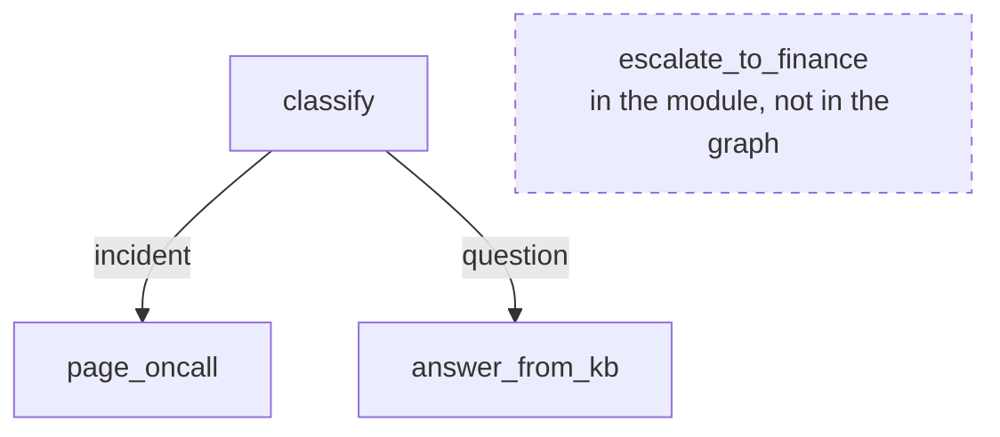

# 3.3 — The switch that turns nothing on

## One-line answer

A node that is half-wired — it has an outgoing edge and nothing leading to it — is rejected at
construction; a node that is **not wired at all** is not in the graph, produces no error of any kind,
and the work it was written to do simply never happens.

## The story

There is a switch in the hallway that turns nothing on.

Everyone in the house knows about it. Guests flip it and look up at the ceiling, and somebody says
*"oh, that one doesn't do anything"*, and that is the end of it. It has been like that since before
you moved in.

Somebody wired that switch. They ran the cable, they fixed the box in the wall, they screwed the plate
on. It works perfectly — flip it and the contacts close, exactly as designed. What was never done is
the other end. There is a light fitting in the store room, or there was going to be, and the cable
that would have connected them is in the wall doing nothing, or was never pulled through at all.

Nobody will ever fix this, because nothing is broken. Every test you could run on that switch passes.
The fault is not in any component; it is in the *absence* of a connection, and absences do not show up
on a meter.

## The idea in plain language

There are two ways for a node to be disconnected, and they have completely different outcomes.

**Half-wired**: the node appears in at least one edge, but there is no path to it from `START`. The
connectivity check walks outward from `START` and lists everything it did not reach. This is caught,
loudly, at construction:

```text
Graph validation failed. The following nodes are unreachable from START: ['escalate_to_finance']
```

**Not wired at all**: the node appears in **no edge**. And here is the fact that catches people —
`Graph` builds its node list *from the edges*. A node that is in no edge is therefore not in the
graph. The framework is not being lax; it genuinely does not know the node exists, any more than the
house knows about a light fitting that was never installed.

So the connectivity check has a blind spot with a precise shape: **it can only tell you about nodes it
knows about, and it only knows about nodes you wired.**

This is the same category as [2.3](../02-the-edge/2.3-a-label-not-an-address.md)'s unmatched route and
[2.4](../02-the-edge/2.4-two-shops-at-once.md)'s starved join: a failure of *absence*. Absences are the
hardest failures in any system, because every test is a test of something that is there.

## Why Sutra needs it

The realistic version is not a demo node. It is a Friday afternoon.

Someone writes `escalate_to_finance` because billing tickets need to go to a different team. They write
it well: it is tested, it has a docstring, its unit test passes. They add the route to the classifier.
They forget the edge. The pull request is reviewed by someone reading the *node*, which is correct, and
merged.

Nothing fails. `./m check` is green. The tests pass. Billing tickets keep going to the knowledge-base
answerer, which produces a confident and useless reply, and the first person to notice is a customer
six weeks later.

Day 58 has nine nodes and Days 57 through 70 add more. This will happen unless something structural
prevents it.

## The mechanism

Two graphs. One forgets the node entirely; the other half-wires it.

```python
@node
def escalate_to_finance(node_input: str) -> Event:
    """Written, reviewed, merged - and wired to nothing."""
    return Event(output="forwarded to finance")


def orphaned() -> Workflow:
    """escalate_to_finance appears in no edge at all. Never built, never noticed."""
    return Workflow(
        name="orphaned",
        edges=[
            ("START", classify),
            (classify, {"incident": page_oncall, "question": answer_from_kb}),
        ],
    )


def disconnected() -> Workflow:
    """escalate_to_finance has an outgoing edge but no incoming one. Build fails."""
    return Workflow(
        name="disconnected",
        edges=[
            ("START", classify),
            (classify, {"incident": page_oncall, "question": answer_from_kb}),
            (escalate_to_finance, {DEFAULT_ROUTE: answer_from_kb}),
        ],
    )
```

**Line by line:**

- In `orphaned`, the node object exists in the module and is referenced by nothing in `edges`. This is
  the exact state of a real forgotten node.
- In `disconnected`, the node has an **outgoing** edge — someone wired the second half — but nothing
  points at it. That is enough for the framework to know it exists and to notice it is unreachable.
- The classifier is identical in both, and it can emit `"billing"`; neither graph has an edge for that
  label. The `orphaned` run below therefore also demonstrates
  [2.3](../02-the-edge/2.3-a-label-not-an-address.md)'s unmatched route arriving from a second
  direction.

```bash
cd days/day-53-graph-workflow-runtime/lab
uv run python orphan.py
uv run python orphan.py --disconnected
```

**Line by line:**

- The first prints the graph's node list and then sends a billing ticket through.
- The second tries to construct the half-wired version and prints the validation error.

Measured on 2026-09-05:

```text
  nodes the graph knows about: ['__START__', 'answer_from_kb', 'classify', 'page_oncall']
  escalate_to_finance in the graph? False

  a billing ticket arrives:
  classify         "Please send last month's invoice"
  answer_from_kb   'answered from the knowledge base'
  2 events
```

`escalate_to_finance in the graph? False`. The node is defined ten lines above and the graph has never
heard of it.

Then look at what happened to the billing ticket. It was **not** dropped, which would at least have
been visible as a short run. It went to `answer_from_kb` and got a confident answer from the knowledge
base about an invoice. That is worse than nothing: a wrong answer, delivered fluently, with no signal
anywhere.

The half-wired version, by contrast:

```text
  Graph validation failed. The following nodes are unreachable from START: ['escalate_to_finance']
```

Caught at construction, node named. **Doing half the job produced a better outcome than doing none of
it** — which is a strange sentence and exactly the lesson.



## When it breaks

The break is the one measured above: a node written, tested and merged that is not in the graph. There
is no error text to quote, which is the entire problem. Its only signatures are indirect:

- the node's own unit test passes and its coverage in an end-to-end run is zero;
- `flow.graph.nodes` does not contain it;
- the label meant to reach it appears in the classifier and in no edge.

Each of those is checkable, and none of them is checked for you. The defences, in order of how much
they buy:

1. **Assert on the node set in a test.** Three lines, and it fails the moment someone adds a node
   without wiring it:

```python
def test_every_stage_is_wired():
    names = {n.name for n in build_triage_graph().graph.nodes}
    assert {"intake", "classify", "research", "draft", "review"} <= names
```

**Line by line:**

- `build_triage_graph()` constructs the real graph, so this test also gets all of
  [3.1](3.1-tested-before-the-mains-go-on.md)'s validation for free.
- `{n.name for n in ...graph.nodes}` reads the framework's own node list — the same list that printed
  `False` above.
- `<=` is subset: every named stage must be present, and extra nodes are allowed. This is the check the
  day's `gate.py` implements as *"five stages are nodes"*.

2. **Assert that every emitted label has an edge.** If your labels are an enum
   ([2.3](../02-the-edge/2.3-a-label-not-an-address.md)), compare the enum's members against the routes
   on `flow.graph.edges`. A label with no edge is a node nobody will reach.
3. **A `DEFAULT_ROUTE` to a human queue,** which turns "answered wrongly by the fallback" into
   "visibly waiting for a person".

## In production

**What a professional writes instead.** The graph-shape test above, in the same file as the graph, from
the day the graph is created rather than after the first incident. They also treat the node set as part
of the graph's public contract: adding a node is a change to a thing that is asserted on, so nobody can
add one and forget to wire it.

**What degrades at scale.** Orphaned nodes accumulate silently and are indistinguishable from live ones
when you are reading the code. A file with fourteen `@node` functions of which eleven are wired reads
as a fourteen-node system, and the next person to touch it will spend an afternoon working out why
their change to node twelve has no effect. Dead code in a graph is worse than dead code elsewhere,
because the graph *looks* like the documentation.

**The failure that only appears with real traffic.** The reverse case, and it is nastier: a node
correctly wired behind a route that real traffic never produces. It is in the graph, it passes every
structural check, it is covered by a unit test, and it has never run on a real ticket. You will
discover it the day traffic changes, when a node nobody has exercised in a year suddenly starts
handling requests. Instrument per-node execution counts and look at the zeros.

**The review comment a senior engineer leaves:** *"`escalate_to_finance` is defined and never wired —
`grep` it and the only hits are its own definition and its test. Either add the edge or delete the
node. And add the node-set assertion to `test_graph.py` so the next one fails CI instead of shipping."*

**The interview question:** *"How would you know if a step of your workflow was never being reached?"*
The answer of someone who has been bitten: *"The engine catches half of it — a node with an edge out
and nothing in is unreachable and fails at construction, with the node named. The half it cannot catch
is a node in no edge at all, because the node list is built *from* the edges, so an unwired node is
simply not in the graph. No error, and the tickets it should have handled go to whatever the fallback
is and get a confident wrong answer. So I assert the expected node set in a test against
`graph.nodes`, and I put per-node execution counters in production and read the zeros."*

## Check yourself

```bash
cd days/day-53-graph-workflow-runtime/lab
uv run python orphan.py
uv run python orphan.py --disconnected
```

Now add `(classify, {"billing": escalate_to_finance})` to `orphaned()` and re-run the first command.
Watch the node appear in the list and the billing ticket change destination.

**Out loud, without scrolling up:** which of the two kinds of disconnected node does the framework
catch, and why can it not catch the other one?

**Next:** [4.1 — One secretary, or one register](../04-composition/4.1-one-secretary-or-one-register.md).
