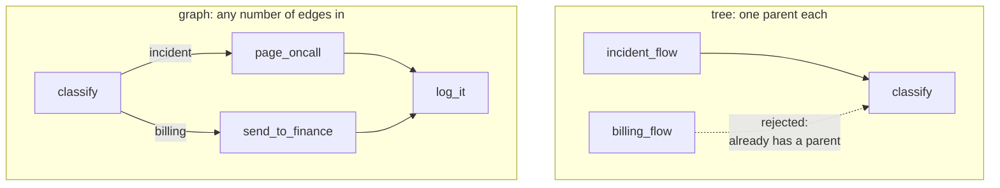

# 4.1 — One secretary, or one register

## One-line answer

In a tree every step has exactly one parent, so the same step cannot appear in two places — the
framework says so out loud with *"Agent `classify` already has a parent agent"* — while in a graph a
node is reached by however many edges point at it, which is why **trap #1** replaced the tree with the
graph.

## The story

Two housing societies, two ways of handling a complaint.

In the first, everything goes through the secretary. A leaking tap: you tell the secretary, the
secretary tells the plumber. A dead corridor light: you tell the secretary, the secretary tells the
electrician. Both jobs, when finished, are reported back to the secretary, who writes them in his own
diary. The system works, and it works because he is always in the middle. He is also on holiday for
two weeks in May, and in those two weeks nothing gets logged at all.

In the second society there is a register in the guard's room. The plumber writes in it. The
electrician writes in it. The lift company writes in it when they come. Nobody is in the middle. A
complaint goes to whoever handles that thing, and every one of them finishes at the same book.

The second society is not better organised in some vague way. It is better organised in one specific
way: **two different people can reach the same book.** In the first, everything that reaches the diary
must first pass through one man, and that is not a rule anybody wrote down — it is a shape.

## The idea in plain language

This is **trap #1 from plan §5.1**, and it deserves to be stated precisely rather than as a slogan:

> **Trap #1 — the node model.** In 1.x, agents were composed only via `sub_agents` trees, and workflow
> behaviour came from special agent *classes*. In 2.x the graph **Workflow Runtime** is the composition
> layer: nodes in a graph, with agents as one node type. Port compositions to the node model; do not
> force everything through agent-tree idioms.

A **tree** is a shape in which every item has exactly one parent. Family trees, folder structures,
org charts. It is a good shape for many things and it has one hard consequence: **an item cannot be in
two places.** A folder is in one folder. An employee has one manager.

A **graph** drops that rule. A node is reached by however many edges point at it, from wherever.

Applied to agent frameworks, the difference is not philosophical:

| | tree (`sub_agents`) | graph (`Workflow` edges) |
| --- | --- | --- |
| composition is | nesting objects | a list of edges |
| a step can be reached by | one parent | any number of edges |
| reusing a step means | a second copy | the same object, twice referenced |
| the flow is readable from | walking the object tree | one edge list |
| sequence, fan-out, loop are | three special agent classes | three shapes of edges |

The last row is the one that matters most in practice and it is
[4.3](4.3-the-bus-pass-with-a-date-on-it.md)'s subject.

To be exact about what did *not* change, because this is where tutorials mislead in the other
direction: **`sub_agents` is not deprecated and has not gone away.** It remains on `BaseAgent`, and it
is how an agent delegates to another agent — Day 55's subject. What is deprecated is using the
*special workflow agent classes* to express sequence, fan-out and loops.

## Why Sutra needs it

The triage flow has a merge in it. An incident goes to `page_oncall` and a billing query goes to
`send_to_finance`, and both, when done, must be logged the same way.

In a tree that merge cannot be expressed by sharing a step. You get two copies of the logging agent —
which drift, so that six months later one of them logs the ticket id and the other does not — or you
add a parent whose job is to be in the middle, which is the secretary on holiday in May.

Day 58 has exactly this shape, and Day 63's approval gate is another: several branches, one gate. Both
need one object reached from several places.

## The paper behind it

**Dryad: distributed data-parallel programs from sequential building blocks** ·
`doi:10.1145/1272998.1273005` · 2007 · <https://doi.org/10.1145/1272998.1273005>

It argued that a job should be written as a **directed acyclic graph of sequential vertices connected
by channels**, so that the programmer writes ordinary single-threaded code and the *graph* — not the
code — is what expresses concurrency and dependency.

Taught in [`papers/01-dryad.md`](../../papers/01-dryad.md).

## The mechanism

The same reuse attempt, in both models.

```python
def tree_reuse() -> str:
    """Put the same agent object under two parents. The tree model forbids it."""
    shared = Agent(name="classify", model="gemini-2.5-flash", instruction="Classify.")
    SequentialAgent(name="incident_flow", sub_agents=[shared])
    try:
        SequentialAgent(name="billing_flow", sub_agents=[shared])
    except Exception as exc:
        for line in str(exc).splitlines():
            if "Value error, " in line:
                return line.split("Value error, ", 1)[1].split(" [type=")[0]
    return "(reuse was allowed)"


@node
def log_it(node_input: str) -> Event:
    """One node object, reached from two different branches."""
    return Event(output=f"logged: {node_input}")


graph_reuse = Workflow(
    name="graph_reuse",
    edges=[
        ("START", classify),
        (classify, {"incident": page_oncall, "billing": send_to_finance}),
        (page_oncall, log_it),
        (send_to_finance, log_it),
    ],
)
```

**Line by line:**

- `shared = Agent(...)` — **one** object, created once, then handed to two parents. This is the exact
  thing you would do if you wanted one classifier used by two flows.
- `SequentialAgent(...)` twice — the second is inside a `try`, because it is expected to fail. (This
  class is deprecated in 2.7.1; it is used here precisely because it is the 1.x composition idiom, and
  [4.3](4.3-the-bus-pass-with-a-date-on-it.md) deals with the deprecation.)
- `(page_oncall, log_it)` and `(send_to_finance, log_it)` — two edges, **one `log_it` object**. Not two
  configurations of a logger; the same node, in the same graph, reached two ways.
- `Agent(model="gemini-2.5-flash")` is pinned per **ADK-73**, free-tier per Addendum 02. Constructing
  agents sends nothing, so this script costs zero requests.

```bash
cd days/day-53-graph-workflow-runtime/lab
uv run python tree.py
```

**Line by line:**

- `tree.py` runs the tree attempt, prints the incoming edges of `log_it` from the graph object, and
  then sends two different tickets through so you can watch both reach the same node.

Measured on 2026-09-05:

```text
  tree - the same agent under two parents:
      Agent `classify` already has a parent agent, current parent: `incident_flow`, trying to add: `billing_flow`

  graph - edges arriving at the single log_it node: ['page_oncall', 'send_to_finance']

  an incident:
  classify         'Checkout is DOWN'
  page_oncall      'paged the on-call engineer'
  log_it           'logged: paged the on-call engineer'
  3 events
  a billing question:
  classify         'send me the invoice'
  send_to_finance  'forwarded to finance'
  log_it           'logged: forwarded to finance'
  3 events
```

The first line is the tree model stating its own constraint in plain English: **an agent already has a
parent.** Not "this is discouraged" — it raises. One object, one place. To use that classifier in a
second flow you must construct a second one.

The rest is the graph doing the thing the tree refused. `log_it` has two incoming edges, and both
tickets reached it — an incident down one branch, a billing query down the other, the same node
object, running with different input each time.



## When it breaks

The break is what people do when the tree refuses them, because it is reasonable and it is a trap:
they make a second copy.

```python
log_for_incidents = node(write_log, name="log_incident")
log_for_billing = node(write_log, name="log_billing")
```

**Line by line:**

- Same underlying function, two node objects, two names. The graph accepts this happily — they are
  distinct nodes with distinct names, so no duplicate-name error.
- And now there are two things to configure. A `retry_config` added to one is missing from the other. A
  timeout tuned on one is not on the other. A metric filtered by node name shows half the traffic.

Nothing errors. The graph is valid, both branches log, and the divergence arrives later as *"why do
only half our tickets have a retry on the log write?"*

The related break is the opposite mistake — trying to reuse a node object by giving copies the same
name — which *is* caught:

```text
Graph validation failed. Duplicate node names found: ['classify']. This means multiple distinct node
objects have the same name. If you intended to reuse the same node, ensure you pass the exact same
object instance. If you intended to have distinct nodes, ensure they have unique names.
```

Read the last two sentences again. The framework is telling you the rule of this part: **reuse means
the same object.** Not a copy that looks the same.

## In production

**What a professional writes instead.** Shared nodes are built once, in a module-level factory, and
referenced from the edge list — never re-created per branch. When two branches genuinely need
different behaviour, that is two nodes with two names *and two different functions*, not two copies of
one function.

**What degrades at scale.** A shared node is a shared bottleneck. `log_it` reached from six branches
is six times the traffic through one node, one `retry_config`, one timeout. That is usually what you
want — it is why the merge exists — but it means the node's timeout is now a property of the whole
graph rather than of one branch. Merge points deserve their limits set deliberately.

**The failure that only appears with real traffic.** A shared node whose behaviour depends on state
that different branches set differently. `log_it` reading `ctx.state["category"]` works when every
branch sets it and misbehaves on the branch that forgot. The more edges point at a node, the more
paths there are into it, and the more its assumptions about state need to be assumptions the *graph*
guarantees rather than ones a particular branch happens to satisfy.

**The review comment a senior engineer leaves:** *"`log_incident` and `log_billing` are the same
function wrapped twice. Make it one node with two incoming edges. Right now only one of them has the
retry config, and the metric dashboard has been under-counting log writes since March."*

**The interview question:** *"What actually changed when ADK moved from agent trees to a graph
runtime?"* An answer that is specific rather than a slogan: *"The composition layer. In 1.x you
composed by nesting agents in `sub_agents`, so the shape was a tree and every agent had exactly one
parent — try to put the same agent object under two parents and it raises `already has a parent
agent`. That means you cannot have two branches converge on one step; you end up with two copies that
drift. In 2.x composition is a list of edges, so a node is reached by however many edges point at it
and a merge is just two edges into one object. Sequence, fan-out and loop stopped being three special
agent classes and became three shapes of edges. `sub_agents` itself is still there for delegation —
what got deprecated is the workflow agent classes."*

## Check yourself

```bash
cd days/day-53-graph-workflow-runtime/lab
uv run python tree.py
```

Now add a third branch to `graph_reuse` — a `question` route to `answer_from_kb`, with an edge from
there into `log_it` — and confirm the incoming-edge list grows to three without changing `log_it`.

**Out loud, without scrolling up:** state the one rule a tree enforces that a graph does not, and give
the concrete thing it stops you doing.

**Next:** [4.2 — The textbook with the wrong edition](4.2-the-textbook-with-the-wrong-edition.md).
