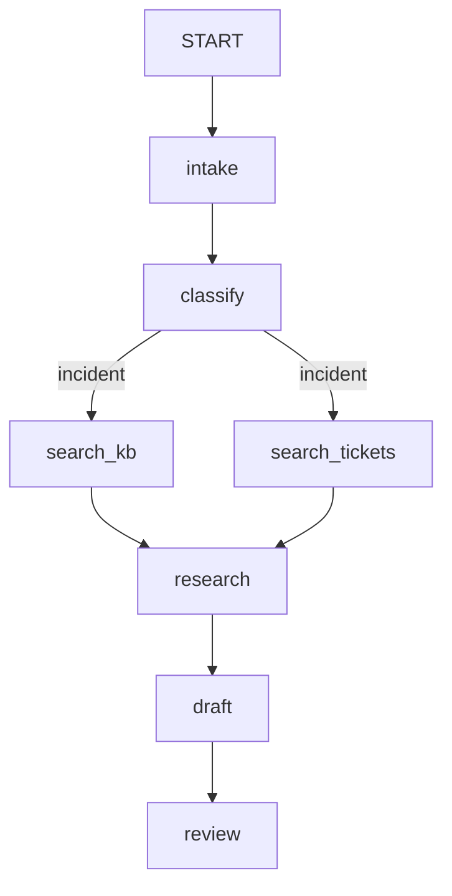

# 4.4 — The floor plan by the lift

## One-line answer

Because composition is a list of edges rather than a nesting of objects, the graph is **data you can
read at runtime** — `flow.graph.edges` — which means the diagram in your documentation can be generated
from the running system instead of drawn by hand and left to rot.

## The story

By the lift on every floor there is a plan of that floor, and a small green arrow that says *you are
here*.

Look closely and there are two kinds of plan in the world. Most of them were drawn by an architect
before the building was finished. Then somebody put a partition across the middle of the east corridor,
and turned a store room into a server room, and blocked the second stair with a cupboard. The plan by
the lift shows none of that. It is a picture of a building that was never quite built, and everyone who
works there stopped looking at it years ago.

The other kind is the one the fire officer checks. It has to match. If the partition goes in, the plan
is redrawn, because the plan is not decoration — it is the thing people will use in smoke, and a plan
that does not match the building is worse than no plan at all.

The difference between the two is not care. It is whether the plan is derived from the building or
merely resembles it.

## The idea in plain language

Once the `Workflow` is built, the graph is an ordinary object you can inspect:

- `flow.graph.nodes` — the node objects, including `__START__`
- `flow.graph.edges` — the `Edge` objects, each with `from_node`, `to_node` and `route`
- `flow.graph._terminal_node_names` — the nodes with no outgoing edges, computed during validation

Nothing here is a debugging back door. It is the same data the runtime schedules from, which is
precisely why reading it is trustworthy: there is no second copy that could disagree.

What this buys you, in ascending order of value:

1. **Counts.** How many nodes, how many edges, how many of them routed. A number that grows tells you
   the flow is getting harder to reason about, before anyone feels it.
2. **A generated diagram.** Twelve lines turn the edge list into mermaid. The picture is then derived
   from the code and cannot drift from it.
3. **Assertions.** [3.3](../03-the-graph-is-checked/3.3-the-switch-that-turns-nothing-on.md)'s node-set
   test, and a check that every label your classifier can emit has an edge.
4. **Diffs.** Print the edge list in a test snapshot, and a pull request that changes the flow shows the
   change to the *flow*, not just to the code.

This is the pay-off of trap #1 that nobody advertises. In the tree model the composition lived in
object nesting, so "what is the flow" was answered by walking a structure and interpreting each class's
semantics along the way. In the graph model the flow is a list, and a list can be printed.

## Why Sutra needs it

Sutra's day documents are full of mermaid diagrams, and a diagram in a document is a promise that
somebody will have to keep. Day 58's triage graph will be edited on Days 60, 62, 63 and 70, and the
diagram in the Day 58 document will not be edited on any of them.

A generated diagram solves that: the document holds the *command*, and the picture is produced from
whatever the graph currently is. It is the same instinct as `./m wiki` — the index is generated from
the days, so it cannot disagree with them, and if it does, the day is right and the index is stale.

## The paper behind it

**Dryad: distributed data-parallel programs from sequential building blocks** ·
`doi:10.1145/1272998.1273005` · 2007 · <https://doi.org/10.1145/1272998.1273005>

It made the job graph a **first-class object** that a program constructs and the runtime consumes,
rather than a shape implied by the order of the code.

Taught in [`papers/01-dryad.md`](../../papers/01-dryad.md).

## The mechanism

Read the graph, count it, and draw it.

```python
def mermaid(flow: Workflow) -> str:
    """Turn any Workflow into a mermaid diagram, so the picture cannot drift from the code."""
    lines = ["graph TD"]
    for edge in flow.graph.edges:
        source = "START" if edge.from_node.name == START.name else edge.from_node.name
        label = "" if edge.route is None else f'|"{edge.route}"|'
        lines.append(f"    {source} -->{label} {edge.to_node.name}")
    return "\\n".join(lines)


def report(flow: Workflow) -> None:
    routed = [e for e in flow.graph.edges if e.route is not None]
    default = [e for e in flow.graph.edges if e.route == DEFAULT_ROUTE]
    terminal = sorted(flow.graph._terminal_node_names)
    print(f"  nodes            {len(flow.graph.nodes)}")
    print(f"  edges            {len(flow.graph.edges)}")
    print(f"  routed edges     {len(routed)}")
    print(f"  DEFAULT_ROUTE    {len(default)}")
    print(f"  terminal nodes   {terminal}")
```

**Line by line:**

- `for edge in flow.graph.edges` — one pass over the framework's own list. Nothing is re-derived, so
  the diagram cannot be wrong about the graph unless the graph is wrong about itself.
- `"START" if edge.from_node.name == START.name` — the sentinel's real name is `__START__`, and a
  double underscore renders as bold in some viewers. Prettifying the label is the only liberty this
  function takes.
- `f'|"{edge.route}"|'` — mermaid's edge-label syntax. The quotes matter: a route list prints as
  `['incident', 'question']`, and the brackets confuse the parser without them.
- `mermaid` takes **any** `Workflow`. It knows nothing about triage. Point it at Day 58's graph or Day
  63's and it works, because the only thing it depends on is the edge list.
- `flow.graph._terminal_node_names` has a leading underscore — it is private, and it is used here
  because it is computed during validation and is the only place the answer exists. A production
  version derives it itself: every node that is no edge's `from_node`.
- `report` separates *routed* edges from *default* edges deliberately. "Six routed edges and no
  default" is a sentence about risk ([2.3](../02-the-edge/2.3-a-label-not-an-address.md)).

```bash
cd days/day-53-graph-workflow-runtime/lab
uv run python shape.py
```

**Line by line:**

- `shape.py` imports `build()` from `triage.py` — the real graph from
  [5.1](../05-the-first-graph/5.1-five-desks-one-form.md), not a copy — then prints the report and the
  diagram.

Measured on 2026-09-05:

```text
  nodes            9
  edges            9
  routed edges     3
  DEFAULT_ROUTE    1
  terminal nodes   ['human_queue', 'review']

graph TD
    START --> intake
    intake --> classify
    classify -->|"['incident', 'question']"| search_kb
    classify -->|"['incident', 'question']"| search_tickets
    classify -->|"__DEFAULT__"| human_queue
    search_kb --> research
    search_tickets --> research
    research --> draft
    draft --> review
```

That diagram was not drawn. It was printed by a program that read the graph, and it is the diagram in
the hub's §1 — the same nine lines, from the same command.

Read the report as a review of the design. Nine nodes and nine edges: not a tree, because a tree with
nine nodes has eight edges, and the extra one is the merge at `research`. Three routed edges out of
nine, so most of the flow is a straight line and the branching is concentrated in one place. One
`DEFAULT_ROUTE`, so an unclassifiable ticket has somewhere to go
([2.3](../02-the-edge/2.3-a-label-not-an-address.md)). Two terminal nodes, `review` and `human_queue`,
which is exactly the two ways a ticket is allowed to finish.

Four numbers, and they describe the design faithfully enough to review.

## When it breaks

The break is a hand-drawn diagram, and it does not raise anything — which is why it survives. Here is
one for the same graph:



Compare it with the generated one. Two differences, both of them the kind a person makes:

- the routes say `"incident"`, but the real edges carry `['incident', 'question']` — so this picture
  says a question is not researched, and it is;
- `human_queue` and its `__DEFAULT__` edge are missing entirely — so this picture says an
  unclassifiable ticket has nowhere to go, which was true for about an hour during development.

Neither error is careless. The first is a diagram drawn before the route list was added; the second is
a node added after the diagram was drawn. **A hand-drawn diagram is a snapshot of an earlier version
of the system**, and the more useful the diagram, the more people trust the wrong one.

The second break is real and is a limitation of the generated version: a generated diagram shows the
*shape* and cannot show the *intent*. It cannot tell you that `research` is a `JoinNode` and therefore
waits, or that `review` can reject. For that you either annotate by node type — which is a dozen more
lines, reading `type(node).__name__` — or you accept that the generated picture answers "what is
connected to what" and something else answers "why".

## In production

**What a professional writes instead.** The diagram generator lives beside the graph and is called by a
test that writes the diagram into the documentation, so a pull request that changes the flow shows a
diff in the picture. The same test asserts the counts — node count, edge count, routed-edge count — so
adding a branch is a deliberate, reviewed change rather than a line in a file.

**What degrades at scale.** The generated diagram itself, past about twenty nodes: mermaid will render
it and nobody will read it. At that point the useful outputs are the *numbers* and a diagram per
sub-workflow rather than one for the whole system. That is another argument for extracting
sub-workflows ([1.2](../01-the-node/1.2-the-four-things-that-can-be-a-node.md)) — a graph you cannot
draw is a graph nobody can review.

**The failure that only appears with real traffic.** The diagram is a picture of the graph, and the
graph is not the run. Every edge is drawn with equal weight, so a diagram gives no hint that ninety-five
per cent of tickets take one branch and the `__DEFAULT__` edge fires twice a week. When Day 84 adds
tracing, the interesting artefact stops being the graph and becomes the graph *with traffic on it* —
and a branch carrying zero traffic is either dead code or a bug in the classifier
([3.3](../03-the-graph-is-checked/3.3-the-switch-that-turns-nothing-on.md)).

**The review comment a senior engineer leaves:** *"The diagram in the README is missing the default
route and has the wrong labels on two edges — it has been wrong since we added the route list. Delete
it and generate it from `flow.graph.edges` in the docs test. We already have the twelve lines in
`shape.py`."*

**The interview question:** *"How do you keep architecture documentation in step with the code?"* An
answer with a mechanism in it: *"For the workflow, I do not write it — I generate it. Because
composition is an edge list rather than nested objects, the graph is data at runtime, so twelve lines
turn `flow.graph.edges` into a mermaid diagram and a test writes it into the docs. A pull request that
changes the flow then shows a diff in the picture. The honest limit is that a generated diagram shows
shape and not intent, and it gives every edge equal weight when in reality one branch takes
ninety-five per cent of the traffic — for that you need the trace, not the graph."*

## Check yourself

```bash
cd days/day-53-graph-workflow-runtime/lab
uv run python shape.py
```

Now extend `mermaid` to add the node's class name to its label — `search_kb<br/>FunctionNode`,
`research<br/>JoinNode` — using `type(node).__name__`, and say which of the two differences from the
hand-drawn diagram that would have made obvious.

**Out loud, without scrolling up:** what makes a generated diagram trustworthy, and name one thing it
still cannot tell you.

**Next:** [5.1 — Five desks, one form](../05-the-first-graph/5.1-five-desks-one-form.md).
