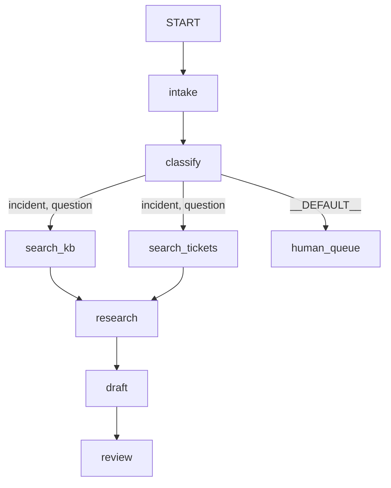

# 5.1 — Five desks, one form

## One-line answer

Everything so far, assembled: a nine-node triage graph — intake, classify, two searches, a join, draft,
review, and a human queue — that runs three different tickets down three different paths, **with zero
model calls**, because the graph is a scheduler and a scheduler can be watched for free.

## The story

First day at a new job, and the induction is a form.

Somebody at the entrance hands it to you and points. Desk one takes your documents and writes your
employee number at the top in pen, and from then on the form has an identity. Desk two reads what you
have written and decides which department you belong to, and ticks a box. Then there are two windows
side by side — one for the security pass, one for the laptop — and you can do them in any order, or
somebody does one while you do the other, and you cannot go on until you have both. Desk five reads
the whole thing, checks that both stickers are actually on it, and signs.

By eleven you are sitting at a desk with a laptop and a pass, and here is the strange part: you could
now draw that process from memory, and you were never told it. You learned it from the form. The
sequence, the two things that happened in parallel, the fact that the last desk refuses you if a
sticker is missing — all of it was legible from watching one piece of paper move.

## The idea in plain language

Everything in this part has already appeared. This is the assembly:

| Stage | What it is | The part |
| --- | --- | --- |
| `intake` | function node; cleans the text, puts the raw ticket in state | [1.1](../01-the-node/1.1-a-node-is-a-unit-of-work.md), [1.3](../01-the-node/1.3-what-arrives-at-a-node.md) |
| `classify` | function node; emits a **label** | [2.3](../02-the-edge/2.3-a-label-not-an-address.md) |
| `search_kb`, `search_tickets` | async nodes, fanned out | [2.4](../02-the-edge/2.4-two-shops-at-once.md) |
| `research` | `JoinNode`; waits for both | [2.4](../02-the-edge/2.4-two-shops-at-once.md) |
| `draft` | function node; edge for sources, state for the ticket | [2.5](../02-the-edge/2.5-on-the-edge-or-in-the-register.md) |
| `review` | function node; the check that can refuse | [1.4](../01-the-node/1.4-what-leaves-a-node.md) |
| `human_queue` | the `DEFAULT_ROUTE` destination | [2.3](../02-the-edge/2.3-a-label-not-an-address.md) |

Every node here is a plain Python function. That is deliberate and it is **Principle 4 at the scale of
a phase**: build the mechanism by hand before adopting the thing that automates it. Day 58 replaces
`classify` and `draft` with agents, and — this is the claim the day has been building towards — **the
edge list will not change.**

Two things you have not seen assembled before, and both matter:

**A route list on an explicit `Edge`.** Both answerable routes need both searches, and the routing-map
sugar cannot say that ([2.2](../02-the-edge/2.2-the-chain-that-is-a-list-of-edges.md)): two dictionary
keys pointing at one node is two edges between the same pair, which is rejected. So the two research
edges are written out, each carrying `route=["incident", "question"]`.

**A join fed on every route that reaches it.** This is [2.4](../02-the-edge/2.4-two-shops-at-once.md)'s
rule made structural. If `question` triggered only `search_kb`, the join would wait forever for
`search_tickets` and everything after it would silently not happen —
[5.2](5.2-the-cycle-that-finished-early.md) measures exactly that.

## Why Sutra needs it

This is the skeleton of the Phase 8 gate. Day 54 turns the shapes into named patterns, Day 55 adds
delegation, Day 56 planning, Day 57 the critic, and Day 58 makes it real with agents in the judgement
positions.

There is also a `sutra/graph.py` waiting to be written, and the hub's build brief asks for it. Today's
lab is the reference the learner writes it *from* — not code to copy, but a working shape to compare
against, which is what `gate.py` checks.

## The mechanism

The harness first, since every script this day has used it and it has not been shown whole.

```python
async def _drain(flow: Workflow, text: str) -> list[Any]:
    """Run `flow` once with `text` as the user message and return every event it emitted."""
    app = App(name=f"{flow.name}_app", root_agent=flow)
    runner = InMemoryRunner(app=app)
    session = await runner.session_service.create_session(app_name=app.name, user_id="learner")
    message = types.Content(role="user", parts=[types.Part(text=text)])
    events = []
    async for event in runner.run_async(
        user_id="learner", session_id=session.id, new_message=message
    ):
        events.append(event)
    return events
```

**Line by line:**

- `App(name=..., root_agent=flow)` — the `Workflow` is passed as `root_agent`. The parameter is named
  for the tree era; what it means in 2.x is *the root node*, and a `Workflow` is a node
  ([1.2](../01-the-node/1.2-the-four-things-that-can-be-a-node.md)). Verified against
  `https://adk.dev/graphs/` on 2026-09-05.
- `InMemoryRunner` — sessions in memory, nothing persisted. Day 47's database-backed sessions are what
  you would use to keep a run; here the run is over when the script ends.
- `types.Content(role="user", parts=[types.Part(text=text)])` — the message must be a `Content`.
  Passing a bare string raises `AttributeError: 'str' object has no attribute 'role'`, which is the
  first error anybody hits.
- `async for event in runner.run_async(...)` — the event stream. Collecting it into a list is fine
  here; [1.5](../01-the-node/1.5-say-it-as-you-go.md) used the streaming variant because it was timing
  arrivals.
- No model is configured anywhere in this function, and none is needed: every node is a function.

Now the graph.

```python
ANSWERABLE = ["incident", "question"]


def build() -> Workflow:
    return Workflow(
        name="triage",
        edges=[
            ("START", intake, classify),
            Edge(from_node=classify, to_node=search_kb, route=ANSWERABLE),
            Edge(from_node=classify, to_node=search_tickets, route=ANSWERABLE),
            (classify, {DEFAULT_ROUTE: human_queue}),
            (search_kb, research),
            (search_tickets, research),
            (research, draft, review),
        ],
    )
```

**Line by line:**

- `("START", intake, classify)` — a chain: two unconditional edges, the straight run in.
- The two `Edge(...)` lines with `route=ANSWERABLE` — one edge per search, each matching **either**
  label. This is the shape the sugar cannot express, and it is what guarantees the join is always fed.
- `ANSWERABLE` is a named constant used by both, so the two edges cannot drift apart. If a third
  answerable category is added, it is added in one place.
- `(classify, {DEFAULT_ROUTE: human_queue})` — the catch-all, as its own edge item so it is visible
  when reading the list rather than buried as a dictionary key.
- `(search_kb, research)` and `(search_tickets, research)` — the two edges into the join. These two
  lines are the definition of "every predecessor".
- `(research, draft, review)` — a chain again, the straight run out.
- `build()` is a **function**, not a module-level graph, so a validation error surfaces where it is
  called ([3.1](../03-the-graph-is-checked/3.1-tested-before-the-mains-go-on.md)).

```bash
cd days/day-53-graph-workflow-runtime/lab
uv run python triage.py
```

**Line by line:**

- `triage.py` runs three tickets chosen to take the three different paths: an incident, a question, and
  something the classifier cannot place.

Measured on 2026-09-05:

```text
'Checkout is DOWN for everyone since the deploy'
  intake           'checkout is down for everyone since the deploy'
  classify         'checkout is down for everyone since the deploy'
  search_kb        'KB-104: rotate the session cookie flags'
  search_tickets   'ticket:4610: same symptom, fixed by SameSite=None; Secure'
  research         {'search_kb': 'KB-104: rotate the session cookie flags', 'search_tickets': 'ticket:4610: same symptom, fixed by SameSite=None; Secure'}
  draft            {'ticket': 'Checkout is DOWN for everyone since the deploy', 'sources': ['KB-104: rotate the session cookie flags', 'ticket:4610: same symptom, fixed by SameSite=None; Secure']}
  review           'approved: 2 sources'
  7 events

'How do I reset my password?'
  intake           'how do i reset my password?'
  classify         'how do i reset my password?'
  search_kb        'KB-104: rotate the session cookie flags'
  search_tickets   'ticket:4610: same symptom, fixed by SameSite=None; Secure'
  research         {'search_kb': 'KB-104: rotate the session cookie flags', 'search_tickets': 'ticket:4610: same symptom, fixed by SameSite=None; Secure'}
  draft            {'ticket': 'How do I reset my password?', 'sources': ['KB-104: rotate the session cookie flags', 'ticket:4610: same symptom, fixed by SameSite=None; Secure']}
  review           'approved: 2 sources'
  7 events

'the coffee machine on floor 2 is sad'
  intake           'the coffee machine on floor 2 is sad'
  classify         'the coffee machine on floor 2 is sad'
  human_queue      'left in the human queue for a person to read'
  3 events
```

Three tickets, three paths, **zero model calls and zero cost**.

Follow the third one first, because it is the one most systems get wrong. *"the coffee machine on floor
2 is sad"* is not an incident and not a question. It produced three events and ended at a human. No
error, no wrong answer, no silence — it is *waiting for a person*, which is the correct outcome for a
ticket the classifier could not place. That is one `DEFAULT_ROUTE` edge doing its job.

The first two took seven events each and the same path, which is what `route=["incident", "question"]`
means. Look at `draft`'s output: `'ticket'` came from **state** — note it is the raw text, with its
original capitals, not the lowercased version on the edge — and `'sources'` came from the **join**, off
the edge. Two channels, one node, exactly as
[2.5](../02-the-edge/2.5-on-the-edge-or-in-the-register.md) argued.

And `review` says `approved: 2 sources`. It counted. If the join had fired with one source it would
have said `held`, which is a check that can go red — Principle 11, in the graph rather than in the test
suite.



That diagram is `uv run python shape.py`, not a drawing
([4.4](../04-composition/4.4-the-floor-plan-by-the-lift.md)).

## When it breaks

The break you will meet building this yourself is the duplicate edge, because the natural first
attempt is the routing map:

```python
(classify, {"incident": (search_kb, search_tickets), "question": search_kb})
```

**Line by line:**

- It reads perfectly: an incident searches both, a question searches only the knowledge base.
- It produces two edges from `classify` to `search_kb` — one from the tuple, one from the second key.

```text
Graph validation failed. Duplicate edge found: from=classify, to=search_kb
```

This was the actual failure while writing this lab, and the fix is instructive because there are two of
them and only one is right.

The **wrong** fix is to give the question route its own copy of the search node under a different name.
That is [4.1](../04-composition/4.1-one-secretary-or-one-register.md)'s trap: two objects, two configs,
one of which will get a retry policy the other does not.

The **right** fix is one edge with both labels — and it turns out to also fix a bug you had not
noticed. The original design searched only the knowledge base for a question, which means the join
would have starved and `draft` would never have run
([5.2](5.2-the-cycle-that-finished-early.md)). The duplicate-edge error was pointing at a real design
problem and not merely at a syntax preference.

## In production

**What a professional writes instead.** `build_triage_graph()` in `sutra/graph.py`, with the nodes
imported from modules beside it rather than defined in the same file — a graph file that is only
wiring stays readable at thirty nodes, and one that also contains the node bodies does not. The
constant `ANSWERABLE` becomes a `StrEnum` shared with the classifier, so the labels cannot drift
([2.3](../02-the-edge/2.3-a-label-not-an-address.md)).

**What degrades at scale.** Today every node is free. Day 58 puts an agent in `classify` and another in
`draft`, and the same graph becomes two requests per ticket against a free-tier quota. The graph does
not change; its cost profile changes completely. Note which nodes those are — the two doing judgement —
and note that the other seven stay free forever, which is the argument
[1.1](../01-the-node/1.1-a-node-is-a-unit-of-work.md) opened with.

**The failure that only appears with real traffic.** The classifier's label distribution. In this lab
each of the three paths is exercised once, so all three look equally important. In production one
category is eighty per cent of tickets and one route fires twice a week, and the rare path is the one
that has drifted. Count executions per node in production and look at the ones near zero.

**The review comment a senior engineer leaves:** *"`review` counts sources and returns `held`, and
nothing consumes `held` — there is no edge out of `review`, so a held draft is indistinguishable from
an approved one to everything downstream. Either route on it or say plainly that `review` is
advisory."*

**The interview question:** *"Walk me through a workflow you have built."* An answer that shows
judgement rather than a feature tour: *"Nine nodes: intake, classify, two parallel searches, a join,
draft, review, and a human queue on the default route. What I would point at is that only two of those
nine would ever need a model — the rest are plain functions, so the graph costs two requests a ticket
rather than nine. The bit that took me two attempts was the routing: I wanted 'incident searches both
archives, question searches one', which is two edges between the same pair of nodes and is rejected. So
it became a single edge carrying both labels — and that turned out to fix a real bug, because the join
waits for all its predecessors and the question path would have starved it."*

## Check yourself

```bash
cd days/day-53-graph-workflow-runtime/lab
uv run python triage.py
uv run python triage.py "my invoice is wrong"
```

Now add a `billing` label to `classify` and an edge from `classify` to a new `send_to_finance` node, and
re-run the second command.

**Out loud, without scrolling up:** name the two nodes that will become agents on Day 58, and say why
the other seven should not.

**Next:** [5.2 — The cycle that finished early](5.2-the-cycle-that-finished-early.md).
