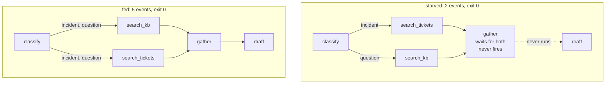

# 5.2 — The cycle that finished early

## One-line answer

Two one-line mistakes — a route label in the wrong case, and a join whose predecessor was never
triggered — each produce a graph that validates, runs, exits **0**, and does **half the work**: two
events where there should be five, with no exception and no failed check anywhere.

## The story

The washing machine finished in about ten minutes and the clothes came out dry.

Not clean-and-spun dry. Dry like they went in. The machine ran — you heard the drum turning, the
display counted down, it played its little tune at the end and unlocked the door. Every part of it did
what it does.

The inlet tap behind the machine was closed. Somebody had turned it off when the plumber came, and
turned everything else back on afterwards, and missed that one.

The machine had no way to tell you. It has no sensor for *"there is no water"* — it has a timer, and a
motor, and a program, and the program ran to completion exactly as designed. The failure was not in
anything the machine does. It was in something that did not arrive, and the machine's idea of success
is "I finished my program", which it did.

## The idea in plain language

This is the day's failure lab, and both failures are the same shape: **the work that did not happen
raised nothing, because nothing that ran went wrong.**

Everything you have met so far in section 3 is caught before the run: a missing `START`, an unreachable
node, a duplicate edge, an unroutable cycle. Those are properties of the *shape*. The two failures
here are properties of the *behaviour*, and the shape is perfect in both:

| Failure | Why validation cannot see it | What you get |
| --- | --- | --- |
| a route label that matches no edge | the graph is well-formed; the mismatch is between a string in a node and a string in an edge | branch ends, one log warning |
| a join whose predecessor was not triggered | both predecessors are reachable *from some route*; this route reaches only one | join never fires, everything after it skipped, no log at all |

The second is worse than the first, and it is worth knowing why: the unmatched route at least writes a
warning to the log. **The starved join writes nothing.** It is not an error condition from the
runtime's point of view — a join is *waiting*, which is a normal state, and then the run has no more
work and ends.

The generalisation, which is the thing to carry into Day 59 and Day 65: **exit code 0 means "nothing
raised", not "the work was done".** For any process that can branch, success has to be *asserted*
rather than inferred. That is Principle 11 pointed at a graph.

## Why Sutra needs it

Day 58 puts an **agent** in the `classify` node. An agent asked to answer with `incident` will one day
answer `Incident.`, or `"incident"`, or `incident (outage)` — because that is what models do — and each
of those is an unmatched route. The failure in this part is not hypothetical for Sutra; it is the
predictable consequence of the next five days' work.

Day 59 is the phase gate on runaway agents and containment. Half of containment is stopping a thing
that will not stop; the other half is noticing a thing that stopped too early, and there is no alarm
for that unless you build one.

## The mechanism

Both failures, each with its one-line fix, in one script.

```python
@node
def classify_shouting(node_input: str) -> Event:
    """Emits 'INCIDENT'. The edge is spelled 'incident'. That is the whole bug."""
    return Event(output=node_input, route="INCIDENT")


def starved(both: bool) -> Workflow:
    """The join waits for every predecessor. Reach it down one branch and it never fires."""
    if both:
        wiring = [
            Edge(from_node=classify_quiet, to_node=search_kb, route=["incident", "question"]),
            Edge(from_node=classify_quiet, to_node=search_tickets, route=["incident", "question"]),
        ]
    else:
        wiring = [(classify_quiet, {"incident": search_tickets, "question": search_kb})]
    return Workflow(
        name="fed" if both else "starved",
        edges=[
            ("START", classify_quiet),
            *wiring,
            (search_kb, gather),
            (search_tickets, gather),
            (gather, draft),
        ],
    )
```

**Line by line:**

- `route="INCIDENT"` against an edge spelled `"incident"` — route matching is exact string comparison
  ([2.3](../02-the-edge/2.3-a-label-not-an-address.md)), so these are two different labels.
- In the broken `starved` branch, `"incident"` triggers **only** `search_tickets`. `search_kb` is still
  reachable — the `"question"` route reaches it — so connectivity passes and the graph builds.
- `gather` has two incoming edges, so it waits for both. Down the `incident` route only one ever
  arrives.
- The `both=True` version replaces the routing map with two explicit edges carrying both labels, so
  whichever way `classify_quiet` goes, both predecessors fire
  ([5.1](5.1-five-desks-one-form.md)).
- `*wiring` splices either shape into the same edge list, so **only the wiring differs** between the
  two runs. Same nodes, same join, same draft.

```bash
cd days/day-53-graph-workflow-runtime/lab
uv run python halfway.py
uv run python halfway.py --fixed
uv run python halfway.py --join
uv run python halfway.py --join --fixed
```

**Line by line:**

- The first pair is the route typo, broken then fixed. The second pair is the starved join, broken then
  fixed.
- Each prints its events and then a reminder about the exit code, which is the point of the whole
  script.

Measured on 2026-09-05. The route typo:

```text
Node 'classify_shouting' has conditional/DEFAULT edges but none were matched by the emitted route(s): INCIDENT. The branch will end.
typo:
  classify_shouting 'Checkout is DOWN'
  1 events
  exit code will be 0 either way
```

One event. And with the label corrected:

```text
fixed:
  classify_quiet   'Checkout is DOWN'
  page_oncall      'paged the on-call engineer'
  2 events
  exit code will be 0 either way
```

Two. The difference between an outage that pages an engineer and an outage that disappears is the case
of eight letters, and the only difference in the output is a count.

Now the join. Broken:

```text
starved:
  classify_quiet   'Checkout is DOWN'
  search_tickets   'ticket:4610'
  2 events
  exit code will be 0 either way
```

Fixed:

```text
fed:
  classify_quiet   'Checkout is DOWN'
  search_kb        'KB-104'
  search_tickets   'ticket:4610'
  gather           {'search_kb': 'KB-104', 'search_tickets': 'ticket:4610'}
  draft            "draft citing ['search_kb', 'search_tickets']"
  5 events
```

**Two events against five.** In the broken run `gather` and `draft` do not appear at all — the reply
was never written. And unlike the route typo, there is **no warning line above it**: the join is
waiting, waiting is legal, and the run simply ran out of work.



Both graphs are valid. Both runs succeed. One of them answers the customer.

## When it breaks

It has already broken; this section is what to *do*, because neither failure has an error message to
search for.

**1. Assert the terminal node was reached.** The cheapest real check, and the one `gate.py` is built
around. A run that did not end at a terminal node did not finish:

```python
def test_incident_reaches_review():
    events = run(build_triage_graph(), "Checkout is DOWN for everyone")
    reached = {e.node_info.path.rsplit("/", 1)[-1].split("@")[0] for e in events if e.node_info}
    assert "review" in reached, f"stopped early; reached {sorted(reached)}"
```

**Line by line:**

- `e.node_info.path` is `'triage@1/review@1'`; the split takes the node name off the end.
- Asserting on the **last** node rather than on the output is what catches a starved join, because a
  starved join produces no output at all to assert on.
- The failure message prints what *was* reached, which points straight at where it stopped.

**2. Count the events.** A path through the graph has a known event count. Seven for an answerable
ticket in [5.1](5.1-five-desks-one-form.md). Asserting `len(events) == 7` is crude and it catches both
failures in this part instantly.

**3. Labels from an enum, never string literals in two places.** A typo becomes an `AttributeError` at
import instead of a vanished ticket.

**4. A `DEFAULT_ROUTE` on every routing node.** It converts "vanished" into "went to the human queue",
which is countable and alertable.

**5. Normalise a model's label before routing on it.** From Day 58 onward the label comes from an
agent. Strip it, lower-case it, check it against the known set, and send anything unrecognised to the
default.

## In production

**What a professional writes instead.** Every graph gets a **completion assertion** — an explicit check
that the run reached one of its terminal nodes — and it lives in production, not only in the tests. A
metric of runs-that-ended-early is the single most valuable number a branching workflow can emit,
because it is the only observable for a whole class of failures that raise nothing.

**What degrades at scale.** These failures get *quieter* with volume, not louder. One ticket in a
thousand hitting an unmatched label is invisible in every aggregate: throughput is normal, error rate
is zero, p99 latency actually *improves* because the truncated runs are fast. The metric that would
catch it — completions per start, per path — is one nobody adds until after the incident.

**The failure that only appears with real traffic.** The model's label drift, and the shape of it is
seasonal rather than random. A classifier that has emitted clean labels for months starts emitting
`Incident (urgent)` after a prompt tweak or a provider-side model update, and from that moment every
incident ticket silently ends at `classify`. Nothing deployed changed on your side. This is why Day 79's
evals exist and why the label set belongs in an eval rather than only in a unit test.

**The review comment a senior engineer leaves:** *"There is no assertion that any of these tests reach
`review`. Both of them would pass if the graph stopped at `classify`, because they only check that no
exception was raised. Assert on the terminal node reached, and add the same check as a production
metric."*

**The interview question:** *"How do you know a workflow run actually did what it was supposed to?"*
The answer of someone who has been burned: *"Not from the exit code. I have shipped a graph that
returned zero and did half the work — a route label emitted in the wrong case matched no edge, so the
branch ended after one node. There was one warning in the log and nothing else. The nastier version is
a join node: it waits for all its predecessors, so if a conditional route triggers only one of them the
join never fires, everything downstream is skipped, and there is not even a warning. So a run is only
successful if it reached a terminal node, and I assert that in tests and emit it as a metric. Exit code
zero means nothing raised; it does not mean the work was done."*

## Check yourself

```bash
cd days/day-53-graph-workflow-runtime/lab
uv run python halfway.py
uv run python halfway.py --join
uv run python halfway.py --join --fixed
```

Now break [5.1](5.1-five-desks-one-form.md)'s real triage graph the same way: change `ANSWERABLE` on
**one** of the two research edges to `["incident"]` only, and run `triage.py` with the password
question. Count the events and find the node it stopped at.

**Out loud, without scrolling up:** give the one assertion that catches both of this part's failures,
and say why asserting on the output would not.

**Next:** [6.1 — The whistle that was taken off](../06-in-production/6.1-the-whistle-that-was-taken-off.md).
