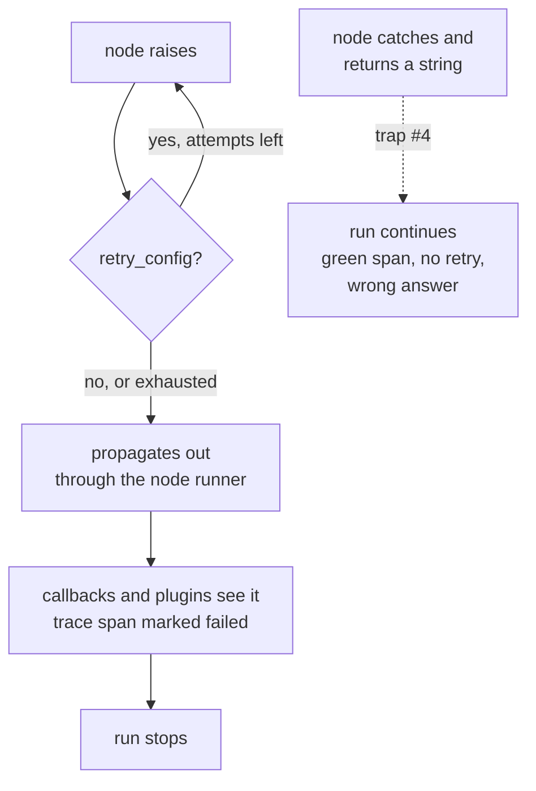

# 6.1 — The whistle that was taken off

## One-line answer

**Trap #4**: an exception inside a node propagates out through the runtime and stops the run, with the
node's frames in the traceback — and the 1.x habit of catching it and returning a friendly string turns
a stopped run into a wrong answer that no retry, no callback and no alert will ever see.

## The story

The whistle on the pressure cooker is loose, and it rattles, and it is annoying.

So somebody takes it off. The cooker still works — it heats, the lid seals, the food cooks. What has
gone is the noise, and the noise was the only thing telling anybody in the house that the pressure had
come up and it was time to lower the flame.

For a week it is fine, because whoever took it off is the one cooking and she knows to watch the clock.
Then somebody else uses it, and there is no whistle, and there is no clock, and the first sign that
anything is wrong is a sound nobody in that house had heard before.

The whistle was not a feature of the cooker. It was the *interface* between what the cooker knows and
what a person needs to know, and removing it did not make the cooker safer or quieter. It made it
silent, which is a different thing.

## The idea in plain language

**Trap #4 from plan §5.1**, stated exactly:

> In 1.x, tool and model errors were commonly caught and returned as strings, hiding failures. In 2.x
> exceptions are surfaced through the runtime so callbacks and plugins can act on them. Swallowing
> them silently breaks retries, tracing, and honesty.

That last list is the argument, and each item is concrete:

- **Retries break** because a `retry_config` retries a node that *raised*. A node that returns
  `"lookup failed"` succeeded, and succeeded results are not retried.
- **Tracing breaks** because Day 84's spans mark a node failed when it raises. A swallowed error is a
  green span.
- **Honesty breaks** because the string flows down the edge into the next node, which puts it in a
  prompt, and the model writes a confident reply built on the sentence *"lookup failed"*.

The runtime gives you three tools instead, and the order matters:

1. **Let it raise.** The default. The exception travels out through the node runner with your node's
   frames intact.
2. **`retry_config=RetryConfig(...)`** on the node, when the failure is transient — a network blip, a
   429. Retries are per-node and configurable by attempt count, delay, backoff factor, jitter, and
   which exception types to retry.
3. **`timeout=<seconds>`** on the node, when the failure mode is *not returning* rather than raising.
   A timeout raises `NodeTimeoutError`, which is an ordinary `Exception` — deliberately, so a timed-out
   node can itself be retried.

**Handle an error only where you can do something about it**, and "return a string that looks like a
result" is never that. The right places are a fallback route, a retry, or the top of the run.

## Why Sutra needs it

Every node that will matter calls something that fails. Day 58 puts model calls in the graph, and the
free tier returns HTTP 429 routinely — that is not an edge case, it is the normal operating condition
of this whole curriculum (Addendum 02: quota is the currency).

Day 70's quota router only works if a 429 is a *raised exception* that something can catch and route
around. A node that catches the 429 and returns `"provider unavailable"` has removed the signal the
router needs, one layer below the router. Principle 10 is not a style preference here; it is a
precondition for two later days.

## The mechanism

Four modes, one script, one node position swapped each time.

```python
@node
def lookup_customer(node_input: str) -> Event:
    """The archive is down. This node has no business pretending otherwise."""
    raise KeyError("customer_id")


@node
def swallow_it(node_input: str) -> Event:
    """The 1.x habit: catch everything, return a string, keep the graph moving."""
    try:
        raise KeyError("customer_id")
    except Exception as exc:
        return Event(output=f"lookup failed ({exc}) - continuing anyway")


flaky = node(
    lambda node_input: _flaky(node_input),
    name="flaky",
    retry_config=RetryConfig(max_attempts=3, initial_delay=0.05, jitter=0.0),
)


@node(name="slow", timeout=0.3)
async def slow(node_input: str) -> Event:
    await asyncio.sleep(2.0)
    return Event(output="never gets here")
```

**Line by line:**

- `raise KeyError("customer_id")` — no `try`. This is the correct shape for a node whose dependency
  failed.
- `swallow_it` is the anti-pattern, written out so it can be run and compared. Note that it is
  *reasonable-looking* code: the exception is caught, the message is preserved, the graph keeps going.
  Everything about it reads as defensive programming.
- `RetryConfig(max_attempts=3, initial_delay=0.05, jitter=0.0)` — three attempts including the first.
  `jitter=0.0` removes the randomness so the demo is reproducible; **in production leave jitter on**,
  because synchronised retries across many clients are how a struggling service is turned into a dead
  one. Verified against `google-adk==2.7.1` with
  `python -c "from google.adk.workflow import RetryConfig; print(RetryConfig.model_fields.keys())"`.
- `RetryConfig` also takes `exceptions=[...]` to retry only certain types. Retrying a `KeyError` is
  pointless — it will fail identically three times — so a real config names the transient ones.
- `@node(name="slow", timeout=0.3)` — the decorator with arguments. The timeout is in seconds and is
  per-node, not per-run.

```bash
cd days/day-53-graph-workflow-runtime/lab
uv run python boom.py --raise
uv run python boom.py --swallow
uv run python boom.py --retry
uv run python boom.py --timeout
```

**Line by line:**

- Each mode builds `("START", <the node>, draft)` and runs it, so `draft` is the downstream node whose
  behaviour reveals what actually happened.

Measured on 2026-09-05. Letting it raise:

```text
  File ".../google/adk/workflow/_node_runner.py", line 136, in run
    await self._execute_node(ctx, node_input)
  File ".../google/adk/workflow/_base_node.py", line 166, in run
    async for item in agen:
  File ".../google/adk/workflow/_function_node.py", line 542, in _run_impl
    result = self._func(**kwargs)
  File ".../lab/boom.py", line 18, in lookup_customer
    raise KeyError("customer_id")
KeyError: 'customer_id'

--raise:
  the run stopped: KeyError: 'customer_id'
```

The traceback runs from the runner, through `_base_node.run`, into `_function_node`, and lands on
**your line**. The run stopped. `draft` did not run. Nothing was sent to a customer.

Swallowing it:

```text
--swallow:
  swallow_it       "lookup failed ('customer_id') - continuing anyway"
  draft            'draft from "lookup failed (\'customer_id\') - continuing anyway"'
  2 events
```

Two events, no traceback, exit 0 — and `draft` has now built a reply **whose source material is the
words "lookup failed"**. In Day 58's version, `draft` is a model, and a model handed that string will
write a fluent apology or, worse, invent the missing detail. The archive being down has been converted
into a customer-facing answer.

Retrying:

```text
Node flaky failed and is being retried locally. Note: retry count is not persisted across resuming.
Node flaky failed and is being retried locally. Note: retry count is not persisted across resuming.
--retry:
  flaky            None
  flaky            None
  flaky            'looked up on attempt 3'
  draft            "draft from 'looked up on attempt 3'"
  4 events
```

Two warnings and three `flaky` events — the first two with `output=None` — then success on attempt
three. Two things worth noticing. The failed attempts **are in the event stream**, so a trace shows
what it cost. And read the warning's second sentence: *retry count is not persisted across resuming*,
which is a real caveat for Day 60's resumable runs — a resumed run gets a fresh retry budget.

Timing out:

```text
google.adk.workflow._errors.NodeTimeoutError: Node 'slow' timed out after 0.3 seconds.

--timeout:
  the run stopped: NodeTimeoutError: Node 'slow' timed out after 0.3 seconds.
```

The message names the node and the limit, which is exactly what you want at 3am.



## When it breaks

The break is what "handle it properly" tempts you into next: catching the exception at the *top* of the
run and turning it into a friendly message there. That is better than swallowing it in the node —
retries and traces still work — but it has a failure of its own.

Consider the triage graph. `search_tickets` raises, the run stops, and the top-level handler says
*"sorry, something went wrong"*. But `search_kb` **succeeded**. There was enough to draft a partial
reply, and it was thrown away because a sibling branch failed.

The graph gives you a better answer, and it is a wiring change rather than a `try`:

- put a `retry_config` on the flaky node, so transient failures do not reach the top at all;
- give the node a `route` for its failure case and an edge to a degraded path, so a failure is a
  *branch* rather than an exception;
- keep genuinely unexpected exceptions raising, because those are bugs and a bug that stops the run is
  behaving correctly.

The second break is a `retry_config` with no `exceptions` filter on a node that can raise a permanent
error. `KeyError` retried three times is three identical failures and two wasted delays; a 429 retried
three times is the right thing. Same config, opposite outcomes, and the difference is one argument.

## In production

**What a professional writes instead.** No `except Exception` inside a node, ever. Retries only on
named transient types, with jitter left on. Timeouts on every node that does I/O, set from the
dependency's own p99 rather than guessed. And a single top-level handler that logs the failure with
the node path from `node_info` and re-raises or records — never one that converts it to a value.

**What degrades at scale.** Retries multiply load exactly when a dependency is least able to take it.
Three attempts per node across a fan-out of two is six requests from one ticket, and if the reason for
the failure is that the provider is rate-limiting you, retrying is how a rate limit becomes a ban.
Backoff, jitter, and a cap on total attempts per *run* rather than per node. Day 72 does this properly.

**The failure that only appears with real traffic.** The swallowed error that has been swallowed for
months. Nobody notices, because the graph is green and the replies are fluent — they are simply built
from a string that says the lookup failed. It surfaces as a slow drift in answer quality that no
dashboard explains, and the only way to find it is to read the outputs rather than the metrics. This
is Principle 10's real cost: a fabricated result is not detectable from outside.

**The review comment a senior engineer leaves:** *"This node catches `Exception` and returns
`'lookup failed'`. That string goes down the edge into the drafting prompt. Delete the `try` and let it
raise — the retry config you added below does nothing right now, because a node that returns a value
has succeeded."*

**The interview question:** *"A step in your pipeline fails. What should happen?"* An answer that is
about mechanisms rather than sentiment: *"It should raise. In ADK 2.x the exception propagates through
the runtime so retries, callbacks and tracing can act on it — catching it in the node and returning a
string is the 1.x habit and it breaks all three, because a node that returns a value has succeeded as
far as the runtime is concerned. So it goes in the retry config if it is transient, or on a failure
route if there is a sensible degraded path, and otherwise it stops the run. The bit people miss is that
swallowing it does not just hide the error, it *feeds* it forward: the string ends up in the next
node's prompt and comes back as a confident answer built on 'lookup failed'."*

## Check yourself

```bash
cd days/day-53-graph-workflow-runtime/lab
uv run python boom.py --raise
uv run python boom.py --swallow
uv run python boom.py --retry
uv run python boom.py --timeout
```

Now add `exceptions=["ConnectionError"]` to the `RetryConfig` and change `_flaky` to raise a `KeyError`
instead. Count the attempts.

**Out loud, without scrolling up:** name the three things trap #4 says swallowing an exception breaks,
and say what a swallowed error does to the *next* node.

**Next:** [6.2 — The labelled fuse box](6.2-the-labelled-fuse-box.md).
