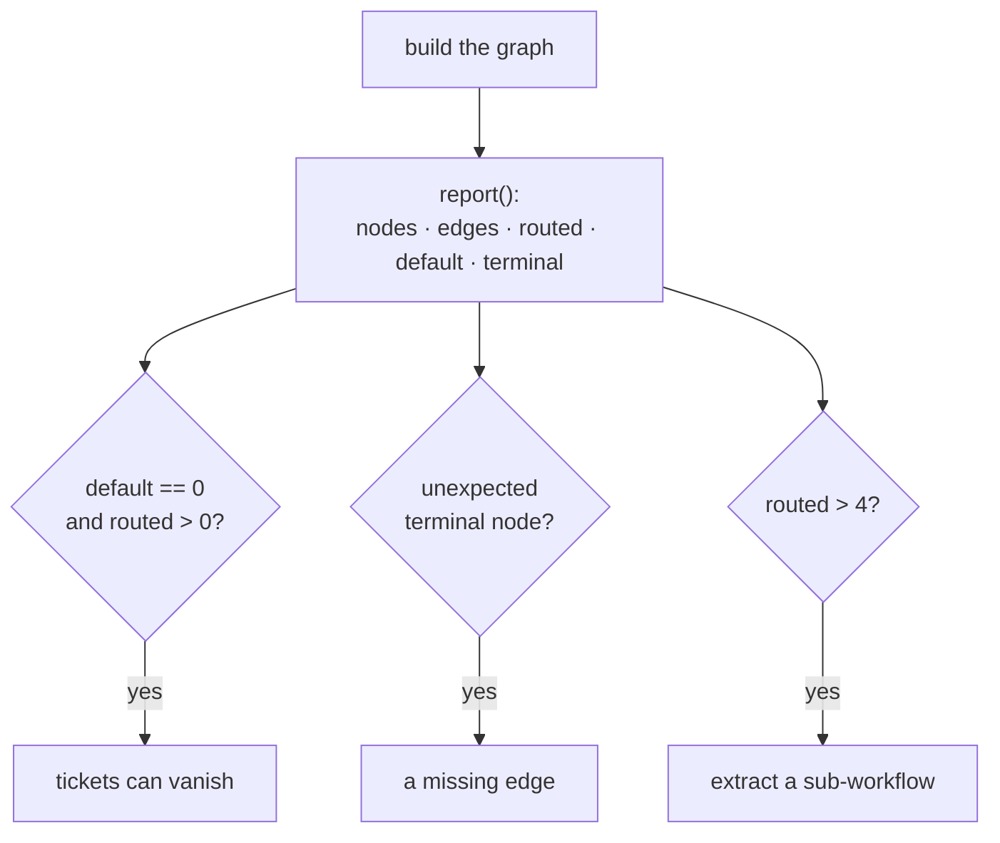

# 6.2 — The labelled fuse box

## One-line answer

A graph is reviewable when a person who has never seen it can read the edge list and predict what a
given input will do — which means node names that say what they do, one place where branching happens,
a `DEFAULT_ROUTE` on every routing node, and a sub-workflow the moment the picture stops fitting on a
screen.

## The story

Two fuse boxes, same building, twenty years apart.

The old one is a row of identical black switches behind a metal door. No labels. There were labels once
— you can see where a strip of tape used to be, and there is one word left, in pen, that says
*"kitchen?"*, with the question mark. When something trips, you stand there and flip switches one at a
time, and go and look, and come back.

The new one, in the flat downstairs, has a printed strip: *lights front · lights rear · sockets kitchen
· geyser · AC bedroom · pump*. When something trips, you look at what stopped working, read the strip,
and go straight to it.

Both boxes have the same wires and the same fuses. The electrical work is identical. One of them can be
used by a person who has never been in the building before, and the other can only be used by someone
who has learned it by trial and error and is not here at the weekend.

## The idea in plain language

By this point in the day you can build a graph that works. This part is about the graph being *usable
by somebody else* — including you, in six months, at 3am, having forgotten it.

Six properties, in the order they matter:

1. **Node names say what the node does.** `classify`, `search_kb`, `human_queue`. Not `step_two`, not
   `node_a`. The name appears in every trace, every metric, every log line and every error message
   ([1.1](../01-the-node/1.1-a-node-is-a-unit-of-work.md)), and it is the only word an on-call engineer
   has to go on.
2. **Branching is concentrated.** Routed edges out of one or two nodes, not sprinkled through the
   graph. Nine edges of which three are routed and all three leave the same node — the shape from
   [4.4](../04-composition/4.4-the-floor-plan-by-the-lift.md) — is readable. Nine edges with routes on
   six different nodes is a decision tree and has more paths than you will ever test.
3. **Every routing node has a `DEFAULT_ROUTE`.** Otherwise "no branch matched" is silence
   ([2.3](../02-the-edge/2.3-a-label-not-an-address.md), [5.2](../05-the-first-graph/5.2-the-cycle-that-finished-early.md)).
4. **Every join is fed on every route that reaches it.** Otherwise the graph stops halfway
   ([2.4](../02-the-edge/2.4-two-shops-at-once.md)).
5. **The diagram is generated.** A drawn one is a picture of an earlier version
   ([4.4](../04-composition/4.4-the-floor-plan-by-the-lift.md)).
6. **It fits on a screen.** When it stops fitting, extract a sub-workflow — a `Workflow` is a node
   ([1.2](../01-the-node/1.2-the-four-things-that-can-be-a-node.md)), so this costs nothing structural.

The reason to be strict about this is not tidiness. A graph is the thing everybody reaches for when
something is wrong, and the same properties that make it readable are the ones that make it *safe to
change*: you cannot add an edge correctly to a graph you cannot hold in your head.

## Why Sutra needs it

The Day 58 graph is edited on Days 60, 62, 63, 64 and 70 — durability, human-in-the-loop, an approval
gate, and quota-aware routing. Five separate additions to one graph over three phases.

The Phase 8 gate is *triage graph v1 end-to-end* and the Phase 9 gate is *kill it mid-run; it resumes;
a human approved the write*. Neither is achievable on a graph that has stopped being legible, because
both require adding something to it and knowing you have not broken the rest.

## The mechanism

The review, run against the day's own graph, as four numbers and a picture.

```python
def report(flow: Workflow) -> None:
    routed = [e for e in flow.graph.edges if e.route is not None]
    default = [e for e in flow.graph.edges if e.route == DEFAULT_ROUTE]
    terminal = sorted(flow.graph._terminal_node_names)
    print(f"  nodes            {len(flow.graph.nodes)}")
    print(f"  edges            {len(flow.graph.edges)}")
    print(f"  routed edges     {len(routed)}")
    print(f"  DEFAULT_ROUTE    {len(default)}")
    print(f"  terminal nodes   {terminal}")
```

**Line by line:**

- `len(nodes)` against `len(edges)` is the first thing to read. A tree of *n* nodes has *n − 1* edges;
  anything more means merges, which is the whole reason for using a graph
  ([4.1](../04-composition/4.1-one-secretary-or-one-register.md)).
- `routed` is the branching count. This is the number that predicts how hard the graph is to test:
  roughly, paths grow with it.
- `default` should be *at least one per routing node*. Zero here is the review finding.
- `terminal` is the list of legitimate endings. If a node you did not expect is terminal, an edge is
  missing — that is how [3.3](../03-the-graph-is-checked/3.3-the-switch-that-turns-nothing-on.md)'s
  half-wiring shows up in a summary rather than in an exception.

```bash
cd days/day-53-graph-workflow-runtime/lab
uv run python shape.py
```

**Line by line:**

- `shape.py` reports on `triage.build()` — the real graph from
  [5.1](../05-the-first-graph/5.1-five-desks-one-form.md) — and then prints the generated diagram.

Measured on 2026-09-05:

```text
  nodes            9
  edges            9
  routed edges     3
  DEFAULT_ROUTE    1
  terminal nodes   ['human_queue', 'review']
```

Review it as if someone else wrote it.

**Nine nodes, nine edges.** One more edge than a tree would have, and that one is the merge at
`research`. The graph earns its shape by exactly one edge, which is honest: this is a mostly-linear
process with one branch and one merge, and it should look like one.

**Three routed edges, all leaving `classify`.** Branching is in one place. To answer *"what can happen
to a ticket?"* you read one node's outgoing edges, and there are three of them.

**One `DEFAULT_ROUTE`.** Every route out of the only routing node is covered, so an unclassifiable
ticket cannot vanish.

**Two terminal nodes: `review` and `human_queue`.** Exactly two ways to finish, and both are intended.
A third name in that list would be a missing edge.

Four numbers, and they let a reader who has never opened `triage.py` say something true about it.

Here is the same review on a graph that would fail it — the numbers alone are enough:

```text
  nodes            14
  edges            19
  routed edges     8
  DEFAULT_ROUTE    0
  terminal nodes   ['draft', 'escalate', 'human_queue', 'log_it', 'review']
```

**Line by line:**

- `DEFAULT_ROUTE 0` with eight routed edges: every unmatched label is a silently dropped ticket.
- Five terminal nodes, including `draft` and `log_it`, which are not endings — those are two missing
  edges, and `draft` being terminal means some path sends a reply that was never reviewed.
- Nineteen edges over fourteen nodes with eight routed: this needs to be two graphs.

Nobody had to read the code.



## When it breaks

The failure of this part is a graph that is *technically correct and unreadable*, and it arrives one
reasonable commit at a time. Nobody adds eight routed edges. Somebody adds a second one, then a third,
each with a good argument, and there is never a commit where the reviewer can point at the graph and
say it has become too much.

The specific smell, and it is worth being able to name: **a routed edge added to a node that is not the
classifier.** The moment `draft` starts routing — *"if the draft is short, go here"* — decisions are
being made in two places, and the answer to "why did this ticket end up there?" now requires reading
two nodes instead of one.

The other failure is more literal, and it is the graph that is really a tree in disguise:

```text
  nodes            4
  edges            3
  routed edges     0
```

Three edges over four nodes, no routes, no merges. This is a chain, and a chain is a tree. There is
nothing wrong with it — a linear process should be linear — but if that graph contains a
`SequentialAgent` doing the real composition inside one of its nodes, it is
[4.2](../04-composition/4.2-the-textbook-with-the-wrong-edition.md)'s half-port, and the giveaway is
exactly this: a node count that is too small for the process it claims to run.

## In production

**What a professional writes instead.** The `report()` numbers go in a test as assertions —
`assert len(routed) <= 4`, `assert default >= 1`, `assert terminal == {"review", "human_queue"}` — so
the graph's shape is a reviewed property rather than an emergent one. A pull request that adds a
routed edge then has to change a number, which is exactly the moment to ask whether it should.

**What degrades at scale.** Legibility, and it degrades before anything else does. The graph stays
correct, fast and green long after it has stopped being something a person can hold in their head, and
the cost is paid in every future change: longer reviews, more cautious edits, and eventually a team
that adds a new graph rather than touching the existing one because nobody is confident in it.

**The failure that only appears with real traffic.** A branch that is correct and never taken. It
passes every structural check in this part — it is wired, reachable, has a default — and it has handled
zero tickets since it was written, so the node at the end of it has drifted with no feedback. When the
classifier's behaviour shifts, that branch wakes up. Instrument executions per node; a zero is either
dead code or a bug in the classifier, and both are worth knowing.

**The review comment a senior engineer leaves:** *"Eight routed edges and no default route on any of
them. Before this merges: one default per routing node, and pull the escalation branch out into its own
`Workflow` node. I cannot review this — I cannot tell you what a billing ticket does without tracing
four nodes by hand, and neither can the person who gets paged."*

**The interview question:** *"How do you tell whether a workflow is well designed, without running
it?"* An answer that is a procedure rather than a preference: *"I read four numbers off the graph
object: node count against edge count, how many edges are routed, how many default routes there are,
and which nodes are terminal. More edges than nodes minus one means there are merges, which is why you
have a graph at all. Routed edges tell me how many paths I owe tests for, and I want them concentrated
on one node, not sprinkled. Zero default routes with any routed edges means work can vanish silently.
And the terminal list should be exactly the intended endings — an unexpected name there is a missing
edge. That is a review I can do in a minute without reading a single node body."*

## Check yourself

```bash
cd days/day-53-graph-workflow-runtime/lab
uv run python shape.py
```

Now write the three assertions from *In production* as a test against `triage.build()`, run it, then
delete the `DEFAULT_ROUTE` edge and watch it go red.

**Out loud, without scrolling up:** name the four numbers you would read off a graph to review it, and
say what an unexpected terminal node means.

**Next:** the day's parts are done. Now read the paper they came from —
[Dryad](../../papers/01-dryad.md).
