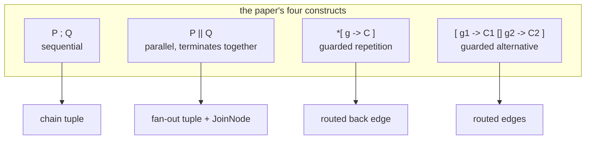

# Communicating sequential processes

> **Communicating sequential processes** · `doi:10.1145/359576.359585` · *Communications of the ACM*
> 21(8), 1978, pages 666–677 · <https://doi.org/10.1145/359576.359585>
>
> Record opened on 2026-09-05 via the CrossRef API for that DOI
> (`curl -s https://api.crossref.org/works/10.1145/359576.359585`), which returned the title,
> journal, volume, issue, pages and year copied above. The ACM Digital Library landing page returns
> HTTP 403 to an unauthenticated fetch; CrossRef is the authoritative record for the identifier.

## One-line answer

This paper proposes that a concurrent program should be written as independent sequential processes
that interact **only** by explicitly named communication, and gives three ways to combine them —
one after another, together, and repeatedly — which are the three shapes this day just built.

## The story

It is the middle of the 1970s and computers have started doing more than one thing at a time.

The programs that do this are written the way the machine works. Two pieces of code share memory. One
of them raises a flag when it has written something; the other checks the flag. There are interrupts,
which arrive whenever the hardware feels like it, and there are locks, and there is a growing
collection of tricks for making sure two pieces of code do not write the same word at the same
moment.

The trouble is not that this is hard to write. It is that there is no way to *say* what the program
does. You cannot read the two pieces and know how they interact, because their interaction is not
written anywhere: it is spread across a shared variable, a flag, and an assumption about who gets
there first. If you want to know whether the program is correct, you cannot read it. You have to
imagine every order in which the two halves might interleave, and there are a great many, and you
will forget one.

Everyone who has tried to debug that kind of program knows the specific feeling: the bug is not in
either half. It is in the gap between them, and the gap is not written down anywhere.

## The idea in plain language

The proposal is one sentence: **make the interaction the thing you write down.**

Concretely, the paper argues that a concurrent program should be built from **processes** — ordinary
sequential programs, each with its own private variables that nothing else can touch — and that the
*only* way one process may affect another is by an explicit **communication**, in which one process
names another and offers a value, and the other names the first and takes it.

Three terms, defined the way the paper uses them:

- **Process** — a sequential program with private state. Nothing outside it can read or write its
  variables. This is the part that removes the shared-memory race by construction rather than by
  discipline.
- **Command** — a step. The paper writes an output command as `ch ! value` ("send value on ch") and
  an input command as `ch ? x` ("receive into x from ch").
- **Synchronisation** — a communication happens only when both sides are ready. The sender waits for
  a receiver; the receiver waits for a sender. There is no buffer, so a communication is a *moment*
  that both processes agree on. The paper's word for this is that the two commands **correspond**.

On top of processes and communication, the paper gives three ways to put programs together, and this
is where a reader who has just finished this day's parts will recognise something:

| The paper's notation | What it means | This day |
| --- | --- | --- |
| `P ; Q` | sequential composition: run `P`, then run `Q` | [1.1](../parts/01-one-after-another/1.1-the-order-you-declare-is-the-order-you-get.md) |
| `P \|\| Q` | parallel composition: run both; finish when both have finished | [2.1](../parts/02-at-the-same-time/2.1-three-branches-from-one-edge.md), [2.2](../parts/02-at-the-same-time/2.2-the-node-that-waits-for-everyone.md) |
| `*[ guard → command ]` | guarded repetition: repeat while the guard holds | [3.1](../parts/03-around-again/3.1-a-loop-is-an-edge-that-goes-back.md) |

Three combinators. It is not a coincidence that this day has three sections.

The fourth construct is the one that gets less attention and is arguably the most consequential:
**the guarded alternative**, written `[ g1 → C1 ▯ g2 → C2 ]`, which offers several possibilities and
takes whichever one becomes available. That is the ancestor of a routed edge — a node offering two
onward paths and something choosing between them.

## Why Sutra needs it

Every shape in this day is one of the paper's combinators wearing a graph's clothes.
[1.1](../parts/01-one-after-another/1.1-the-order-you-declare-is-the-order-you-get.md)'s chain is
`P ; Q ; R`. [2.1](../parts/02-at-the-same-time/2.1-three-branches-from-one-edge.md)'s fan-out with
the `JoinNode` of [2.2](../parts/02-at-the-same-time/2.2-the-node-that-waits-for-everyone.md) is
`P || Q || R` — including the join, because parallel composition in the paper finishes only when all
of its processes have. [3.1](../parts/03-around-again/3.1-a-loop-is-an-edge-that-goes-back.md)'s
routed back edge is guarded repetition.

The part that is not decoration is
[2.4](../parts/02-at-the-same-time/2.4-two-branches-one-state-key.md). That part measured two
branches writing one session-state key and found last-writer-wins, with the declared order making no
difference. Session state is shared memory. The paper's central claim is that shared memory between
concurrent processes is the thing to remove, and the day arrived at that answer empirically — write
your own key, combine after the join — half a century after the paper argued it from first
principles.

Day 57's Writer↔Critic pair and Day 58's triage graph are both built out of these three combinators,
and Day 60's durable execution depends on the run's interactions being explicit enough to record.

## The mechanism

The paper's method, written out.

**A process is sealed.** Its variables are private. There is no construct in the notation for "read
another process's variable", which is not an omission — it is the entire proposal. Everything two
processes know about each other travels through communications, so the interaction between them is a
finite, readable list of send and receive commands rather than an emergent property of timing.

**A communication is a rendezvous.** `P` executing `Q ! v` and `Q` executing `P ? x` complete
together, and the value moves. If `P` is ready first, `P` waits. Nothing is queued, and there is no
mailbox either side can ignore. This is why the paper can talk about the *state* of a program at a
moment: the communications are the points where the processes agree about where they are.

**Guarded commands choose.** A guard is a boolean, or an input command, or both. `*[ g → C ]` repeats
`C` for as long as `g` holds. `[ g1 → C1 ▯ g2 → C2 ]` offers a choice, and where a guard is an input
command, the choice is made by whichever partner communicates first. That is how a process waits on
several possible inputs without polling any of them.

**Parallel composition terminates together.** `[ P || Q ]` finishes when both `P` and `Q` have
finished. A join is not an extra mechanism bolted on; it is what parallel composition *means*. When
[2.2](../parts/02-at-the-same-time/2.2-the-node-that-waits-for-everyone.md) had to add a `JoinNode`
explicitly, it was recovering something the paper had built into the combinator.



## The paper in one demo

The claim to isolate is the paper's central one: **processes that interact only by named
communication have a defined result, and processes that share a variable do not.** Everything else in
the paper — the notation, the guards, the parallel composition — is here only as far as it takes to
state that.

Two files. Two hundred lines total, no framework, no model call, no arguments beyond the ablation
switch.

```text
days/day-54-sequential-parallel-loop/lab/papers/communicating-sequential-processes/
├── csp.py     # the three combinators and the rendezvous channel
└── demo.py    # two writers and a decider, run 200 times, with the ablation switch
```

**`csp.py`** — the paper's constructs, and nothing else:

```python
class Channel:
    """A rendezvous between exactly two processes: `send` and `receive` complete together."""

    def __init__(self, name: str) -> None:
        self.name = name
        self._queue: asyncio.Queue[Any] = asyncio.Queue(maxsize=1)
        self._taken: asyncio.Event = asyncio.Event()

    async def send(self, value: Any) -> None:
        """The paper's `ch ! value`. Returns only once a receiver has taken it."""
        self._taken.clear()
        await self._queue.put(value)
        await self._taken.wait()

    async def receive(self) -> Any:
        """The paper's `ch ? x`. Waits until some process offers a value on this channel."""
        value = await self._queue.get()
        self._taken.set()
        return value


def seq(*processes: Process) -> Process:
    """The paper's `P ; Q`: each process starts only after the previous one has finished."""

    async def run() -> None:
        for process in processes:
            await process()

    return run


def par(*processes: Process) -> Process:
    """The paper's `P || Q`: all processes run together, and this finishes when the last does."""

    async def run() -> None:
        await asyncio.gather(*(process() for process in processes))

    return run


def rep(guard: Callable[[], bool], process: Process) -> Process:
    """The paper's `*[ guard -> P ]`: repeat while the guard holds, test it before each pass."""

    async def run() -> None:
        while guard():
            await process()

    return run
```

**Line by line:**

- `asyncio.Queue(maxsize=1)` plus `self._taken` — a rendezvous, not a mailbox. The queue alone would
  let the sender drop a value and walk away, which is a buffer and is what the paper explicitly does
  not have. `await self._taken.wait()` is what makes `send` block until a receiver has actually taken
  the value, so the two commands complete together.
- `self._taken.clear()` at the top of `send` — reset before offering, so a previous communication's
  completion cannot satisfy this one.
- `def seq(*processes)` returning a coroutine function rather than running anything — the
  combinators build processes out of processes, which is what makes them combinators. `seq(a, b)` is
  itself something `par` can take.
- `await asyncio.gather(...)` in `par` — gather finishes when every coroutine has finished, which is
  precisely the paper's rule that `[P || Q]` terminates when both do. The join is in the combinator.
- `rep(guard, process)` — the guard is a callable rather than a value, so it is re-evaluated before
  each pass. A boolean passed by value would be tested once and the loop would never terminate,
  which is the same mistake as a route that never changes
  ([3.4](../parts/03-around-again/3.4-the-loop-that-never-ends.md)).
- There is no lock, no flag and no shared variable anywhere in this file. That absence is the paper.

**`demo.py`** — the experiment, and the switch:

```python
async def one_run_with_channels() -> str:
    """archive || knowledge_base || decide, where decide receives from two named channels."""
    from_archive = Channel("archive")
    from_kb = Channel("kb")
    result: list[str] = []

    async def archive() -> None:
        await jitter()
        await from_archive.send("low")

    async def knowledge_base() -> None:
        await jitter()
        await from_kb.send("high")

    async def decide() -> None:
        a = await from_archive.receive()
        k = await from_kb.receive()
        result.append(f"archive={a} kb={k}")

    await par(archive, knowledge_base, decide)()
    return result[0]


async def one_run_with_shared_state() -> str:
    """The same three processes, with the two writers sharing one variable instead."""
    state: dict[str, str] = {}
    result: list[str] = []

    async def archive() -> None:
        await jitter()
        state["confidence"] = "low"

    async def knowledge_base() -> None:
        await jitter()
        state["confidence"] = "high"

    async def decide() -> None:
        while "confidence" not in state:
            await asyncio.sleep(0)
        result.append(f"confidence={state['confidence']}")

    await par(archive, knowledge_base, decide)()
    return result[0]
```

**Line by line:**

- `await jitter()` — yields control back to the event loop a random number of times, seeded once in
  `main`. It is the same in both arms, so the scheduling chaos is identical and the only difference
  between the two functions is *how the processes interact*.
- `from_archive = Channel("archive")` and `from_kb = Channel("kb")` — **two** channels, one per
  sender. That is the paper's rule that a communication names its partner; a single shared channel
  would put the two values in an order nobody chose.
- `a = await from_archive.receive()` then `k = await from_kb.receive()` — the decider names which
  value it wants first. It cannot receive the wrong one, whatever the timing, because the two values
  arrive on different channels.
- `state["confidence"] = "low"` in the ablation — the same value, deposited in a shared variable
  instead of handed over. Neither writer names anyone. Neither knows the other exists.
- `while "confidence" not in state: await asyncio.sleep(0)` — the natural way to write "wait until
  someone has written it" without channels, and it is a poll. Notice it cannot ask *whose* value it
  is looking at, because a shared variable does not record who wrote it.
- Both arms use `par(...)`, the paper's own combinator, so the ablation switches exactly one thing:
  channels versus a shared variable.

The command, and the ablation:

```bash
cd days/day-54-sequential-parallel-loop/lab/papers/communicating-sequential-processes
uv run python demo.py
uv run python demo.py --shared
```

**Line by line:**

- `demo.py` runs `one_run_with_channels` two hundred times, driving the trial with `seq(rep(...))` so
  the paper's other two combinators are doing the work rather than a bare `for` loop.
- `--shared` swaps in `one_run_with_shared_state`. That flag is the ablation: it turns the paper's
  contribution off and changes nothing else.

Measured on 2026-09-05, with the paper's rule **on**:

```text
200 runs, channels (paper's rule ON)
     200x  archive=low kb=high
    distinct results: 1
```

And with it **off**:

```text
200 runs, shared variable (paper's rule OFF)
     118x  confidence=high
      82x  confidence=low
    distinct results: 2
```

Two hundred runs, one distinct result. Two hundred runs, two distinct results, at roughly sixty-forty.

Same processes, same values, same scheduler, same seed, same `par` combinator. The only thing the
flag changes is whether the interaction between the processes is a named communication or a shared
variable, and that alone is the difference between a program with one answer and a program with two.

That sixty-forty split is [2.4](../parts/02-at-the-same-time/2.4-two-branches-one-state-key.md)'s
measurement, arrived at from the other direction. There, two graph branches wrote one state key and
the slower one won. Here, the mechanism is stripped of everything else, and the paper's fix is a flag
away.

## When it breaks

The paper's model is narrower than its influence, and three of its limits matter.

**It assumes a fixed set of processes, known in advance.** The notation names them and composes them
statically. That is a poor fit for anything that spawns work in response to what it finds — which is
exactly a fan-out over a list, and which ADK provides as a parallel worker rather than as named
branches. The paper's own text acknowledges that it deliberately excludes such features to keep the
proposal small.

**The unbuffered rendezvous is a strong requirement.** Every send blocks until a receiver takes the
value. That gives you the clean reasoning, and it also means a slow consumer stops its producer dead.
Real systems put a buffer in — every message queue is a mailbox — and a buffer is precisely what the
paper removed. What you buy back is throughput; what you give up is knowing where in the program
each side is.

**It is a notation, not a language.** The paper presents the constructs without an implementation, an
error model or a type system, and it says so. Everything about failure is outside it: what happens
when a process crashes mid-communication, or when a partner never arrives, is not addressed. Sutra's
answers to those — [4.2](../parts/04-where-they-meet/4.2-the-branch-that-took-everyone-down-with-it.md)
on a failing branch, [3.5](../parts/03-around-again/3.5-the-guard-you-write-yourself.md) on a loop
that will not terminate — are questions the paper does not ask.

**And the guarded alternative does not solve the exit problem.** `*[ g → C ]` terminates when `g`
becomes false, and nothing in the notation says it will. The runaway loop of
[3.4](../parts/03-around-again/3.4-the-loop-that-never-ends.md) is expressible here, exactly as it is
in a routed graph.

## In production

**What survived.** The core claim did, comprehensively. "Do not communicate by sharing memory; share
memory by communicating" is the design rule of Go's goroutines and channels, of Erlang and Elixir's
processes and mailboxes, of Rust's channels, and of every actor framework. The word "channel" in all
of those traces to this paper. So does `select`, which is the guarded alternative under another name.

The three combinators survived so thoroughly that they stopped being attributed. Every workflow
engine in current use — including the one this day is written against — offers sequential, parallel
and looping composition as its primitives, and offers them in that order.

**What did not.** The unbuffered rendezvous mostly lost. Go's channels are buffered by default in
practice, Erlang's mailboxes are unbounded, and every message broker is a buffer with durability
bolted on. The reasoning benefit was real and the coupling cost was higher, so the field kept the
named channel and dropped the synchronisation.

The **notation** did not survive either. Nobody writes `ch ! v`. What survived is the shape of the
idea in ordinary function calls: `ch.send(v)` and `ch.receive()`, which is what `csp.py` above does.

And the paper's **static process structure** was abandoned early. Its own direct successor, the
process algebra that grew out of it, generalised to dynamic process creation, because a fixed set of
processes named at compile time cannot express a server.

**Where Sutra sits.** ADK's graph runtime is on the other side of one of these choices, and it is
worth being clear-eyed about which. Nodes do not have private state: they share session state, which
is a shared variable, which is the thing the paper removed. That is a deliberate trade — it makes
[1.2](../parts/01-one-after-another/1.2-what-the-next-stage-can-see.md)'s pattern possible, where a
node three stages later reads a key without every stage in between carrying it — and the price is
paid in full in [2.4](../parts/02-at-the-same-time/2.4-two-branches-one-state-key.md). The `JoinNode`
is the closest thing the graph has to a communication: a place where several branches hand values to
one node, by name, at a moment they all agree on. Which is why the working advice from this paper,
for this framework, is the one that part reached anyway: **inside a fan-out, treat state as
write-your-own and read-after-join.**

## Check yourself

```bash
cd days/day-54-sequential-parallel-loop/lab/papers/communicating-sequential-processes
uv run python demo.py
uv run python demo.py --shared
```

Now change `one_run_with_channels` to use a **single** channel for both senders instead of two, and
run it again. Count the distinct results, and say which of the paper's rules you just broke.

**Out loud:** what did this paper actually claim, and what do we do differently now? Include, in your
answer, which side of its central trade ADK's session state sits on.

**Next:** back to the hub — [Day 54](../LESSON.md) — for the build brief, the eval and the ledger.
