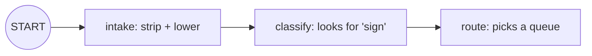

# 1.1 — The order you declare is the order you get

## One-line answer

A sequential workflow is one tuple — `(START, a, b, c)` — and the runtime turns it into three edges
that run in exactly that order, handing each node the value the node before it returned.

## The story

You go to the passport office to renew a passport. There are three windows along one wall, and a
sign says to use them in order.

Window one takes your form, checks that the name matches your old passport, and writes the
reference number at the top in red pen. Window two takes the form with the red number on it, looks
up the number, and stamps the fee as paid. Window three takes the stamped form and gives you a
collection slip.

You have done this before, so you know what happens if you get it wrong. One afternoon you walked
to window two first, because there was no queue. The clerk did not shout at you. She did not send
you away either. She looked at the form, could not find a red number, wrote *"reference missing"*
in the box, stamped it, and handed it back. You joined window one, got the red number, went to
window three, and were told at the counter that the fee stamp was against a blank reference and the
whole thing had to start again.

Nobody refused you. Every window did its job on whatever was put in front of it. The order was the
only thing that was wrong, and the order was the thing nobody checked.

## The idea in plain language

A **workflow** is a description of which pieces of work happen, and in what order. In ADK 2.x that
description is a **graph**: a set of **nodes** (the pieces of work) and **edges** (the arrows
between them). Day 53 introduced both words and the class that holds them, `Workflow`.

A **sequential** workflow is the simplest graph there is: a straight line. One node, then the next,
then the next. Each node runs once, and it does not start until the node before it has finished.

Two things travel along that line, and they are different things:

- **The node's output** — whatever the node returned. The next node receives it as its input.
- **The session state** — a dictionary that lives for the whole run, which any node can read or
  write. [1.2](1.2-what-the-next-stage-can-see.md) is about that difference; this part is about the
  order.

There is a third word you need for the rest of the day. **`START`** is a node the runtime provides,
with no work in it, that marks where the graph begins. Every graph has exactly one, and everything
else must be reachable from it. You never write a function for `START`; you just point the first
edge out of it.

The word **chain** in this day means a straight run of nodes with no branching: window one, window
two, window three.

## Why Sutra needs it

Day 58 builds the triage graph: intake, then classify, then research, then draft, then review. Four
of those five arrows are ordinary sequential edges, and the reason they are edges rather than four
lines of Python is what [1.3](1.3-why-calling-them-in-order-is-not-a-workflow.md) is about.

The immediate reason Sutra needs *this* part is smaller and sharper. The desk's classifier looks for
the word `sign` in lower case. The normaliser is what makes the text lower case. Put those two in
the wrong order and the classifier still answers. It just answers `other` for every authentication
ticket the desk will ever see, quietly, for as long as nobody checks.

## The mechanism

A chain is a **tuple** in the `edges` list. The first element is `START`; every element after it is
a node, and the runtime draws one edge between each neighbouring pair.

```python
from google.adk.workflow import START, Workflow


def intake(node_input: str) -> str:
    """Stage one: normalise whatever arrived from the user."""
    return node_input.strip().lower()


def classify(node_input: str) -> str:
    """Stage two: one word saying what kind of ticket this is."""
    return "auth" if "sign" in node_input else "other"


def route(node_input: str) -> str:
    """Stage three: the queue this ticket belongs in."""
    return f"queue:{node_input}"


workflow = Workflow(name="intake_chain", edges=[(START, intake, classify, route)])
```

**Line by line:**

- `from google.adk.workflow import START, Workflow` — both live in `google.adk.workflow`, the 2.x
  composition layer. Verified against `https://adk.dev/graphs/` on 2026-09-05, and against the
  installed package with
  `python -c "from google.adk.workflow import START, Workflow; print(START.name)"` on
  `google-adk==2.7.1`, which prints `__START__`.
- `def intake(node_input: str) -> str:` — a plain function. Not decorated, not registered, not
  subclassed from anything. The parameter is named `node_input`, and that name is not a
  coincidence: it is the name the runtime binds the upstream node's output to. Any other name is
  looked up in session state instead, which is the subject of
  [1.2](1.2-what-the-next-stage-can-see.md) and the cause of the error in
  [1.4](1.4-the-stage-that-refuses-to-run.md).
- `return node_input.strip().lower()` — the return value *is* the node's output. There is no
  `yield`, no event object and no wrapper. The runtime wraps it for you.
- `"auth" if "sign" in node_input else "other"` — the classifier is deliberately this crude, because
  a crude rule makes the ordering bug visible. `"sign"` is lower case, so this line only works on
  text that `intake` has already lowered.
- `edges=[(START, intake, classify, route)]` — one tuple, four elements, three edges:
  `START → intake`, `intake → classify`, `classify → route`. `edges` is the only structural argument
  `Workflow` takes, and the node list is derived from it rather than given separately. Verified with
  `python -c "from google.adk.workflow import Workflow; print(sorted(Workflow.model_fields))"` on
  `google-adk==2.7.1`: there is no `nodes` field to pass.
- The three bare functions are converted into nodes for you. A plain callable is one of the things
  the runtime accepts wherever a node is expected, alongside a `BaseNode` and a tool.

Run it:

```bash
cd days/day-54-sequential-parallel-loop/lab
uv run python chain.py
```

**Line by line:**

- `chain.py` builds exactly the graph above and prints every output the graph emitted, in order.
- It takes one flag, `--swap`, which declares `classify` before `intake` and changes nothing else.

Measured on 2026-09-05:

```text
declared: START -> intake -> classify -> route
  1. 'signed out mid-form'
  2. 'auth'
  3. 'queue:auth'
```

Three outputs, one per node, in declaration order. `intake` received the raw user text
`"  Signed OUT mid-form "` and returned it stripped and lowered. `classify` received *that*, not the
original, and found `sign` in it. `route` received `'auth'`.



Now the same three nodes in the wrong order:

```bash
uv run python chain.py --swap
```

**Line by line:**

- `--swap` builds `(START, classify, intake, route)`. The functions are unchanged, the input text is
  unchanged, and the graph is still perfectly valid: three nodes, three edges, one terminal.

```text
declared: START -> classify -> intake -> route
  1. 'other'
  2. 'other'
  3. 'queue:other'
```

There is no error here and no warning. `classify` was handed `"  Signed OUT mid-form "` with its
capital letters intact, looked for `sign`, did not find it, and returned `'other'` — a perfectly
good string. `intake` then lowered `'other'` to `'other'`, and `route` filed the ticket in the wrong
queue.

This is the passport office. Every node did its job on what was put in front of it, and the order
was the only thing that was wrong.

## When it breaks

The break worth reaching on purpose is not the swap above, which produces a wrong answer rather than
an error. It is what happens when a chain has a **gap** in it: you declare two separate tuples and
forget that the second is not attached to the first.

```python
workflow = Workflow(
    name="broken",
    edges=[(START, intake), (classify, route)],
)
```

**Line by line:**

- Two tuples instead of one. The first gives `START → intake`. The second gives `classify → route`.
- Nothing anywhere gives `intake → classify`, so `classify` and `route` sit in the graph with no path
  from `START` to either of them.

The runtime refuses to build it, at construction time, before a single node runs:

```text
pydantic_core._pydantic_core.ValidationError: 1 validation error for Workflow
  Value error, Graph validation failed. The following nodes are unreachable from START:
  ['classify', 'route']
```

The smallest fix is to make it one tuple: `[(START, intake, classify, route)]`. The general fix is to
remember that a tuple is one chain, and a list of tuples is a list of *separate* chains, joined only
where they name the same node object.

[1.4](1.4-the-stage-that-refuses-to-run.md) collects the other four rejections this check performs,
because they are worth meeting together.

## In production

**What a professional writes instead.** They do not put the chain in a module-level variable and
import it. They put it behind a function — `def triage_graph() -> Workflow:` — for a reason that
looks like style and is not. A `Workflow` is built once and validated once, and a graph built at
import time validates during the import of whatever imports it, which means a graph bug surfaces as
a failure to import your package rather than as a failure to build a graph. Behind a function, the
same bug surfaces where you called the function, with a stack that says so.

**What degrades at scale.** Nothing about a chain degrades, which is its whole appeal. What degrades
is the *reason* it is a chain. Sutra's research stage does three independent lookups; written as a
chain they take as long as all three added together, and that is the argument for
[2.1](../02-at-the-same-time/2.1-three-branches-from-one-edge.md). A chain is the right shape when
each stage genuinely needs the previous stage's answer, and the wrong shape the moment it does not.

**The failure mode that only appears with real traffic.** The swap above. It produces plausible
output on every ticket, so it passes any test whose assertion is "the graph returned a string". It
is caught by exactly one kind of test: one that asserts the *content* of the answer for an input
whose correct answer you know. On the desk that means a ticket containing the word "SIGN" in capital
letters, asserted to come out as `auth`. Without that test the ordering bug is invisible until a
support agent notices that authentication tickets stopped being grouped.

**The review comment a senior engineer leaves:** *"These are three edges in one list, which is fine,
but nothing in this file says the second stage depends on the first having lowered the text. Put the
assumption in the classifier — either lower it there too, or assert it — because a graph is easy to
reorder and this ordering is load-bearing."*

**The interview question:** *"You have a two-stage pipeline and someone swaps the stages. How do you
find out?"* An honest answer: *"Usually not from an exception. I did this on purpose in a small
graph: a normaliser and a classifier that looks for a lower-case word. Swapped, every ticket came
back `other` and nothing errored, because the classifier is happy to run on unnormalised text and
returns a valid answer for it. What catches it is an assertion on the content for a case whose
answer you know — capital letters in, `auth` out. Structural checks catch unreachable nodes and
duplicate names; they cannot catch two nodes that are both willing to run in either order."*

## Check yourself

```bash
cd days/day-54-sequential-parallel-loop/lab
uv run python chain.py
uv run python chain.py --swap
```

Now change `classify` so it looks for `"Sign"` with a capital S, and run both again. Write down which
of the two orders is correct afterwards, and what that tells you about where the ordering assumption
actually lives.

**Out loud, without scrolling up:** what does `START` do, and what exactly does the second element of
a chain tuple receive as its input?

**Next:** [1.2 — What the next stage can see](1.2-what-the-next-stage-can-see.md).
