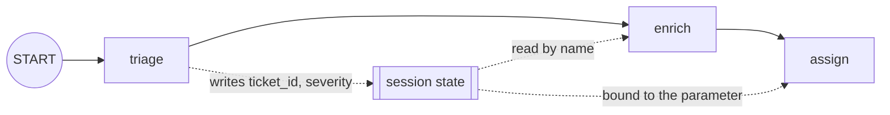

# 1.2 — What the next stage can see

## One-line answer

A node sees exactly two things: the value the node before it returned, bound to a parameter named
`node_input`, and the session state, from which every *other* parameter is bound by name.

## The story

You take the car in because something rattles over speed bumps. The service desk writes a job card
and clips it under the wiper: registration, mileage, *"rattle, front nearside, over bumps"*.

The card travels with the car. The first mechanic puts it on the ramp, finds a loose heat shield,
writes *"heat shield tack-welded"* on the card, and pushes it into the next bay. The second mechanic
reads the card, does the road test, writes *"road tested, rattle gone"*, and pushes it to the valet.
The valet reads the card, sees nothing addressed to him, vacuums the mats and parks it out front.

Now think about what the second mechanic actually knew. He knew what the first mechanic wrote,
because it was on the card. He also knew the registration and the mileage, because those were on the
card too, written at the desk before either of them touched the car. Those are different kinds of
knowing. One is a handover from the person immediately before him. The other is a fact about the job
that has been there since the beginning and will still be there when the valet reads it.

The day the card gets separated from the car, the second mechanic road-tests a car whose rattle he
has to find again from scratch. Nothing is broken. The information just is not there.

## The idea in plain language

Every node in a graph has two sources of information, and confusing them is the most common bug in
a workflow that runs but produces nonsense.

**The node input** is the handover. It is whatever the immediately preceding node returned, and only
that. It does not accumulate; node three does not receive node one's output unless node two passed
it along. This is the note the first mechanic wrote for the second.

**The session state** is the job card. It is a dictionary that belongs to the whole run, not to any
one node. Any node can write a key into it and any later node can read it. It is the same session
state you met on Day 46, when Phase 7 drew the line between a session and a memory, and on Day 47,
when a session started surviving a restart — so what a node writes here is the thing that persists.

ADK binds these to your function's parameters by name, using a rule with two cases:

| Your parameter is called… | Where its value comes from |
| --- | --- |
| `node_input` | the previous node's output |
| `ctx` (typed `Context`) | the run context itself, which is how you read and write state |
| anything else | session state, looked up by the parameter's own name |

That third row is the one that surprises people. A parameter called `ticket_id` is not something you
pass; it is something the runtime goes and finds in `state["ticket_id"]`. If it is not there and the
parameter has no default, the node refuses to run — which is
[1.4](1.4-the-stage-that-refuses-to-run.md).

One more term, because it appears in the code. **`Context`** is the object a node uses to reach
everything outside itself: `ctx.state` for the session state, and later in this day `ctx.route` for
telling the graph which edge to take. You get one by declaring a parameter annotated
`ctx: Context`.

## Why Sutra needs it

The triage graph classifies a ticket early and drafts a reply late. The label is decided at stage two
and needed at stage five. Nothing between them cares about it.

If the label travels as node output, every stage in between has to carry it — the researcher has to
return the label along with its findings, the drafter has to unpack a tuple, and adding a sixth
stage means editing the return type of the five before it. If the label travels in state, stage two
writes `state["label"]` and stage five reads it, and the three stages in between never mention it.

That is the whole design decision, and Day 58 makes it. This part is where you learn the rule that
makes it work.

## The mechanism

Three nodes. The first writes state. The second reads both sources. The third takes no node input at
all and has its parameter bound from state by name.

```python
from google.adk.agents.context import Context
from google.adk.workflow import START, FunctionNode, Workflow


def triage(ctx: Context, node_input: str) -> str:
    """Writes two facts into session state and returns a short summary as its output."""
    ctx.state["ticket_id"] = "4610"
    ctx.state["severity"] = "high"
    return f"triaged: {node_input}"


def enrich(ctx: Context, node_input: str) -> str:
    """Reads the previous node's output AND the state written before it."""
    return (
        f"node_input={node_input!r} "
        f"state.ticket_id={ctx.state.get('ticket_id')!r} "
        f"state.severity={ctx.state.get('severity')!r}"
    )


def assign(ticket_id: str = "UNKNOWN") -> str:
    """Takes no node_input at all: its parameter is bound from state by name."""
    return f"assigned ticket {ticket_id}"


workflow = Workflow(
    name="visibility",
    edges=[
        (
            START,
            FunctionNode(func=triage, name="triage"),
            FunctionNode(func=enrich, name="enrich"),
            FunctionNode(func=assign, name="assign"),
        )
    ],
)
```

**Line by line:**

- `from google.adk.agents.context import Context` — `Context` lives under `google.adk.agents`, not
  under `google.adk.workflow`, because it is the context every kind of node gets and not a
  graph-specific object. Verified with
  `python -c "from google.adk.agents.context import Context; print(Context.route)"` on
  `google-adk==2.7.1`, and against `https://adk.dev/graphs/data-handling/` on 2026-09-05.
- `def triage(ctx: Context, node_input: str)` — both parameters at once. The order does not matter;
  the binding is by name, not by position.
- `ctx.state["ticket_id"] = "4610"` — a plain dictionary write. The runtime collects these into a
  state delta and attaches it to the event the node emits, which is what makes the write survive
  into the session store rather than living in a local variable.
- `return f"triaged: {node_input}"` — the output is separate from the state write. This node does
  both, and they go to different places.
- `def assign(ticket_id: str = "UNKNOWN")` — no `node_input`, no `ctx`. `ticket_id` is looked up in
  session state under exactly that key. The default is what makes this node survive the key being
  absent, and the reason [1.4](1.4-the-stage-that-refuses-to-run.md) exists is that without a
  default it does not.
- `FunctionNode(func=triage, name="triage")` — wrapping the function explicitly, rather than passing
  the bare function as [1.1](1.1-the-order-you-declare-is-the-order-you-get.md) did. Both work. You
  need the explicit form the moment you want to set anything on the node: a name that differs from
  the function name, a `retry_config` ([4.3](../04-where-they-meet/4.3-retries-inside-a-loop-multiply.md)),
  or a `timeout`.

Run it:

```bash
cd days/day-54-sequential-parallel-loop/lab
uv run python visible.py
```

**Line by line:**

- `visible.py` is the graph above plus a print of the session state as it stands when the run ends.
- `--forget` makes `triage` skip both state writes and changes nothing else, so the second run
  isolates exactly what the state was carrying.

Measured on 2026-09-05:

```text
  triaged: customer bounced at sign-in
  node_input='triaged: customer bounced at sign-in' state.ticket_id='4610' state.severity='high'
  assigned ticket 4610
  final session state: {'ticket_id': '4610', 'severity': 'high'}
```

Read the middle line closely. `node_input` is `'triaged: customer bounced at sign-in'` — the
*previous node's return value*, not the user's original text. The user's text is gone unless somebody
put it in state. Meanwhile `ticket_id` and `severity` arrived from a node that is two steps back and
did not hand them over; they were on the job card.

The third line is the one worth staring at. `assign` declared a parameter called `ticket_id` and got
`4610`, and nothing in the graph connects `triage` to `assign` except the state key they happen to
agree on.



Now take the job card off the car:

```bash
uv run python visible.py --forget
```

**Line by line:**

- Same three nodes, same edges, same input. The only difference is the two state writes in `triage`.

```text
  triaged: customer bounced at sign-in
  node_input='triaged: customer bounced at sign-in' state.ticket_id=None state.severity=None
  assigned ticket UNKNOWN
  final session state: {}
```

The handover still works — `node_input` is unchanged, because that is the mechanic-to-mechanic note
and it does not depend on state. Everything read from state is `None`, and `assign` fell back to its
default and cheerfully assigned ticket `UNKNOWN`.

Nothing raised. The graph is structurally identical. A downstream system now has a ticket assignment
against a ticket that does not exist.

## When it breaks

The break is what happens when you remove the default from `assign` and the key is not there:

```python
def assign(ticket_id: str) -> str:
    return f"assigned ticket {ticket_id}"
```

**Line by line:**

- The only change is the removed `= "UNKNOWN"`. This is the version most people write first, because
  a default that is never used looks like clutter.

```text
ValueError: Missing value for parameter "ticket_id" of function "assign". It was not found in
state and has no default value.
```

Read the message carefully, because it names the source it looked in: **state**. That word is the
diagnostic. If you expected the value to arrive from the previous node, the message telling you it
was not in *state* means you named the parameter something other than `node_input` and the runtime
went looking in the wrong place — which is a different bug from the key genuinely being absent.

The smallest fix depends on which bug it is. If the value should come from the handover, rename the
parameter to `node_input`. If it should come from state, find out why the earlier node did not write
it. The one fix that is almost always wrong is adding a default, because a default converts a loud
failure into the `UNKNOWN` above.

## In production

**What a professional writes instead.** They namespace the keys and they write them down. A key
called `label` in a graph with five nodes is fine; the same key in a system that also runs a
Day 51 cache and a Day 47 persisted session is a collision waiting to happen. Real systems use a
prefix per stage — `triage.label`, `research.sources` — and declare the shape once. ADK supports
this directly: `Workflow`, `Node` and `FunctionNode` all accept a `state_schema` of a Pydantic model,
so the keys become a declared type rather than a convention. Verified on the installed package with
`python -c "from google.adk.workflow import Node; print('state_schema' in Node.model_fields)"`.

**What degrades under concurrency.** Nothing here does, because a chain has one node running at a
time. The moment two nodes run at once, "any node can write any key" stops being a convenience and
becomes a race, and which write survives is decided by timing rather than by your graph. That is
[2.4](../02-at-the-same-time/2.4-two-branches-one-state-key.md), and it is the single most expensive
thing in this day to discover in production.

**The failure mode that only appears with real traffic.** State keys that are written *sometimes*.
The classifier writes `state["label"]` on every ticket it can classify and returns early on the ones
it cannot. Every test ticket classifies. In production, one ticket in two hundred does not, and the
drafter three stages later reads a key that was never written, falls back to its default, and drafts
a reply for the wrong category. The `.get(key)` that made the node robust is what made the bug
silent.

**The review comment a senior engineer leaves:** *"`assign` has a default of `UNKNOWN` and nothing
downstream checks for it. Either the key is guaranteed by an earlier node — in which case drop the
default and let it fail loudly — or it is not, in which case handle the absent case explicitly here
instead of inventing a ticket number."*

**The interview question:** *"In a multi-step agent workflow, when do you pass data between steps and
when do you put it in shared state?"* An honest answer: *"Handover for the thing the next step
operates on, shared state for facts about the run that several steps need. The test I use is: if I
added a step in the middle, would it have to carry this value through without using it? If yes, it
belongs in state, because otherwise every insertion edits the signatures of everything downstream.
The cost is that state is global, so keys collide and a key written on only some paths reads as
absent later. I namespace by stage and I let a missing required key raise instead of defaulting,
because a default turns a missing key into a wrong answer nobody notices."*

## Check yourself

```bash
cd days/day-54-sequential-parallel-loop/lab
uv run python visible.py
uv run python visible.py --forget
```

Now rename `enrich`'s `node_input` parameter to `summary` and run it again. Read the error, and say
which of the two sources the runtime went looking in.

**Out loud, without scrolling up:** name the two places a node's parameter values can come from, and
state the rule the runtime uses to decide which is which.

**Next:** [1.3 — Why calling them in order is not a workflow](1.3-why-calling-them-in-order-is-not-a-workflow.md).
