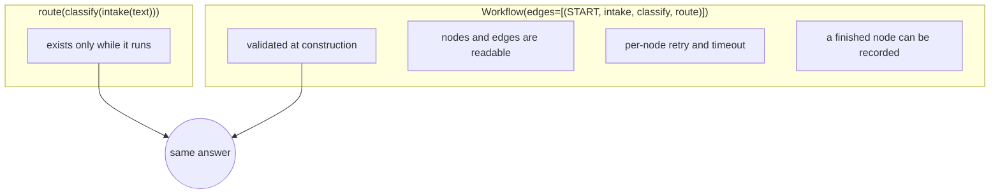

# 1.3 — Why calling them in order is not a workflow

## One-line answer

`route(classify(intake(text)))` and the three-node graph return the same string, and only one of
them is a thing you can inspect, validate, draw, pause and resume — because only one of them exists
as data before it runs.

## The story

The flat-pack wardrobe arrives in two boxes with an instruction sheet. You have built one of these
before, so you leave the sheet in the box and start.

You get a long way. The sides go on, the back panel goes on, the doors go on. Then you find the two
small brackets that should have gone in before the back panel, and the back panel is the thing
holding the whole frame square.

Your brother-in-law, who has never built one, follows the sheet. He is slower at the beginning
because he lays every part out and counts the screws against the parts list. He notices, before he
picks up a screwdriver, that bag D is missing. He phones the shop while you are still fitting doors.

You both know how to build a wardrobe. The difference is that his plan existed on paper before the
building started, so it could be checked against the parts in the room. Yours existed only as the
next thing you were about to do.

## The idea in plain language

There are two ways to say "do these three things in order".

The first is to write the calls out: `route(classify(intake(text)))`. The order is real, and Python
enforces it perfectly. But the order exists only as *control flow* — it is a fact about what the
interpreter will do next, and nothing can look at it. You cannot ask that expression how many
stages it has. You cannot draw it. You cannot stop it after stage two and pick it up tomorrow.

The second is to build a **graph**: a list of edges, held in an object, that describes the same three
stages as **data**. Now the order is a value. You can count the nodes, list the edges, hand it to a
renderer, check it before running it, and — the part that matters most later — record which node
finished so a later process can resume from there.

The word for the difference is **declarative**. A declarative description says what the shape is; an
imperative one performs it. Both run the same work. Only the declarative one can be examined by
anything other than the interpreter that is executing it.

Two consequences that arrive immediately:

1. **Errors move earlier.** A graph is validated when it is constructed. Whole classes of bug —
   an unreachable stage, two stages with the same name, a stage that receives an object of a shape
   it declared it cannot accept — are found before any work happens.
2. **The runtime can act on the shape.** It knows which nodes have no downstream edge and are
   therefore terminal. It knows which are independent and can run at once
   ([2.1](../02-at-the-same-time/2.1-three-branches-from-one-edge.md)). It knows a back edge is a
   loop ([3.1](../03-around-again/3.1-a-loop-is-an-edge-that-goes-back.md)). None of that is
   available for a nested call.

## Why Sutra needs it

Phase 9 is the answer to this question, and it starts six days after this one. Day 60 is durable
execution — resume, replay, idempotency — and Day 61 is pause and resume with checkpoints. A run
that stops halfway and continues from the same place needs a written-down answer to *where was it*,
and "halfway through evaluating a nested expression" is not one.

There is a nearer payoff too. `Workflow`, `Node` and `FunctionNode` all take `rerun_on_resume`,
`retry_config` and `timeout` as ordinary fields. Those are per-node policies, and a node has to be
an object before it can carry a policy. In the nested-call version there is nowhere to put them.

## The mechanism

The same three stages, twice, plus a look at what the graph can be asked before it runs.

```python
from google.adk.workflow import START, Workflow

from _flow import drive, run


def intake(node_input: str) -> str:
    return node_input.strip().lower()


def classify(node_input: str) -> str:
    return "auth" if "sign" in node_input else "other"


def route(node_input: str) -> str:
    return f"queue:{node_input}"


TICKET = "  Signed OUT mid-form "

print(route(classify(intake(TICKET))))

workflow = Workflow(name="intake_chain", edges=[(START, intake, classify, route)])
print(run(drive(workflow, TICKET))[-1])

print([n.name for n in workflow.graph.nodes])
for edge in workflow.graph.edges:
    print(edge.from_node.name, "->", edge.to_node.name, "route=", edge.route)
```

**Line by line:**

- `from _flow import drive, run` — `_flow.py` is this day's three lines of shared plumbing: it makes
  an `InMemoryRunner`, creates a session, wraps the text as a `Content`, and returns the outputs. It
  is imported rather than repeated so each script stays about one idea.
- `print(route(classify(intake(TICKET))))` — the imperative version. Three calls, one expression, no
  object anywhere.
- `workflow.graph` — the compiled `Graph`. It is a public field on `Workflow` and it is populated
  when the object is constructed, so this line works whether or not the graph has ever run. Verified
  with `python -c "from google.adk.workflow import Workflow; print('graph' in Workflow.model_fields)"`
  on `google-adk==2.7.1`, and against `https://adk.dev/graphs/` on 2026-09-05.
- `[n.name for n in workflow.graph.nodes]` — the nodes were never passed in. They were **derived**
  from the edges when the graph was compiled, which is why the node list is a thing you read rather
  than a thing you write.
- `edge.route` — every edge carries a route, which is `None` for an unconditional edge. Section 3
  is entirely about the edges where it is not.

Run it:

```bash
cd days/day-54-sequential-parallel-loop/lab
uv run python plain.py
```

**Line by line:**

- `plain.py` is the code above with the printing tidied up. It takes no flags.

Measured on 2026-09-05:

```text
nested calls:
    'queue:auth'
graph:
    'queue:auth'
what the graph can be asked, before it runs:
    nodes    : ['__START__', 'intake', 'classify', 'route']
    edge     : __START__ -> intake route=None
    edge     : intake -> classify route=None
    edge     : classify -> route route=None
```

The two answers are identical, which is the point: nothing about the *work* changed. What changed is
the eight lines under them, which have no equivalent in the nested version. There is no expression
you can write in Python that asks `route(classify(intake(x)))` what its second stage is called.

Notice `__START__` in the node list. It is a real node in the graph with a real name, not a marker
the parser throws away.



## When it breaks

A graph is data, and the specific way that bites is that a graph can be *built* successfully and
still be wrong in a way that a hand-written call chain could not be. Here is the one that catches
people: reusing the same node object in two places.

```python
step = FunctionNode(func=classify, name="classify")
workflow = Workflow(name="twice", edges=[(START, step, step)])
```

**Line by line:**

- One node object, used as both the second and third element of the chain, which asks for the edges
  `START → classify` and `classify → classify`.
- In the nested-call version this is simply `classify(classify(x))` and is completely legal.

```text
pydantic_core._pydantic_core.ValidationError: 1 validation error for Workflow
  Value error, Graph validation failed. Unconditional cycle detected: classify -> classify.
  Cycles must include at least one conditional (routed) edge to avoid infinite loops.
```

A node is identified by its name, so the same object twice in a row is a self-edge, and a self-edge
with no route is a cycle with no exit. The runtime will not build it.
[3.2](../03-around-again/3.2-the-cycle-the-runtime-refuses.md) is about that rule and why it is the
only structural promise the runtime makes about loops. The smallest fix here is two node objects
with two different names — which, once you say it out loud, is what you meant anyway.

## In production

**What a professional writes instead.** They keep the graph construction in one function per graph
and put nothing else in it. No I/O, no config reading, no conditional edge-building on an
environment variable. The reason is that a graph you can only build by running your configuration is
a graph your tests cannot inspect. When the shape genuinely varies, they build the *nodes*
conditionally and keep the `edges=` list literal, so the shape is still readable in one place.

**What degrades at scale.** Not the graph — a graph of twenty nodes validates in the time it takes
to walk twenty nodes. What degrades is the readability of one enormous `edges=` list. The move is
composition: `Workflow` is itself a node, so a research sub-graph can be built by its own function
and dropped into the parent's edge list as a single element. That keeps each list at the size a
person can read, and it is the same instinct as not writing a two-hundred-line function.

**The failure mode that only appears with real traffic.** Building the graph inside the request
handler. It works, and it costs a full validation pass per request, and worse, it means a graph bug
introduced by a config change becomes a 500 on live traffic rather than a failure at start-up. Build
the graph once, at start-up, and let it fail there.

**The review comment a senior engineer leaves:** *"This builds the `Workflow` at module scope, so the
validation runs during import. Move it behind a function and call it from your app factory. As it
stands, a bad edge means the package will not import, and the traceback points at an import line
rather than at the graph."*

**The interview question:** *"You could just call your functions in order. Why use a graph
framework?"* An honest answer: *"For a three-step pipeline that always succeeds, you should not —
nested calls are less code and easier to read. The graph earns its place when you need the shape to
be data. I want validation before the run, so an unreachable stage or a duplicated node name is
caught at start-up rather than in production. I want per-node policy — this node retries on 429,
that one has a timeout — which needs a node to be an object. And I want to know which node finished,
because that is the only way a run can resume where it stopped. None of those are available for an
expression, because an expression only exists while it is being evaluated."*

## Check yourself

```bash
cd days/day-54-sequential-parallel-loop/lab
uv run python plain.py
```

Now add a fourth stage to the graph in `plain.py` without adding it to the nested call, and print the
node list again. Then count how many lines you would have had to change to insert that stage
*second* rather than last, in each of the two versions.

**Out loud, without scrolling up:** name two things you can do with a graph that you cannot do with
the same three functions called in order, and say why each one needs the shape to exist as data.

**Next:** [1.4 — The stage that refuses to run](1.4-the-stage-that-refuses-to-run.md).
