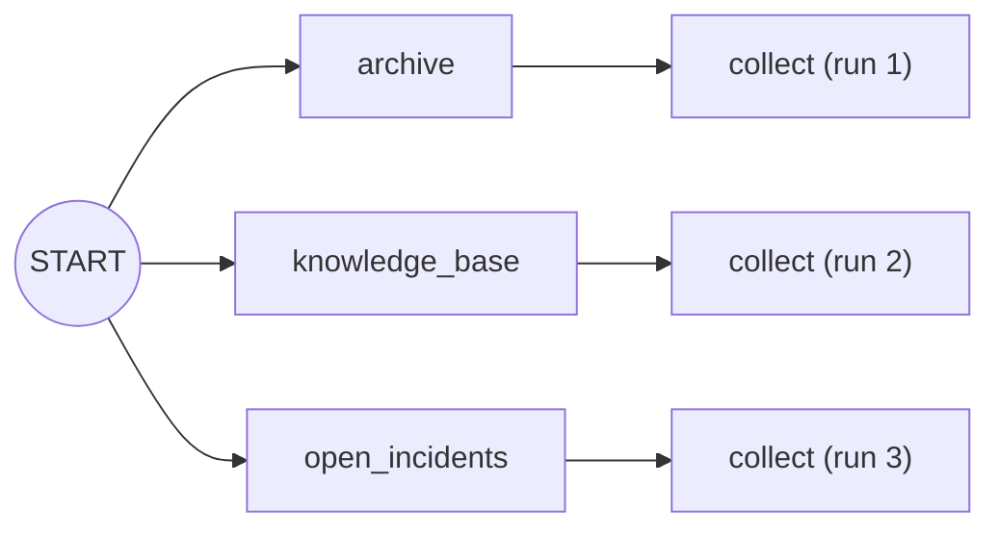

# 2.1 — Three branches from one edge

## One-line answer

Putting a tuple of nodes where one node would go fans the graph out — all of them start before any
of them finishes — and whatever sits downstream then runs **once for each branch**, which is almost
never what you meant.

## The story

The shop has three storerooms and one customer at the counter asking whether the part is in stock.

The old way: the assistant walks to storeroom one, looks, comes back, walks to storeroom two, looks,
comes back, walks to storeroom three. The customer waits for all three walks end to end.

The new way: the assistant radios all three storerooms at once. Three people start looking at the
same moment. The customer waits for the slowest one, not for the sum of the three.

Then something small goes wrong. The assistant told all three storerooms *"tell the counter when you
find something"*, so the counter gets three separate radio calls, and the trainee at the counter
writes up three separate answers for one question. The customer is handed three slips of paper. The
looking was fine. What happens *after* the looking was not designed at all.

## The idea in plain language

**Fanning out** means starting several independent pieces of work from one point, instead of one
after another. Two words matter here and people use them loosely:

- **Concurrent** — several things are in progress at the same time. One of them can be paused
  waiting for something while another makes progress.
- **Parallel** — several things are executing at the same instant on different processors.

ADK's graph runtime gives you **concurrency**. The branches share one thread and one event loop.
Whenever a branch waits — for a network call, a file, a model — another branch runs. That is the
right tool for the desk's research stage, because looking things up is nearly all waiting.

In the graph, fanning out is a tuple. A chain tuple is `(START, a, b, c)`, which means *a then b then
c*. A tuple **nested inside** the chain, `(START, (a, b, c), d)`, means *a and b and c together, then
d*. The nesting is the whole syntax.

The part everyone gets wrong is `d`. A node downstream of three branches is **triggered three
times** — once by each branch — so it runs three times, each time with one branch's output. If you
wanted it to run once with all three results, you need a different kind of node, and that is
[2.2](2.2-the-node-that-waits-for-everyone.md).

## Why Sutra needs it

The desk's research stage does three lookups that have nothing to do with each other: the past-ticket
archive Day 49 built, the written knowledge base, and the list of open incidents. None of the three
needs another's answer.

Chained, the customer at the counter waits for all three walks. Fanned out, they wait for the
slowest. Day 58 builds this stage for real, and it is the only place in the triage graph where the
shape is a fan-out rather than a line.

## The mechanism

Three branches, one nested tuple, and a log that records when each branch started and ended.

```python
import asyncio

LOG: list[str] = []


async def archive(node_input: str) -> str:
    """Searches the past-ticket archive Day 49 built."""
    LOG.append("archive:start")
    await asyncio.sleep(0)
    LOG.append("archive:end")
    return "ticket:4610"
```

**Line by line:**

- `async def` — the branch is a coroutine, not a plain function. The runtime accepts both, and only
  an `async def` can yield control to let another branch run.
- `LOG.append("archive:start")` — the log is the measurement. Without it, "they ran at the same
  time" is a claim about something invisible.
- `await asyncio.sleep(0)` — a **yield point**. It waits for nothing at all; it simply hands control
  back to the event loop and takes it again on the next pass. That is exactly what a real `await` on
  a network call does at the instant it starts waiting, so it produces the same interleaving with
  nothing to wait for. Using a real delay here would make the demonstration slow without making it
  truer.
- `return "ticket:4610"` — a fixed string. The point of this part is the ordering, so the branches
  return constants and the day spends no quota.

The other two branches, `knowledge_base` and `open_incidents`, are the same shape with different
strings. Then the graph:

```python
from google.adk.workflow import START, FunctionNode, Workflow

BRANCHES = (archive, knowledge_base, open_incidents)


def collect(node_input) -> str:
    """One ordinary node sitting downstream of all three branches."""
    return f"collect saw {node_input!r}"


workflow = Workflow(
    name="research",
    edges=[(START, BRANCHES, FunctionNode(func=collect, name="collect"))],
)
```

**Line by line:**

- `BRANCHES = (archive, knowledge_base, open_incidents)` — a plain tuple of three callables.
- `edges=[(START, BRANCHES, collector)]` — the outer tuple is the chain and the inner tuple is the
  fan-out. Read it as *START, then all of BRANCHES, then collect*. Verified against
  `https://adk.dev/graphs/` on 2026-09-05, which documents a tuple of nodes as fan-out: "Values can
  be a single node or a tuple of nodes (fan-out)."
- `def collect(node_input)` — deliberately untyped, because what arrives is the surprise this part is
  built around.

Run it:

```bash
cd days/day-54-sequential-parallel-loop/lab
uv run python fanout.py
```

**Line by line:**

- `fanout.py` builds exactly this graph, prints every output, then prints the log joined into one
  line so the interleaving is readable at a glance.
- It takes `--sequential`, which chains the same three branches instead of fanning them out, and
  `--nojoin`, which is [2.2](2.2-the-node-that-waits-for-everyone.md)'s subject.

Measured on 2026-09-05:

```text
shape: START -> (archive, knowledge_base, open_incidents) -> collect
    ticket:4610
    kb:KB-104
    incidents:none
    collect saw 'ticket:4610'
    collect saw 'kb:KB-104'
    collect saw 'incidents:none'
log: archive:start | knowledge_base:start | open_incidents:start | archive:end | knowledge_base:end | open_incidents:end
```

Read the log first. **All three `:start` entries come before any `:end` entry.** That is the whole
claim of this part, measured: the three branches were genuinely in flight together, not run one
after another very quickly.

Now read the outputs. `collect` appears three times. It did not receive the three results; it
received the first result, then the second, then the third, as three separate runs. There is one
`collect` node in the graph and it executed three times, because three edges pointed at it and each
one triggered it.

Compare with the chained version:

```bash
uv run python fanout.py --sequential
```

**Line by line:**

- `--sequential` builds `(START, *BRANCHES, collector)` — the tuple is spread into the chain instead
  of nested inside it, so the same three functions become three links of a line.

```text
shape: START -> archive -> knowledge_base -> open_incidents -> collect
    ticket:4610
    kb:KB-104
    incidents:none
    collect saw 'incidents:none'
log: archive:start | archive:end | knowledge_base:start | knowledge_base:end | open_incidents:start | open_incidents:end
```

Two differences, both worth naming. The log is now strictly paired — every `:start` is followed
immediately by its own `:end` — because each branch has to finish before the next can begin. And
`collect` runs **once**, seeing only the last branch's output, because in a chain there is only one
edge into it.



That diagram is drawn deliberately wrong-looking, because that is what the run actually did: one
node, three executions.

## When it breaks

Fan out and stop there — no node downstream at all — and the runtime refuses at the very end of the
run:

```bash
uv run python fanout.py --nojoin
```

**Line by line:**

- `--nojoin` builds `[(START, BRANCHES)]`, so all three branches are **terminal**: nothing points
  away from them.

```text
shape: START -> (archive, knowledge_base, open_incidents)
    ValueError: Workflow research: multiple terminal nodes produced output (3). A workflow must have at most one terminal output.
log: archive:start | knowledge_base:start | open_incidents:start | archive:end | knowledge_base:end | open_incidents:end
```

Two things about this error are worth holding on to.

First, **it is not a construction-time error**. Every one of the five checks in
[1.4](../01-one-after-another/1.4-the-stage-that-refuses-to-run.md) fires when you build the
`Workflow`. This one fires when the run finishes, because "how many terminal nodes actually produced
output" is not a fact about the shape — a routed graph can have three terminal nodes and reach only
one of them.

Second, look at the log: all three branches ran to completion. The work was done. The error is
purely about there being no single answer to hand back, and the fix is the next part.

## In production

**What a professional writes instead.** They fan out over a **list of items**, not over three named
functions, whenever the items are the same kind of work. ADK has a dedicated shape for that:
`Node` and its subclasses take `parallel_worker=True` and `max_parallel_workers`, which runs the
same node once per element of a list input and collects the results in **input order**. Verified with
`python -c "from google.adk.workflow import Node; print(Node.model_fields['parallel_worker'])"` on
`google-adk==2.7.1`. Three fixed lookups are three branches; three hundred documents to summarise
are one parallel worker, because a graph with three hundred edges is not a graph anyone can read.

**What degrades at scale.** Three branches is free. Thirty branches against a provider with a
requests-per-minute limit is a burst that arrives as a wall of 429s, and
[2.5](2.5-fan-out-against-a-quota.md) is entirely about that. The other thing that degrades is
latency at the tail: a fan-out finishes when its *slowest* branch finishes, so adding a fourth
branch that is usually fast and occasionally slow makes the whole stage occasionally slow. That is
the argument Day 44 made about tail latency, arriving here in a different costume.

**The failure mode that only appears with real traffic.** The `collect` bug above, running three
times instead of once, when the node is not a pure function. `collect` printing three lines is
obvious. `collect` **appending to a list in session state** is not: it appends three times, the list
looks right because all three results are in it, and the code that built it is nonsense that happens
to work. Then somebody adds a fourth branch, or one branch fails, and the shape of the list changes
in a way nothing predicted.

**The review comment a senior engineer leaves:** *"This fans out to three branches and then runs the
formatter three times. It works because the formatter happens to be idempotent, but that is an
accident. Put a `JoinNode` in and let the formatter take a dict — otherwise the next person who adds
a counter to that node will spend an evening on it."*

**The interview question:** *"What does 'run these in parallel' actually give you in an agent
framework?"* An honest answer: *"Concurrency, not parallelism — one event loop, and branches
interleave whenever one of them waits. I measured it with a log: all three branches printed `start`
before any of them printed `end`, and chained, every `start` was immediately followed by its own
`end`. It is the right tool when the branches are I/O-bound, which for an agent they always are. The
thing that surprised me is what happens after: a plain node downstream of three branches runs three
times, once per branch, because each branch triggers it. If you want it once with all three results
you need an explicit join node."*

## Check yourself

```bash
cd days/day-54-sequential-parallel-loop/lab
uv run python fanout.py
uv run python fanout.py --sequential
uv run python fanout.py --nojoin
```

Now add a fourth branch to `_research.py` and re-run the default. Write down how many times `collect`
ran, without looking, then check.

**Out loud, without scrolling up:** what does the nested tuple in `(START, (a, b, c), d)` mean, and
how many times does `d` run?

**Next:** [2.2 — The node that waits for everyone](2.2-the-node-that-waits-for-everyone.md).
