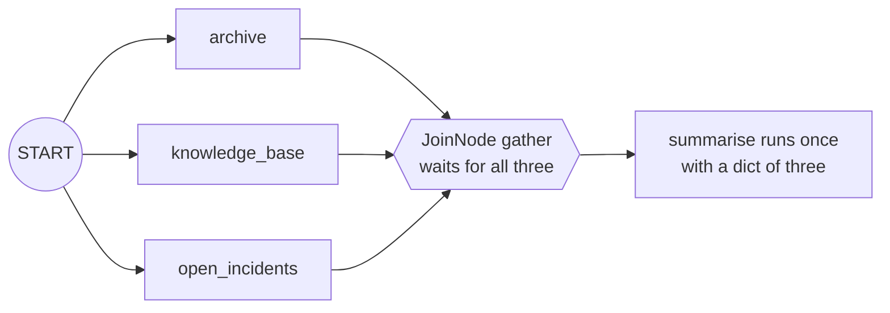

# 2.2 — The node that waits for everyone

## One-line answer

A `JoinNode` runs **once**, after every branch pointing at it has finished, and hands the node after
it a single dictionary keyed by branch name — where an ordinary node in the same position would have
run once per branch.

## The story

The family is on the steps outside the hall for the group photograph, and the photographer will not
press the shutter.

Two cousins are still getting their shoes on. An uncle has gone back for his glasses. The
photographer stands with his hand on the camera and says the same sentence every thirty seconds:
*we will take it when everyone is here.* Nobody is annoyed with him. That is the job. A photograph
of eleven people out of fourteen is not a smaller version of the group photograph; it is a different
photograph, and the three who are missing are missing from it forever.

When the last cousin arrives, one shutter click. One photograph. Everybody in it, and you can point
at each person and say their name.

## The idea in plain language

A **join** is a node that waits. It has several edges pointing into it, and instead of running when
the first one arrives, it runs when **all** of them have arrived, once, with everything they
produced.

[2.1](2.1-three-branches-from-one-edge.md) measured what an ordinary node does in that position: it
runs once per incoming edge, because each edge triggers it. That is the default and it is the right
default for most graphs. A join is the opt-in exception, and in ADK it is a separate class:
`JoinNode`.

What a join hands downstream is the part worth learning precisely. It is a **dictionary**, and the
keys are the **names of the branch nodes**. Not a list, not a tuple, not a concatenated string. So
the node after the join reaches its inputs by name:

```text
{"archive": "ticket:4610", "knowledge_base": "kb:KB-104", "open_incidents": "incidents:none"}
```

That is a good design and it is worth saying why. A list would force the downstream node to know
which position each branch occupies, which means adding a branch renumbers everything. A dictionary
keyed by name means the drafting node asks for `results["archive"]` and does not care how many other
branches exist.

The key ordering of that dictionary is a trap, and it is
[2.3](2.3-the-order-you-cannot-rely-on.md).

## Why Sutra needs it

The drafting stage of the triage graph needs all three research results in one place: the past
ticket, the knowledge-base article, and whether anything is on fire right now. It writes one reply
from all three.

Without a join it runs three times and writes three replies, each from one source. With a join it
runs once and writes one reply from a dictionary it can address by name. Day 58 wires exactly this,
and the node it puts after the join takes a `dict`.

## The mechanism

The graph from [2.1](2.1-three-branches-from-one-edge.md), with one class changed.

```python
from google.adk.workflow import START, FunctionNode, JoinNode, Workflow

BRANCHES = (archive, knowledge_base, open_incidents)


def summarise(node_input) -> str:
    """Runs after the branches. What it receives is the whole point of this part."""
    return f"summarise received {type(node_input).__name__}: {node_input!r}"


workflow = Workflow(
    name="research",
    edges=[
        (
            START,
            BRANCHES,
            JoinNode(name="gather"),
            FunctionNode(func=summarise, name="summarise"),
        )
    ],
)
```

**Line by line:**

- `JoinNode(name="gather")` — a join takes a name and nothing else. There is no list of branches to
  wait for, because the graph already knows: the join waits for every node with an edge into it.
  Verified with
  `python -c "from google.adk.workflow import JoinNode; print(JoinNode(name='g').name)"` on
  `google-adk==2.7.1`, and against `https://adk.dev/graphs/` on 2026-09-05, which describes the join
  as proceeding "only after all its upstream nodes have provided an Event output".
- The join sits in the chain tuple in exactly the position the ordinary node occupied before. The
  fan-out syntax does not change; only the class of the thing catching it does.
- `def summarise(node_input)` — still untyped, so the run can tell you what actually arrives rather
  than the annotation asserting it.
- `type(node_input).__name__` — printing the type is the measurement. "It gets all the results" is a
  claim; `dict` is an observation.

Run it:

```bash
cd days/day-54-sequential-parallel-loop/lab
uv run python join.py
```

**Line by line:**

- `join.py` builds the graph above.
- `--plain` swaps the `JoinNode` for an ordinary `FunctionNode` in the same position, so the two can
  be compared without changing anything else.

Measured on 2026-09-05:

```text
gather is a JoinNode
    ticket:4610
    kb:KB-104
    incidents:none
    {'archive': 'ticket:4610', 'open_incidents': 'incidents:none', 'knowledge_base': 'kb:KB-104'}
    summarise received dict: {'archive': 'ticket:4610', 'open_incidents': 'incidents:none', 'knowledge_base': 'kb:KB-104'}
```

Five outputs: three branches, then the join, then `summarise`. The join emitted the dictionary as its
own output — a join is a node like any other and produces an event — and `summarise` ran **once**,
with a `dict`.

Now the same graph with an ordinary node in the join's place:

```bash
uv run python join.py --plain
```

**Line by line:**

- `--plain` puts `FunctionNode(func=summarise, name="gather_plain")` where the `JoinNode` was. Same
  position, same three incoming edges, same three branches.

```text
gather is an ordinary FunctionNode
    ticket:4610
    kb:KB-104
    incidents:none
    summarise received str: 'ticket:4610'
    summarise received str: 'kb:KB-104'
    summarise received str: 'incidents:none'
```

Three runs, each with a `str`. One line changed in the graph and the downstream node went from
running once with everything to running three times with a third of it each.



## When it breaks

A join waits for **all** its predecessors, and the dangerous case is a predecessor that never
triggers it at all. Somebody has quietly gone home, and the photographer is still standing there.

The way to reach it on purpose is a conditional edge into the join whose route never matches. A node
upstream emits a route, no edge out of that node is listening for it, and the branch simply ends.

```python
Workflow(
    name="stall",
    edges=[
        (START, (archive_node, kb_node, gate_node)),
        Edge(from_node=archive_node, to_node=join),
        Edge(from_node=kb_node, to_node=join),
        Edge(from_node=gate_node, to_node=join, route="routine"),
        Edge(from_node=join, to_node=summarise_node),
    ],
)
```

**Line by line:**

- Two of the three edges into the join are unconditional, so those branches always trigger it.
- `route="routine"` on the third means that edge is followed **only** when `gate` emits the route
  `routine`. Routes are section 3's subject; here the only thing that matters is that an edge with a
  route is sometimes not followed.
- When `gate` emits anything else, that edge is not taken, the join is one trigger short, and it
  never fires.

```bash
cd days/day-54-sequential-parallel-loop/lab
uv run python stall.py
```

**Line by line:**

- `stall.py` builds exactly that graph, with `gate` emitting `urgent` — a route no edge is waiting
  for. It calls `logging.basicConfig(level=logging.WARNING)` on purpose, because the only trace this
  failure leaves is a log line.
- `--match` makes `gate` emit `routine` instead, so the edge is taken and the join fires.

Measured on 2026-09-05:

```text
WARNING google_adk.google.adk.workflow._graph: Node 'gate' has conditional/DEFAULT edges but none were matched by the emitted route(s): urgent. The branch will end.
gate emits urgent (matches nothing)
    ticket:4610
    kb:KB-104
    checked
```

Three branch outputs, then nothing. No join dictionary, no `summarise`, no traceback, and an exit
code of zero. The run *succeeded* by every measure a caller has, and the last third of the graph
never happened.

The only evidence is that first line, and it is a `WARNING` on the `google_adk` logger. An
application that has not configured logging prints nothing at all. This is the quietest failure in
the whole day, and it is the reason Day 22's structured logging exists.

With the route matching, the same graph completes:

```text
gate emits routine (matches)
    ticket:4610
    kb:KB-104
    checked
    {'archive': 'ticket:4610', 'knowledge_base': 'kb:KB-104', 'gate': 'checked'}
    summarise received {'archive': 'ticket:4610', 'knowledge_base': 'kb:KB-104', 'gate': 'checked'}
```

There is a second, softer version worth seeing, because the obvious guess about it is wrong. A branch
that returns `None` does **not** stall the join:

```bash
uv run python stall.py --none
```

**Line by line:**

- `--none` makes `knowledge_base` return `None` for "nothing found", and takes the matching route so
  the join fires.

```text
gate emits routine (matches)
    ticket:4610
    checked
    {'knowledge_base': None, 'archive': 'ticket:4610', 'gate': 'checked'}
    summarise received {'knowledge_base': None, 'archive': 'ticket:4610', 'gate': 'checked'}
```

The join fires and the key is there with a value of `None`. What is missing is the branch's own
output line: two branch outputs are printed where there were three, because a node returning `None`
emits no output event of its own. So `None` is not a hang. It is a `None` arriving in the dictionary
of whatever node you wrote to expect three strings, which is a `TypeError` one node further on.

Return an explicit empty result — the string `"incidents:none"` that this lab's working branch
returns is exactly that. An empty result is a result. It is the same distinction Day 50 drew between
*"I found nothing"* and *"there is no past case"*.

## In production

**What a professional writes instead.** They give the join an `input_schema` so the shape of what
arrives is declared rather than discovered. `JoinNode` inherits `input_schema` from `BaseNode` and
validates each branch's contribution against it, which turns "the drafter received a dict with an
unexpected key" into an error at the join rather than a `KeyError` two nodes later. Verified with
`python -c "from google.adk.workflow import JoinNode; print('input_schema' in JoinNode.model_fields)"`
on `google-adk==2.7.1`.

**What degrades at scale.** The join holds every branch's result in memory until the last one lands,
so a fan-out over three lookups is nothing and a fan-out over two hundred document summaries is two
hundred summaries resident at once. The production move when the count is large is to reduce
incrementally rather than join — each branch appends to a store and the downstream node reads the
store — but that trade is only worth making when the count is genuinely large, because it gives up
the thing the join was for.

**The failure mode that only appears with real traffic.** A conditional edge into the join whose
route stops matching. The classifier gains a fourth category, the edge into the join still lists the
original three, and every ticket in the new category ends at that node with one `WARNING` line. The
run exits zero. The symptom that reaches you is "some tickets never get a reply", which is a long way
from a join node, and the only thing that shortens the distance is having that warning somewhere you
can see it.

**The review comment a senior engineer leaves:** *"One of the three edges into this join is routed
and the other two are not. The join therefore only fires for tickets that take the routed branch, and
for everything else the graph ends here with a warning nobody reads. Either make the edge
unconditional, or add a `DEFAULT_ROUTE` edge into the join so every path triggers it."*

**The interview question:** *"How do you collect the results of parallel steps in a workflow?"* An
honest answer: *"With an explicit join node, and it has to be explicit because the default is
different: an ordinary node downstream of three branches runs three times, once per branch. I
measured that. A `JoinNode` runs once and hands on a dict keyed by branch name, which beats a list
because adding a branch does not renumber anything. The sharp edge is that it waits for all of them,
so if one predecessor sits behind a routed edge and the route stops matching, the join never fires —
no exception, exit code zero, and a single WARNING line saying the branch ended. I went looking for
that one on purpose, because it is the failure I would otherwise never have thought to test."*

## Check yourself

```bash
cd days/day-54-sequential-parallel-loop/lab
uv run python join.py
uv run python join.py --plain
```

Now run `uv run python stall.py` and `uv run python stall.py --match`, and say which node never ran in
the first one and what the only evidence of it was.

**Out loud, without scrolling up:** what does a `JoinNode` hand to the node after it, and what does an
ordinary node in the same position do instead?

**Next:** [2.3 — The order you cannot rely on](2.3-the-order-you-cannot-rely-on.md).
