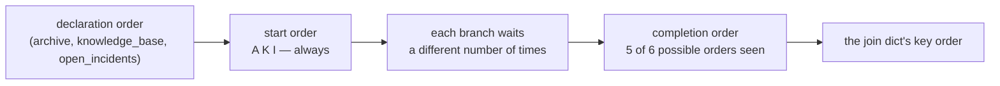

# 2.3 — The order you cannot rely on

## One-line answer

Branches **start** in the order you declared them, every single run, and the join's dictionary comes
back in the order they **finished** — which changed five times across eight runs of the same graph
and did not change at all across eight runs inside one process.

## The story

Three friends are coming to the station to meet you. One is on the fast train, one is driving, one is
on the bus.

You know the order they set off in, because you were on the phone to each of them. You do not know
the order they will walk through the barrier, and you would not bet on it. The one who left first is
on the bus.

Here is the part that catches people out. You meet them at that station every Friday, and for six
weeks running the driver arrives first, then the train, then the bus. By week seven you have stopped
thinking of it as an order that might change. You have started saying *"the driver is always first"*,
and you have arranged to hand the driver the house keys, because he is always first.

Then there are roadworks.

## The idea in plain language

Two orderings exist in a fan-out and they are not the same ordering.

**The scheduling order** is the order the runtime starts the branches in. It is the order you wrote
them in the tuple, and it is deterministic. The runtime buffers triggers in a dictionary and Python
dictionaries preserve insertion order, so the branch you named first is dispatched first.

**The completion order** is the order the branches finish in. It depends on how many times each
branch yields control back to the event loop, which depends on what each one is waiting for. It is
not stated anywhere and it is not promised.

The join's dictionary is built in **completion** order. Its keys are correct, its values are correct,
and the sequence of its keys is a fact about the last run rather than about your graph.

That is fine, right up to the moment somebody writes one of these:

```python
first = list(results.values())[0]
archive_result, kb_result, incidents_result = results.values()
```

**Line by line:**

- `list(results.values())[0]` — "the first result", meaning the first branch in the tuple. It is
  actually the branch that finished first.
- `archive_result, kb_result, incidents_result = results.values()` — unpacking by position, which
  additionally assumes there are exactly three and that they come out in declaration order. Neither
  is true, and unlike the line above this one at least fails loudly the day somebody adds a fourth
  branch.

Both read the dictionary as though it were a list. Both are wrong. Both will pass your tests.

The word for this is **non-determinism**: the same input producing a different result on different
runs. The dangerous kind is not the kind that produces different answers; it is the kind that
produces the *same* answer for long enough that you stop testing for it.

## Why Sutra needs it

The drafting node in the triage graph receives the join's dictionary and has to build a prompt from
it. The natural thing to write is *"put the strongest source first"*, and the natural way to get the
strongest source is to take the first thing in the dictionary — which is the branch that happened to
finish first, which is the one that had the least to do.

Day 58 assembles this graph, and the drafting node it writes reaches for `results["archive"]` by
name. This part is why.

## The mechanism

Run the same three-branch fan-out many times and record two things per run: the order the branches
started in, and the order the join's keys came out in.

```python
from google.adk.workflow import START, JoinNode, Workflow

from _flow import drive, run

SHORT = {"archive": "A", "knowledge_base": "K", "open_incidents": "I"}


def once() -> tuple[str, str]:
    """One run of the fan-out. Returns (start order, join key order) as short letters."""
    _research.reset()
    workflow = Workflow(name="research", edges=[(START, BRANCHES, JoinNode(name="gather"))])
    outputs = run(drive(workflow, "sso bounce"))
    joined = next(o for o in outputs if isinstance(o, dict))
    started = [entry.split(":")[0] for entry in _research.LOG if entry.endswith(":start")]
    return " ".join(SHORT[name] for name in started), " ".join(SHORT[key] for key in joined)
```

**Line by line:**

- `_research.reset()` — the log is module-level, so it has to be cleared between runs or the second
  run's start order is polluted by the first's.
- `next(o for o in outputs if isinstance(o, dict))` — the join's output is the only `dict` among the
  outputs, so this picks it out without depending on its position in the list.
- `entry.endswith(":start")` — only the starts. The ends are the completion order and they are
  already visible in the join's keys, so recording them twice would say the same thing twice.
- `" ".join(SHORT[key] for key in joined)` — iterating a dict yields its keys **in insertion order**,
  which is the whole measurement. If Python did not guarantee insertion order this experiment would
  be measuring the wrong thing.
- The function returns two strings so the caller can put them side by side in a table, which is the
  only way the contrast is readable.

Run it inside one process first:

```bash
cd days/day-54-sequential-parallel-loop/lab
uv run python order.py
```

**Line by line:**

- `order.py` calls `once()` eight times in the same process and tabulates the pairs.
- `--fresh N` runs `once()` in N separate Python processes instead, which is the second half of this
  part.

Measured on 2026-09-05:

```text
8 runs, all in one process
run  started   join keys
  1  A K I    I K A
  2  A K I    I K A
  3  A K I    I K A
  4  A K I    I K A
  5  A K I    I K A
  6  A K I    I K A
  7  A K I    I K A
  8  A K I    I K A

distinct start orders : 1  ['A K I']
distinct join orders  : 1  ['I K A']
```

Look at what this says. The start order is `A K I` every time, which is the declaration order and is
exactly what the runtime documents in its scheduler: triggers are processed strictly in the order
they arrived, so parallel branches are dispatched deterministically.

And the join order is `I K A` every time. **Stable. Eight for eight.** If you stopped here you would
write down "the join comes back in reverse declaration order" and you would be wrong, and nothing in
these eight runs would tell you so.

Now the same eight runs, one process each:

```bash
uv run python order.py --fresh 8
```

**Line by line:**

- `--fresh 8` shells out to `sys.executable` eight times, each running `once()` and printing one
  line, so nothing at all is shared between runs — no warm event loop, no imported module state, no
  interpreter that has already run this code seven times.

```text
8 runs, one process each
run  started   join keys
  1  A K I    I K A
  2  A K I    K A I
  3  A K I    K I A
  4  A K I    A K I
  5  A K I    A K I
  6  A K I    K I A
  7  A K I    A I K
  8  A K I    A I K

distinct start orders : 1  ['A K I']
distinct join orders  : 5  ['A I K', 'A K I', 'I K A', 'K A I', 'K I A']
```

**One start order. Five join orders.** Same graph, same input, same machine, same afternoon.

That is the roadworks. The eight runs in one process were not evidence of determinism; they were
eight samples from a process that happened to settle into one scheduling pattern and stay in it. A
test suite is exactly that: one process, running the same graph many times.



## When it breaks

The break is not an exception. It is this line, written by somebody reasonable:

```python
def draft(node_input: dict) -> str:
    """Build the reply, leading with the strongest source."""
    strongest = list(node_input.values())[0]
    return f"Based on {strongest}, here is what to do."
```

**Line by line:**

- `list(node_input.values())[0]` — takes the first value in the join's dictionary. The author's
  intention was "the archive result", because the archive is the first branch in the tuple.
- What it actually takes is the branch that finished first.

There is no error. On the day it is written, and in every test run, it returns `ticket:4610` and the
reply is correct. In the eight fresh runs above it would have returned the archive result three
times, the knowledge-base result twice, and the incident result three times — for the same ticket.

The smallest fix is one character short of trivial:

```python
strongest = node_input["archive"]
```

**Line by line:**

- Address the branch by name. The name is stable, guaranteed and readable, and it is the reason the
  join hands you a dictionary rather than a list in the first place
  ([2.2](2.2-the-node-that-waits-for-everyone.md)).

The general rule: **the join's keys are data, its key order is not.** Treat the dictionary as a
mapping and never as a sequence. If you genuinely need a fixed order, sort it yourself with a key you
control.

## In production

**What a professional writes instead.** They sort at the boundary, once, and never index a join's
output positionally. A drafting node that wants sources in a fixed priority writes
`for name in ("archive", "knowledge_base", "open_incidents"):` and pulls each one by name, so the
priority is a list in the code rather than an accident of the scheduler. Where the branch set is
dynamic they sort by an explicit field — a score, a timestamp — never by arrival.

**What degrades under concurrency.** This gets *worse* as the branches get more realistic, which is
the opposite of the usual pattern. The branches in this lab do nothing at all and still produced five
orderings. Branches that make real network calls have wildly variable completion times, so the
ordering churns constantly, and the bug that hid for eight runs surfaces in the first hour. That is
the good case. The bad case is a set of branches with very different typical durations — one cache
hit and two network calls — where the fast one wins ninety-nine times in a hundred and the code that
depends on it is wrong once a day.

**The failure mode that only appears with real traffic.** Everything about this part. The stable
eight-run table is what your CI sees; the five-way spread is what production sees, because production
is many processes on many machines with real latency. A positional read of a join output is close to
undetectable before deployment and close to unmissable after it — and even then it presents as
"sometimes the reply cites the wrong source", which nobody traces to a dictionary.

**The review comment a senior engineer leaves:** *"`list(results.values())[0]` — that is the branch
that finished first, not the archive. Index it by name. And if you ever genuinely need these in a
fixed order, sort them here with an explicit key rather than relying on the join."*

**The interview question:** *"Your parallel steps return results. What can you assume about their
order?"* An honest answer: *"That they started in declaration order, and nothing else. I measured
this in ADK's graph runtime: across eight runs in one process the join's dictionary came back in
exactly the same key order every time, and across eight separate processes the same graph produced
five different key orders. So a positional read passes CI and fails in production, and the code that
does it looks completely reasonable — `list(results.values())[0]` meaning 'the first branch'. The
rule I follow is that the keys of a join result are data and the key order is not, so I address them
by name and, when order matters, I sort by something I chose."*

## Check yourself

```bash
cd days/day-54-sequential-parallel-loop/lab
uv run python order.py
uv run python order.py --fresh 12
```

Now add a fourth branch to `_research.py` and run `--fresh 12` again. Write down how many distinct
join orders you saw, and how many are possible.

**Out loud, without scrolling up:** which of the two orderings in a fan-out is guaranteed, and what is
the smallest code change that makes a downstream node immune to the other one?

**Next:** [2.4 — Two branches, one state key](2.4-two-branches-one-state-key.md).
