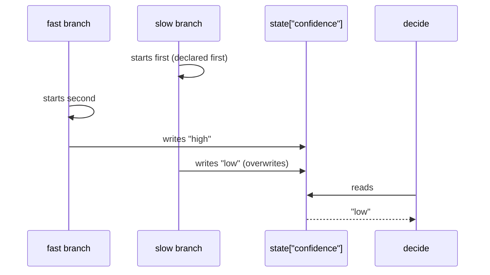

# 2.4 — Two branches, one state key

## One-line answer

When two branches write the same session-state key, the value that survives is the one written by
the branch that finished **last** — measured, in both declaration orders, and the declared order
made no difference whatsoever.

## The story

Two people share a flat and one shopping list on the fridge door.

She gets home first and writes *milk, bread, rice* and leaves. He gets home an hour later, does not
see her list because it is on the inside of the door, tears off a fresh sheet, writes *washing
powder, onions*, and sticks it on top.

On Saturday one of them takes the list off the fridge and goes shopping. There is one list on the
fridge and it says *washing powder, onions*. Nothing was lost by accident, nothing was torn up in
anger, and neither of them did anything unreasonable. Whoever wrote last is who the fridge remembers.

The part that makes it a real problem rather than a funny story is that they cannot tell from the
fridge that this happened. There is a list. It looks like the list.

## The idea in plain language

[1.2](../01-one-after-another/1.2-what-the-next-stage-can-see.md) introduced session state as the
job card that travels with the run: any node can write a key, any later node can read it. In a chain
that is safe, because exactly one node runs at a time and "later" is unambiguous.

Fan out, and "later" stops being unambiguous. Two branches run at the same time. Both write
`state["confidence"]`. Both writes succeed. The value a downstream node reads is whichever write
happened last in real time — which, from [2.3](2.3-the-order-you-cannot-rely-on.md), is the branch
that finished last, which is not something your graph says.

This is a **race condition**: two pieces of work touching the same thing, where the answer depends
on their relative timing rather than on anything written down. The specific flavour here is
**last-writer-wins**, and it is the flavour that is hardest to notice, because nothing fails. There
is a value. It is a plausible value. It is one of the two values you expected.

The word **key collision** is worth having too: two branches agreeing, by accident, on the name of a
state key. It is an accident precisely because nothing declares who owns which key.

## Why Sutra needs it

Sutra's research branches all want to say how confident they are. The archive branch knows whether it
found a close match; the knowledge-base branch knows whether the article it found is current. The
obvious key name for both is `confidence`, because it is the obvious word.

Day 58 puts three research branches in the triage graph and Day 57 adds a critic that reads their
verdicts. If two of them write `confidence`, the drafting node is reading a value produced by a race,
and the reply it writes is confident or hedged depending on which lookup was slower that afternoon.

## The mechanism

Two branches. One is slow, one is fast. Both write the same key. A third node reads it afterwards.

```python
import asyncio

from google.adk.agents.context import Context
from google.adk.workflow import START, FunctionNode, JoinNode, Workflow


async def slow_search(ctx: Context, node_input: str) -> str:
    """Takes two turns of the event loop to finish, then writes its verdict."""
    await asyncio.sleep(0.02)
    ctx.state["confidence"] = "low"
    return "slow: low"


async def fast_search(ctx: Context, node_input: str) -> str:
    """Finishes immediately, then writes its verdict."""
    ctx.state["confidence"] = "high"
    return "fast: high"


def decide(ctx: Context, node_input) -> str:
    """Reads the key afterwards, the way a downstream node would."""
    return f"decide: confidence={ctx.state.get('confidence')!r}"
```

**Line by line:**

- `await asyncio.sleep(0.02)` — a real delay this time, not the `sleep(0)` yield point of
  [2.1](2.1-three-branches-from-one-edge.md). The point here is to make one branch reliably slower
  than the other, so the result is a clean demonstration rather than a coin toss. A real system's
  slower branch is slower for a real reason and just as reliably.
- `ctx.state["confidence"] = "low"` — the write happens *after* the wait, which is the realistic
  shape: a branch does its work, then records what it concluded.
- Both branches write the same key with different values. Neither is aware of the other. Neither is
  doing anything wrong on its own.
- `def decide(ctx: Context, node_input)` — reads the key with `.get`, so it cannot raise. That is
  what makes the failure silent.

```python
pair = (slow, fast)  # or (fast, slow) with --swap
workflow = Workflow(
    name="race",
    edges=[(START, pair, JoinNode(name="gather"), FunctionNode(func=decide, name="decide"))],
)
```

**Line by line:**

- `pair` is the fan-out tuple, and the script can build it either way round. That is the experiment:
  if declaration order mattered, swapping the pair would swap the answer.

Run it:

```bash
cd days/day-54-sequential-parallel-loop/lab
uv run python race.py
```

**Line by line:**

- `race.py` builds the graph above and prints `decide`'s output and the final session state.
- `--swap` declares the branches in the other order. `--keyed` is the fix, below.

Measured on 2026-09-05:

```text
declared: (slow, fast)
    decide: confidence='low'
    final state: {'confidence': 'low'}
```

The slow branch's value is what survived, even though the fast branch was declared second and
therefore started second and finished first. Now swap the declaration:

```bash
uv run python race.py --swap
```

**Line by line:**

- `--swap` builds the fan-out tuple as `(fast, slow)` instead of `(slow, fast)`. Nothing else about
  the run changes: same functions, same delays, same key.

```text
declared: (fast, slow)
    decide: confidence='low'
    final state: {'confidence': 'low'}
```

**Identical.** `'low'` again. The declaration order changed and the answer did not, because the
declaration order is not what decides this. The branch that finished last wrote last, and the branch
that finished last is the slow one in both arrangements.

That is the sentence to carry away: *your edge list has no opinion about this.* You can reorder the
tuple all day and it will not change which write survives, because the thing that decides is
duration, and duration is a property of the world rather than of your graph.



The fix is not a lock and it is not ordering. It is not sharing the key at all:

```bash
uv run python race.py --keyed
```

**Line by line:**

- `--keyed` makes each branch write its own key: `fast_confidence` and `slow_confidence`. Nothing
  else changes — same branches, same durations, same fan-out.

```text
declared: (slow, fast)   [keyed]
    decide: fast='high' slow='low'
    final state: {'fast_confidence': 'high', 'slow_confidence': 'low'}
```

Both values survive, `decide` can see both, and there is no race left to lose, because there is
nothing being contended for. The general principle is that **a concurrent write is only dangerous
when two writers share a destination**, so the cheapest fix is almost always to stop sharing it.

## When it breaks

The version that is genuinely hard to find is not two branches writing a string. It is two branches
appending to the same list:

```python
async def archive(ctx: Context, node_input: str) -> str:
    found = ctx.state.get("sources", [])
    found.append("ticket:4610")
    ctx.state["sources"] = found
    return "archive done"
```

**Line by line:**

- `ctx.state.get("sources", [])` — read the list, or start a new one.
- `found.append(...)` — modify it.
- `ctx.state["sources"] = found` — write it back.

Those three lines are a **read-modify-write**, and the gap between the read and the write is where
the other branch's whole execution can fit. Two branches doing this concurrently can both read the
same empty list, both append their own item, and both write back a list of one — and the surviving
list has one entry where you expected two.

The symptom is not an exception. It is `sources` having two entries instead of three, on some runs,
for some tickets. In the failing runs the reply is drafted from two sources and reads perfectly well.

There is no minimal fix that keeps the shape, and that is the honest answer: read-modify-write on
shared state from concurrent branches is not repairable by being careful. Each branch writes its own
key, and something after the join assembles them — which is exactly what a `JoinNode` already hands
you for free ([2.2](2.2-the-node-that-waits-for-everyone.md)). If you find yourself accumulating into
shared state from inside a fan-out, the join is the thing you are reimplementing badly.

## In production

**What a professional writes instead.** They treat session state inside a fan-out as **write-your-own,
read-after-join**. Every branch owns a key namespaced to itself — `research.archive.confidence` —
and nothing reads another branch's key while the fan-out is running. Everything that needs to combine
branches happens after the join, where there is exactly one node running again. ADK gives you a place
to write this down: `state_schema` on the `Workflow` declares the shape of state as a Pydantic model,
so a key that two branches both want becomes a conversation at review time rather than a race at run
time. Verified with
`python -c "from google.adk.workflow import Workflow; print('state_schema' in Workflow.model_fields)"`
on `google-adk==2.7.1`.

**What degrades at scale.** Two branches racing is a coin toss you can at least reason about. Twenty
branches racing on one key is a value nobody can predict or reproduce, and it interacts with
`max_concurrency` ([2.5](2.5-fan-out-against-a-quota.md)) in a way that is genuinely nasty: lowering
the concurrency limit changes which branches overlap, so a change made for quota reasons silently
changes which value wins. A performance tuning knob quietly became a correctness knob.

**The failure mode that only appears with real traffic.** The slow branch stops being the slow one.
In this lab the durations are fixed, so `'low'` always wins and the bug is at least consistent. In
production the archive lookup is slower than the knowledge-base lookup on most tickets and faster on
the ones where the archive returns nothing — so the winning branch flips on exactly the tickets that
are unusual, which are the tickets whose replies get read most carefully.

**The review comment a senior engineer leaves:** *"Both of these branches write `state['confidence']`
and they run concurrently. That is last-writer-wins and the winner is whichever lookup was slower.
Give each one its own key and combine after the join. While you are there, put a `state_schema` on
the workflow so the next person adding a branch has to look at the key names."*

**The interview question:** *"Two parallel steps in your workflow both write to shared state. What
happens?"* An honest answer: *"Last writer wins, and the last writer is the slowest step, not the
last one you declared. I tested that specifically: I built the fan-out with the slow branch declared
first and then declared second, and the surviving value was the same both times, because the edge
order has no bearing on it. Nothing raises — you get one of the two values you expected, which is why
it survives review. The fix is not a lock. It is that each branch writes its own key and the
combining happens after the join, where only one node is running. The version that really hurts is a
read-modify-write, two branches appending to the same list, because then you silently lose an entry
rather than choosing between two values."*

## Check yourself

```bash
cd days/day-54-sequential-parallel-loop/lab
uv run python race.py
uv run python race.py --swap
uv run python race.py --keyed
```

Now change `slow_search`'s `asyncio.sleep(0.02)` to `asyncio.sleep(0)` and run the first two again.
Write down which value wins now, and why the answer stopped being stable.

**Out loud, without scrolling up:** two concurrent branches write the same state key — which value
survives, and what does the order you declared them in have to do with it?

**Next:** [2.5 — Fan-out against a quota](2.5-fan-out-against-a-quota.md).
