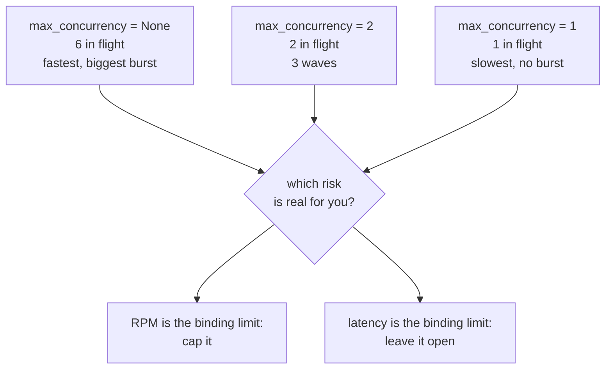

# 2.5 — Fan-out against a quota

## One-line answer

`max_concurrency` on the `Workflow` caps how many nodes may be in flight at once, and on a free tier
measured in requests per minute it is not a tuning knob — it is the difference between six branches
and six 429s.

## The story

The tank on the roof fills overnight and holds enough for the day. Everyone in the house knows this
and nobody thinks about it, because on a normal morning the taps are used one at a time.

Then relatives arrive. Two showers, the washing machine, the kitchen tap and somebody filling
buckets, all at once. Nothing is broken. Nobody is wasting anything. Each of those uses is
individually reasonable, and every one of them would have been fine on its own.

The tank does not run dry gently. The pressure goes first: the shower upstairs turns into a dribble
while the washing machine is filling, and the person in it thinks the shower is broken. Then the
kitchen tap coughs. By nine o'clock there is no water at all and the tank does not refill until
tonight, so the afternoon is gone too.

What went wrong was not the amount of water used. It was the number of taps open at once.

## The idea in plain language

A **quota** is a limit on how much of a service you may use. Free tiers state theirs in two
currencies, and they are not the same:

- **RPD** — requests per day. A budget for the whole day. Spend it and you are finished until
  tomorrow.
- **RPM** — requests per minute. A limit on the *rate*. You can respect your daily budget perfectly
  and still be refused, if you spend a chunk of it in one second.

A fan-out spends RPM. Six branches that each call a model is six requests in one instant, and if the
limit is ten per minute you have used more than half of a minute's allowance before the first branch
comes back. Add a second ticket arriving at the same moment and you are over.

What comes back when you exceed a rate limit is **HTTP 429**, "Too Many Requests", usually with a
`retry-after` header saying how long to wait. Day 21 established that errors surface rather than
being swallowed, and Addendum 02 requires every model call path in Sutra to handle 429 with
`retry-after` and backoff before escalating. That handling is the response to a 429. This part is
about not causing them.

The control is `max_concurrency`, a field on `Workflow`. It is the number of taps you are willing to
have open. Branches beyond that number wait for a slot instead of starting.

## Why Sutra needs it

Addendum 02 records the free-tier Gemini Flash rate as roughly ten to fifteen requests per minute,
and ten is the number Sutra budgets against because a floor is the right number for a budget. The
triage graph's research stage has three branches today and Day 58 will not shrink it.

Three is comfortably inside ten. The problem arrives when the desk handles two tickets at once, or
when a research branch becomes a small sub-graph of its own with three calls in it, or when Day 56's
planner decides to fan out over five candidate approaches. None of those is an unreasonable change,
and each one multiplies. `max_concurrency` is the one line that means those changes cost latency
instead of costing the rest of the day's quota.

## The mechanism

Six branches, and a counter that records how many were live at the same moment.

```python
IN_FLIGHT = 0
PEAK = 0
TRACE: list[str] = []


def branch(name: str):
    """Build one async research branch that records how many branches are live while it runs."""

    async def go(node_input: str) -> str:
        global IN_FLIGHT, PEAK
        IN_FLIGHT += 1
        PEAK = max(PEAK, IN_FLIGHT)
        TRACE.append(f"+{name}({IN_FLIGHT})")
        await asyncio.sleep(0.01)
        IN_FLIGHT -= 1
        TRACE.append(f"-{name}")
        return f"{name}:done"

    go.__name__ = name
    return go
```

**Line by line:**

- `IN_FLIGHT` is incremented on entry and decremented on exit, so at any instant it is the number of
  branches inside their own body. `PEAK` remembers the highest it ever reached, which is the number
  that would have been simultaneous requests against a provider.
- `TRACE.append(f"+{name}({IN_FLIGHT})")` — recording the count *at the moment of entry* rather than
  just the name. `+b4(4)` says "b4 started, and it was the fourth one live". That single character is
  what makes the trace readable as evidence.
- `await asyncio.sleep(0.01)` — a small real delay, so branches genuinely overlap rather than
  finishing before the next one starts. With `sleep(0)` this experiment would measure nothing.
- `go.__name__ = name` — the runtime derives a node's name from the callable, and six closures all
  called `go` would collide. The error you would otherwise get is `Graph validation failed. Duplicate
  node names found: ['go']`, from
  [1.4](../01-one-after-another/1.4-the-stage-that-refuses-to-run.md).

```python
workflow = Workflow(
    name="fanout",
    edges=[(START, branches, JoinNode(name="gather"))],
    max_concurrency=limit,
)
```

**Line by line:**

- `max_concurrency=limit` — an integer, or `None` for no limit. It is a field on `Workflow`, not on a
  node, so it governs the whole graph rather than one fan-out. Verified with
  `python -c "from google.adk.workflow import Workflow; print(Workflow.model_fields['max_concurrency'].default)"`
  on `google-adk==2.7.1`, which prints `None`, and against `https://adk.dev/graphs/` on 2026-09-05.
- The default being `None` is the fact to notice. **Out of the box a fan-out is unbounded**, and a
  graph that fans out over a list can open as many taps as the list is long.

Run it:

```bash
cd days/day-54-sequential-parallel-loop/lab
uv run python concurrency.py
```

**Line by line:**

- `concurrency.py` builds six branches, runs the graph, and reports the peak, the trace, and the
  peak read against a ten-per-minute budget.
- `--limit N` sets `max_concurrency`.

Measured on 2026-09-05:

```text
max_concurrency = None
    peak in flight : 6 of 6
    trace          : +b1(1) +b2(2) +b3(3) +b4(4) +b5(5) +b6(6) -b1 -b3 -b6 -b5 -b2 -b4
    burst against a 10 RPM free tier: 6 of 10 in one instant
```

All six taps open. The trace climbs `1 2 3 4 5 6` with no closing entry in between, which is what
"all at once" looks like when you write it down. Six of a minute's ten requests, gone in one instant,
for one ticket.

Notice the closing order too: `-b1 -b3 -b6 -b5 -b2 -b4`. That is [2.3](2.3-the-order-you-cannot-rely-on.md)
appearing again in a different script, for free.

Now one tap:

```bash
uv run python concurrency.py --limit 1
```

**Line by line:**

- `--limit 1` sets `max_concurrency=1`: one node in flight at a time, across the whole graph.

```text
max_concurrency = 1
    peak in flight : 1 of 6
    trace          : +b1(1) -b1 +b2(1) -b2 +b3(1) -b3 +b4(1) -b4 +b5(1) -b5 +b6(1) -b6
    burst against a 10 RPM free tier: 1 of 10 in one instant
```

Perfectly serialised — every `+` immediately followed by its own `-`. This is a fan-out in the graph
and a chain in execution, which is exactly the trade: the shape stays declarative and the runtime
paces it.

And the useful middle:

```bash
uv run python concurrency.py --limit 2
```

**Line by line:**

- `--limit 2` is the useful middle: enough overlap to be worth fanning out, small enough that six
  branches never become six simultaneous requests.

```text
max_concurrency = 2
    peak in flight : 2 of 6
    trace          : +b1(1) +b2(2) -b1 -b2 +b3(1) +b4(2) -b3 -b4 +b5(1) +b6(2) -b5 -b6
    burst against a 10 RPM free tier: 2 of 10 in one instant
```

Two at a time, in three waves. Three times the concurrency of `--limit 1` at a third of the burst of
the unbounded run.



## When it breaks

The break is what the burst produces at the other end, and it is worth writing the handler once
because Addendum 02 requires it on every model call path:

```python
async def call_model(client, prompt: str, attempts: int = 5) -> str:
    """One model call with honest 429 handling: respect retry-after, back off, then escalate."""
    delay = 1.0
    for attempt in range(1, attempts + 1):
        try:
            return await client.generate(prompt)
        except RateLimited as exc:
            if attempt == attempts:
                raise
            wait = exc.retry_after if exc.retry_after is not None else delay
            logging.warning("429 on attempt %s; waiting %ss", attempt, wait)
            await asyncio.sleep(wait)
            delay *= 2
    raise AssertionError("unreachable")
```

**Line by line:**

- `except RateLimited as exc` — a specific exception, never a bare `except`. Principle 10 and trap
  #4 both say the same thing here: an error that is caught and turned into a string is an error the
  runtime, the retry logic and the tracing can no longer see.
- `if attempt == attempts: raise` — the last attempt re-raises rather than returning a placeholder.
  **Never fabricate a result to cover a 429.** A missing answer is recoverable; an invented one is
  not.
- `exc.retry_after if exc.retry_after is not None else delay` — the server's own number wins. It
  knows when the window resets and your exponential guess does not.
- `delay *= 2` — one, two, four, eight. Day 72 builds this ladder properly; this is the shape.
- `logging.warning(...)` — a 429 that is silently retried is a quota problem you will discover from
  a billing page or an outage rather than from a log.

The error this handler exists for, rendered by the installed `google-genai` from a 429 body. The
class, the `429 <STATUS>. <body>` shape and the `RESOURCE_EXHAUSTED` status are verified — this block
was produced by constructing the real exception on 2026-09-05 with:

```bash
python -c "from google.genai.errors import ClientError;   print(ClientError(429, {'error': {'code': 429, 'message': '...',   'status': 'RESOURCE_EXHAUSTED'}}))"
```

```text
google.genai.errors.ClientError: 429 RESOURCE_EXHAUSTED. {'error': {'code': 429, 'message':
'<the provider wording, captured on your first real 429>', 'status': 'RESOURCE_EXHAUSTED'}}
```

The `message` string is the provider's own prose and it changes; this day does not call a live model,
so it is left as a placeholder rather than guessed at. `TODO(me)`: the first time you hit a real 429,
paste the exact `message` into your runbook, because that string is what you will paste into a search
box at eleven at night.

The thing to understand about the status is that `RESOURCE_EXHAUSTED` is telling you about a **rate**,
not about a balance. On a free tier you will meet it having used a tiny fraction of the day's
allowance, because six branches asked at the same instant. Capping concurrency is the fix; retrying is
the apology.

## In production

**What a professional writes instead.** They set `max_concurrency` explicitly on every graph that
fans out, even when the current fan-out is three and the limit they choose is ten. The value is
documentation: it says out loud what this graph is allowed to do to a shared resource, and it means
the person who later fans out over a list rather than over three named branches has to change a
number rather than discover a limit. Where several graphs share one provider, the cap belongs
higher — in a plugin that counts requests per provider per window, which is precisely what Day 70's
Quota-Router is.

**What degrades at scale.** `max_concurrency` is per `Workflow` instance, so it bounds one run and
not your process. Two tickets in flight at once means two graphs each honouring a limit of three,
and six concurrent requests against a provider that is counting all of them together. This is the
single most common way a correctly-configured cap fails to help, and the only real fix is a limiter
that lives at the provider rather than at the graph.

**The failure mode that only appears with real traffic.** Bursts that are fine in isolation and
overlap under load. Your fan-out of three is comfortable at one ticket a minute and is thirty
concurrent requests at ten tickets a minute, and ten tickets a minute is a normal Monday morning. The
graph did not change and the arithmetic did. Rate limits are the one production problem that is
entirely invisible in development, because development has one user.

**The review comment a senior engineer leaves:** *"`max_concurrency` is unset here, so this fan-out
opens as many concurrent model calls as there are items in the list. Set it. And note that it is per
run — if we handle two tickets at once we are at twice this number against the same provider key, so
we still want the per-provider limiter before we raise the ticket concurrency."*

**The interview question:** *"How do you stop a parallel agent workflow from exhausting a rate
limit?"* An honest answer: *"Cap the concurrency at the workflow, and handle the 429s you still get
honestly. In ADK that is `max_concurrency` on the `Workflow`, and its default is `None`, which means
unbounded — so a fan-out over a list is as many simultaneous requests as the list is long. I measured
it with six branches: unbounded, the peak in flight was six; at a limit of two it was two, in three
waves. The thing I would flag in review is that the cap is per run, so it does nothing about two runs
overlapping — for that you need a limiter that counts per provider per window, which is a plugin
rather than a graph setting. And the 429 handler never invents a result; it respects `retry-after`,
backs off, and eventually escalates."*

## Check yourself

```bash
cd days/day-54-sequential-parallel-loop/lab
uv run python concurrency.py
uv run python concurrency.py --limit 1
uv run python concurrency.py --limit 2
```

Now change `RPM` in `concurrency.py` to `15` — the top of Addendum 02's stated range — and work out
how many tickets the desk could research at once, unbounded, before the burst exceeds it.

**Out loud, without scrolling up:** what is `max_concurrency`'s default, what does it bound, and name
one thing it does *not* protect you from.

**Next:** [3.1 — A loop is an edge that goes back](../03-around-again/3.1-a-loop-is-an-edge-that-goes-back.md).
