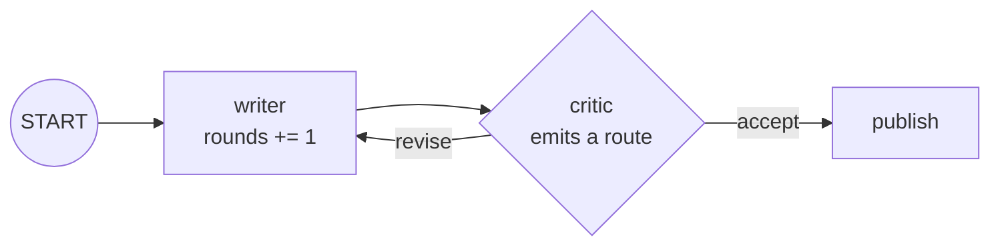

# 3.1 — A loop is an edge that goes back

## One-line answer

There is no loop construct: a loop is an ordinary edge pointing at a node the graph has already
visited, plus a **route** on it so a node upstream can decide, each time round, whether that edge is
taken.

## The story

The tailor takes your measurements and says come back on Thursday.

On Thursday you put the shirt on and stand in front of the mirror. He looks at the shoulders, pinches
the fabric at the back with two fingers, and puts a chalk mark on it. Come back Saturday.

On Saturday you put it on again. The shoulders are right. He looks at the sleeves, decides one cuff
sits low, marks it. Come back Monday.

On Monday you put it on and he stands back and does not reach for the chalk. He says *"that is it"*,
wraps it, and you pay.

Nobody decided in advance that it would take three fittings. There was no plan that said "three".
Each time, the same two things happened: you tried it on, and he decided whether it was finished. The
number of fittings was the *result* of those decisions, not an input to them.

And you have been to a tailor who does not do this. He hands it over on Thursday whatever it looks
like, because Thursday was the day.

## The idea in plain language

A **loop** in a graph is not a special kind of node and not a keyword. It is an **edge that points
backwards** — from a node later in the graph to a node earlier in it — so that reaching the later
node can send the run back round.

That backwards arrow has a name: a **back edge**.

An edge that always fires would loop forever, so a back edge has to be **conditional**. The mechanism
for that is a **route**: a label attached to an edge, and a value emitted by the node upstream of it.
When the node emits the value, the matching edge is followed. When it emits something else, a
different edge is followed. The tailor emits *"come back"* or *"that is it"*, and there is an arrow
for each.

Two pieces of vocabulary, defined once and used for the rest of the day:

- **Route** — the label on the edge, and the value a node emits to select it. It can be a string, an
  integer or a boolean.
- **Exit condition** — the state of the world in which the node emits the value that leads *out* of
  the loop rather than back into it. In the tailor's shop, "no chalk marks left".

So the writer-critic loop, which is the shape Day 57 builds on, is four edges:

1. `START → writer`
2. `writer → critic`
3. `critic → writer`, labelled `revise`
4. `critic → publish`, labelled `accept`

The critic is the only node that decides anything. The writer just writes.

## Why Sutra needs it

Day 57 designs the orchestrator and the Writer↔Critic pair, and Day 58 puts that pair into the triage
graph as the review stage: draft a reply, have a critic read it, redraft if the critic objects. The
number of redrafts is not known in advance, because it depends on the ticket.

That is exactly the tailor. A stage that runs a fixed three times is a chain of three, and you would
write it as a chain of three. A loop is what you reach for when the *number* of passes is a result
rather than a setting.

## The mechanism

The writer, the critic, and the two labelled edges out of the critic.

```python
from google.adk.agents.context import Context
from google.adk.events.event import Event
from google.adk.workflow import START, Edge, FunctionNode, Workflow


def write(ctx: Context, node_input=None) -> str:
    """The writer. Each pass produces a new draft and bumps the round counter in state."""
    rounds = ctx.state.get("rounds", 0) + 1
    ctx.state["rounds"] = rounds
    return f"draft v{rounds}"


def review(ctx: Context, node_input: str) -> Event:
    """The critic. Its return value carries BOTH an output and the route the graph should take."""
    rounds = ctx.state.get("rounds", 0)
    verdict = "accept" if rounds >= 3 else "revise"
    return Event(route=verdict, output=f"review of {node_input}: {verdict}")


def publish(node_input: str) -> str:
    return f"PUBLISHED ({node_input})"
```

**Line by line:**

- `def write(ctx: Context, node_input=None)` — the default of `None` matters. On the first pass the
  writer is reached from `START`; on later passes it is reached from the critic. Both supply
  something, but the default is what makes the node robust to being the entry point.
- `rounds = ctx.state.get("rounds", 0) + 1` — the counter lives in **session state**, not in a local
  variable and not in the node object, because those do not survive the trip round the loop. That is
  [3.3](3.3-what-survives-one-turn-of-the-loop.md), and it is the single most useful thing to know
  about loops.
- `def review(...) -> Event` — the critic returns an `Event` rather than a string. Every other node in
  this day returns a plain value and lets the runtime wrap it; this one needs to say something the
  wrapper cannot carry.
- `Event(route=verdict, output=...)` — the two halves. `output` is what the next node receives;
  `route` is which next node that is. They are independent, which is why they are separate arguments.
  Verified with
  `python -c "from google.adk.events.event import Event; print(Event(route='revise').actions.route)"`
  on `google-adk==2.7.1`, which prints `revise`, and against `https://adk.dev/graphs/routes/` on
  2026-09-05, which documents `return Event(route="RUN_TASK_C")` as the way a node emits a route.
- `"accept" if rounds >= 3 else "revise"` — the exit condition, in one line, reading state. A real
  critic would read the draft; the point of this part is the wiring, so the criterion is a counter
  you can predict.

Now the edges:

```python
writer = FunctionNode(func=write, name="writer")
critic = FunctionNode(func=review, name="critic")
published = FunctionNode(func=publish, name="publish")

workflow = Workflow(
    name="writer_critic",
    edges=[
        (START, writer, critic),
        Edge(from_node=critic, to_node=writer, route="revise"),
        Edge(from_node=critic, to_node=published, route="accept"),
    ],
)
```

**Line by line:**

- `(START, writer, critic)` — the ordinary chain, exactly as in
  [1.1](../01-one-after-another/1.1-the-order-you-declare-is-the-order-you-get.md). Two of the four
  edges come from this one tuple.
- `Edge(from_node=critic, to_node=writer, route="revise")` — **the back edge**. It points at a node
  that already appears earlier in the graph, which is the only thing that makes this a loop.
- `route="revise"` — the string here must match the string the critic emits. They are matched by
  value, so a typo in either produces an edge that is never taken and a branch that silently ends
  (the failure in [2.2](../02-at-the-same-time/2.2-the-node-that-waits-for-everyone.md)).
- The two routed edges out of `critic` are what make it a decision. Without the second one, `accept`
  would match nothing and the loop would have no exit.

Run it:

```bash
cd days/day-54-sequential-parallel-loop/lab
uv run python loop.py
```

**Line by line:**

- `loop.py` builds exactly this graph and prints every output and the final session state.
- `--rounds N` moves the exit condition, so the same graph runs a different number of passes.

Measured on 2026-09-05:

```text
critic accepts once rounds >= 3
    draft v1
    review of draft v1: revise
    draft v2
    review of draft v2: revise
    draft v3
    review of draft v3: accept
    PUBLISHED (review of draft v3: accept)
    final state: {'rounds': 3}
```

Three fittings. The writer ran three times and the critic ran three times, from a graph with three
node objects in it. Two of those three critic passes took the back edge; the third took the other
one.



Move the exit condition and the number of passes moves with it:

```bash
uv run python loop.py --rounds 5
```

**Line by line:**

- `--rounds 5` changes only the number the critic compares against. The graph, the nodes and the edges
  are untouched.

```text
critic accepts once rounds >= 5
    draft v1
    review of draft v1: revise
    ...
    draft v5
    review of draft v5: accept
    PUBLISHED (review of draft v5: accept)
    final state: {'rounds': 5}
```

Five passes from the same four edges. The graph does not know how many times it will go round, and
that is the property you came for.

## When it breaks

The break is a route the graph is not listening for. Change the critic's verdict string and leave the
edges alone:

```python
verdict = "approved" if rounds >= 3 else "revise"
```

**Line by line:**

- One word. The critic now emits `approved`, and the edge out of the critic is still labelled
  `accept`.

The run does not raise. It loops twice, reaches round three, emits `approved`, and stops — because no
edge matches, so there is nowhere to go. The only trace is a log line:

```text
WARNING google_adk.google.adk.workflow._graph: Node 'critic' has conditional/DEFAULT edges but none
were matched by the emitted route(s): approved. The branch will end.
```

That is the same warning [2.2](../02-at-the-same-time/2.2-the-node-that-waits-for-everyone.md)
measured on a join, arriving here through a different door, and it is worth recognising in both
places: **a route that matches nothing ends the branch quietly.**

The smallest fix is to make the two strings agree. The better fix is to stop having two strings:
define the route values as constants next to the graph, and use the constants in both the node and
the edge, so a typo is a `NameError` instead of a warning nobody reads.

There is a second version of this that is worth knowing about because it is the intended design
rather than a bug. `DEFAULT_ROUTE` is a special route value that matches when nothing else on that
node does:

```python
Edge(from_node=critic, to_node=published, route=DEFAULT_ROUTE)
```

**Line by line:**

- `DEFAULT_ROUTE` is importable from `google.adk.workflow` and its value is the string `__DEFAULT__`.
  Verified with
  `python -c "from google.adk.workflow import DEFAULT_ROUTE; print(DEFAULT_ROUTE)"` on
  `google-adk==2.7.1`.
- With this edge in place, `approved` no longer ends the branch: it fails to match `revise`, falls
  through to the default, and publishes. A node may have only one `DEFAULT_ROUTE` edge, and combining
  `DEFAULT_ROUTE` with other routes in one list is rejected at construction.

Which of the two you want is a design decision: the default edge makes the loop robust to an
unexpected verdict, at the cost of publishing something a critic did not actually accept.

## In production

**What a professional writes instead.** They make the route values an enum or a set of module
constants, never string literals repeated in two places, for the reason above. They also keep the
deciding node small: a node that both does work and emits a route is two jobs, and the route logic is
the half that gets read during an incident. Separating "produce a verdict" from "decide which edge
that verdict means" is often worth one extra node.

**What degrades at scale.** Nothing in the mechanism. What degrades is cost, and it degrades
multiplicatively rather than additively: a loop that averages three passes over a stage that makes
two model calls is six calls, and if either node retries you multiply again. That arithmetic is
[4.3](../04-where-they-meet/4.3-retries-inside-a-loop-multiply.md), and it is the reason a review
loop is the most expensive shape in the triage graph.

**The failure mode that only appears with real traffic.** An exit condition that reads a model's
output. In this lab the critic counts, so the loop always ends. A real critic asks a model *"is this
reply good enough?"* and the model, on some tickets, keeps saying no — not because the draft is bad
but because the criterion is vague and the ticket is unusual. Those tickets loop until something else
stops them, and what stops them is [3.5](3.5-the-guard-you-write-yourself.md).

**The review comment a senior engineer leaves:** *"The route string `revise` appears in the critic and
in the edge, as two separate literals. Make them one constant. Right now a typo in either place gives
us a branch that silently ends, and the only evidence is a warning on a logger we do not surface in
production."*

**The interview question:** *"How do you build a loop in a graph-based workflow?"* An honest answer:
*"You do not build one; you point an edge backwards and put a route on it. In ADK the node emits
`Event(route='revise')` and the back edge is labelled `revise`, with a second labelled edge out of
the same node for the exit. The number of passes is then a consequence of the exit condition rather
than a setting, which is the point. The two things I watch for are that the route strings on the node
and the edge are literally the same value — a mismatch just ends the branch with a warning — and that
the loop counter lives in session state, because nothing local survives a trip round."*

## Check yourself

```bash
cd days/day-54-sequential-parallel-loop/lab
uv run python loop.py
uv run python loop.py --rounds 5
```

Now change the critic's `"accept"` to `"approved"` in one place only, run it, and find the warning.
Then add a `DEFAULT_ROUTE` edge and run it again.

**Out loud, without scrolling up:** what makes an edge a back edge, and what has to be true of that
edge for the runtime to accept the graph at all?

**Next:** [3.2 — The cycle the runtime refuses](3.2-the-cycle-the-runtime-refuses.md).
