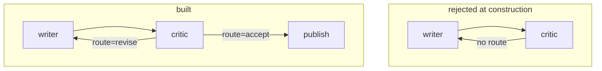

# 3.2 — The cycle the runtime refuses

## One-line answer

The graph runtime rejects a back edge with **no route on it**, at construction time, with the message
`Unconditional cycle detected` — and that single check is the *only* structural promise it makes
about loops.

## The story

You are filling in a form to claim a refund and you are stuck on a page in the middle of it.

Section 2 asks for a reference number and says, in small print: *if you do not have a reference
number, see section 4*.

You turn to section 4. Section 4 says: *to complete section 4, you will need the reference number
from section 2*.

You read both again, slowly, in case you have missed a word. You have not. There is no third door.
Two sections point at each other and neither of them contains the thing the other one needs.

You are not going to solve this by trying harder. The form is wrong, and it was wrong when it was
printed, before anybody picked up a pen. Somebody should have read those two lines side by side at
the printers.

## The idea in plain language

[3.1](3.1-a-loop-is-an-edge-that-goes-back.md) built a loop out of a back edge with a **route** on it.
This part is about what happens when you leave the route off.

An edge with no route is **unconditional**: it is always followed. A cycle made only of unconditional
edges therefore has no way out — every node in it, on finishing, always sends the run to the next one
round. That is not a loop with a bug in it. It is a loop with no exit, and there is no input that
would make it terminate.

The runtime checks for exactly that, when you construct the `Workflow`, by walking the graph using
only the unconditional edges and looking for a cycle. If it finds one, it raises.

This is worth being precise about, because it is easy to over-read:

| What the runtime guarantees | What it does not |
| --- | --- |
| A cycle made entirely of unrouted edges will not build. | Nothing about how many times a *routed* cycle goes round. |
| The check runs at construction, before any node executes. | Any check on whether your exit condition can ever be true. |
| The message names the exact cycle path. | Any limit, default or otherwise, on iterations. |

The right-hand column is [3.4](3.4-the-loop-that-never-ends.md) and
[3.5](3.5-the-guard-you-write-yourself.md). Knowing precisely where the guarantee stops is the point
of this part, because a reader who believes the runtime bounds loops will not write the guard that
does.

## Why Sutra needs it

Every loop Sutra builds from here is a routed back edge: the review loop on Day 57, the replanning
loop on Day 56 when a plan step fails, the resumption loop on Day 61. Each one is one line away from
being unroutable by accident, because deleting `route="revise"` from an edge is a plausible edit.

This check is the reason that particular mistake costs you a message rather than a machine. It is
also the reason you can trust that any loop in a Sutra graph *has* a conditional edge in it — the
question is only whether the condition is reachable.

## The mechanism

Two graphs that differ by one keyword argument.

```python
from google.adk.events.event import Event
from google.adk.workflow import START, Edge, FunctionNode, Workflow


def write(node_input=None) -> str:
    return "draft"


def review(node_input: str) -> Event:
    return Event(route="revise", output="still not good")


writer = FunctionNode(func=write, name="writer")
critic = FunctionNode(func=review, name="critic")

back = Edge(from_node=critic, to_node=writer)  # no route
back_routed = Edge(from_node=critic, to_node=writer, route="revise")

Workflow(name="cycle", edges=[(START, writer, critic), back])
```

**Line by line:**

- `Edge(from_node=critic, to_node=writer)` — `route` defaults to `None`, and `None` means
  unconditional. There is nothing to spot visually; the difference between a legal loop and an
  illegal one is an argument that is absent.
- `back_routed` is the same edge with `route="revise"`. Both edges connect the same two nodes in the
  same direction.
- The critic emits `revise` in both cases, so the *behaviour* of the two graphs would be identical if
  both were allowed to run. Only one of them is.

Run it:

```bash
cd days/day-54-sequential-parallel-loop/lab
uv run python cycle.py
```

**Line by line:**

- `cycle.py` builds the unrouted version inside a `try` and prints the rejection.
- `--routed` builds the routed version, which constructs successfully, and prints the node count as
  proof that it did.

Measured on 2026-09-05:

```text
back edge route: None
    ValidationError: Graph validation failed. Unconditional cycle detected: critic -> writer -> critic. Cycles must include at least one conditional (routed) edge to avoid infinite loops.
```

Note what the message gives you: `critic -> writer -> critic`. Not "there is a cycle somewhere" — the
actual path, in order, so in a graph of thirty nodes you know which three edges to look at. That is
the two sections of the form, printed side by side, which is what nobody did at the printers.

And with the route:

```bash
uv run python cycle.py --routed
```

**Line by line:**

- `--routed` passes `route="revise"` to the same `Edge` and changes nothing else.

```text
back edge route: 'revise'
    built: cycle with 3 nodes
```

It builds. Three nodes — `__START__`, `writer`, `critic` — and a legal cycle among them.



The check is deliberately narrow. It walks **only** the unconditional edges, so the moment one edge in
the cycle carries a route, the cycle disappears from the graph the checker is looking at. The routed
version above builds even though its critic emits `revise` unconditionally and it would, in fact,
loop forever. The runtime is not checking whether your loop terminates. It is checking whether you
have given it any way at all to.

## When it breaks

The version that catches people is not the two-node cycle above — that one is obvious once you see
the message. It is a **long** cycle, where the back edge is nowhere near the node it points at.

```python
Workflow(
    name="triage",
    edges=[
        (START, intake, classify, research, draft, review),
        Edge(from_node=review, to_node=classify),
    ],
)
```

**Line by line:**

- A five-stage chain, then one edge from the last stage back to the second, so that a review can send
  a ticket to be re-classified.
- The intent is entirely reasonable: the reviewer noticed the ticket was filed as `auth` and is really
  a billing question.
- `route` is missing, so this is unconditional.

```text
ValidationError: Graph validation failed. Unconditional cycle detected: classify -> research ->
draft -> review -> classify. Cycles must include at least one conditional (routed) edge to avoid
infinite loops.
```

Four nodes in the printed path, and the fix is on none of the first three. It is on the edge you
added last, which is the one node not in the chain tuple. Read the path from the end: the last two
names are the edge you wrote.

The smallest fix is `route="reclassify"` on that edge, plus a node that emits it — and the moment you
write those two things you have to answer the question the unrouted version let you skip: *under what
circumstances does the reviewer send it back?* The check is not just catching a mistake; it is
refusing to let you leave the condition unwritten.

There is a related rejection worth recognising, because it looks similar and is not. Point a node at
itself, unrouted, and you get:

```text
ValidationError: Graph validation failed. Unconditional cycle detected: classify -> classify.
Cycles must include at least one conditional (routed) edge to avoid infinite loops.
```

A one-node path. That is usually not a loop you meant to build at all — it is the same node object
used twice in one chain tuple, which
[1.3](../01-one-after-another/1.3-why-calling-them-in-order-is-not-a-workflow.md) met from the other
direction.

## In production

**What a professional writes instead.** They never write a back edge without writing its exit edge in
the same commit. The two go together the way an `if` goes with its `else`: an edge labelled `revise`
with no sibling labelled `accept` is a loop whose only exit is the warning from
[3.1](3.1-a-loop-is-an-edge-that-goes-back.md). Reviewing a diff that adds one routed edge to a node
that had none is worth a question every time.

**What degrades at scale.** The check itself does not — it is a depth-first walk over the edges. What
degrades is your ability to read the cycle path it prints. In a graph assembled from three composed
sub-graphs, `a -> b -> c -> d -> e -> f -> a` names six nodes across three files. That is an argument
for naming nodes with their sub-graph prefix, so the path tells you where to look as well as what is
wrong.

**The failure mode that only appears with real traffic.** None from this check, by construction: it
fires before the object exists, so a graph with an unconditional cycle cannot be deployed. What
*does* reach traffic is the graph that passed this check and loops anyway, because its route is
always the same value. The check gives a strong feeling of safety that covers a narrower area than it
appears to, which is why [3.4](3.4-the-loop-that-never-ends.md) exists.

**The review comment a senior engineer leaves:** *"This back edge builds because it is routed, and the
route is the only thing standing between us and an infinite loop. Where is the condition that makes
the other route fire, and what happens on a ticket where it never does? I want a cap in the node, not
a hope in the prompt."*

**The interview question:** *"Does your workflow engine protect you from infinite loops?"* An honest
answer: *"Partly, and it is important to know which part. ADK's graph runtime rejects an
unconditional cycle when you construct the `Workflow` — the message is `Unconditional cycle detected`
and it prints the exact path. So you cannot build a loop with no conditional edge in it at all. What
it explicitly does not do is bound a routed cycle: the docs say a graph cycle is not bounded
automatically and you must make sure the exit condition eventually becomes true. I tested that, and a
critic that always emits `revise` runs indefinitely with no complaint from the runtime. So the
structural check catches the typo and the iteration cap is mine to write."*

## Check yourself

```bash
cd days/day-54-sequential-parallel-loop/lab
uv run python cycle.py
uv run python cycle.py --routed
```

Now build a four-node cycle in `cycle.py` — `a → b → c → d → b`, unrouted — and read the path in the
message. Say which single edge you would add a route to, and why that one.

**Out loud, without scrolling up:** state exactly what the runtime guarantees about cycles, and one
thing a reader might wrongly assume it guarantees.

**Next:** [3.3 — What survives one turn of the loop](3.3-what-survives-one-turn-of-the-loop.md).
