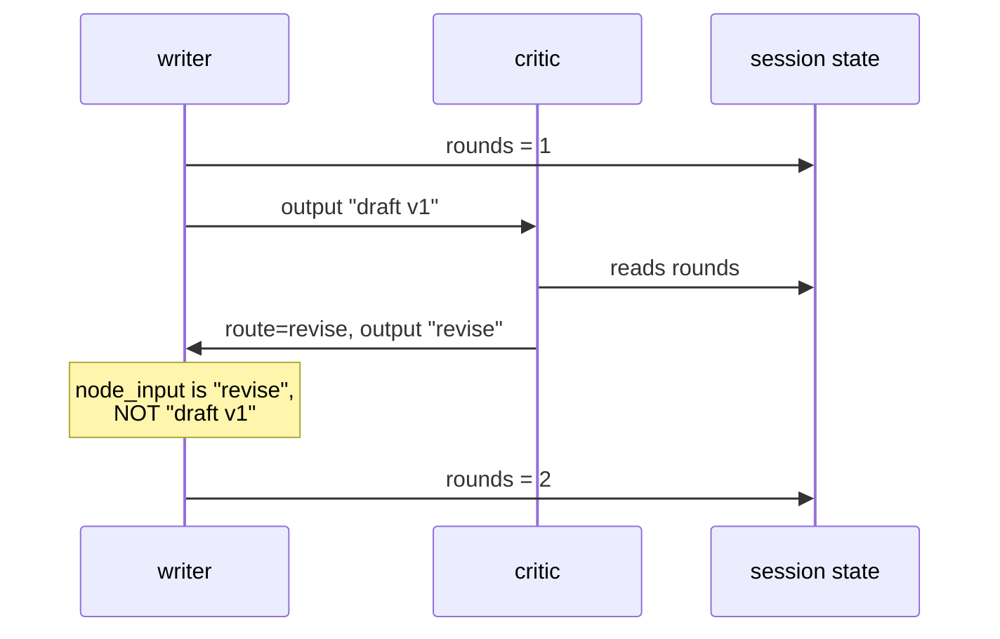

# 3.3 — What survives one turn of the loop

## One-line answer

Session state carries across an iteration; the node input does not carry what you expect, because on
the way back round it holds the **critic's** output rather than the writer's previous draft.

## The story

The meeting room has a whiteboard and, on the table, a minutes book.

The first item is discussed and the whiteboard fills up: names, arrows, a rough number circled twice.
When that item is finished, somebody writes three lines in the minutes book — the decision, who is
doing it, by when — and then wipes the whiteboard clean for item two.

Item four comes back to something from item one. Somebody says *"we had a number for this"*, and
everyone looks at the whiteboard, which has item three on it. The number that was circled twice is
gone. What survives is the three lines in the minutes book, and only the three lines: the decision,
not the working.

Nobody did anything wrong. The whiteboard is for working and the minutes book is for what carries.
The mistake, if there is one, was assuming the whiteboard was a record.

## The idea in plain language

A loop runs the same node several times. Something has to carry from one pass to the next — the round
number, the previous draft, the list of things the critic has already objected to — and there are
three candidates. Only one of them works, and the other two fail in different and instructive ways.

**Session state** is the minutes book. It belongs to the run and it survives every pass. This is the
one that works, and it is why [3.1](3.1-a-loop-is-an-edge-that-goes-back.md) put the round counter
there rather than anywhere else.

**A module-level variable** is a whiteboard in a different room. It survives inside one Python
process, which is why it appears to work perfectly in a script. It does not belong to the run, so it
is shared by every run in that process and it is gone the moment the process restarts. Day 61 makes
this fatal: a run that pauses and resumes in a different process finds it empty. It is also,
immediately, a bug in any server handling two tickets at once.

**The node input** is the surprising one, and it is the whole reason this part exists. On the way back
round the loop, the writer's `node_input` is not the writer's previous draft. It is whatever the
**critic** returned, because the critic is the node the back edge comes from. The writer never sees
its own last output unless somebody put it in state.

That is obvious once stated and almost nobody predicts it, because the mental model of a loop is "the
writer goes again", and the mental model of the graph is "the critic sends something to the writer".
Both are true and the second one decides what arrives.

## Why Sutra needs it

The review loop's whole value is that the second draft is better than the first. That requires the
writer to have, on pass two, at least two things: what it wrote last time, and what the critic
objected to.

The critic's objection arrives as `node_input`, for free. **The previous draft does not arrive at
all.** If the writer does not write its draft into session state, pass two starts from nothing and
produces a different first draft rather than a revision — and it will look plausible, because a
first draft always does. Day 57 designs this pair properly and Day 58 wires it into the triage graph;
this is the fact that design rests on.

## The mechanism

One writer that counts the rounds three different ways and reports all three, inside a real loop.

```python
MODULE_COUNTER = 0


def write(ctx: Context, node_input=None) -> str:
    """Counts the rounds three ways and reports all three."""
    global MODULE_COUNTER
    MODULE_COUNTER += 1
    rounds = ctx.state.get("rounds", 0) + 1
    ctx.state["rounds"] = rounds
    print(
        f"    writer: state.rounds={rounds}  module={MODULE_COUNTER}  "
        f"node_input={describe(node_input)}"
    )
    return f"draft v{rounds}"


def review(ctx: Context, node_input: str) -> Event:
    rounds = ctx.state.get("rounds", 0)
    verdict = "accept" if rounds >= 3 else "revise"
    print(f"    critic: sees {node_input!r} -> {verdict}")
    return Event(route=verdict, output=verdict)
```

**Line by line:**

- `global MODULE_COUNTER` — the whiteboard in the other room. Incremented on every call, living in
  the module rather than in the run.
- `ctx.state.get("rounds", 0) + 1` — the minutes book. Read, increment, write back. This is a
  read-modify-write, which was a bug in
  [2.4](../02-at-the-same-time/2.4-two-branches-one-state-key.md) and is safe here for one specific
  reason: a loop runs one node at a time, so there is no second writer to race with.
- `print(...)` inside the node rather than returning the information — because the interesting values
  are what the node *received*, and a return value only tells you what it produced.
- `describe(node_input)` — a small helper that prints the type and a truncated string, so a `Content`
  object and a one-word string are visibly different things rather than both being "some text".
- `return Event(route=verdict, output=verdict)` — the critic's output is deliberately just the
  verdict word, so that what the writer receives on the way back round is unmistakable.

Run it:

```bash
cd days/day-54-sequential-parallel-loop/lab
uv run python carry.py
```

**Line by line:**

- `carry.py` is the loop above with the exit condition at three rounds. It takes no flags: the whole
  point is one run with three passes through the same node.

Measured on 2026-09-05:

```text
    writer: state.rounds=1  module=1  node_input=Content(parts=[Part(   text='start' )] rol...)
    critic: sees 'draft v1' -> revise
    writer: state.rounds=2  module=2  node_input=str(revise)
    critic: sees 'draft v2' -> revise
    writer: state.rounds=3  module=3  node_input=str(revise)
    critic: sees 'draft v3' -> accept
    final session state: {'rounds': 3}
    module counter after the run: 3
```

Three things to read out of that, in order of how surprising they are.

**First, `node_input` on pass one is a `Content` object.** Not a string. The first time the writer
runs it is reached from `START`, and what arrives is the user's message as the runner wrapped it. A
node that does `node_input.strip()` works on every pass except the first, which is a fun way to spend
an evening.

**Second, `node_input` on passes two and three is `str(revise)`.** That is the critic's output, not
`draft v1`. The writer has no access whatsoever to what it wrote last time. If pass two is meant to
be a revision, the previous draft has to come from state.

**Third, `state.rounds` and `module` agree — 1, 2, 3 — and that agreement is a trap.** Both counters
say the same thing here, so a reader could conclude they are interchangeable. They are not: this is
one run in one process. Two runs in the same process give `state.rounds` of 1, 2, 3 and 1, 2, 3, and
a module counter of 1 through 6.



## When it breaks

The break is the module-level counter meeting a second run. Run the loop twice in one process, which
is exactly what a server does with two tickets:

```python
run(drive_with_state(workflow, "first ticket"))
run(drive_with_state(workflow, "second ticket"))
```

**Line by line:**

- Two runs, one process, the same graph object. Each `drive_with_state` creates its own session, so
  each run gets its own session state.
- `MODULE_COUNTER` is not part of either session.

The first run behaves exactly as measured above. The second prints:

```text
    --- second run, same process ---
    writer: state.rounds=1  module=4  node_input=Content(parts=[Part(   text='second ticket...)
    critic: sees 'draft v1' -> revise
    writer: state.rounds=2  module=5  node_input=str(revise)
```

`state.rounds=1` and `module=4` on the same line. The minutes book is per-run and correct. The
whiteboard has kept counting, and if the exit condition had been written against `MODULE_COUNTER >= 3`
the second ticket would have been "finished" on its first pass without a single revision.

There is no error. The second ticket gets a reply. The reply is a first draft that was never reviewed,
and nothing anywhere says so.

The smallest fix is to delete the global and read the counter from `ctx.state`. The general rule is
that **anything a loop needs to remember belongs to the run, and the run is the session** — which is
the same rule Day 47 arrived at from the other direction when sessions started surviving restarts.

## In production

**What a professional writes instead.** They put everything the loop carries into state under one
namespaced key, as a small structure rather than as scattered scalars:

```python
ctx.state["review.history"] = history + [{"round": rounds, "draft": draft, "verdict": verdict}]
```

**Line by line:**

- One key, one list of records, appended each pass. The writer reads `review.history[-1]["draft"]` for
  what it wrote last time and `[-1]["verdict"]` for why that was not good enough.
- Namespacing with `review.` keeps it clear of the research stage's keys, which matters because those
  are written by concurrent branches
  ([2.4](../02-at-the-same-time/2.4-two-branches-one-state-key.md)).
- Storing the history rather than only the last item is what lets a critic say *"you have now made the
  same mistake twice"*, which is the difference between a loop that converges and one that oscillates.

**What degrades at scale.** That history grows every pass, and if the drafts are long it is the
biggest thing in the session. A session that persists to a database (Day 47) is now writing the whole
history on every pass. The production move is to keep the full text of only the most recent draft and
a short summary of the earlier rounds — which is the compaction argument from Day 20 arriving inside
a loop.

**The failure mode that only appears with real traffic.** The `Content` on pass one. Every loop test
you write drives at least two passes, so the string path is exercised constantly and the first-pass
path is exercised once per run and never looked at. Then a ticket arrives that the critic accepts on
the first pass, the writer's only execution is the one where `node_input` is a `Content`, and whatever
your node does to it happens on the object rather than the text.

**The review comment a senior engineer leaves:** *"This writer takes `node_input` and treats it as the
previous draft. It is not — it is the critic's verdict, because the back edge comes from the critic.
Read the previous draft from state, and while you are there, handle the first pass where `node_input`
is the user's `Content` rather than a string."*

**The interview question:** *"In an iterative agent loop, how does information get from one iteration
to the next?"* An honest answer: *"Through the run's own state, and not through anything else. The
thing that surprised me when I measured it is what the node input holds on the way back round: in a
writer-critic loop the writer's input on pass two is the critic's verdict, not the writer's previous
draft, because the back edge comes from the critic. So the draft has to be written to state
explicitly or the second pass is a fresh first draft wearing a revision's clothes. A module-level
variable looks like it works — it counted 1, 2, 3 correctly in my test — and it is per-process rather
than per-run, so it breaks the moment two tickets are in flight or the process restarts."*

## Check yourself

```bash
cd days/day-54-sequential-parallel-loop/lab
uv run python carry.py
```

Now call `run(drive_with_state(workflow, "second ticket"))` a second time at the bottom of `main()`
and run it again. Write down the two counters on the first line of the second run.

**Out loud, without scrolling up:** on pass two of a writer-critic loop, what exactly is in the
writer's `node_input`, and where does the previous draft have to come from?

**Next:** [3.4 — The loop that never ends](3.4-the-loop-that-never-ends.md).
