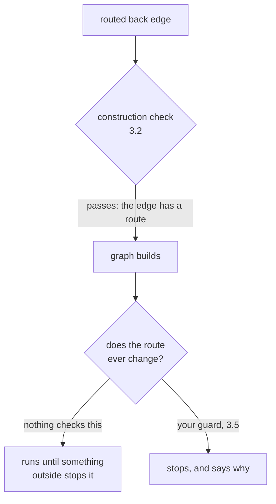

# 3.4 — The loop that never ends

## One-line answer

A routed cycle whose route never changes runs forever: the graph builds, no exception is raised, and
in this lab the writer had run **twenty-one times** before something outside the runtime stopped it —
because nothing inside the runtime was going to.

## The story

The self-service checkout says *unexpected item in the bagging area*.

You lift the bag off and put it back. It says it again. You take the packet out and put it in more
carefully. It says it again. You put your hand flat on the scale to see whether it notices anything
at all, take it off, and it says it again.

Everything about the machine is working. The screen is lit, the scanner beeps, the scale is reporting
a weight. It is asking you to fix something and it is going to keep asking, in the same voice, at the
same interval, for as long as you stand there. It has no counter. There is no fifth attempt at which
it gives up and lets you pay.

What ends it is a person. The assistant comes over with a card, taps the screen twice, and the
transaction completes. The machine did not decide to stop. Somebody outside the machine stopped it.

## The idea in plain language

[3.2](3.2-the-cycle-the-runtime-refuses.md) established the one thing the runtime guarantees: it will
not build a cycle made only of unrouted edges. This part is about what sits immediately on the other
side of that guarantee.

Put a route on the back edge and the graph builds. Now nothing checks whether the route ever changes.
A critic that emits `revise` on every pass produces a legal, valid, well-formed graph that goes round
forever, and the runtime is content, because from its point of view a node returned an output and an
edge matched a route. That is a normal Tuesday.

The official documentation says so plainly. From `https://adk.dev/graphs/routes/`, read on 2026-09-05:
**"A graph cycle is not bounded automatically. Make sure the exit condition eventually becomes
true."**

There is no `max_iterations` on `Workflow`. There is no default cap. There is no warning after the
hundredth pass. The word for what the runtime provides here is: nothing.

And "the exit condition eventually becomes true" is a heavier requirement than it sounds, because in
an agent the exit condition is usually a *model's judgement*. "Is this reply good enough?" is not a
predicate that provably converges. It is an opinion that might be `no` on every pass, for a ticket
nobody anticipated, at four in the morning.

## Why Sutra needs it

Sutra's review loop asks a critic whether a draft is acceptable. Day 57 designs that critic and
Day 58 puts it in the triage graph.

Every part of that sentence is fine except the word "asks". A critic that counts, as this lab's does,
always terminates. A critic that judges does not have to. And the cost of not terminating is not an
inconvenience: each pass is model calls, so a loop that does not stop spends the day's entire quota on
one ticket and then the desk is down until tomorrow. Principle 13 says every new power arrives with
its containment story, and this is the power. [3.5](3.5-the-guard-you-write-yourself.md) is the
containment.

## The mechanism

The writer-critic loop from [3.1](3.1-a-loop-is-an-edge-that-goes-back.md), with one line changed: the
critic is never satisfied.

```python
def review(ctx: Context, node_input: str) -> Event:
    """Never satisfied. In a real desk this is a critic whose bar the writer cannot reach."""
    return Event(route="revise", output="revise")
```

**Line by line:**

- No condition at all. `revise`, every time, unconditionally.
- The graph around it is unchanged from [3.1](3.1-a-loop-is-an-edge-that-goes-back.md): a routed back
  edge to the writer and a routed edge to `publish`. The `publish` edge is still there and still
  labelled `accept`; it is simply never taken.
- Note what this is **not**: it is not an unrouted cycle. The back edge carries `route="revise"`, so
  [3.2](3.2-the-cycle-the-runtime-refuses.md)'s check passes cleanly.

Because a demonstration that never returns is not a demonstration, the writer counts itself and
raises once it has run more times than we are willing to watch:

```python
PASSES = 0


class Runaway(Exception):
    """Raised by the writer once it has run more times than we are willing to watch."""


def write(ctx: Context, node_input=None) -> str:
    global PASSES
    PASSES += 1
    if PASSES > WATCH:
        raise Runaway(f"writer ran {PASSES} times and the graph has not finished")
    return f"draft v{PASSES}"
```

**Line by line:**

- `PASSES` is a module-level counter, which
  [3.3](3.3-what-survives-one-turn-of-the-loop.md) just explained is the wrong place for anything the
  loop depends on. It is correct here for exactly that reason: this counter is not part of the run's
  logic, it is the harness watching from outside. Putting it in state would make it look like a
  guard, and this part is about there being no guard.
- `raise Runaway(...)` — a specific exception class, raised rather than returned. The runtime surfaces
  it (trap #4: do not swallow exceptions), which is how the script gets control back.
- `WATCH` is how many passes we are prepared to sit through, not a limit on the graph. Changing it
  changes how long the demonstration runs and nothing else, which is itself the finding.

Run it:

```bash
cd days/day-54-sequential-parallel-loop/lab
uv run python runaway.py
```

**Line by line:**

- `runaway.py` builds the graph, drives it, and prints what stopped it.
- `--watch N` sets how many writer passes to allow before the harness intervenes.

Measured on 2026-09-05:

```text
the graph built fine. watching until the writer has run 20 times.
    Runaway: writer ran 21 times and the graph has not finished
    the runtime did not stop it. This script did, from outside.
```

The graph built fine. Read that first line again: construction succeeded, which is
[3.2](3.2-the-cycle-the-runtime-refuses.md)'s check passing on a graph that cannot terminate.

Then twenty-one writer passes, and twenty-one critic passes with them, and the run had not finished.
It had not slowed down, warned, or logged anything. It was going to keep doing that.

Now double the patience:

```bash
uv run python runaway.py --watch 40
```

**Line by line:**

- `--watch 40` changes only the harness's tolerance. The graph, the nodes and the routes are
  identical.

```text
the graph built fine. watching until the writer has run 40 times.
    Runaway: writer ran 41 times and the graph has not finished
    the runtime did not stop it. This script did, from outside.
```

Forty-one. The number in the output is exactly the number you put in the flag, plus one, and it will
be whatever you set, because the thing deciding when this ends is the flag. That is the entire
finding: **the stopping point is a property of the observer, not of the graph.**



## When it breaks

In the lab it breaks by raising an exception you wrote. In a real system it breaks in one of three
ways, none of which mention a loop.

**It breaks as a quota exhaustion.** Each pass is one or more model calls. The free-tier Gemini Flash
budget is a few hundred requests per day, so a loop making two calls per pass consumes the whole day
in something like a hundred passes — a few minutes of wall clock. What you see is every *other*
ticket failing with a 429, and the ticket that caused it still running:

```text
google.genai.errors.ClientError: 429 RESOURCE_EXHAUSTED. {'error': {'code': 429, 'message':
'<the provider wording, captured on your first real 429>', 'status': 'RESOURCE_EXHAUSTED'}}
```

That shape is verified in [2.5](../02-at-the-same-time/2.5-fan-out-against-a-quota.md); the provider's
own wording is left as a `TODO(me)` there rather than guessed at.

**It breaks as a growing session.** [3.3](3.3-what-survives-one-turn-of-the-loop.md) put the round
history in session state, so a loop that does not stop is also a session that does not stop growing,
and with a database-backed session (Day 47) it is a row that grows on every pass.

**It breaks as a timeout somewhere else entirely.** A request handler gives up, a load balancer closes
the connection, a container is killed for memory. The graph is still running, or was, and the log
line that reaches you is about the thing that gave up rather than the thing that would not.

The honest summary is that a runaway loop is diagnosed by its **collateral damage**, and by the time
you are reading a 429 you are two steps from the cause. That is precisely why the fix belongs in the
graph, before any of this, and it is the next part.

## In production

**What a professional writes instead.** They never merge a loop without a cap, and they treat the cap
as part of the loop rather than as a safety net bolted on afterwards. The cap is not a fallback for
the exit condition failing; it is a second exit condition, and it says something different — the
first one means *this is good enough*, and the second means *this is not converging and a human
should see it*. Those two exits deserve different downstream nodes, which is
[3.5](3.5-the-guard-you-write-yourself.md).

**What degrades at scale.** One runaway loop on one ticket takes down the desk for every ticket,
because quota is shared. That is the property that makes this different from an ordinary bug: the
blast radius is not the request that triggered it. A slow endpoint affects its own caller; a runaway
loop against a shared free-tier key affects everyone until the window resets. Day 70's Quota-Router
exists partly to make that blast radius smaller by giving different work different lanes.

**The failure mode that only appears with real traffic.** The exit condition that is *almost* always
reachable. A model-judged critic accepts ninety-nine tickets in a hundred within two passes, so the
loop looks bounded in every test and every staging run. The hundredth ticket — an unusual one, badly
worded, in a category the critic's instructions do not cover — is the one that goes round forever. And
because it is the unusual ticket, it is also the one where the loop is doing the most expensive work.

**The review comment a senior engineer leaves:** *"This loop's only exit is the critic saying yes. What
happens on a ticket where it says no forever? I want a `MAX_ROUNDS` in the node, an explicit route out
when it is hit, and a different destination for that route so we can see in the logs how often we are
giving up rather than finishing."*

**The interview question:** *"What stops an agent loop from running forever?"* An honest answer:
*"Something you write, because the framework does not. ADK's graph runtime refuses to build a cycle
with no conditional edge, which catches the typo, and the docs say outright that a graph cycle is not
bounded automatically. I tested it: a critic that always emits the `revise` route ran twenty-one
passes before my harness raised, and forty-one when I raised the harness limit — the stopping point
was mine, not the runtime's. What makes it dangerous is the diagnosis. You do not see 'infinite
loop'; you see every other request 429ing, because the loop ate the quota. So the cap goes in the
deciding node, in state, with its own route out to a human hand-off, and I would not approve a loop
without one."*

## Check yourself

```bash
cd days/day-54-sequential-parallel-loop/lab
uv run python runaway.py
uv run python runaway.py --watch 40
```

Now set `--watch 100` and read the output. Then say what number would appear if you set it to a
thousand, and what that tells you about who is in control of when this graph stops.

**Out loud, without scrolling up:** the runtime rejects one kind of cycle and permits another. Name
both, and say which one this part is about.

**Next:** [3.5 — The guard you write yourself](3.5-the-guard-you-write-yourself.md).
